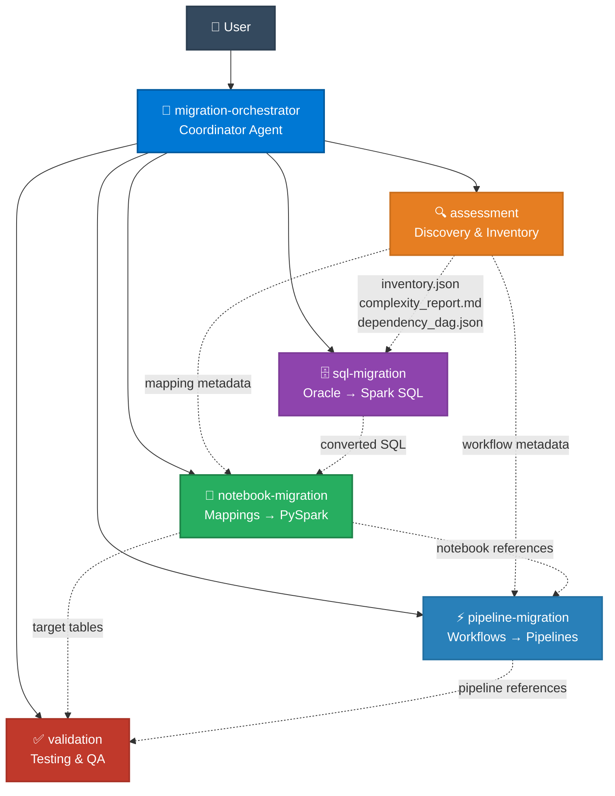
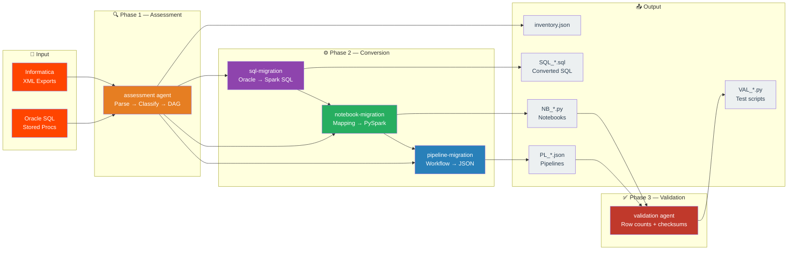
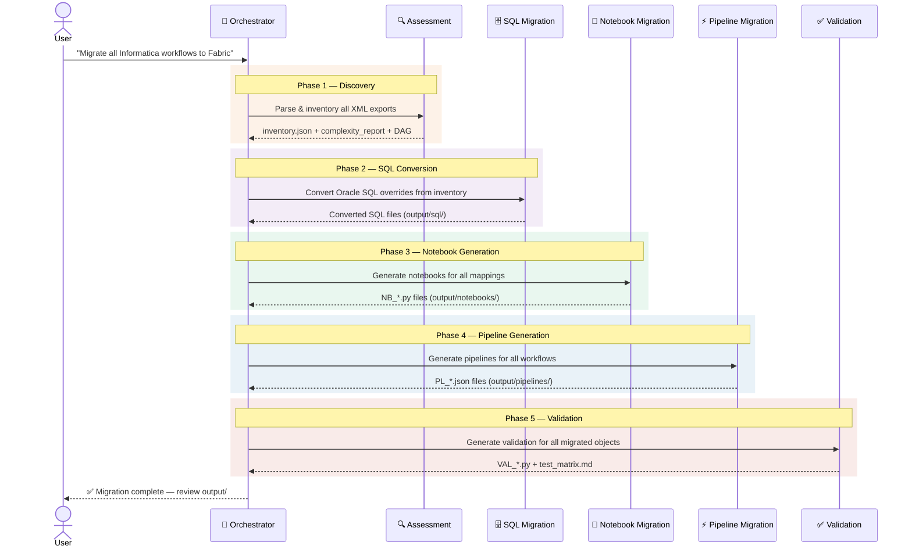
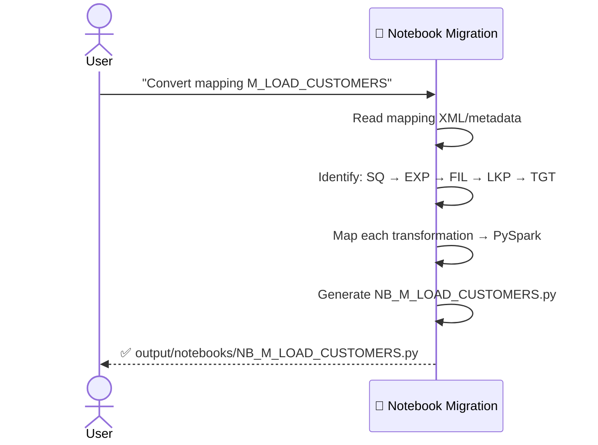

# Multi-Agent Architecture — Informatica to Fabric Migration

<p align="center">
  
  
  
  
</p>

## Overview

This project uses a **6-agent specialization model** to automate and guide the migration from Informatica to Microsoft Fabric. Each agent is a VS Code Copilot agent (`.agent.md`) with scoped domain knowledge, file ownership, and clear boundaries.

---

## Architecture Diagram



<details>
<summary><b>ASCII fallback diagram</b> (for environments without Mermaid)</summary>

```
                    ┌──────────────────────────┐
                    │  migration-orchestrator   │  ← Coordinator
                    │  (plans, delegates,       │
                    │   tracks progress)        │
                    └────────┬─────────────────┘
                             │ delegates to
          ┌──────────────────┼──────────────────────┐
          │                  │                       │
   ┌──────▼──────┐   ┌──────▼──────┐   ┌────────────▼────────┐
   │ assessment  │   │  notebook   │   │  pipeline           │
   │ (XML parse, │   │  migration  │   │  migration          │
   │  inventory) │   │  (PySpark)  │   │  (JSON pipelines)   │
   └─────────────┘   └──────┬──────┘   └─────────────────────┘
                             │
                      ┌──────▼──────┐
                      │    sql      │
                      │  migration  │
                      │ (Oracle→    │
                      │  SparkSQL)  │
                      └──────┬──────┘
                             │
                      ┌──────▼──────┐
                      │ validation  │
                      │ (testing &  │
                      │  QA)        │
                      └─────────────┘
```

</details>

---

## Quick Reference

| Agent | Invoke With | Owns | Outputs |
|-------|-------------|------|---------|
| **🎯 @migration-orchestrator** | `@migration-orchestrator start migration` | Migration plan, wave scheduling, progress | `output/migration_summary.md` |
| **🔍 @assessment** | `@assessment parse input/workflows/` | XML parsing, inventory, complexity, DAG | `output/inventory/` |
| **📓 @notebook-migration** | `@notebook-migration convert mapping M_X` | Mapping → PySpark notebook generation | `output/notebooks/NB_*.py` |
| **⚡ @pipeline-migration** | `@pipeline-migration convert workflow WF_X` | Workflow → Pipeline JSON generation | `output/pipelines/PL_*.json` |
| **🗄️ @sql-migration** | `@sql-migration convert Oracle SQL overrides` | Oracle → Spark SQL / T-SQL conversion | `output/sql/SQL_*.sql` |
| **✅ @validation** | `@validation generate tests for Silver tables` | Test scripts, row counts, checksums, diffs | `output/validation/VAL_*.py` |

---

## Agent Descriptions

### 1. 🎯 `migration-orchestrator` (Coordinator)

| | |
|---|---|
| **Role** | Top-level coordinator that plans the migration, delegates to specialized agents, and tracks overall progress |
| **Inputs** | User request (e.g., "migrate workflow X") or full migration scope |
| **Outputs** | Migration plan, progress tracking, delegation instructions, summary report |
| **File** | [.github/agents/migration-orchestrator.agent.md](.github/agents/migration-orchestrator.agent.md) |

### 2. 🔍 `assessment` (Discovery & Inventory)

| | |
|---|---|
| **Role** | Parses Informatica XML exports, builds inventories, classifies complexity, maps dependencies |
| **Inputs** | Informatica XML export files (workflows, mappings, sessions) |
| **Outputs** | `inventory.json`, `complexity_report.md`, `dependency_dag.json` |
| **File** | [.github/agents/assessment.agent.md](.github/agents/assessment.agent.md) |

### 3. 📓 `notebook-migration` (Transformation Conversion)

| | |
|---|---|
| **Role** | Converts Informatica mappings into Fabric Notebooks (PySpark) |
| **Inputs** | Mapping metadata from assessment, transformation rules, converted SQL |
| **Outputs** | Fabric Notebook `.py` files with PySpark transformation logic |
| **File** | [.github/agents/notebook-migration.agent.md](.github/agents/notebook-migration.agent.md) |

### 4. ⚡ `pipeline-migration` (Orchestration Conversion)

| | |
|---|---|
| **Role** | Converts Informatica workflows into Fabric Data Pipeline JSON definitions |
| **Inputs** | Workflow metadata from assessment, notebook references |
| **Outputs** | Fabric Data Pipeline JSON definitions with dependency chains |
| **File** | [.github/agents/pipeline-migration.agent.md](.github/agents/pipeline-migration.agent.md) |

### 5. 🗄️ `sql-migration` (SQL Conversion)

| | |
|---|---|
| **Role** | Converts Oracle SQL (overrides, stored procs) to Fabric-compatible SQL (Spark SQL / T-SQL) |
| **Inputs** | SQL overrides from mappings, stored procedure files |
| **Outputs** | Converted SQL files, Notebook `%%sql` cells |
| **File** | [.github/agents/sql-migration.agent.md](.github/agents/sql-migration.agent.md) |

### 6. ✅ `validation` (Testing & QA)

| | |
|---|---|
| **Role** | Generates validation notebooks, compares row counts, checksums, and data quality |
| **Inputs** | Source/target table pairs, migration metadata |
| **Outputs** | Validation notebooks, test matrix, pass/fail summaries |
| **File** | [.github/agents/validation.agent.md](.github/agents/validation.agent.md) |

---

## Data Flow



---

## Agent Interaction — Full Migration



### Single Mapping Flow



---

## Handoff Protocol

When an agent encounters work outside its domain:

1. **Complete your part** — finish everything within your scope
2. **State the handoff** — clearly describe what needs to happen next
3. **Name the target agent** — e.g., "Hand off to @sql-migration for SQL override conversion"
4. **List artifacts** — specify files and data structures involved
5. **Include context** — provide intermediate results the next agent needs

---

## File Ownership Rules

- **One owner per output directory** — each agent writes only to its designated output folder
- **Read access is universal** — any agent can read any file for context
- **Write access is restricted** — only the owning agent writes to its output folder
- **Validation is cross-cutting** — reads outputs from all agents, writes only to `output/validation/`

| Agent | Write Access | Read Access |
|-------|-------------|-------------|
| 🎯 Orchestrator | `output/migration_summary.md`, `output/migration_issues.md` | Everything |
| 🔍 Assessment | `output/inventory/` | `input/` |
| 🗄️ SQL Migration | `output/sql/` | `output/inventory/`, `input/sql/` |
| 📓 Notebook Migration | `output/notebooks/` | `output/inventory/`, `output/sql/`, `templates/` |
| ⚡ Pipeline Migration | `output/pipelines/` | `output/inventory/`, `output/notebooks/`, `templates/` |
| ✅ Validation | `output/validation/` | `output/notebooks/`, `output/pipelines/`, `output/sql/` |

---

## Directory Structure

```
InformaticaToDBFabric/
├── .github/
│   └── agents/                          # 🤖 Agent definitions (6 agents)
│       ├── migration-orchestrator.agent.md
│       ├── assessment.agent.md
│       ├── notebook-migration.agent.md
│       ├── pipeline-migration.agent.md
│       ├── sql-migration.agent.md
│       └── validation.agent.md
├── .vscode/
│   └── instructions/                    # 📘 Shared rules
│       └── informatica-patterns.instructions.md
├── input/                               # 📂 Informatica exports
│   ├── workflows/                       #   Workflow XML
│   ├── mappings/                        #   Mapping XML
│   ├── sessions/                        #   Session XML
│   └── sql/                             #   Oracle SQL files
├── output/                              # 📤 Generated artifacts
│   ├── inventory/                       #   🔍 Assessment results
│   ├── notebooks/                       #   📓 Fabric Notebooks
│   ├── pipelines/                       #   ⚡ Pipeline JSON
│   ├── sql/                             #   🗄️ Converted SQL
│   └── validation/                      #   ✅ Test scripts
├── templates/                           # 📋 Reusable templates
│   ├── notebook_template.py
│   ├── pipeline_template.json
│   └── validation_template.py
├── AGENTS.md                            # 🤖 This file
├── MIGRATION_PLAN.md                    # 📝 Migration strategy
└── README.md                            # 📖 Project overview
```

---

## How to Use

### Full Migration (Orchestrated)

```
@migration-orchestrator start migration
```

### Individual Tasks

| Task | Command |
|------|---------|
| Parse & inventory | `@assessment parse the workflow XML in input/workflows/` |
| Convert a mapping | `@notebook-migration convert mapping M_LOAD_CUSTOMERS` |
| Convert SQL | `@sql-migration convert the Oracle SQL overrides` |
| Generate a pipeline | `@pipeline-migration convert workflow WF_DAILY_LOAD` |
| Generate tests | `@validation generate tests for the Silver lakehouse tables` |

### Deploy to Fabric

1. **Review outputs** in the `output/` folder
2. **Deploy** using Fabric Git integration, manual upload, or Fabric REST API

---

## When NOT to Use Specialized Agents

Use the **default agent** (or `@migration-orchestrator`) for:
- Quick questions about the project
- Multi-domain tasks that touch 3+ agents
- Documentation updates
- General project planning
