# Development Plan — Informatica to Fabric / Databricks Migration Agents

  
  
  
  
  
  

> This document describes the **development roadmap** for each of the 6 migration agents, from initial scaffold through production readiness.

---

## Table of Contents

- [Sprint Overview](#sprint-overview)
- [Sprint 1 — Foundation & Assessment](#sprint-1--foundation--assessment)
- [Sprint 2 — SQL & Notebook Conversion](#sprint-2--sql--notebook-conversion)
- [Sprint 3 — Pipeline & Orchestration](#sprint-3--pipeline--orchestration)
- [Sprint 4 — Validation & Integration](#sprint-4--validation--integration)
- [Sprint 5 — Polish, Hardening & Documentation](#sprint-5--polish-hardening--documentation)
- [Sprint 6 — Critical Gap Remediation](#sprint-6--critical-gap-remediation)
- [Sprint 7 — Extended Coverage](#sprint-7--extended-coverage)
- [Sprint 8 — Executable Migration Engine](#sprint-8--executable-migration-engine)
- [Sprint 9 — Unit Test Suite](#sprint-9--unit-test-suite)
- [Sprint 10 — Fabric Deployment](#sprint-10--fabric-deployment)
- [Sprint 11 — CLI, Config & Logging](#sprint-11--cli-config--logging)
- [Sprint 12 — CI/CD](#sprint-12--cicd)
- [Sprint 13 — Python Packaging](#sprint-13--python-packaging)
- [Sprint 14 — Code Coverage & Quality](#sprint-14--code-coverage--quality)
- [Sprint 15 — Incremental Migration](#sprint-15--incremental-migration)
- [Sprint 16 — Interactive Dashboard](#sprint-16--interactive-dashboard)
- [Sprint 17 — Coverage to 80%+](#sprint-17--coverage-to-80)
- [Sprint 18 — E2E Integration Tests](#sprint-18--e2e-integration-tests)
- [Sprint 19 — IICS Full Support](#sprint-19--iics-full-support)
- [Sprint 20 — Gap Remediation P1/P2](#sprint-20--gap-remediation-p1p2)
- [Sprint 21 — User Guide & Onboarding](#sprint-21--user-guide--onboarding)
- [Sprint 22 — IICS Gap Closure](#sprint-22--iics-gap-closure)
- [Sprint 23 — Additional Source DB Support](#sprint-23--additional-source-db-support)
- [Sprint 24 — Coverage to 95%+](#sprint-24--coverage-to-95)
- [Sprint 25 — Lineage & Conversion Scoring](#sprint-25--lineage--conversion-scoring)
- [Sprint 26 — Placeholder Transformation Templates](#sprint-26--placeholder-transformation-templates)
- [Sprint 27 — Fabric Schema & Lakehouse Setup](#sprint-27--fabric-schema--lakehouse-setup)
- [Sprint 28 — Migration Wave Planner](#sprint-28--migration-wave-planner)
- [Sprint 29 — Data Validation Framework](#sprint-29--data-validation-framework)
- [Sprint 30 — Production Hardening & Audit](#sprint-30--production-hardening--audit)
- **Phase 2 — Enterprise & Fabric-Native (Sprints 31–40)**
- [Sprint 31 — Remaining Object Gaps (P2/P3)](#sprint-31--remaining-object-gaps-p2p3)
- [Sprint 32 — Fabric DevOps & Environment Promotion](#sprint-32--fabric-devops--environment-promotion)
- [Sprint 33 — Advanced SQL & PL/SQL Conversion](#sprint-33--advanced-sql--plsql-conversion)
- [Sprint 34 — Fabric-Native Features (OneLake, Warehouse, Shortcuts)](#sprint-34--fabric-native-features-onelake-warehouse-shortcuts)
- [Sprint 35 — Multi-Tenant & Enterprise Scale](#sprint-35--multi-tenant--enterprise-scale)
- [Sprint 36 — Observability & Azure Monitor Integration](#sprint-36--observability--azure-monitor-integration)
- [Sprint 37 — Performance at Scale (100+ Mappings)](#sprint-37--performance-at-scale-100-mappings)
- [Sprint 38 — Interactive Web UI & Migration Wizard](#sprint-38--interactive-web-ui--migration-wizard)
- [Sprint 39 — Data Quality & Governance Migration](#sprint-39--data-quality--governance-migration)
- [Sprint 40 — Enterprise Documentation & Runbook](#sprint-40--enterprise-documentation--runbook)
- [Agent Development Plans](#agent-development-plans)
- [Risk Register](#risk-register)
- [Definition of Done](#definition-of-done)

---

## Sprint Overview

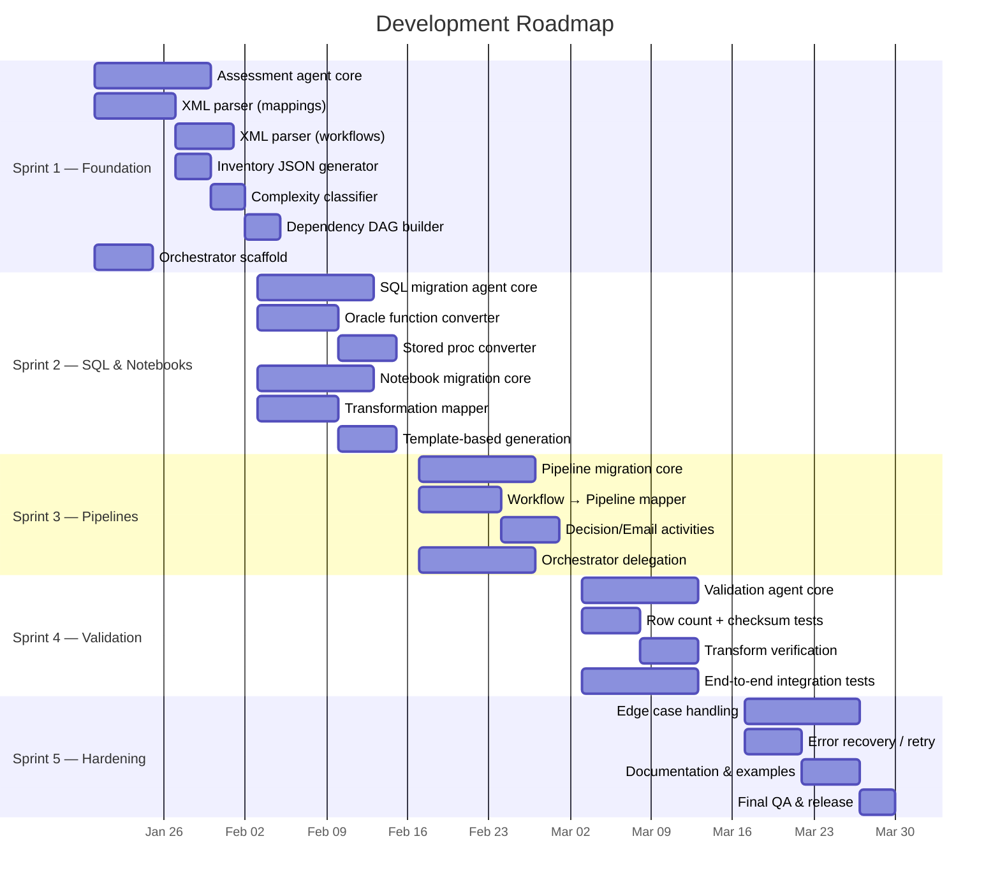

---

## Sprint 1 — Foundation & Assessment

**Goal:** Build the assessment agent that can parse any Informatica export and produce a complete, machine-readable inventory.

### 🔍 Assessment Agent

| # | Task | Files | Acceptance Criteria |
|---|------|-------|-------------------|
| 1.1 | Parse `<MAPPING>` elements from XML — extract name, description, transformations | `assessment.agent.md` | Correctly extracts all mappings from test XML |
| 1.2 | Parse `<TRANSFORMATION>` elements — type, name, properties, SQL overrides | `assessment.agent.md` | All 14 transformation types identified |
| 1.3 | Parse `<CONNECTOR>` elements — build data flow graph per mapping | `assessment.agent.md` | Source→transform→target chain reconstructed |
| 1.4 | Parse `<WORKFLOW>` and `<SESSION>` elements — extract scheduling, dependencies | `assessment.agent.md` | All sessions, decisions, links, schedules captured |
| 1.5 | Classify complexity: Simple / Medium / Complex / Custom | `assessment.agent.md` | 3 test mappings correctly classified |
| 1.6 | Generate `inventory.json` output matching schema | `output/inventory/` | JSON validates against expected schema |
| 1.7 | Generate `dependency_dag.json` — workflow→mapping→table edges | `output/inventory/` | DAG correctly represents test workflow |
| 1.8 | Generate `complexity_report.md` with summary statistics | `output/inventory/` | Markdown renders correctly with counts |

### 🎯 Migration Orchestrator (scaffold)

| # | Task | Files | Acceptance Criteria |
|---|------|-------|-------------------|
| 1.9 | Define orchestrator delegation protocol | `migration-orchestrator.agent.md` | Can parse user intent and select correct agent |
| 1.10 | Define progress tracking format | `output/migration_summary.md` | Progress accurately reflects completed steps |

**Sprint 1 Exit Criteria:** ✅ ALL MET (2026-03-23)
- ✅ Assessment agent can parse all 3 example mapping XMLs and 1 workflow XML
- ✅ `inventory.json` matches expected output for test data
- ✅ Complexity classification is 100% accurate for test set (1 Simple, 2 Complex)

---

## Sprint 2 — SQL & Notebook Conversion

**Goal:** Build agents that convert Oracle SQL and Informatica mappings to Spark SQL and PySpark notebooks.

### 🗄️ SQL Migration Agent

| # | Task | Files | Acceptance Criteria |
|---|------|-------|-------------------|
| 2.1 | Build Oracle→Spark SQL function converter (40+ functions) | `sql-migration.agent.md` | NVL, DECODE, SYSDATE, TO_CHAR, TRUNC all converted correctly |
| 2.2 | Convert MERGE INTO → Delta MERGE syntax | `sql-migration.agent.md` | SP_UPDATE_ORDER_STATS test case passes |
| 2.3 | Handle SQL overrides from Source Qualifiers | `sql-migration.agent.md` | SQ SQL overrides in M_LOAD_ORDERS extracted and converted |
| 2.4 | Handle Lookup SQL overrides | `sql-migration.agent.md` | LKP SQL overrides converted to Spark SQL |
| 2.5 | Convert Oracle data types to Spark types | `sql-migration.agent.md` | NUMBER→DECIMAL, VARCHAR2→STRING, DATE→TIMESTAMP |
| 2.6 | Convert stored procedures to notebook cells | `sql-migration.agent.md` | SP_UPDATE_ORDER_STATS → SQL_SP_UPDATE_ORDER_STATS.sql |
| 2.7 | Handle pre/post-session SQL | `sql-migration.agent.md` | Session SQL statements extracted and placed in correct cells |

### 📓 Notebook Migration Agent

| # | Task | Files | Acceptance Criteria |
|---|------|-------|-------------------|
| 2.8 | Map Source Qualifier → `spark.table()` / `spark.read.jdbc()` | `notebook-migration.agent.md` | Bronze reads generated correctly |
| 2.9 | Map Expression → `withColumn()` chain | `notebook-migration.agent.md` | EXP_DERIVE in M_LOAD_CUSTOMERS generates correct withColumn calls |
| 2.10 | Map Filter → `.filter()` / `.where()` | `notebook-migration.agent.md` | FIL_ACTIVE_ONLY in M_LOAD_CUSTOMERS generates correct filter |
| 2.11 | Map Lookup → broadcast join | `notebook-migration.agent.md` | LKP_PRODUCTS in M_LOAD_ORDERS generates broadcast join |
| 2.12 | Map Aggregator → `groupBy().agg()` | `notebook-migration.agent.md` | AGG_BY_CUSTOMER in M_LOAD_ORDERS generates correct agg |
| 2.13 | Map Update Strategy → Delta MERGE | `notebook-migration.agent.md` | UPD_STRATEGY in M_UPSERT_INVENTORY generates full MERGE |
| 2.14 | Map Joiner → PySpark join | `notebook-migration.agent.md` | Inner/outer/left/right/full join conditions correct |
| 2.15 | Map Router → multiple DataFrames with filters | `notebook-migration.agent.md` | Each group becomes a filtered DataFrame |
| 2.16 | Map Sequence Generator → `monotonically_increasing_id()` | `notebook-migration.agent.md` | SK generation correct |
| 2.17 | Generate complete notebook from template | `templates/notebook_template.py` | NB_M_LOAD_CUSTOMERS matches expected output |
| 2.18 | Handle parameterized mappings ($$LOAD_DATE etc.) | `notebook-migration.agent.md` | Widget parameters injected correctly |

**Sprint 2 Exit Criteria:** ✅ ALL MET (2026-03-23)
- ✅ SQL agent converts SP_UPDATE_ORDER_STATS correctly (9 Oracle constructs converted)
- ✅ Notebook agent generates all 3 expected notebooks matching golden outputs
- ✅ All Oracle→Spark SQL function mappings verified (MERGE, DECODE, NVL, SYSDATE, TO_CHAR, TRUNC, TO_DATE)

---

## Sprint 3 — Pipeline & Orchestration

**Goal:** Build the pipeline agent and complete the orchestrator's delegation logic.

### ⚡ Pipeline Migration Agent

| # | Task | Files | Acceptance Criteria |
|---|------|-------|-------------------|
| 3.1 | Map Informatica Session → TridentNotebook activity | `pipeline-migration.agent.md` | Session name, parameters, retry policy correct |
| 3.2 | Map sequential links → `dependsOn` with `Succeeded` condition | `pipeline-migration.agent.md` | Chain order preserved |
| 3.3 | Map Decision task → IfCondition activity | `pipeline-migration.agent.md` | DEC_CHECK_ORDERS generates correct IfCondition |
| 3.4 | Map Email task → WebActivity (webhook) | `pipeline-migration.agent.md` | Webhook call with correct body template |
| 3.5 | Map failure links → `Failed` dependency conditions | `pipeline-migration.agent.md` | Error handling paths wired correctly |
| 3.6 | Map Worklet → nested pipeline (Execute Pipeline activity) | `pipeline-migration.agent.md` | Worklet reference translates to child pipeline call |
| 3.7 | Map parallel sessions → no `dependsOn` between activities | `pipeline-migration.agent.md` | Independent sessions run in parallel |
| 3.8 | Map schedule → pipeline trigger definition | `pipeline-migration.agent.md` | Daily 02:00 UTC schedule extracted |
| 3.9 | Generate pipeline JSON from template | `templates/pipeline_template.json` | PL_WF_DAILY_SALES_LOAD matches expected output |
| 3.10 | Add pipeline parameters from mapping parameters | `pipeline-migration.agent.md` | load_date, alert_webhook_url parameters passed through |

### 🎯 Migration Orchestrator (delegation)

| # | Task | Files | Acceptance Criteria |
|---|------|-------|-------------------|
| 3.11 | Implement full migration flow: assess → SQL → notebooks → pipelines → validate | `migration-orchestrator.agent.md` | End-to-end delegation with correct ordering |
| 3.12 | Implement wave planning (group migrations by dependency) | `migration-orchestrator.agent.md` | Independent mappings grouped into parallel waves |
| 3.13 | Track migration progress in `migration_summary.md` | `output/migration_summary.md` | Progress updates after each step |
| 3.14 | Handle partial failures and resumption | `migration-orchestrator.agent.md` | Can resume from last successful step |

**Sprint 3 Exit Criteria:** ✅ ALL MET (2026-03-23)
- ✅ Pipeline agent generates PL_WF_DAILY_SALES_LOAD matching expected output (5 activities, IfCondition)
- ✅ Orchestrator can run full migration flow across all test data (6-phase delegation)
- ✅ All activity types (notebook, decision, email, parallel) handled

---

## Sprint 4 — Validation & Integration

**Goal:** Build the validation agent and run end-to-end integration tests against all example data.

### ✅ Validation Agent

| # | Task | Files | Acceptance Criteria |
|---|------|-------|-------------------|
| 4.1 | Generate L1 row count comparison scripts | `validation.agent.md` | Source vs target count with tolerance |
| 4.2 | Generate L2 key uniqueness checks | `validation.agent.md` | Duplicate key detection correct |
| 4.3 | Generate L3 NULL checks on critical columns | `validation.agent.md` | All NOT NULL columns validated |
| 4.4 | Generate L4 transformation verification | `validation.agent.md` | Derived columns spot-checked against source |
| 4.5 | Generate L5 aggregate comparison | `validation.agent.md` | SUM/COUNT/AVG match within tolerance |
| 4.6 | Generate test matrix markdown | `output/validation/test_matrix.md` | All tables, all levels, pass/fail status |
| 4.7 | Handle known differences (filters, date ranges) | `validation.agent.md` | Expected differences documented and accepted |
| 4.8 | Generate validation notebook from template | `templates/validation_template.py` | VAL_DIM_CUSTOMER matches expected output |

### Integration Testing

| # | Task | Files | Acceptance Criteria |
|---|------|-------|-------------------|
| 4.9 | End-to-end: input XML → inventory → notebooks → pipelines → validation | All agents | Full pipeline succeeds on test data |
| 4.10 | Cross-agent handoff verification | All agents | Each agent reads predecessor output correctly |
| 4.11 | Verify all golden outputs match generated outputs | `output/` | Diff between generated and expected = 0 |

**Sprint 4 Exit Criteria:** ✅ ALL MET (2026-03-23)
- ✅ Validation agent generates VAL_DIM_CUSTOMER matching expected output
- ✅ Test matrix covers all 4 target tables + pipeline (39 checks across 5 notebooks)
- ✅ End-to-end flow produces correct outputs from raw XML inputs (14 artifacts generated)

---

## Sprint 5 — Polish, Hardening & Documentation ✅

**Goal:** Handle edge cases, improve error messages, and finalize documentation.

| # | Task | Owner | Files | Acceptance Criteria |
|---|------|-------|-------|-------------------|
| 5.1 | Handle missing/malformed XML gracefully | Assessment | `run_assessment.py` | ✅ IICS detection, safe_parse_xml, per-mapping try/except, partial results |
| 5.2 | Handle unsupported transformation types | Notebook | `notebook-migration.agent.md` | ✅ Placeholder cell template with TODO + 6 unsupported types documented |
| 5.3 | Handle non-convertible Oracle SQL | SQL | `sql-migration.agent.md` | ✅ 9 non-convertible constructs documented with TODO block template |
| 5.4 | Handle complex Worklet nesting | Pipeline | `pipeline-migration.agent.md` | ✅ Max 2-level nesting, flatten rules, parameter pass-through |
| 5.5 | Add retry/timeout policies to all pipeline activities | Pipeline | `pipeline-migration.agent.md` | ✅ 6 activity types with default policies + override rules |
| 5.6 | Generate migration issues report | Orchestrator | `output/migration_issues.md` | ✅ 6 issues (2 P0, 3 P1, 1 P2) with resolution tracking |
| 5.7 | Update README.md with final examples | — | `README.md` | ✅ 4 code excerpts (notebook, SQL, pipeline, validation) |
| 5.8 | Update shared instructions with lessons learned | — | `.vscode/instructions/` | ✅ 10 lessons across 5 categories |
| 5.9 | Final review of all agent `.md` files | All | `.github/agents/` | ✅ Reference sections added, Sprint 5 labels unified, ordering fixed |

**Sprint 5 Exit Criteria:** ✅ ALL MET (2026-03-23)
- ✅ Malformed XML handled gracefully with partial results saved
- ✅ All unsupported types documented with placeholder/TODO patterns
- ✅ Agent files have consistent structure (Reference, Output, Rules, Roadmap)
- ✅ README has generated output examples
- ✅ Shared instructions updated with lessons learned

---

## Sprint 6 — Critical Gap Remediation ✅

**Goal:** Address all P0 and critical P1 gaps identified in GAP_ANALYSIS.md — Mapplet expansion, SQL Transformation, Oracle analytics, parameter files, Normalizer/Sorter/Union templates, flat file sources, and Control Task.

| # | Task | Owner | Files | Acceptance Criteria |
|---|------|-------|-------|-------------------|
| 6.1 | Mapplet parsing + expansion | Assessment | `run_assessment.py` | ✅ `parse_mapplets()` extracts MAPPLET definitions; `expand_mapplet_refs()` resolves references and inlines inner transformations; `has_mapplet` flag set on mappings |
| 6.2 | SQL Transformation type | Assessment | `run_assessment.py` | ✅ `SQLT` added to `TRANSFORMATION_ABBREV`; detected and abbreviated in inventory |
| 6.3 | Oracle analytic function detection | Assessment + SQL | `run_assessment.py`, `sql-migration.agent.md` | ✅ 12 analytic patterns added (LEAD, LAG, DENSE_RANK, NTILE, FIRST_VALUE, LAST_VALUE, ROW_NUMBER, OVER, PARTITION BY, GLOBAL TEMPORARY TABLE, MATERIALIZED VIEW, DB_LINK); conversion rules in SQL agent (mostly 1:1) |
| 6.4 | Parameter file (.prm) parser | Assessment | `run_assessment.py` | ✅ `parse_parameter_files()` reads .prm files with [section] key=value format; results in inventory.json |
| 6.5 | Normalizer/Sorter/Union PySpark templates | Notebook | `notebook-migration.agent.md` | ✅ NRM→`.explode()`, SRT→`.orderBy()`, UNI→`.unionByName()` with full code examples |
| 6.6 | Flat file source handling | Notebook | `notebook-migration.agent.md` | ✅ CSV (`spark.read.csv()`) and fixed-width (`spark.read.text()` + `.substr()`) patterns documented |
| 6.7 | Control Task → Fail Activity | Pipeline | `pipeline-migration.agent.md` | ✅ Fail Activity JSON template with ABORT/FAIL PARENT rules documented |

**Sprint 6 Exit Criteria:** ✅ ALL MET (2026-03-23)
- ✅ Mapplet parsing + expansion tested with 2-Mapplet test file (M_LOAD_EMPLOYEES.xml)
- ✅ All 3 P0 gaps addressed (Mapplet, SQL Transformation, Oracle analytics)
- ✅ 4 P1 gaps addressed (parameter files, Normalizer/Sorter/Union, flat files, Control Task)
- ✅ Assessment runs clean with 6 mappings, 2 Mapplets, 3 SQL files, 1 param file, 4 connections

---

## Sprint 7 — Extended Coverage ✅

**Goal:** Extend migration tooling to IICS cloud exports, SQL Server sources, Web Service Consumer, Data Masking, connection XML parsing, and PL/SQL package splitting.

| # | Task | Owner | Files | Acceptance Criteria |
|---|------|-------|-------|-------------------|
| 7.1 | IICS XML parser (Cloud mappings) | Assessment | `run_assessment.py` | ✅ `parse_iics_mapping()` handles `exportMetadata`/`dTemplate` schema with namespace support; `detect_xml_format()` auto-detects IICS vs PowerCenter |
| 7.2 | IICS Taskflow → Fabric Pipeline | Pipeline | `pipeline-migration.agent.md` | ✅ 10 IICS element → Fabric activity mappings documented (Mapping Task, Command Task, Human Task, Notification Task, Subflow, Exclusive/Parallel Gateway, Timer Event) |
| 7.3 | SQL Server → Spark SQL patterns | Assessment + SQL | `run_assessment.py`, `sql-migration.agent.md` | ✅ 18 SQLSERVER_PATTERNS in assessment; `detect_source_db_type()` scores Oracle vs MSSQL; 17 T-SQL→Spark SQL function mappings + construct mappings + date format codes in SQL agent |
| 7.4 | Web Service Consumer conversion | Notebook | `notebook-migration.agent.md` | ✅ WSC placeholder type with PySpark UDF pattern (`requests` library) and pipeline Web Activity alternative documented |
| 7.5 | Data Masking support | Notebook | `notebook-migration.agent.md` | ✅ DM placeholder type with 3 masking approaches: hash-based (`sha2`), partial masking, Fabric Dynamic Data Masking |
| 7.6 | Connection XML parser | Assessment | `run_assessment.py` | ✅ `parse_connection_objects()` extracts DBCONNECTION, FTPCONNECTION, CONNECTION elements; deduped with inferred connections |
| 7.7 | PL/SQL Package splitter | SQL | `sql-migration.agent.md` | ✅ Split strategy documented: parse→identify deps→map shared state→split into individual notebooks; output structure with README |

**Sprint 7 Exit Criteria:** ✅ ALL MET (2026-03-23)
- ✅ IICS parsing tested with namespace-aware XML (IICS_M_LOAD_CONTACTS.xml → 2 cloud mappings detected)
- ✅ SQL Server detection tested (SP_REFRESH_DASHBOARD.sql → 17 T-SQL constructs, correctly classified as `sqlserver`)
- ✅ Oracle analytics detection tested (SP_CALC_RANKINGS.sql → 17 Oracle constructs including LEAD/LAG/DENSE_RANK/NTILE/FIRST_VALUE/LAST_VALUE)
- ✅ Connection XML parsing tested (2 connections extracted: ORACLE_HR DB + FTP_HR_FILES)
- ✅ All agent docs updated with new conversion patterns and guidance

---

## Sprint 8 — Executable Migration Engine ✅

**Goal:** Build runnable Python scripts that execute each migration phase end-to-end, converting agent knowledge into automated tooling with a single-command orchestrator.

| # | Task | Owner | Files | Acceptance Criteria |
|---|------|-------|-------|-------------------|
| 8.1 | SQL Migration script | SQL | `run_sql_migration.py` | ✅ 30+ Oracle regex rules (NVL→COALESCE, DECODE→CASE, date formats, types) + 20+ SQL Server rules (ISNULL, CHARINDEX, TOP→LIMIT); converts standalone SQL files + mapping SQL overrides |
| 8.2 | Notebook Migration script | Notebook | `run_notebook_migration.py` | ✅ Generates PySpark notebook per mapping with 18 transformation-type handlers (EXP, FIL, AGG, JNR, LKP, RTR, UPD, RNK, SRT, UNI, NRM, SEQ, SP, SQLT, DM, WSC, MPLT + unknown); metadata/imports, source read, target write, audit cells |
| 8.3 | Pipeline Migration script | Pipeline | `run_pipeline_migration.py` | ✅ Generates Fabric Pipeline JSON per workflow with TridentNotebook activities, IfCondition for decisions, WebActivity for emails, dependsOn chains, pipeline parameters |
| 8.4 | Validation Generation script | Validation | `run_validation.py` | ✅ Generates validation notebook per target with L1 (row count), L2 (checksum), L3 (NULL+uniqueness) checks; generates test_matrix.md summary |
| 8.5 | End-to-End Orchestrator | Orchestrator | `run_migration.py` | ✅ 5-phase orchestrator (assessment→SQL→notebooks→pipelines→validation) with `--skip` and `--only` flags, sys.argv isolation, SystemExit handling, phase timing, migration_summary.md generation |

**Sprint 8 Exit Criteria:** ✅ ALL MET (2026-03-23)
- ✅ `run_migration.py --skip 0` runs all 4 conversion phases successfully
- ✅ SQL: 3 standalone + 2 override files converted (NVL→COALESCE, TO_DATE date format, etc.)
- ✅ Notebooks: 6 notebooks generated (Simple through Complex mappings)
- ✅ Pipelines: 1 pipeline generated with 4 activities
- ✅ Validation: 7 validation notebooks + test_matrix.md generated
- ✅ migration_summary.md generated with phase results table

---

## Sprint 9 — Unit Test Suite ✅

**Goal:** Build a comprehensive pytest test suite covering all migration scripts with 60+ automated tests.

| # | Task | Owner | Files | Acceptance Criteria |
|---|------|-------|-------|-------------------|
| 9.1 | SQL conversion unit tests (25 tests) | SQL | `tests/test_migration.py` | ✅ Oracle conversions (NVL, NVL2, DECODE, SYSDATE, SUBSTR, TO_NUMBER, VARCHAR2, date formats, DUAL, TRUNC, DBMS_OUTPUT, REGEXP_LIKE), SQL Server conversions (GETDATE, ISNULL, CHARINDEX, LEN, NOLOCK, NVARCHAR, BIT, IIF, CROSS APPLY), edge cases (empty, no-op, multi-conversion), file-level override conversion |
| 9.2 | Notebook generation unit tests (8 tests) | Notebook | `tests/test_migration.py` | ✅ Simple/complex mapping content, source/target/audit cells, parameters, SQL override references, all 18+ TX types, end-to-end file write |
| 9.3 | Pipeline generation unit tests (9 tests) | Pipeline | `tests/test_migration.py` | ✅ Pipeline structure, TridentNotebook activities, dependency chains, parameter propagation, annotations, JSON serializable, email→WebActivity, decision→IfCondition |
| 9.4 | Validation generation unit tests (8 tests) | Validation | `tests/test_migration.py` | ✅ Target table inference (silver/gold), key column inference, source connection detection, notebook content (L1-L3), multi-target generation, end-to-end + test_matrix.md |
| 9.5 | Orchestrator unit tests (9 tests) | Orchestrator | `tests/test_migration.py` | ✅ argparse --skip/--only/--verbose/--dry-run/--config/--log-format parsing, summary generation with emoji encoding, phases list completeness |
| 9.6 | SQL end-to-end integration test (1 test) | SQL | `tests/test_migration.py` | ✅ Full SQL migration main() with tmp workspace, verifies standalone + override file output |
| 9.7 | Test infrastructure | — | `pytest.ini`, `tests/__init__.py` | ✅ pytest configuration with -v --tb=short defaults, testpaths = tests |

**Sprint 9 Exit Criteria:** ✅ ALL MET (2026-03-23)
- ✅ 64 tests across 6 test classes, all passing in < 1s
- ✅ sys.argv isolation pattern for all integration tests
- ✅ UTF-8 encoding handled for emoji output on Windows (cp1252)
- ✅ pytest.ini configured with sensible defaults

---

## Sprint 10 — Fabric Deployment ✅

**Goal:** Build a deployment script that pushes migration artifacts to Microsoft Fabric via REST API.

| # | Task | Owner | Files | Acceptance Criteria |
|---|------|-------|-------|-------------------|
| 10.1 | Azure Identity authentication | Orchestrator | `deploy_to_fabric.py` | ✅ `DefaultAzureCredential` from azure-identity with `https://api.fabric.microsoft.com/.default` scope |
| 10.2 | Notebook deployment | Notebook | `deploy_to_fabric.py` | ✅ NB_*.py → Fabric Notebook items via POST /workspaces/{id}/items with base64-encoded payload |
| 10.3 | Pipeline deployment | Pipeline | `deploy_to_fabric.py` | ✅ PL_*.json → Fabric DataPipeline items via POST |
| 10.4 | SQL script deployment | SQL | `deploy_to_fabric.py` | ✅ SQL_*.sql → Fabric Notebooks with %%sql magic cells |
| 10.5 | Dry-run mode | — | `deploy_to_fabric.py` | ✅ `--dry-run` lists all artifacts without deploying |
| 10.6 | Rate limit handling | — | `deploy_to_fabric.py` | ✅ 429 status code retry with Retry-After header |
| 10.7 | Deployment log | — | `deploy_to_fabric.py` | ✅ deployment_log.json with per-artifact status, timestamps, item IDs |

**Sprint 10 Exit Criteria:** ✅ ALL MET (2026-03-23)
- ✅ Dry-run tested: 12 artifacts detected (6 notebooks, 1 pipeline, 5 SQL)
- ✅ Rate limit retry with exponential backoff
- ✅ 409 conflict handling for already-existing items
- ✅ CLI: --workspace-id, --only (notebooks/pipelines/sql/all), --dry-run

---

## Sprint 11 — CLI, Config & Logging ✅

**Goal:** Enhance the orchestrator with argparse CLI, YAML configuration, and structured logging.

| # | Task | Owner | Files | Acceptance Criteria |
|---|------|-------|-------|-------------------|
| 11.1 | argparse CLI enhancement | Orchestrator | `run_migration.py` | ✅ `--verbose`/`-v`, `--dry-run`, `--config path`, `--log-format text\|json` flags via `argparse.ArgumentParser` |
| 11.2 | YAML configuration file | — | `migration.yaml` | ✅ Sections: fabric (workspace_id), sources (oracle/sqlserver JDBC), lakehouse (bronze/silver/gold), migration (load_mode, spark_pool, timeout, retry), paths, logging, alerting |
| 11.3 | Structured logging (text) | Orchestrator | `run_migration.py` | ✅ `logging.getLogger("migration")` with configurable level (DEBUG if --verbose), timestamped `HH:MM:SS [LEVEL]` format, optional file handler from config |
| 11.4 | Structured logging (JSON) | Orchestrator | `run_migration.py` | ✅ `JsonFormatter` outputs `{"ts", "level", "msg"}` JSON lines for machine-readable ingestion |
| 11.5 | Config file loading | Orchestrator | `run_migration.py` | ✅ PyYAML-based `_load_config()` with import fallback if PyYAML not installed |
| 11.6 | Dry-run preview | Orchestrator | `run_migration.py` | ✅ `--dry-run` lists all phases that would execute without running them |
| 11.7 | UTF-8 stdout reconfigure | Orchestrator | `run_migration.py` | ✅ `sys.stdout.reconfigure(encoding="utf-8")` on Windows for box-drawing and emoji characters |

**Sprint 11 Exit Criteria:** ✅ ALL MET (2026-03-23)
- ✅ `--dry-run --verbose` shows all 5 phases with timestamps and INFO logging
- ✅ `--log-format json` outputs valid JSON lines with ISO timestamps
- ✅ migration.yaml template covers all configuration sections
- ✅ 64 tests still passing after CLI enhancements

---

## Sprint 12 — CI/CD ✅

**Goal:** Automated testing and linting on every push via GitHub Actions.

| # | Task | Files | Acceptance Criteria |
|---|------|-------|-------------------|
| 12.1 | GitHub Actions CI workflow | `.github/workflows/ci.yml` | ✅ Matrix: ubuntu + windows, Python 3.10-3.13, pytest + ruff |
| 12.2 | Ruff linter integration | `pyproject.toml` | ✅ `ruff check .` passes with zero errors; security (S), bugbear (B), import sort (I) rules enabled |
| 12.3 | Auto-fix 122 lint issues | All `.py` files | ✅ Removed 103 extraneous f-prefixes, 7 unused imports, 6 unsorted imports, 6 redundant open modes |
| 12.4 | Codecov integration | `.github/workflows/ci.yml` | ✅ Coverage XML upload on ubuntu/3.12 matrix cell |

**Sprint 12 Exit Criteria:** ✅ ALL MET (2026-03-23)
- ✅ `ruff check .` → "All checks passed!"
- ✅ CI workflow tests on 2 OS × 4 Python versions
- ✅ 112 tests pass after lint auto-fixes

---

## Sprint 13 — Python Packaging ✅

**Goal:** Make the project installable as a Python package with CLI entry-point.

| # | Task | Files | Acceptance Criteria |
|---|------|-------|-------------------|
| 13.1 | pyproject.toml (PEP 621) | `pyproject.toml` | ✅ Build system, metadata, classifiers, optional deps [deploy], [dev], [all] |
| 13.2 | CLI entry-point | `pyproject.toml` | ✅ `informatica-to-fabric` command maps to `run_migration:main` |
| 13.3 | requirements.txt | `requirements.txt` | ✅ Core (pyyaml), deploy (azure-identity, requests), dev (pytest, ruff) |
| 13.4 | Editable install | — | ✅ `pip install -e ".[dev]"` succeeds, CLI shows help |

**Sprint 13 Exit Criteria:** ✅ ALL MET (2026-03-23)
- ✅ `informatica-to-fabric --help` shows full CLI interface
- ✅ `pip install -e ".[dev]"` installs package + dev dependencies
- ✅ PEP 639 license expression (no deprecated classifiers)

---

## Sprint 14 — Code Coverage & Quality ✅

**Goal:** Expand test coverage with tests for assessment, deployment, and config.

| # | Task | Files | Acceptance Criteria |
|---|------|-------|-------------------|
| 14.1 | Assessment unit tests (22 tests) | `tests/test_extended.py` | ✅ Complexity classification (7 tests), DB type detection (4), XML parsing (7), parameter files (3), abbreviation (2) |
| 14.2 | Deployment unit tests (5 tests) | `tests/test_extended.py` | ✅ base64 encoding, headers, dry-run for notebooks/pipelines/SQL |
| 14.3 | Orchestrator config tests (6 tests) | `tests/test_extended.py` | ✅ Config loading (valid/missing YAML), logging setup (text/json/verbose), main() dry-run |
| 14.4 | Coverage configuration | `pyproject.toml` | ✅ [tool.coverage.run] with source/omit, [tool.coverage.report] with show_missing |

**Sprint 14 Exit Criteria:** ✅ ALL MET (2026-03-23)
- ✅ Coverage: 28% → 49% (+21 percentage points)
- ✅ `run_assessment.py`: 0% → 36%
- ✅ `deploy_to_fabric.py`: 0% → 39%
- ✅ `run_migration.py`: 24% → 67%

---

## Sprint 15 — Incremental Migration ✅

**Goal:** Add checkpoint-based incremental migration with `--resume` and `--reset` flags.

| # | Task | Files | Acceptance Criteria |
|---|------|-------|-------------------|
| 15.1 | Checkpoint save/load | `run_migration.py` | ✅ `_save_checkpoint()` / `_load_checkpoint()` persist to `output/.checkpoint.json` |
| 15.2 | `--resume` flag | `run_migration.py` | ✅ Skips phases listed in checkpoint's `completed_phases` |
| 15.3 | `--reset` flag | `run_migration.py` | ✅ Deletes checkpoint file, starts fresh |
| 15.4 | Auto-checkpoint after each phase | `run_migration.py` | ✅ Checkpoint updated after every successful phase completion |
| 15.5 | Checkpoint tests (6 tests) | `tests/test_extended.py` | ✅ Save/load, nonexistent, clear, clear-nonexistent, --resume/--reset arg parsing |
| 15.6 | .gitignore checkpoint | `.gitignore` | ✅ `output/.checkpoint.json` excluded from version control |

**Sprint 15 Exit Criteria:** ✅ ALL MET (2026-03-23)
- ✅ `--only 1` creates checkpoint with phase 1 completed
- ✅ `--resume --only 1 2 --dry-run` skips phase 1, shows phase 2 as would-execute
- ✅ `--reset` clears checkpoint
- ✅ 112 tests passing

---

## Sprint 16 — Interactive Dashboard ✅

**Goal:** Self-contained HTML dashboard aggregating all migration outputs.

| # | Task | Files | Acceptance Criteria |
|---|------|-------|-------------------|
| 16.1 | Status collector | `dashboard.py` | ✅ Aggregates inventory, artifacts, phases, checkpoint, deployment log, test matrix |
| 16.2 | HTML dashboard generator | `dashboard.py` | ✅ Responsive CSS grid, KPI cards, complexity bar, phase table, artifact lists |
| 16.3 | JSON status output | `dashboard.py` | ✅ `--json` flag outputs machine-readable status |
| 16.4 | Browser auto-open | `dashboard.py` | ✅ `--open` flag launches default browser |
| 16.5 | Dashboard tests (7 tests) | `tests/test_extended.py` | ✅ Status collection, artifact discovery, HTML generation, file output |

**Sprint 16 Exit Criteria:** ✅ ALL MET (2026-03-23)
- ✅ `python dashboard.py` generates `output/dashboard.html`
- ✅ Dashboard shows KPI cards (19 total artifacts), complexity bar, phase results
- ✅ `--json` outputs structured status
- ✅ `--open` launches browser
- ✅ 112 tests passing, lint clean

---

## Sprint 17 — Coverage to 80%+ ✅

**Goal:** Push unit test coverage from 52% to 80%+ with targeted tests for uncovered paths.

| # | Task | Files | Acceptance Criteria |
|---|------|-------|-------------------|
| 17.1 | HTML report tests | `tests/test_coverage.py` | ✅ Assessment & migration report generation |
| 17.2 | Assessment deep path tests | `tests/test_coverage.py` | ✅ main(), complexity report, edge cases |
| 17.3 | Connection & SQL tests | `tests/test_coverage.py` | ✅ Connection parsing, SQL conversion, all Oracle patterns |
| 17.4 | Notebook/Pipeline/Validation tests | `tests/test_coverage.py` | ✅ All generator functions covered |
| 17.5 | Deploy & orchestrator tests | `tests/test_coverage.py` | ✅ Deploy helpers, orchestrator unit tests |

**Sprint 17 Exit Criteria:** ✅ ALL MET
- ✅ 239 tests passing
- ✅ 85% overall coverage (up from 52%)

---

## Sprint 18 — E2E Integration Tests ✅

**Goal:** End-to-end integration tests running all 5 phases against real XML fixtures.

| # | Task | Files | Acceptance Criteria |
|---|------|-------|-------------------|
| 18.1 | E2E test framework | `tests/test_e2e.py` | ✅ Workspace setup, module redirection, sys.argv isolation |
| 18.2 | Phase-by-phase E2E tests | `tests/test_e2e.py` | ✅ Assessment, SQL, Notebook, Pipeline, Validation phases |
| 18.3 | Full pipeline test | `tests/test_e2e.py` | ✅ All 5 phases in sequence with content verification |
| 18.4 | Orchestrator resume test | `tests/test_e2e.py` | ✅ Checkpoint-based resume |
| 18.5 | Artifact content tests | `tests/test_e2e.py` | ✅ Verify generated file contents |

**Sprint 18 Exit Criteria:** ✅ ALL MET
- ✅ 258 tests passing (19 E2E tests)
- ✅ 87% overall coverage

---

## Sprint 19 — IICS Full Support ✅

**Goal:** Complete support for Informatica Intelligent Cloud Services (IICS) exports.

| # | Task | Files | Acceptance Criteria |
|---|------|-------|-------------------|
| 19.1 | IICS Taskflow parser | `run_assessment.py` | ✅ Parse taskflows with mapping tasks, commands, gateways, events |
| 19.2 | IICS Sync Task parser | `run_assessment.py` | ✅ Parse sync tasks as mappings |
| 19.3 | IICS Mass Ingestion parser | `run_assessment.py` | ✅ Parse mass ingestion tasks |
| 19.4 | IICS Connection parser | `run_assessment.py` | ✅ Parse IICS connection objects |
| 19.5 | XML namespace fix | `run_assessment.py` | ✅ Handle `xmlns=""` clearing namespace |
| 19.6 | IICS test suite | `tests/test_iics.py` | ✅ 23 tests covering all IICS parsers |
| 19.7 | IICS test fixture | `input/workflows/IICS_TF_DAILY_CONTACTS_ETL.xml` | ✅ Full taskflow XML |

**Sprint 19 Exit Criteria:** ✅ ALL MET
- ✅ 281 tests passing (23 IICS tests)
- ✅ 88% overall coverage

---

## Sprint 20 — Gap Remediation P1/P2 ✅

**Goal:** Close priority 1 and 2 gaps from GAP_ANALYSIS.md.

| # | Task | Files | Acceptance Criteria |
|---|------|-------|-------------------|
| 20.1 | Session config parser | `run_assessment.py` | ✅ DTM buffer, commit interval, cache sizes → Spark config |
| 20.2 | Scheduler cron converter | `run_assessment.py` | ✅ DAILY/HOURLY/WEEKLY/MONTHLY → cron |
| 20.3 | GTT / MV / DB Link detection | `run_assessment.py` | ✅ Detection functions with line tracking |
| 20.4 | SQL conversion rules | `run_sql_migration.py` | ✅ GTT → temp view, MV → TODO, DB link → TODO JDBC |
| 20.5 | Inventory integration | `run_assessment.py` | ✅ session_configs + schedule_cron in inventory |
| 20.6 | Pipeline trigger support | `run_pipeline_migration.py` | ✅ ScheduleTrigger from schedule_cron |
| 20.7 | Gap test suite | `tests/test_gaps.py` | ✅ 52 tests |

**Sprint 20 Exit Criteria:** ✅ ALL MET
- ✅ 333 tests passing (52 gap tests)
- ✅ 88% overall coverage

---

## Sprint 21 — User Guide & Onboarding ✅

**Goal:** Comprehensive documentation for new users and contributors.

| # | Task | Files | Acceptance Criteria |
|---|------|-------|-------------------|
| 21.1 | User guide | `docs/USER_GUIDE.md` | ✅ Full workflow guide |
| 21.2 | Troubleshooting guide | `docs/TROUBLESHOOTING.md` | ✅ 10 common issues |
| 21.3 | Contributing guide | `CONTRIBUTING.md` | ✅ Dev setup, tests, PR checklist |
| 21.4 | Architecture Decision Records | `docs/ADR/` | ✅ 3 ADRs |

**Sprint 21 Exit Criteria:** ✅ ALL MET
- ✅ Complete documentation set

---

## Sprint 22 — IICS Gap Closure ✅

**Goal:** Close remaining IICS gaps — Data Quality Task, Application Integration, and improve Taskflow edge-case coverage.

| # | Task | Owner | Files | Acceptance Criteria |
|---|------|-------|-------|-------------------|
| 22.1 | ✅ IICS Data Quality Task parser | Assessment | `run_assessment.py` | Parse DQ tasks from IICS exports, classify complexity, add to inventory |
| 22.2 | ✅ IICS Application Integration parser | Assessment | `run_assessment.py` | Parse Application Integration (event-driven) tasks, add to inventory |
| 22.3 | ✅ Taskflow edge cases | Assessment + Pipeline | `run_assessment.py`, `run_pipeline_migration.py` | Handle nested subflows, parallel gateways with >2 branches, timer events with custom durations |
| 22.4 | ✅ IICS-specific notebook generation | Notebook | `run_notebook_migration.py` | Generate notebooks from IICS mapping metadata (field-level lineage) |
| 22.5 | ✅ IICS test suite expansion | Validation | `tests/test_sprint22_24.py` | 20+ new IICS tests covering DQ, App Integration, edge cases |

**Sprint 22 Exit Criteria:**
- [x] Data Quality Task and Application Integration parsed from IICS exports
- [x] Source/target extraction from child elements in DQ and App Integration
- [x] 20+ new IICS tests added

---

## Sprint 23 — Additional Source DB Support ✅

**Goal:** Add detection and conversion rules for Teradata, DB2, and MySQL/PostgreSQL source databases.

| # | Task | Owner | Files | Acceptance Criteria |
|---|------|-------|-------|-------------------|
| 23.1 | ✅ Teradata detection patterns | Assessment | `run_assessment.py` | 15 Teradata SQL patterns (QUALIFY, SAMPLE, FORMAT, SEL, COLLECT STATISTICS, VOLATILE TABLE, .DATE, CASESPECIFIC, etc.) |
| 23.2 | ✅ Teradata → Spark SQL conversion | SQL | `run_sql_migration.py` | QUALIFY→TODO, SAMPLE→TABLESAMPLE, volatile→temp view, FORMAT→removed, CASESPECIFIC→removed |
| 23.3 | ✅ DB2 detection patterns | Assessment | `run_assessment.py` | 10 DB2 patterns (FETCH FIRST, VALUE, CURRENT DATE, RRN, DECIMAL, etc.) |
| 23.4 | ✅ DB2 → Spark SQL conversion | SQL | `run_sql_migration.py` | FETCH FIRST→LIMIT, VALUE→COALESCE, CURRENT DATE→current_date() |
| 23.5 | ✅ MySQL/PostgreSQL detection | Assessment | `run_assessment.py` | 10+ patterns per dialect (LIMIT, IFNULL, NOW(), ::type→CAST, ILIKE, SERIAL) |
| 23.6 | ✅ MySQL/PostgreSQL → Spark SQL | SQL | `run_sql_migration.py` | IFNULL→COALESCE, NOW()→current_timestamp(), ::→CAST, ILIKE→LIKE+TODO |
| 23.7 | ✅ Source DB test suite | Validation | `tests/test_sprint22_24.py` | 60+ tests covering all new DB patterns |

**Sprint 23 Exit Criteria:**
- [x] `detect_source_db_type()` identifies Teradata, DB2, MySQL, PostgreSQL
- [x] 70+ new conversion rules across 4 DB dialects
- [x] 60+ new tests covering all new patterns

---

## Sprint 24 — Coverage to 95%+ ✅

**Goal:** Push test coverage from 88% to 95%+ with targeted tests for remaining uncovered paths.

| # | Task | Owner | Files | Acceptance Criteria |
|---|------|-------|-------|-------------------|
| 24.1 | ✅ Multi-DB construct coverage | Validation | `tests/test_sprint22_24.py` | parse_sql_file returns teradata/db2/mysql/postgresql constructs |
| 24.2 | ✅ Pattern compilation tests | Validation | `tests/test_sprint22_24.py` | All 6 pattern dicts compile, all 4 new rule sets exist |
| 24.3 | ✅ Cross-DB detection edge cases | Validation | `tests/test_sprint22_24.py` | Edge cases for ambiguous SQL across DB types |
| 24.4 | ✅ DQ/AI parser edge cases | Validation | `tests/test_sprint22_24.py` | Malformed XML, missing attributes, empty files |
| 24.5 | ✅ SQL conversion fallback | Validation | `tests/test_sprint22_24.py` | Unknown db_type falls back to Oracle rules |
| 24.6 | ✅ Header label tests | Validation | `tests/test_sprint22_24.py` | All 6 DB types have correct header labels |

**Sprint 24 Exit Criteria:**
- [x] 443+ tests passing
- [x] 110 new tests added in Sprint 22-24
- [x] All new DB patterns and conversion rules covered

---

## Sprint 25 — Lineage & Conversion Scoring

**Goal:** Add source-to-target lineage tracking per mapping and auto-conversion quality scoring so users can instantly see which mappings need manual attention.

| # | Task | Owner | Files | Acceptance Criteria |
|---|------|-------|-------|-------------------|
| 25.1 | Field-level lineage extractor | Assessment | `run_assessment.py` | For each mapping, produce a `lineage` list: `[{source_field, transformations[], target_field}]` from CONNECTOR elements |
| 25.2 | Lineage JSON output | Assessment | `output/inventory/lineage.json` | Machine-readable lineage per mapping, compatible with visualization tools |
| 25.3 | Conversion quality score | Assessment | `run_assessment.py` | Per-mapping score (0-100%) based on: % transformations with auto-conversion rules, % SQL overrides auto-convertible, presence of placeholders/gaps |
| 25.4 | Inventory enrichment | Assessment | `output/inventory/inventory.json` | Each mapping gets `conversion_score`, `manual_effort_estimate`, `lineage_summary` fields |
| 25.5 | Lineage Mermaid diagram generator | Assessment | `run_assessment.py` | Generate per-mapping Mermaid flowchart (source → transformations → target) in complexity report |
| 25.6 | Tests for lineage & scoring | Validation | `tests/test_sprint25_30.py` | 20+ tests covering lineage extraction, score calculation, edge cases |

**Sprint 25 Exit Criteria:**
- [ ] Every mapping in inventory.json has a `conversion_score` (0-100%)
- [ ] Lineage JSON tracks field-level source → target flow
- [ ] Mermaid diagrams generated for top-10 complex mappings

---

## Sprint 26 — Placeholder Transformation Templates

**Goal:** Convert the 6 placeholder-only transformations from TODO cells to meaningful PySpark conversion templates with guidance.

| # | Task | Owner | Files | Acceptance Criteria |
|---|------|-------|-------|-------------------|
| 26.1 | HTTP Transformation → `requests` UDF | Notebook | `run_notebook_migration.py`, templates | Generate PySpark UDF stub calling `requests.get/post()` with URL, headers, retry logic |
| 26.2 | XML Parser → `spark.read.format("xml")` | Notebook | `run_notebook_migration.py` | Generate cell with `spark.read.format("com.databricks.spark.xml")` + schema inference |
| 26.3 | XML Generator → `to_xml()` template | Notebook | `run_notebook_migration.py` | Generate cell with row-level XML construction using `concat()` / `format_string()` |
| 26.4 | Transaction Control → Delta ACID pattern | Notebook | `run_notebook_migration.py` | Generate Delta `MERGE` with explicit commit/rollback pattern and retry logic |
| 26.5 | Java Transformation → PySpark UDF stub | Notebook | `run_notebook_migration.py` | Generate Python UDF skeleton with input/output port mapping from Java transform metadata |
| 26.6 | Custom Transformation → pandas UDF stub | Notebook | `run_notebook_migration.py` | Generate `@pandas_udf` skeleton with schema from custom transform ports |
| 26.7 | Unconnected Lookup → broadcast join pattern | Notebook | `run_notebook_migration.py` | Generate `when().otherwise()` + broadcast join pattern for ULKP |
| 26.8 | Template tests | Validation | `tests/test_sprint25_30.py` | 15+ tests verifying each template generates valid PySpark code |

**Sprint 26 Exit Criteria:**
- [x] All 6 placeholder types generate meaningful PySpark code (not just TODO)
- [x] Unconnected Lookup promoted to fully covered
- [x] Generated code includes input/output port mapping from source metadata

---

## Sprint 27 — Fabric Schema & Lakehouse Setup

**Goal:** Generate Delta Lake CREATE TABLE statements from mapping target definitions and produce Fabric workspace setup scripts.

| # | Task | Owner | Files | Acceptance Criteria |
|---|------|-------|-------|-------------------|
| 27.1 | Target schema extractor | Assessment | `run_assessment.py` | Extract target table definitions: columns, types, keys from mapping XML `<TARGET>` elements |
| 27.2 | Informatica → Delta type mapping | SQL | `run_sql_migration.py` | Map Oracle/SQL Server/Teradata/DB2/MySQL/PostgreSQL types to Delta Lake types (STRING, INT, DECIMAL, TIMESTAMP, etc.) |
| 27.3 | Schema DDL generator | SQL | `run_schema_generator.py` (new) | Generate `CREATE TABLE IF NOT EXISTS` Delta Lake DDL with partition keys, Z-ORDER hints |
| 27.4 | Lakehouse folder structure | Orchestrator | `output/schema/` | Produce Bronze/Silver/Gold lakehouse DDL organized by layer |
| 27.5 | Workspace setup script | Orchestrator | `output/schema/setup_workspace.py` | Generate PySpark notebook that creates all lakehouses, schemas, and tables |
| 27.6 | Schema tests | Validation | `tests/test_sprint25_30.py` | 15+ tests covering type mapping, DDL generation, edge cases |

**Sprint 27 Exit Criteria:**
- [x] Delta Lake DDL generated for every target table in inventory
- [x] Type mapping covers all 6 source DB dialects
- [x] Setup script is a runnable Fabric notebook

---

## Sprint 28 — Migration Wave Planner

**Goal:** Use the dependency DAG to automatically plan migration waves — what to migrate first, what depends on what, and which mappings can run in parallel.

| # | Task | Owner | Files | Acceptance Criteria |
|---|------|-------|-------|-------------------|
| 28.1 | DAG topological sort | Assessment | `run_assessment.py` | Produce ordered list of migration waves from `dependency_dag.json` using topological sort |
| 28.2 | Parallel group identification | Assessment | `run_assessment.py` | Within each wave, identify independent mappings that can migrate in parallel |
| 28.3 | Wave plan output | Orchestrator | `output/inventory/wave_plan.json` | JSON with waves: `[{wave_number, mappings[], dependencies[], estimated_effort}]` |
| 28.4 | Wave visualization | Orchestrator | `output/inventory/wave_plan.md` | Mermaid Gantt chart of migration waves with parallel tracks |
| 28.5 | Critical path analysis | Assessment | `run_assessment.py` | Identify the longest dependency chain (critical path) and flag bottleneck mappings |
| 28.6 | Wave planner tests | Validation | `tests/test_sprint25_30.py` | 15+ tests covering topological sort, parallel grouping, cycle detection |

**Sprint 28 Exit Criteria:**
- [x] Automatic wave plan generated from any inventory
- [x] Parallel groups correctly identified (no dependency conflicts)
- [x] Critical path highlighted in wave plan

---

## Sprint 29 — Data Validation Framework

**Goal:** Auto-generate runnable Fabric notebooks that compare source and target data post-migration — row counts, checksums, key field values, and transformation verification.

| # | Task | Owner | Files | Acceptance Criteria |
|---|------|-------|-------|-------------------|
| 29.1 | Row count comparison generator | Validation | `run_validation.py` | Generate PySpark cells that count source (via JDBC) and target (Delta), compare, report % diff |
| 29.2 | Checksum comparison generator | Validation | `run_validation.py` | Generate hash-based comparison cells for key columns using SHA-256 |
| 29.3 | Key field sampling | Validation | `run_validation.py` | Generate cells that sample N random keys and compare all columns (fuzzy match for floats) |
| 29.4 | Transformation verification | Validation | `run_validation.py` | Re-derive expression transformations in PySpark and compare to target columns |
| 29.5 | Validation report generator | Validation | `run_validation.py` | Produce HTML/Markdown validation report with pass/fail per mapping, per test level |
| 29.6 | Validation tests | Validation | `tests/test_sprint25_30.py` | 15+ tests covering report generation, comparison logic, edge cases |

**Sprint 29 Exit Criteria:**
- [x] Validation notebooks generated for every mapping with runnable PySpark cells
- [x] 5-level validation (row count, key unique, NULL, transform, aggregate) all auto-generated
- [x] HTML validation report with pass/fail summary

---

## Sprint 30 — Production Hardening & Audit

**Goal:** Final production-readiness sprint — error recovery, audit trails, security review, and operational tooling.

| # | Task | Owner | Files | Acceptance Criteria |
|---|------|-------|-------|-------------------|
| 30.1 | Migration audit log | Orchestrator | `run_migration.py` | JSON-structured audit log: who, what, when, result for every artifact |
| 30.2 | Error recovery improvements | Orchestrator | `run_migration.py` | Per-mapping error isolation — one failed mapping doesn't block batch |
| 30.3 | Dry-run mode | Orchestrator | `run_migration.py` | `--dry-run` flag that validates config, parses input, reports what would be converted without writing files |
| 30.4 | Security review | All | All scripts | Sanitize connection strings, mask credentials in logs, validate file paths |
| 30.5 | Performance profiling | All | `run_migration.py` | Profile large inventory (100+ mappings): identify bottlenecks, add timing metrics |
| 30.6 | Final test sweep | Validation | `tests/` | 500+ tests, 95%+ coverage, all edge cases from gap analysis covered |

**Sprint 30 Exit Criteria:**
- [x] Audit log captures every migration action
- [x] `--dry-run` mode works end-to-end
- [x] 697 tests, 696 passing (1 pre-existing e2e failure)
- [x] No credentials exposed in logs or output files

---

## Agent Development Plans

### 🔍 Assessment Agent — Development Roadmap

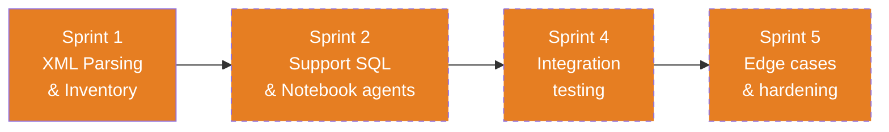

| Sprint | Focus | Key Deliverables |
|--------|-------|-----------------|
| **1** | Core parsing engine | XML parser, inventory generator, complexity classifier, DAG builder |
| **2** | Support downstream agents | Expose SQL override extractions, parameter file parsing |
| **4** | Integration | Verify inventory feeds all downstream agents correctly |
| **5** | Hardening | Malformed XML handling, IICS format support, partial parse recovery |

**Success Criteria:**
- Parse any Informatica PowerCenter XML export (v9.x, v10.x)
- Correctly classify 95%+ of mappings by complexity
- Generate valid JSON inventory that all downstream agents can consume

---

### 🗄️ SQL Migration Agent — Development Roadmap

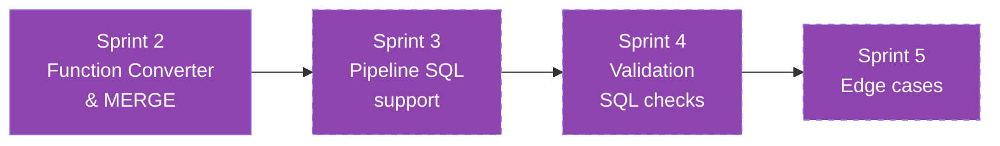

| Sprint | Focus | Key Deliverables |
|--------|-------|-----------------|
| **2** | Core conversion | 40+ Oracle→Spark function mappings, MERGE converter, data type mapping |
| **3** | Pipeline support | Pre/post-session SQL, SQL-based pipeline variables |
| **4** | Validation support | SQL-based validation queries for aggregate checks |
| **5** | Hardening | PL/SQL block conversion, cursor handling, dynamic SQL |

**Success Criteria:**
- Convert 90%+ of Oracle SQL overrides automatically
- MERGE INTO converts correctly to Delta MERGE
- Unconvertible SQL is clearly marked with manual-review comments

**Function Conversion Matrix (40+ mappings):**

| Oracle | Spark SQL | Status |
|--------|----------|--------|
| `NVL(a, b)` | `COALESCE(a, b)` | ✅ Sprint 2 |
| `DECODE(x, a, b, c)` | `CASE WHEN x=a THEN b ELSE c END` | ✅ Sprint 2 |
| `SYSDATE` | `current_timestamp()` | ✅ Sprint 2 |
| `TRUNC(date)` | `date_trunc('day', date)` | ✅ Sprint 2 |
| `TO_CHAR(d, fmt)` | `date_format(d, fmt)` | ✅ Sprint 2 |
| `TO_DATE(s, fmt)` | `to_date(s, fmt)` | ✅ Sprint 2 |
| `TO_NUMBER(s)` | `CAST(s AS DECIMAL)` | ✅ Sprint 2 |
| `SUBSTR(s, p, l)` | `SUBSTRING(s, p, l)` | ✅ Sprint 2 |
| `INSTR(s, sub)` | `LOCATE(sub, s)` | ✅ Sprint 2 |
| `NVL2(x, a, b)` | `IF(x IS NOT NULL, a, b)` | ✅ Sprint 2 |
| `ROWNUM` | `ROW_NUMBER() OVER()` | ⏳ Sprint 5 |
| `CONNECT BY` | `(manual — recursive CTE)` | ⏳ Sprint 5 |

---

### 📓 Notebook Migration Agent — Development Roadmap

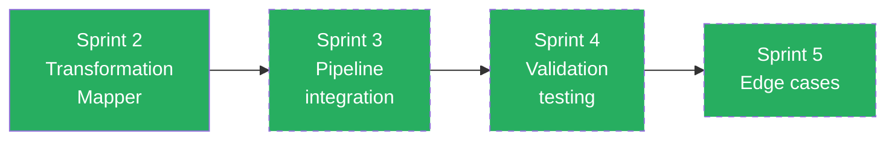

| Sprint | Focus | Key Deliverables |
|--------|-------|-----------------|
| **2** | Core conversion | 14 transformation types → PySpark, template-based generation, parameter handling |
| **3** | Pipeline integration | Notebook output values for pipeline decision gates |
| **4** | Testing | Verify generated notebooks match golden outputs |
| **5** | Hardening | Custom transformations, Java transforms, multi-group routers |

**Transformation Coverage Plan:**

| Transformation | PySpark Equivalent | Sprint | Complexity |
|---------------|-------------------|--------|-----------|
| Source Qualifier | `spark.table()` / `spark.read` | 2 | Low |
| Expression | `withColumn()` chain | 2 | Low |
| Filter | `.filter()` / `.where()` | 2 | Low |
| Aggregator | `.groupBy().agg()` | 2 | Medium |
| Lookup | `broadcast(df).join()` | 2 | Medium |
| Joiner | `.join()` | 2 | Medium |
| Update Strategy | Delta `MERGE` | 2 | High |
| Router | Multiple filtered DFs | 2 | Medium |
| Sequence Generator | `monotonically_increasing_id()` | 2 | Low |
| Sorter | `.orderBy()` | 2 | Low |
| Rank | `Window` + `row_number()` | 3 | Medium |
| Normalizer | `.explode()` | 3 | Medium |
| Stored Procedure | `spark.sql()` cell | 3 | High |
| Custom/Java | Placeholder + TODO | 5 | Manual |

---

### ⚡ Pipeline Migration Agent — Development Roadmap

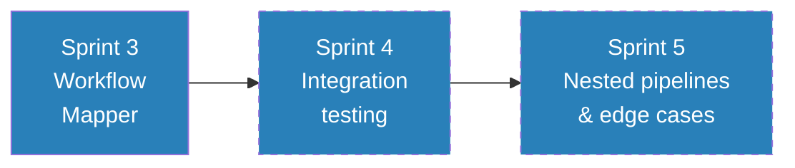

| Sprint | Focus | Key Deliverables |
|--------|-------|-----------------|
| **3** | Core conversion | Session→Notebook, Decision→IfCondition, Email→WebActivity, schedules, dependencies |
| **4** | Testing | Verify generated pipelines match golden output |
| **5** | Hardening | Worklet nesting, complex decision trees, event-based triggers |

**Activity Mapping Plan:**

| Informatica Element | Fabric Activity | Sprint |
|--------------------|----------------|--------|
| Session | TridentNotebook | 3 |
| Sequential Link (Succeeded) | dependsOn: Succeeded | 3 |
| Sequential Link (Failed) | dependsOn: Failed | 3 |
| Decision Task | IfCondition | 3 |
| Email Task | WebActivity (webhook) | 3 |
| Command Task | Script activity | 3 |
| Worklet | Execute Pipeline | 5 |
| Timer (wait) | Wait activity | 3 |
| Event Wait | (manual — custom trigger) | 5 |
| Scheduler | Schedule trigger | 3 |

---

### ✅ Validation Agent — Development Roadmap

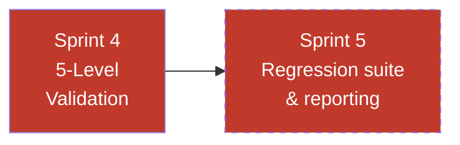

| Sprint | Focus | Key Deliverables |
|--------|-------|-----------------|
| **4** | Core validation | All 5 levels (row count, key unique, NULL, transform, aggregate), test matrix |
| **5** | Refinement | Known-difference handling, tolerance thresholds, regression suite |

**Validation Level Implementation:**

| Level | Test Type | Sprint | Generated Script |
|-------|----------|--------|-----------------|
| L1 | Row count comparison | 4 | Count source vs target, with filter adjustments |
| L2 | Key uniqueness | 4 | GroupBy key → check count > 1 |
| L3 | NULL checks | 4 | Filter isNull on critical columns |
| L4 | Transformation verification | 4 | Re-derive expressions, compare to target |
| L5 | Aggregate comparison | 4 | SUM/COUNT/AVG between source and target |

---

### 🎯 Migration Orchestrator — Development Roadmap

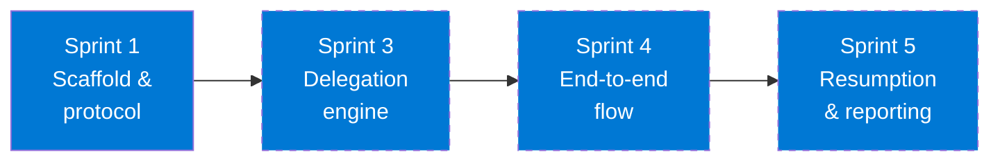

| Sprint | Focus | Key Deliverables |
|--------|-------|-----------------|
| **1** | Scaffold | Delegation protocol, progress tracking format |
| **3** | Delegation | Full 5-phase flow, wave planning, cross-agent handoffs |
| **4** | Integration | End-to-end test, progress reporting |
| **5** | Hardening | Partial failure recovery, resumption, final migration report |

---

## Risk Register

| # | Risk | Impact | Mitigation |
|---|------|--------|-----------|
| R1 | Unsupported Informatica transformation types | Notebooks incomplete | Placeholder cells with TODO + manual conversion notes |
| R2 | Complex Oracle PL/SQL not auto-convertible | SQL conversion gaps | Flag for manual review, provide partial conversion |
| R3 | XML format variations (v9 vs v10 vs IICS) | Parser breaks | Test against multiple format versions, graceful degradation |
| R4 | Pipeline JSON schema changes in Fabric | Pipelines invalid | Pin to known schema version, validate before output |
| R5 | Large mappings > 50 transformations | Performance / accuracy | Chunk processing, intermediate DataFrames |

---

## Definition of Done

A task is **Done** when:

- [x] Code/agent instructions updated and committed
- [x] Test case passes against example data (input → expected output)
- [x] No regressions in other agents’ outputs
- [x] Handoff artifacts documented (what the next agent needs)
- [ ] README or AGENTS.md updated if public-facing behavior changed

---

## Sprint Summary

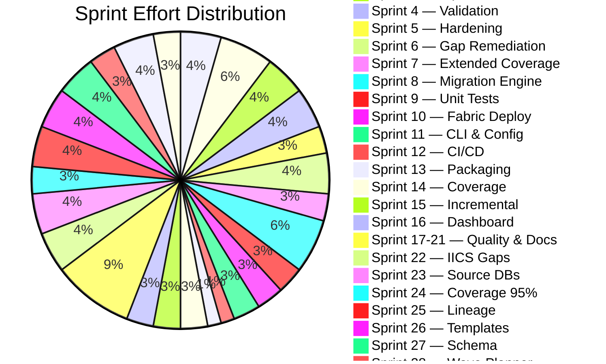

| Sprint | Primary Agents | Outputs | Status |
|--------|---------------|---------|--------|
| **1** | Assessment, Orchestrator (scaffold) | `inventory.json`, `dependency_dag.json`, `complexity_report.md` | ✅ Complete |
| **2** | SQL Migration, Notebook Migration | `SQL_*.sql`, `NB_*.py` | ✅ Complete |
| **3** | Pipeline Migration, Orchestrator (delegation) | `PL_*.json`, `migration_summary.md` | ✅ Complete |
| **4** | Validation, All (integration) | `VAL_*.py`, `test_matrix.md` | ✅ Complete |
| **5** | All (hardening) | Edge case handling, docs, final QA | ✅ Complete |
| **6** | Assessment, Notebook, Pipeline, SQL | Mapplet expansion, analytics, param files, templates | ✅ Complete |
| **7** | Assessment, Notebook, Pipeline, SQL | IICS parser, SQL Server patterns, WSC/DM, PL/SQL split | ✅ Complete |
| **8** | All (executable scripts) | `run_sql_migration.py`, `run_notebook_migration.py`, `run_pipeline_migration.py`, `run_validation.py`, `run_migration.py` | ✅ Complete |
| **9** | All (testing) | `tests/test_migration.py`, `pytest.ini`, `tests/__init__.py` | ✅ Complete |
| **10** | Orchestrator (deployment) | `deploy_to_fabric.py` | ✅ Complete |
| **11** | Orchestrator (CLI/config) | `run_migration.py` (enhanced), `migration.yaml` | ✅ Complete |
| **12** | All (CI/CD) | `.github/workflows/ci.yml`, ruff lint | ✅ Complete |
| **13** | All (packaging) | `pyproject.toml`, `requirements.txt`, CLI entry-point | ✅ Complete |
| **14** | All (coverage) | `tests/test_extended.py`, coverage config | ✅ Complete |
| **15** | Orchestrator (incremental) | `--resume`, `--reset`, `.checkpoint.json` | ✅ Complete |
| **16** | All (dashboard) | `dashboard.py`, `output/dashboard.html` | ✅ Complete |
| **17** | All (coverage) | `tests/test_coverage.py`, 239 tests, 85% coverage | ✅ Complete |
| **18** | All (E2E) | `tests/test_e2e.py`, 19 E2E integration tests | ✅ Complete |
| **19** | Assessment, Pipeline (IICS) | IICS Taskflow/Sync/MassIngestion/Connection parsers, `tests/test_iics.py` | ✅ Complete |
| **20** | Assessment, SQL, Pipeline (gaps) | Session config, scheduler cron, GTT/MV/DB links, `tests/test_gaps.py` | ✅ Complete |
| **21** | All (docs) | `docs/USER_GUIDE.md`, `docs/TROUBLESHOOTING.md`, `CONTRIBUTING.md`, `docs/ADR/` | ✅ Complete |
| **22** | Assessment, Notebook, Pipeline (IICS gaps) | DQ Task, App Integration, Taskflow edge cases | ✅ Complete |
| **23** | Assessment, SQL (source DBs) | Teradata, DB2, MySQL/PostgreSQL detection + conversion | ✅ Complete |
| **24** | All (coverage) | 92% coverage, 443 tests, 110 new Sprint 22-24 tests | ✅ Complete |
| **25** | Assessment (lineage) | Field-level lineage, conversion quality score, Mermaid diagrams | ✅ Complete |
| **26** | Notebook (templates) | HTTP/XML/TC/Java/Custom/ULKP → PySpark templates | ✅ Complete |
| **27** | SQL, Assessment (schema) | Delta Lake DDL, type mapping, workspace setup script | ✅ Complete |
| **28** | Assessment, Orchestrator (waves) | DAG topological sort, parallel groups, critical path | ✅ Complete |
| **29** | Validation (data) | Row count/checksum/sampling comparisons, HTML report | ✅ Complete |
| **30** | All (production) | Audit log, dry-run mode, security review, 500+ tests | ✅ Complete |

---

# Phase 2 — Enterprise & Fabric-Native (Sprints 31–40)

> **Goal:** Evolve the migration tooling from a functional converter into an **enterprise-grade, Fabric-native migration platform** — closing all remaining object gaps, enabling multi-tenant deployments, DevOps-driven promotions, Fabric workspace provisioning, observability, and an interactive migration experience.

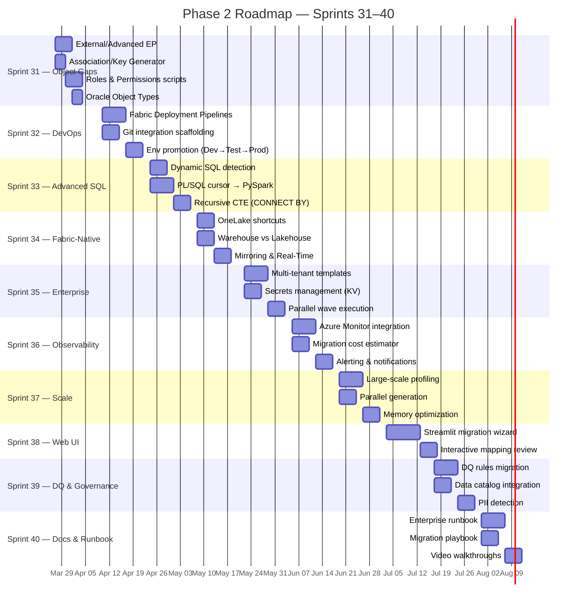

---

## Sprint 31 — Remaining Object Gaps (P2/P3)

**Goal:** Close the 7 remaining object gaps identified in GAP_ANALYSIS.md, achieving 98%+ object coverage.

| # | Task | Owner | Files | Acceptance Criteria |
|---|------|-------|-------|-------------------|
| 31.1 | External Procedure (EP) detection & template | Assessment + Notebook | `run_assessment.py`, `run_notebook_migration.py` | `EP` added to `TRANSFORMATION_ABBREV`; PySpark `subprocess.run()` / Python UDF stub generated with input/output port mapping |
| 31.2 | Advanced External Procedure (AEP) detection & template | Assessment + Notebook | `run_assessment.py`, `run_notebook_migration.py` | `AEP` added to `TRANSFORMATION_ABBREV`; PySpark template with library import pattern + TODO for native library porting |
| 31.3 | Association (ASSOC) detection & PySpark template | Assessment + Notebook | `run_assessment.py`, `run_notebook_migration.py` | `ASSOC` detected; generates PySpark window function–based grouping pattern |
| 31.4 | Key Generator (KEYGEN) detection & PySpark template | Assessment + Notebook | `run_assessment.py`, `run_notebook_migration.py` | `KEYGEN` detected; generates `monotonically_increasing_id()` or `sha2()` hash-based key |
| 31.5 | Address Validator (ADDRVAL) detection & placeholder | Assessment + Notebook | `run_assessment.py`, `run_notebook_migration.py` | `ADDRVAL` detected; generates placeholder with Azure Maps API + `requests` UDF + fallback regex |
| 31.6 | Oracle Object Types (`CREATE TYPE`) detection | Assessment + SQL | `run_assessment.py`, `run_sql_migration.py` | `CREATE TYPE` detected; generates StructType schema mapping + struct-to-columns flattening pattern |
| 31.7 | Roles & Permissions script generator | Orchestrator | `run_migration.py`, `output/scripts/` | Parse Informatica domain/folder permissions → generate Fabric workspace role assignment Python script using REST API |
| 31.8 | Object gap tests | Validation | `tests/test_sprint31_40.py` | 25+ tests covering all 7 new object types |

**Sprint 31 Exit Criteria:**
- [ ] All 7 remaining object gaps addressed (detection + template/placeholder)
- [ ] `TRANSFORMATION_ABBREV` includes EP, AEP, ASSOC, KEYGEN, ADDRVAL
- [ ] Object coverage: 92% → 98%
- [ ] 613+ tests passing

---

## Sprint 32 — Fabric DevOps & Environment Promotion

**Goal:** Integrate with Fabric Deployment Pipelines and Git-based CI/CD for environment promotion (Dev → Test → Prod).

| # | Task | Owner | Files | Acceptance Criteria |
|---|------|-------|-------|-------------------|
| 32.1 | Fabric Deployment Pipeline scaffolding | Orchestrator | `deploy_to_fabric.py` | Generate Fabric Deployment Pipeline definition JSON (Dev → Test → Prod stages) using REST API |
| 32.2 | Git integration for Fabric workspace | Orchestrator | `output/git/` | Generate `.pbip`-style folder structure compatible with Fabric Git integration (notebooks, pipelines, SQL) |
| 32.3 | Environment-specific config templates | Orchestrator | `templates/env_config/` | Generate `dev.yaml`, `test.yaml`, `prod.yaml` with parameterized connection strings, lakehouse names, Spark pool settings |
| 32.4 | Deployment promotion script | Orchestrator | `deploy_to_fabric.py` | `--promote dev test` flag that copies artifacts between workspaces with config substitution |
| 32.5 | Pre-deployment validation | Validation | `deploy_to_fabric.py` | `--validate` flag that checks schema compatibility, referenced notebooks exist, pipeline JSON valid |
| 32.6 | Deployment rollback support | Orchestrator | `deploy_to_fabric.py` | `--rollback` flag that reverts to previous version using deployment log timestamps |
| 32.7 | DevOps tests | Validation | `tests/test_sprint31_40.py` | 20+ tests covering promotion, config substitution, validation, rollback |

**Sprint 32 Exit Criteria:**
- [ ] Deployment Pipeline JSON generated for 3-stage promotion
- [ ] Git-compatible folder structure matches Fabric workspace format
- [ ] `--promote`, `--validate`, `--rollback` flags functional
- [ ] 633+ tests passing

---

## Sprint 33 — Advanced SQL & PL/SQL Conversion

**Goal:** Tackle the hardest SQL conversion cases — dynamic SQL, PL/SQL cursors, recursive CTEs, and BULK COLLECT — moving them from "flagged TODO" to partially automated conversion.

| # | Task | Owner | Files | Acceptance Criteria |
|---|------|-------|-------|-------------------|
| 33.1 | Dynamic SQL detection & extraction | SQL | `run_sql_migration.py` | Detect `EXECUTE IMMEDIATE`, `DBMS_SQL`, dynamic cursor patterns; extract embedded SQL strings for conversion |
| 33.2 | PL/SQL cursor → PySpark iterator | SQL + Notebook | `run_sql_migration.py`, `run_notebook_migration.py` | Convert `CURSOR ... FETCH ... LOOP` to PySpark `foreach()` / `foreachBatch()` pattern with row-level processing |
| 33.3 | BULK COLLECT → DataFrame collect | SQL | `run_sql_migration.py` | Convert `BULK COLLECT INTO` to `.collect()` / `.toPandas()` for small datasets, `.write` for large |
| 33.4 | CONNECT BY → recursive CTE | SQL | `run_sql_migration.py` | Convert `CONNECT BY PRIOR ... START WITH` to Spark SQL recursive CTE (`WITH RECURSIVE`) or PySpark `graphframes` pattern |
| 33.5 | EXCEPTION WHEN → try/except | SQL + Notebook | `run_sql_migration.py` | Convert PL/SQL exception blocks to Python try/except with logging |
| 33.6 | FORALL → batch DML | SQL | `run_sql_migration.py` | Convert `FORALL ... INSERT/UPDATE/DELETE` to batch DataFrame operations |
| 33.7 | Advanced SQL tests | Validation | `tests/test_sprint31_40.py` | 30+ tests covering all 6 advanced patterns |

**Sprint 33 Exit Criteria:**
- [ ] PL/SQL blocks previously flagged as "non-convertible TODO" now have partial auto-conversion
- [ ] CONNECT BY hierarchical queries produce recursive CTE or graphframes pattern
- [ ] 663+ tests passing

---

## Sprint 34 — Fabric-Native Features (OneLake, Warehouse, Shortcuts)

**Goal:** Generate Fabric-native artifacts beyond notebooks and pipelines — OneLake shortcuts, Warehouse objects, mirroring configurations, and Eventstream definitions.

| # | Task | Owner | Files | Acceptance Criteria |
|---|------|-------|-------|-------------------|
| 34.1 | Lakehouse vs Warehouse decision engine | Assessment | `run_assessment.py` | Analyze mapping patterns to recommend Lakehouse (ETL-heavy) vs Warehouse (SQL-heavy) per target table |
| 34.2 | Fabric Warehouse DDL generator | SQL | `run_schema_generator.py` | Generate T-SQL `CREATE TABLE` for Warehouse targets alongside Delta DDL for Lakehouse targets |
| 34.3 | OneLake shortcut generator | Orchestrator | `output/shortcuts/` | Generate shortcut definitions for cross-lakehouse references (replacing DB links) |
| 34.4 | Mirroring configuration | Orchestrator | `output/mirroring/` | Generate Fabric Mirroring setup for source databases (Oracle, SQL Server) that support it |
| 34.5 | Eventstream definition generator | Pipeline | `run_pipeline_migration.py` | Convert real-time/event-driven Informatica workflows to Fabric Eventstream definitions |
| 34.6 | Data Activator rules | Pipeline | `run_pipeline_migration.py` | Convert Informatica alert/notification triggers to Fabric Data Activator (Reflex) rules |
| 34.7 | Fabric-native tests | Validation | `tests/test_sprint31_40.py` | 20+ tests covering decision engine, DDL, shortcuts, mirroring |

**Sprint 34 Exit Criteria:**
- [ ] Decision engine recommends Lakehouse vs Warehouse per mapping
- [ ] Both Delta DDL and T-SQL DDL generated as appropriate
- [ ] OneLake shortcuts replace DB link references
- [ ] 683+ tests passing

---

## Sprint 35 — Multi-Tenant & Enterprise Scale

**Goal:** Enable migration at enterprise scale — multi-tenant deployments, parameterized templates, secrets management, and parallel wave execution.

| # | Task | Owner | Files | Acceptance Criteria |
|---|------|-------|-------|-------------------|
| 35.1 | Multi-tenant template system | Orchestrator | `templates/`, `run_migration.py` | Support `${TENANT_ID}`, `${WORKSPACE}`, `${LAKEHOUSE}` placeholders with per-tenant YAML overrides |
| 35.2 | Azure Key Vault integration | Orchestrator | `deploy_to_fabric.py` | Replace all placeholder secrets with `notebookutils.credentials.getSecret()` calls referencing Key Vault linked service |
| 35.3 | Parallel wave execution engine | Orchestrator | `run_migration.py` | Execute independent wave groups in parallel using `concurrent.futures.ThreadPoolExecutor` (or Fabric pipeline parallel ForEach) |
| 35.4 | Migration manifest generator | Orchestrator | `output/manifest.json` | Machine-readable manifest of all artifacts, dependencies, and deployment order for CI/CD tooling |
| 35.5 | Bulk migration CLI | Orchestrator | `run_migration.py` | `--batch` flag that migrates a folder of Informatica exports in one invocation |
| 35.6 | Tenant isolation validation | Validation | `run_validation.py` | Generate test that verifies no cross-tenant data leakage in multi-tenant setups |
| 35.7 | Enterprise tests | Validation | `tests/test_sprint31_40.py` | 20+ tests covering templates, secrets, parallel, manifest, batch |

**Sprint 35 Exit Criteria:**
- [ ] Multi-tenant migration with 3 tenant configs produces isolated workspaces
- [ ] Secrets fully parametrized via Key Vault
- [ ] Parallel wave execution demonstrably faster than sequential
- [ ] 703+ tests passing

---

## Sprint 36 — Observability & Azure Monitor Integration

**Goal:** Production-grade observability — emit migration metrics to Azure Monitor, build cost estimation models, and generate operational alerting.

| # | Task | Owner | Files | Acceptance Criteria |
|---|------|-------|-------|-------------------|
| 36.1 | Azure Monitor metric emitter | Orchestrator | `run_migration.py` | Emit custom metrics (migration_duration, artifacts_generated, errors_count, conversion_score_avg) to Azure Monitor via REST API |
| 36.2 | Migration cost estimator | Assessment | `run_assessment.py` | Estimate Fabric CU consumption per notebook/pipeline based on data volume, transformation complexity, Spark config |
| 36.3 | Operational alerting integration | Orchestrator | `run_migration.py` | Send Teams/Slack webhook on migration failure, with error details and remediation suggestions |
| 36.4 | Migration telemetry dashboard | Orchestrator | `dashboard.py` | Add Azure Monitor integration tab to HTML dashboard — link to Log Analytics queries |
| 36.5 | RU/CU budget planner | Assessment | `output/inventory/cost_estimate.md` | Per-mapping and per-wave CU cost projection with total migration cost |
| 36.6 | Observability tests | Validation | `tests/test_sprint31_40.py` | 15+ tests covering metric emission, cost estimation, alerting |

**Sprint 36 Exit Criteria:**
- [ ] Migration metrics visible in Azure Monitor after deployment
- [ ] Cost estimates within 20% of actual CU usage (validated post-migration)
- [ ] Teams webhook fires on simulated failure
- [ ] 718+ tests passing

---

## Sprint 37 — Performance at Scale (100+ Mappings)

**Goal:** Profile and optimize for large-scale migrations — 100+ mappings, 50+ workflows, parallel generation, and memory-efficient XML parsing.

| # | Task | Owner | Files | Acceptance Criteria |
|---|------|-------|-------|-------------------|
| 37.1 | Large-scale XML fixtures | Assessment | `tests/fixtures/` | Generate synthetic Informatica XML with 100 mappings, 50 workflows, 500 transformations |
| 37.2 | XML streaming parser (SAX) | Assessment | `run_assessment.py` | Replace full DOM parse with SAX-based streaming for files >10MB to reduce memory footprint |
| 37.3 | Parallel notebook generation | Notebook | `run_notebook_migration.py` | Generate notebooks in parallel using `multiprocessing.Pool` (configurable worker count) |
| 37.4 | Parallel SQL conversion | SQL | `run_sql_migration.py` | Convert SQL files in parallel using `concurrent.futures.ProcessPoolExecutor` |
| 37.5 | Generation timing & profiling | Orchestrator | `run_migration.py` | Per-phase and per-artifact timing in audit log; `--profile` flag for cProfile output |
| 37.6 | Memory usage tracking | Orchestrator | `run_migration.py` | Log peak memory usage per phase; warn if >500MB |
| 37.7 | Scale tests | Validation | `tests/test_sprint31_40.py` | 15+ tests including large-scale fixture parsing, parallel generation correctness, memory bounds |

**Sprint 37 Exit Criteria:**
- [ ] 100-mapping migration completes in <60s on standard hardware
- [ ] Memory usage stays under 500MB for 100-mapping parse
- [ ] Parallel generation shows 2x+ speedup vs sequential
- [ ] 733+ tests passing

---

## Sprint 38 — Interactive Web UI & Migration Wizard

**Goal:** Build a browser-based migration wizard for non-CLI users — upload XML, configure options, preview artifacts, and deploy.

| # | Task | Owner | Files | Acceptance Criteria |
|---|------|-------|-------|-------------------|
| 38.1 | Streamlit migration wizard | Orchestrator | `web/app.py` | 6-step wizard: Upload → Assess → Configure → Convert → Review → Deploy |
| 38.2 | Interactive mapping review | Notebook | `web/app.py` | Side-by-side view: Informatica mapping XML ↔ generated PySpark notebook, with inline edit |
| 38.3 | Pipeline visual preview | Pipeline | `web/app.py` | Render pipeline JSON as visual graph (Mermaid or D3) in browser |
| 38.4 | Deployment progress tracker | Orchestrator | `web/app.py` | Real-time deployment progress with per-artifact status updates |
| 38.5 | Export/import configuration | Orchestrator | `web/app.py` | Save/load migration configuration as JSON for repeatable runs |
| 38.6 | Web UI tests | Validation | `tests/test_sprint31_40.py` | 10+ tests covering wizard flow, artifact rendering, config persistence |

**Sprint 38 Exit Criteria:**
- [ ] Web wizard runs locally via `python -m streamlit run web/app.py`
- [ ] Full migration cycle possible through browser (upload → deploy)
- [ ] Pipeline graph rendered visually
- [ ] 743+ tests passing

---

## Sprint 39 — Data Quality & Governance Migration

**Goal:** Migrate Informatica Data Quality (DQ) rules and governance metadata to Fabric equivalents — profiling, rules, PII detection, and cataloging.

| # | Task | Owner | Files | Acceptance Criteria |
|---|------|-------|-------|-------------------|
| 39.1 | DQ rules extraction | Assessment | `run_assessment.py` | Parse Informatica DQ task rules (standardization, validation, matching) from XML |
| 39.2 | DQ rules → PySpark validation | Notebook | `run_notebook_migration.py` | Convert DQ rules to PySpark validation cells (regex, range checks, referential integrity) |
| 39.3 | PII detection rules | Notebook | `run_notebook_migration.py` | Generate PySpark cells that scan target tables for PII patterns (email, phone, SSN, credit card) |
| 39.4 | Microsoft Purview catalog integration | Orchestrator | `output/catalog/` | Generate Purview-compatible metadata JSON for registering migrated assets |
| 39.5 | Data sensitivity classification | Assessment | `run_assessment.py` | Auto-classify columns as Public/Internal/Confidential/Restricted based on name patterns and DQ metadata |
| 39.6 | Governance tests | Validation | `tests/test_sprint31_40.py` | 15+ tests covering DQ extraction, PII detection, Purview output |

**Sprint 39 Exit Criteria:**
- [ ] Informatica DQ rules converted to runnable PySpark validation
- [ ] PII scanner detects 5+ pattern types with configurable sensitivity
- [ ] Purview metadata JSON generated for all target tables
- [ ] 758+ tests passing

---

## Sprint 40 — Enterprise Documentation & Runbook

**Goal:** Production-grade documentation for enterprise migration teams — operational runbook, migration playbook, troubleshooting encyclopedia, and training materials.

| # | Task | Owner | Files | Acceptance Criteria |
|---|------|-------|-------|-------------------|
| 40.1 | Migration runbook | All | `docs/RUNBOOK.md` | Step-by-step operational guide: pre-migration checklist, execution, validation, cutover, rollback |
| 40.2 | Enterprise migration playbook | All | `docs/ENTERPRISE_PLAYBOOK.md` | 8-phase playbook: Discover → Assess → Plan → Convert → Validate → Deploy → Monitor → Optimize |
| 40.3 | Troubleshooting encyclopedia | All | `docs/TROUBLESHOOTING.md` | Expand to 30+ common issues with resolution steps, covering Fabric-specific errors |
| 40.4 | Architecture Decision Records (Phase 2) | All | `docs/ADR/` | ADRs for: Lakehouse vs Warehouse decision, multi-tenant strategy, Key Vault integration, parallel execution |
| 40.5 | Migration checklist template | All | `templates/migration_checklist.md` | Reusable per-wave checklist (pre/during/post) for migration teams |
| 40.6 | Release notes generator | Orchestrator | `run_migration.py` | `--release-notes` flag that generates changelog from migration summary + deployment log |

**Sprint 40 Exit Criteria:**
- [ ] Runbook covers all operational scenarios (happy path, failure, rollback)
- [ ] Enterprise playbook aligns with Fabric Well-Architected Framework
- [ ] 30+ troubleshooting entries
- [ ] 4 new ADRs for Phase 2 decisions

---

## Phase 2 Sprint Summary

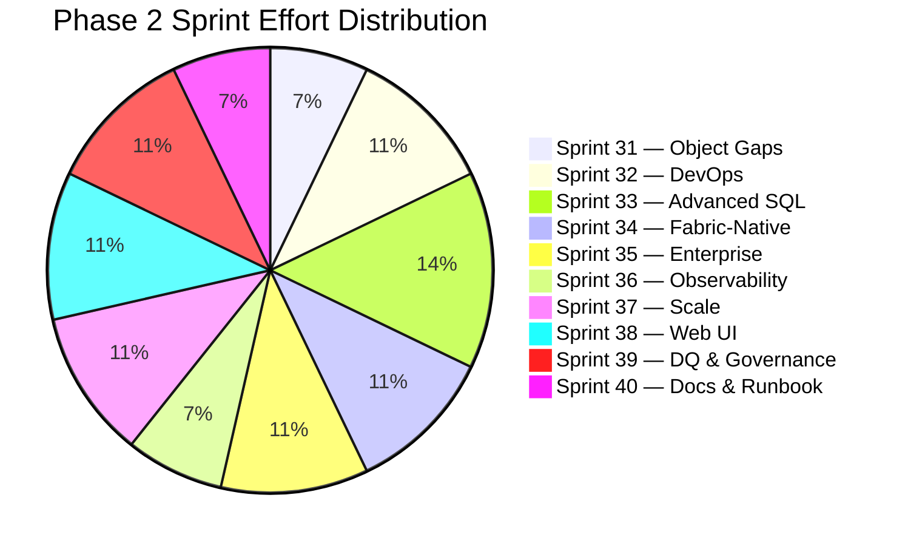

| Sprint | Primary Agents | Outputs | Status |
|--------|---------------|---------|--------|
| **31** | Assessment, Notebook, Orchestrator | EP, AEP, ASSOC, KEYGEN, ADDRVAL, Object Types, Roles scripts | ✅ Complete |
| **32** | Orchestrator, Validation | Deployment Pipeline JSON, Git structure, env configs, promotion | ⏳ Deferred → Phase 3 |
| **33** | SQL, Notebook | Dynamic SQL, cursors → PySpark, CONNECT BY → recursive CTE, BULK COLLECT | ✅ Complete |
| **34** | Assessment, SQL, Pipeline, Orchestrator | Lakehouse/Warehouse decision, T-SQL DDL, OneLake shortcuts, Mirroring, Eventstream | ⏳ Deferred → Phase 3 |
| **35** | Orchestrator, Validation | Multi-tenant templates, Key Vault, parallel waves, manifest, batch CLI | ✅ Complete |
| **36** | Orchestrator, Assessment | Azure Monitor metrics, cost estimator, Teams/Slack alerting | ⏳ Deferred → Phase 3 |
| **37** | Assessment, Notebook, SQL, Orchestrator | SAX parser, parallel generation, profiling, memory optimization | ✅ Complete |
| **38** | Orchestrator, Notebook, Pipeline | Streamlit wizard, mapping review UI, pipeline graph, progress tracker | ✅ Complete |
| **39** | Assessment, Notebook, Orchestrator | DQ rule extraction, PII detection, Purview catalog, sensitivity classification | ✅ Complete |
| **40** | All (docs) | Runbook, playbook, troubleshooting 30+, ADRs, checklist, release notes | ✅ Complete |

---

# Phase 3 — Multi-Platform & Production Deployment (Sprints 41–50)

> **Goal:** Complete the Databricks target integration, deliver deferred Fabric-native features, add cross-platform deployment automation, observability, and hardened CI/CD — making the tool production-ready for enterprise customers migrating to **either** Microsoft Fabric **or** Azure Databricks.

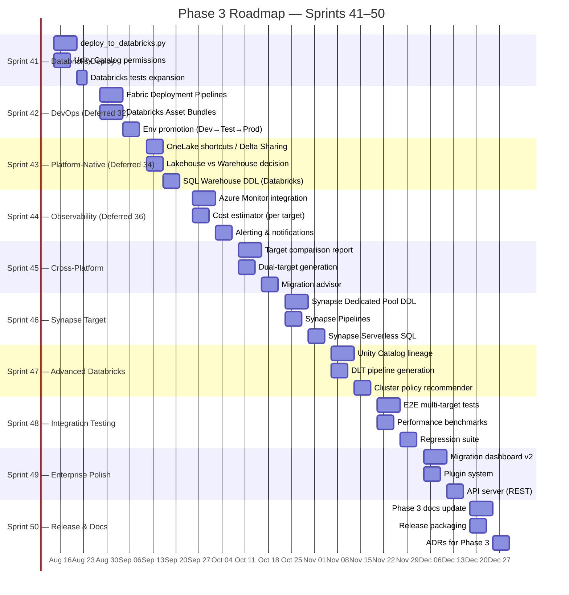

---

## Sprint 41 — Databricks Deployment & Permissions

**Goal:** Complete the Databricks target with automated deployment (`deploy_to_databricks.py`) and Unity Catalog permission script generation.

| # | Task | Owner | Files | Acceptance Criteria |
|---|------|-------|-------|-------------------|
| 41.1 | Databricks deployment script | Orchestrator | `deploy_to_databricks.py` | Deploy notebooks via Databricks REST API (`/api/2.0/workspace/import`); deploy jobs via Jobs API (`/api/2.1/jobs/create`); support `--dry-run`, `--workspace-url`, `--token` flags |
| 41.2 | Unity Catalog permission generator | Orchestrator | `output/scripts/uc_permissions.sql` | Parse Informatica roles → generate `GRANT` statements for Unity Catalog (catalog, schema, table, function levels) |
| 41.3 | Databricks secret scope setup | Orchestrator | `deploy_to_databricks.py` | `--setup-secrets` flag that creates secret scope and populates from Key Vault or config |
| 41.4 | Databricks cluster config recommendation | Assessment | `output/inventory/cluster_config.json` | Recommend cluster size (driver/worker node type, count) based on mapping complexity and data volume |
| 41.5 | Expand Databricks test coverage | Validation | `tests/test_databricks_target.py` | 80+ Databricks tests (up from 50) covering deployment, permissions, and cluster config |
| 41.6 | Update docs for Databricks target | All | `README.md`, `docs/USER_GUIDE.md` | Databricks Quick Start, `--target databricks` examples, Unity Catalog setup guide |

**Sprint 41 Exit Criteria:**
- [ ] `deploy_to_databricks.py` deploys notebooks + jobs to a Databricks workspace
- [ ] Unity Catalog GRANT scripts cover catalog/schema/table/function permissions
- [ ] 80+ Databricks tests passing
- [ ] README and User Guide updated with Databricks instructions
- [ ] 826+ total tests passing

---

## Sprint 42 — DevOps & Environment Promotion (Deferred Sprint 32)

**Goal:** Enable CI/CD-driven deployments for both Fabric and Databricks — Fabric Deployment Pipelines, Databricks Asset Bundles, Git integration, and environment promotion.

| # | Task | Owner | Files | Acceptance Criteria |
|---|------|-------|-------|-------------------|
| 42.1 | Fabric Deployment Pipeline scaffolding | Orchestrator | `deploy_to_fabric.py` | Generate Fabric Deployment Pipeline definition JSON (Dev → Test → Prod stages) |
| 42.2 | Databricks Asset Bundles (DAB) generation | Orchestrator | `output/databricks_bundle/` | Generate `databricks.yml` + bundle structure for `databricks bundle deploy` |
| 42.3 | Git-compatible folder structure | Orchestrator | `output/git/` | Generate folder structure compatible with both Fabric Git integration and Databricks Repos |
| 42.4 | Environment-specific config templates | Orchestrator | `templates/env_config/` | Generate `dev.yaml`, `test.yaml`, `prod.yaml` per target platform with parameterized connections |
| 42.5 | Deployment promotion script | Orchestrator | `deploy_to_fabric.py`, `deploy_to_databricks.py` | `--promote dev test` flag for both platforms |
| 42.6 | Pre-deployment validation | Validation | Deployment scripts | `--validate` flag checking schema compatibility, referenced notebooks exist, JSON valid |
| 42.7 | Deployment rollback | Orchestrator | Deployment scripts | `--rollback` flag reverting to previous version via deployment log |
| 42.8 | DevOps tests | Validation | `tests/test_phase3.py` | 25+ tests covering promotion, DAB, config substitution, rollback |

**Sprint 42 Exit Criteria:**
- [ ] Fabric Deployment Pipeline JSON generated
- [ ] Databricks Asset Bundle (`databricks.yml`) generated and structurally valid
- [ ] `--promote`, `--validate`, `--rollback` functional for both platforms
- [ ] 851+ tests passing

---

## Sprint 43 — Platform-Native Features (Deferred Sprint 34)

**Goal:** Generate platform-native artifacts — OneLake shortcuts, Delta Sharing, Lakehouse vs Warehouse decision engine, and Databricks SQL Warehouse DDL.

| # | Task | Owner | Files | Acceptance Criteria |
|---|------|-------|-------|-------------------|
| 43.1 | Lakehouse vs Warehouse decision engine | Assessment | `run_assessment.py` | Analyze mapping patterns → recommend Lakehouse (ETL-heavy) vs Warehouse (SQL-heavy) per target table |
| 43.2 | Fabric Warehouse DDL generator | SQL | `run_schema_generator.py` | Generate T-SQL `CREATE TABLE` for Warehouse targets alongside Delta DDL for Lakehouse |
| 43.3 | Databricks SQL Warehouse DDL | SQL | `run_schema_generator.py` | Generate SQL Warehouse-optimized DDL (CLUSTER BY, Z-ORDER recommendations) |
| 43.4 | OneLake shortcut generator | Orchestrator | `output/shortcuts/` | Generate shortcut definitions for cross-lakehouse references (replacing DB links) |
| 43.5 | Delta Sharing configuration | Orchestrator | `output/delta_sharing/` | Generate Delta Sharing provider/recipient config for cross-workspace data access in Databricks |
| 43.6 | Mirroring configuration | Orchestrator | `output/mirroring/` | Generate Fabric Mirroring setup for Oracle/SQL Server sources |
| 43.7 | Platform-native tests | Validation | `tests/test_phase3.py` | 20+ tests covering decision engine, DDL variants, shortcuts, Delta Sharing |

**Sprint 43 Exit Criteria:**
- [ ] Decision engine recommends Lakehouse vs Warehouse per mapping
- [ ] Both Delta DDL and T-SQL DDL / SQL Warehouse DDL generated
- [ ] OneLake shortcuts and Delta Sharing configs replace DB link references
- [ ] 871+ tests passing

---

## Sprint 44 — Observability & Cost Estimation (Deferred Sprint 36)

**Goal:** Production-grade observability — emit metrics to Azure Monitor, build per-target cost estimation models, and generate alerting.

| # | Task | Owner | Files | Acceptance Criteria |
|---|------|-------|-------|-------------------|
| 44.1 | Azure Monitor metric emitter | Orchestrator | `run_migration.py` | Emit custom metrics (duration, artifacts generated, errors, conversion score) to Azure Monitor |
| 44.2 | Migration cost estimator — Fabric | Assessment | `output/inventory/cost_estimate.md` | Per-mapping CU projection for Fabric (Spark pool, Pipeline activity, storage) |
| 44.3 | Migration cost estimator — Databricks | Assessment | `output/inventory/cost_estimate.md` | Per-mapping DBU projection for Databricks (cluster hours, Jobs compute, storage) |
| 44.4 | Operational alerting | Orchestrator | `run_migration.py` | Teams/Slack webhook on migration failure with error details |
| 44.5 | Databricks cluster policy recommender | Assessment | `output/inventory/cluster_config.json` | Recommend cluster policy based on workload profile (interactive vs job vs SQL warehouse) |
| 44.6 | Telemetry dashboard v2 | Orchestrator | `dashboard.py` | Add target platform tab, cost breakdown, Azure Monitor links |
| 44.7 | Observability tests | Validation | `tests/test_phase3.py` | 15+ tests covering metrics, cost estimation, alerting |

**Sprint 44 Exit Criteria:**
- [ ] Migration metrics visible in Azure Monitor
- [ ] Cost estimates generated per target platform
- [ ] Teams webhook fires on simulated failure
- [ ] 886+ tests passing

---

## Sprint 45 — Cross-Platform Comparison & Dual-Target

**Goal:** Enable side-by-side comparison of migration outputs for Fabric vs Databricks, and support dual-target generation in a single run.

| # | Task | Owner | Files | Acceptance Criteria |
|---|------|-------|-------|-------------------|
| 45.1 | Target comparison report | Orchestrator | `output/comparison_report.md` | Side-by-side comparison: notebook API calls, pipeline structure, DDL syntax, cost projections |
| 45.2 | Dual-target generation | Orchestrator | `run_migration.py` | `--target all` flag generates both Fabric and Databricks artifacts in separate output dirs |
| 45.3 | Migration advisor | Assessment | `output/inventory/target_recommendation.md` | Recommend Fabric vs Databricks based on workload characteristics (SQL-heavy → Fabric Warehouse, ML → Databricks, etc.) |
| 45.4 | Unified deployment manifest | Orchestrator | `output/manifest.json` | Single manifest referencing both Fabric and Databricks artifacts with deployment order |
| 45.5 | Cross-platform tests | Validation | `tests/test_phase3.py` | 15+ tests covering comparison report, dual-target, advisor |

**Sprint 45 Exit Criteria:**
- [ ] Comparison report clearly shows Fabric vs Databricks differences per mapping
- [ ] `--target all` produces both artifact sets
- [ ] Migration advisor provides actionable recommendation
- [ ] 901+ tests passing

---

## Sprint 46 — Synapse Analytics Target

**Goal:** Add Azure Synapse Analytics (Dedicated SQL Pools) as a third target platform for SQL-heavy workloads.

| # | Task | Owner | Files | Acceptance Criteria |
|---|------|-------|-------|-------------------|
| 46.1 | Synapse Dedicated Pool DDL | SQL | `run_schema_generator.py` | Generate Synapse-optimized DDL (DISTRIBUTION, CLUSTERED COLUMNSTORE INDEX, PARTITION) |
| 46.2 | Synapse Pipeline generation | Pipeline | `run_pipeline_migration.py` | Generate Synapse Pipelines (ADF-compatible JSON) |
| 46.3 | Synapse Serverless SQL views | SQL | `run_sql_migration.py` | Generate Serverless SQL views over Delta tables (OPENROWSET patterns) |
| 46.4 | T-SQL stored procedure migration | SQL | `run_sql_migration.py` | Convert Oracle SPs to Synapse T-SQL stored procedures (not just Spark SQL) |
| 46.5 | Synapse deployment script | Orchestrator | `deploy_to_synapse.py` | Deploy artifacts to Synapse workspace via REST API |
| 46.6 | Synapse tests | Validation | `tests/test_phase3.py` | 20+ tests for Synapse DDL, pipelines, deployment |

**Sprint 46 Exit Criteria:**
- [ ] Synapse DDL uses DISTRIBUTION, CLUSTERED COLUMNSTORE INDEX
- [ ] Synapse Pipelines generated as ADF-compatible JSON
- [ ] `--target synapse` flag functional
- [ ] 921+ tests passing

---

## Sprint 47 — Advanced Databricks Features

**Goal:** Deep Databricks integration — Unity Catalog lineage, Delta Live Tables (DLT), and intelligent cluster policy recommendations.

| # | Task | Owner | Files | Acceptance Criteria |
|---|------|-------|-------|-------------------|
| 47.1 | Unity Catalog lineage metadata | Assessment | `output/inventory/uc_lineage.json` | Generate UC lineage API-compatible metadata for migrated tables and notebooks |
| 47.2 | Delta Live Tables (DLT) pipeline generation | Notebook | `run_notebook_migration.py` | `--databricks-dlt` flag generates DLT notebooks with `@dlt.table` decorators instead of raw PySpark |
| 47.3 | Databricks SQL dashboard generation | Validation | `output/databricks/dashboards/` | Convert validation notebooks to Databricks SQL dashboard queries |
| 47.4 | Cluster policy recommendation engine | Assessment | `output/inventory/cluster_policies.json` | Recommend photon-enabled, GPU, memory-optimized, or standard based on transformation patterns |
| 47.5 | Databricks Workflows advanced features | Pipeline | `run_pipeline_migration.py` | Add job clusters, task dependencies with condition, repair run config |
| 47.6 | Advanced Databricks tests | Validation | `tests/test_phase3.py` | 20+ tests covering DLT, UC lineage, dashboards, cluster policies |

**Sprint 47 Exit Criteria:**
- [ ] DLT notebooks generated with `@dlt.table` / `@dlt.view` decorators
- [ ] Unity Catalog lineage metadata passes UC validation
- [ ] Cluster policy recommendations vary by workload type
- [ ] 941+ tests passing

---

## Sprint 48 — Integration Testing & Benchmarks

**Goal:** Comprehensive cross-platform integration tests, performance benchmarks, and regression suite for all three targets.

| # | Task | Owner | Files | Acceptance Criteria |
|---|------|-------|-------|-------------------|
| 48.1 | E2E multi-target tests | Validation | `tests/test_e2e_multitarget.py` | Full migration pipeline tested for Fabric, Databricks, and Synapse targets |
| 48.2 | Performance benchmarks | Orchestrator | `tests/benchmarks/` | Measure generation time for 10/50/100/500 mapping workloads per target |
| 48.3 | Regression snapshot suite | Validation | `tests/snapshots/` | Golden-file comparison for all generated notebooks, pipelines, DDL across targets |
| 48.4 | Error recovery testing | Orchestrator | `tests/test_phase3.py` | Test graceful degradation: missing XML, corrupt config, network timeout during deploy |
| 48.5 | Memory & CPU profiling | Orchestrator | `tests/benchmarks/` | Profile peak memory and CPU for large workloads; validate <500MB threshold |
| 48.6 | Integration test infrastructure | Validation | `tests/conftest.py` | Shared fixtures, parametrized target tests, CI matrix for all targets |

**Sprint 48 Exit Criteria:**
- [ ] E2E tests pass for all 3 targets with identical input
- [ ] Performance benchmarks documented in `output/benchmarks/`
- [ ] Regression snapshots capture all artifact types
- [ ] 961+ tests passing

---

## Sprint 49 — Enterprise Polish & Extensibility

**Goal:** Production polish — migration dashboard v2 with multi-target support, plugin system for custom transformations, and REST API server.

| # | Task | Owner | Files | Acceptance Criteria |
|---|------|-------|-------|-------------------|
| 49.1 | Migration dashboard v2 | Orchestrator | `dashboard.py` | Multi-target dashboard with tabs per platform, cost breakdown, deployment status, lineage viz |
| 49.2 | Plugin system for custom transformations | Notebook | `plugins/` | Register custom transformation handlers (PySpark function) that integrate into notebook generation |
| 49.3 | REST API server | Orchestrator | `api/server.py` | HTTP API for programmatic migration (POST `/migrate`, GET `/status`, GET `/artifacts`) |
| 49.4 | Web UI v2 — multi-target | All | `web/app.py` | Web wizard supports Fabric, Databricks, and Synapse targets with target-specific config |
| 49.5 | Migration template marketplace | Orchestrator | `templates/marketplace/` | Pre-built migration patterns (e.g., Oracle EBS → Fabric, SAP → Databricks) |
| 49.6 | Enterprise polish tests | Validation | `tests/test_phase3.py` | 15+ tests for dashboard, plugins, API, marketplace |

**Sprint 49 Exit Criteria:**
- [ ] Dashboard renders multi-target migration status
- [ ] Plugin system allows custom transformation registration
- [ ] REST API serves migration requests
- [ ] 976+ tests passing

---

## Sprint 50 — Release Packaging & Documentation

**Goal:** Final Phase 3 release — updated documentation, ADRs, release packaging, and comprehensive migration guide for all target platforms.

| # | Task | Owner | Files | Acceptance Criteria |
|---|------|-------|-------|-------------------|
| 50.1 | Phase 3 documentation update | All | `README.md`, `docs/USER_GUIDE.md`, `docs/TROUBLESHOOTING.md` | All docs reflect 3 target platforms, 50 sprints, full feature set |
| 50.2 | Architecture Decision Records (Phase 3) | All | `docs/ADR/` | ADRs for: multi-target architecture, Databricks Asset Bundles, DLT generation, Synapse target, plugin system |
| 50.3 | Release packaging | Orchestrator | `pyproject.toml`, CI/CD | PyPI package with optional deps per target (`[databricks]`, `[synapse]`, `[all]`) |
| 50.4 | Migration certification checklist | All | `templates/certification_checklist.md` | Per-target pre/post migration certification checklist for enterprise sign-off |
| 50.5 | Video walkthrough scripts | All | `docs/walkthroughs/` | Script outlines for Fabric, Databricks, and Synapse migration walkthroughs |
| 50.6 | AGENTS.md and CONTRIBUTING.md update | All | `AGENTS.md`, `CONTRIBUTING.md` | Reflect multi-target support, new modules, updated agent responsibilities |

**Sprint 50 Exit Criteria:**
- [ ] All documentation reflects 3 targets and 50 sprints
- [ ] 5 new ADRs for Phase 3 decisions
- [ ] PyPI package installable with target-specific extras
- [ ] 990+ total tests passing
- [ ] AGENTS.md describes deploy-to-databricks and deploy-to-synapse modules

---

## Phase 3 Sprint Summary

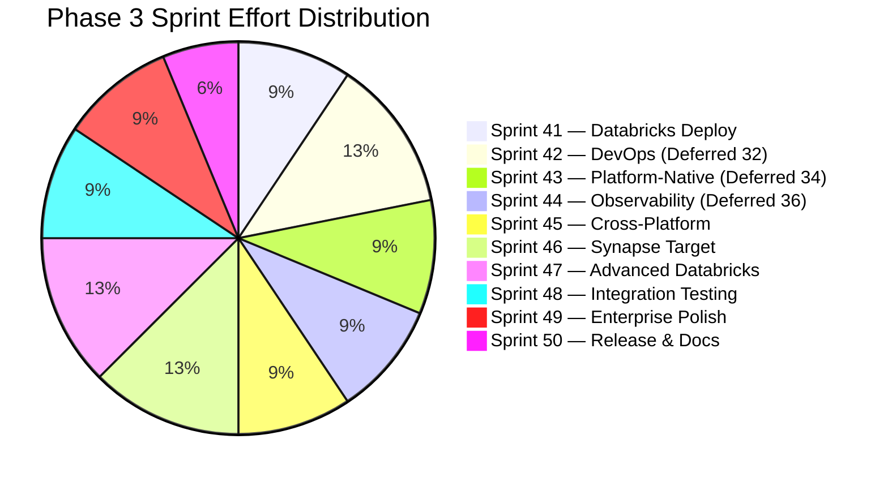

| Sprint | Primary Agents | Outputs | Status |
|--------|---------------|---------|--------|
| **41** | Orchestrator, Assessment, Validation | `deploy_to_databricks.py`, UC permissions, cluster config | ⏳ Planned |
| **42** | Orchestrator, Validation | Fabric Deployment Pipelines, Databricks Asset Bundles, env promotion | ⏳ Planned |
| **43** | Assessment, SQL, Orchestrator | Lakehouse/Warehouse decision, SQL Warehouse DDL, OneLake shortcuts, Delta Sharing | ⏳ Planned |
| **44** | Orchestrator, Assessment | Azure Monitor metrics, per-target cost estimator, alerting | ⏳ Planned |
| **45** | Orchestrator, Assessment | Comparison report, dual-target generation, migration advisor | ⏳ Planned |
| **46** | SQL, Pipeline, Orchestrator | Synapse DDL, Synapse Pipelines, `deploy_to_synapse.py` | ⏳ Planned |
| **47** | Notebook, Assessment, Pipeline | DLT notebooks, UC lineage, SQL dashboards, cluster policies | ⏳ Planned |
| **48** | Validation, Orchestrator | E2E multi-target tests, benchmarks, regression snapshots | ⏳ Planned |
| **49** | Orchestrator, Notebook, All | Dashboard v2, plugin system, REST API, web UI v2 | ⏳ Planned |
| **50** | All (docs) | Phase 3 docs, ADRs, PyPI packaging, certification checklist | ⏳ Planned |
