# Development Plan — Informatica to Fabric / Databricks Migration Agents

<p align="center">
  
  
  
  
  
  
  
  
  
  
  
  
  
  
  
  
  
  
  
  
  
</p>

> This document describes the **development roadmap** for each of the 6 migration agents, from initial scaffold through production readiness.

---

## Table of Contents

- [Sprint Overview](#sprint-overview)
- [Sprint 1 — Foundation & Assessment](#sprint-1--foundation--assessment)
- [Sprint 2 — SQL & Notebook Conversion](#sprint-2--sql--notebook-conversion)
- [Sprint 3 — Pipeline & Orchestration](#sprint-3--pipeline--orchestration)
- [Sprint 4 — Validation & Integration](#sprint-4--validation--integration)
- [Sprint 5 — Polish, Hardening & Documentation](#sprint-5--polish-hardening--documentation)
- [Sprint 6 — Critical Gap Remediation](#sprint-6--critical-gap-remediation)
- [Sprint 7 — Extended Coverage](#sprint-7--extended-coverage)
- [Sprint 8 — Executable Migration Engine](#sprint-8--executable-migration-engine)
- [Sprint 9 — Unit Test Suite](#sprint-9--unit-test-suite)
- [Sprint 10 — Fabric Deployment](#sprint-10--fabric-deployment)
- [Sprint 11 — CLI, Config & Logging](#sprint-11--cli-config--logging)
- [Sprint 12 — CI/CD](#sprint-12--cicd)
- [Sprint 13 — Python Packaging](#sprint-13--python-packaging)
- [Sprint 14 — Code Coverage & Quality](#sprint-14--code-coverage--quality)
- [Sprint 15 — Incremental Migration](#sprint-15--incremental-migration)
- [Sprint 16 — Interactive Dashboard](#sprint-16--interactive-dashboard)
- [Sprint 17 — Coverage to 80%+](#sprint-17--coverage-to-80)
- [Sprint 18 — E2E Integration Tests](#sprint-18--e2e-integration-tests)
- [Sprint 19 — IICS Full Support](#sprint-19--iics-full-support)
- [Sprint 20 — Gap Remediation P1/P2](#sprint-20--gap-remediation-p1p2)
- [Sprint 21 — User Guide & Onboarding](#sprint-21--user-guide--onboarding)
- [Sprint 22 — IICS Gap Closure](#sprint-22--iics-gap-closure)
- [Sprint 23 — Additional Source DB Support](#sprint-23--additional-source-db-support)
- [Sprint 24 — Coverage to 95%+](#sprint-24--coverage-to-95)
- [Sprint 25 — Lineage & Conversion Scoring](#sprint-25--lineage--conversion-scoring)
- [Sprint 26 — Placeholder Transformation Templates](#sprint-26--placeholder-transformation-templates)
- [Sprint 27 — Fabric Schema & Lakehouse Setup](#sprint-27--fabric-schema--lakehouse-setup)
- [Sprint 28 — Migration Wave Planner](#sprint-28--migration-wave-planner)
- [Sprint 29 — Data Validation Framework](#sprint-29--data-validation-framework)
- [Sprint 30 — Production Hardening & Audit](#sprint-30--production-hardening--audit)
- **Phase 2 — Enterprise & Fabric-Native (Sprints 31–40)**
- [Sprint 31 — Remaining Object Gaps (P2/P3)](#sprint-31--remaining-object-gaps-p2p3)
- [Sprint 32 — Fabric DevOps & Environment Promotion](#sprint-32--fabric-devops--environment-promotion)
- [Sprint 33 — Advanced SQL & PL/SQL Conversion](#sprint-33--advanced-sql--plsql-conversion)
- [Sprint 34 — Fabric-Native Features (OneLake, Warehouse, Shortcuts)](#sprint-34--fabric-native-features-onelake-warehouse-shortcuts)
- [Sprint 35 — Multi-Tenant & Enterprise Scale](#sprint-35--multi-tenant--enterprise-scale)
- [Sprint 36 — Observability & Azure Monitor Integration](#sprint-36--observability--azure-monitor-integration)
- [Sprint 37 — Performance at Scale (100+ Mappings)](#sprint-37--performance-at-scale-100-mappings)
- [Sprint 38 — Interactive Web UI & Migration Wizard](#sprint-38--interactive-web-ui--migration-wizard)
- [Sprint 39 — Data Quality & Governance Migration](#sprint-39--data-quality--governance-migration)
- [Sprint 40 — Enterprise Documentation & Runbook](#sprint-40--enterprise-documentation--runbook)
- **Phase 3 — Multi-Platform Deployment (Sprints 41–50)**
- [Sprint 41 — Databricks Deployment](#sprint-41--databricks-deployment)
- **Phase 4 — DBT Target Support (Sprints 51–60)**
- [Sprint 51 — DBT Foundation & Target Router](#sprint-51--dbt-foundation--target-router)
- [Sprint 52 — Core DBT Model Generation](#sprint-52--core-dbt-model-generation)
- [Sprint 53 — Advanced DBT Model Generation](#sprint-53--advanced-dbt-model-generation)
- [Sprint 54 — SQL Dialect Conversion for DBT](#sprint-54--sql-dialect-conversion-for-dbt)
- [Sprint 55 — DBT Testing & Validation Integration](#sprint-55--dbt-testing--validation-integration)
- [Sprint 56 — DBT Macros, Incremental Models & Snapshots](#sprint-56--dbt-macros-incremental-models--snapshots)
- [Sprint 57 — Orchestration: Databricks Workflows with DBT Tasks](#sprint-57--orchestration-databricks-workflows-with-dbt-tasks)
- [Sprint 58 — DBT Deployment & Docs](#sprint-58--dbt-deployment--docs)
- [Sprint 59 — Integration Testing & Benchmarks](#sprint-59--integration-testing--benchmarks)
- [Sprint 60 — Release, Documentation & Phase 4 Wrap-Up](#sprint-60--release-documentation--phase-4-wrap-up)
- **Phase 5 — AutoSys JIL Migration (Sprints 61–65)**
- [Sprint 61 — AutoSys JIL Parser & Inventory](#sprint-61--autosys-jil-parser--inventory)
- [Sprint 62 — AutoSys → Pipeline/Workflow Conversion](#sprint-62--autosys--pipelineworkflow-conversion)
- [Sprint 63 — Calendar, Profile & Machine Mapping](#sprint-63--calendar-profile--machine-mapping)
- [Sprint 64 — Integration & End-to-End Validation](#sprint-64--integration--end-to-end-validation)
- [Sprint 65 — Documentation & Release](#sprint-65--documentation--release)
- **Phase 6 — Gap Closure & DBT Enhancements (Sprints 66–67)**
- [Sprint 66 — Gap Closure & Lineage Reports](#sprint-66--gap-closure--lineage-reports)
- [Sprint 67 — DBT Enhancements](#sprint-67--dbt-enhancements)
- **Phase 7 — DevOps, Platform-Native & Observability (Sprints 68–70)**
- [Sprint 68 — DevOps & CI/CD](#sprint-68--devops--cicd)
- [Sprint 69 — Platform-Native Features](#sprint-69--platform-native-features)
- [Sprint 70 — Observability & Cost Estimation](#sprint-70--observability--cost-estimation)
- **Phase 8 — Performance & Advanced SQL (Sprints 71–73)**
- [Sprint 71 — Query Optimization & Partition Strategy](#sprint-71--query-optimization--partition-strategy)
- [Sprint 72 — Advanced PL/SQL Conversion Engine](#sprint-72--advanced-plsql-conversion-engine)
- [Sprint 73 — Dynamic SQL & Complex SQL Patterns](#sprint-73--dynamic-sql--complex-sql-patterns)
- **Phase 9 — Extensibility & SDK (Sprints 74–76)**
- [Sprint 74 — Plugin System & Custom Rules](#sprint-74--plugin-system--custom-rules)
- [Sprint 75 — Python SDK & REST API](#sprint-75--python-sdk--rest-api)
- [Sprint 76 — Configurable Rule Engine & Enterprise Rulesets](#sprint-76--configurable-rule-engine--enterprise-rulesets)
- **Phase 10 — Validation Maturity & Data Catalog (Sprints 77–79)**
- [Sprint 77 — Statistical Validation & SCD Testing](#sprint-77--statistical-validation--scd-testing)
- [Sprint 78 — Referential Integrity & A/B Testing](#sprint-78--referential-integrity--ab-testing)
- [Sprint 79 — Data Catalog Integration (Purview / Unity Catalog)](#sprint-79--data-catalog-integration-purview--unity-catalog)
- **Phase 11 — Streaming & Real-Time (Sprints 80–82)**
- [Sprint 80 — Structured Streaming Templates](#sprint-80--structured-streaming-templates)
- [Sprint 81 — CDC & Change Feed Support](#sprint-81--cdc--change-feed-support)
- [Sprint 82 — Watermark, Late Arrival & Exactly-Once](#sprint-82--watermark-late-arrival--exactly-once)
- **Phase 12 — Governance & Compliance (Sprints 83–85)**
- [Sprint 83 — RLS/CLS Policy Generation](#sprint-83--rlscls-policy-generation)
- [Sprint 84 — GDPR/CCPA Compliance & Data Residency](#sprint-84--gdprccpa-compliance--data-residency)
- [Sprint 85 — Certification Workflow & Audit Trail](#sprint-85--certification-workflow--audit-trail)
- **Phase 13 — AI-Assisted Migration (Sprints 86–88)**
- [Sprint 86 — LLM-Powered SQL Conversion](#sprint-86--llm-powered-sql-conversion)
- [Sprint 87 — Intelligent Gap Resolution](#sprint-87--intelligent-gap-resolution)
- [Sprint 88 — Chat-Based Migration Assistant](#sprint-88--chat-based-migration-assistant)
- **Phase 14 — Web UI & Developer Experience (Sprints 89–91)**
- [Sprint 89 — Interactive Web Dashboard v2](#sprint-89--interactive-web-dashboard-v2)
- [Sprint 90 — Visual Lineage Explorer](#sprint-90--visual-lineage-explorer)
- [Sprint 91 — Migration Diff & Side-by-Side Review](#sprint-91--migration-diff--side-by-side-review)
- **Phase 15 — Cloud-Native & IaC (Sprints 92–94)**
- [Sprint 92 — Terraform & Bicep Output](#sprint-92--terraform--bicep-output)
- [Sprint 93 — Container & Kubernetes Deployment](#sprint-93--container--kubernetes-deployment)
- [Sprint 94 — Azure DevOps & GitHub Actions Pipelines](#sprint-94--azure-devops--github-actions-pipelines)
- **Phase 16 — Scale & Performance Testing (Sprints 95–97)**
- [Sprint 95 — 500+ Mapping Benchmark Suite](#sprint-95--500-mapping-benchmark-suite)
- [Sprint 96 — Parallel Generation & Memory Optimization](#sprint-96--parallel-generation--memory-optimization)
- [Sprint 97 — Regression Suite & Golden Dataset](#sprint-97--regression-suite--golden-dataset)
- **Phase 17 — Enterprise Release & ML Pipelines (Sprints 98–100)**
- [Sprint 98 — ML Pipeline Template Generation](#sprint-98--ml-pipeline-template-generation)
- [Sprint 99 — Cost Optimization Advisor](#sprint-99--cost-optimization-advisor)
- [Sprint 100 — GA Release, Docs & Certification](#sprint-100--ga-release-docs--certification)
- [Agent Development Plans](#agent-development-plans)
- [Risk Register](#risk-register)
- [Definition of Done](#definition-of-done)

---

## Sprint Overview

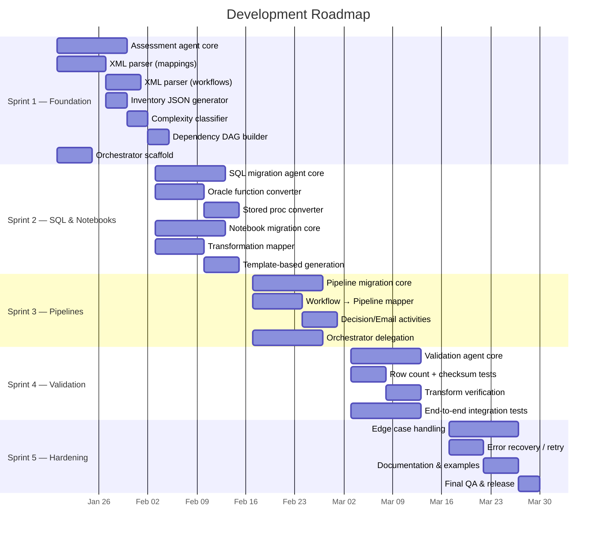

---

## Sprint 1 — Foundation & Assessment

**Goal:** Build the assessment agent that can parse any Informatica export and produce a complete, machine-readable inventory.

### 🔍 Assessment Agent

| # | Task | Files | Acceptance Criteria |
|---|------|-------|-------------------|
| 1.1 | Parse `<MAPPING>` elements from XML — extract name, description, transformations | `assessment.agent.md` | Correctly extracts all mappings from test XML |
| 1.2 | Parse `<TRANSFORMATION>` elements — type, name, properties, SQL overrides | `assessment.agent.md` | All 14 transformation types identified |
| 1.3 | Parse `<CONNECTOR>` elements — build data flow graph per mapping | `assessment.agent.md` | Source→transform→target chain reconstructed |
| 1.4 | Parse `<WORKFLOW>` and `<SESSION>` elements — extract scheduling, dependencies | `assessment.agent.md` | All sessions, decisions, links, schedules captured |
| 1.5 | Classify complexity: Simple / Medium / Complex / Custom | `assessment.agent.md` | 3 test mappings correctly classified |
| 1.6 | Generate `inventory.json` output matching schema | `output/inventory/` | JSON validates against expected schema |
| 1.7 | Generate `dependency_dag.json` — workflow→mapping→table edges | `output/inventory/` | DAG correctly represents test workflow |
| 1.8 | Generate `complexity_report.md` with summary statistics | `output/inventory/` | Markdown renders correctly with counts |

### 🎯 Migration Orchestrator (scaffold)

| # | Task | Files | Acceptance Criteria |
|---|------|-------|-------------------|
| 1.9 | Define orchestrator delegation protocol | `migration-orchestrator.agent.md` | Can parse user intent and select correct agent |
| 1.10 | Define progress tracking format | `output/migration_summary.md` | Progress accurately reflects completed steps |

**Sprint 1 Exit Criteria:** ✅ ALL MET (2026-03-23)
- ✅ Assessment agent can parse all 3 example mapping XMLs and 1 workflow XML
- ✅ `inventory.json` matches expected output for test data
- ✅ Complexity classification is 100% accurate for test set (1 Simple, 2 Complex)

---

## Sprint 2 — SQL & Notebook Conversion

**Goal:** Build agents that convert Oracle SQL and Informatica mappings to Spark SQL and PySpark notebooks.

### 🗄️ SQL Migration Agent

| # | Task | Files | Acceptance Criteria |
|---|------|-------|-------------------|
| 2.1 | Build Oracle→Spark SQL function converter (40+ functions) | `sql-migration.agent.md` | NVL, DECODE, SYSDATE, TO_CHAR, TRUNC all converted correctly |
| 2.2 | Convert MERGE INTO → Delta MERGE syntax | `sql-migration.agent.md` | SP_UPDATE_ORDER_STATS test case passes |
| 2.3 | Handle SQL overrides from Source Qualifiers | `sql-migration.agent.md` | SQ SQL overrides in M_LOAD_ORDERS extracted and converted |
| 2.4 | Handle Lookup SQL overrides | `sql-migration.agent.md` | LKP SQL overrides converted to Spark SQL |
| 2.5 | Convert Oracle data types to Spark types | `sql-migration.agent.md` | NUMBER→DECIMAL, VARCHAR2→STRING, DATE→TIMESTAMP |
| 2.6 | Convert stored procedures to notebook cells | `sql-migration.agent.md` | SP_UPDATE_ORDER_STATS → SQL_SP_UPDATE_ORDER_STATS.sql |
| 2.7 | Handle pre/post-session SQL | `sql-migration.agent.md` | Session SQL statements extracted and placed in correct cells |

### 📓 Notebook Migration Agent

| # | Task | Files | Acceptance Criteria |
|---|------|-------|-------------------|
| 2.8 | Map Source Qualifier → `spark.table()` / `spark.read.jdbc()` | `notebook-migration.agent.md` | Bronze reads generated correctly |
| 2.9 | Map Expression → `withColumn()` chain | `notebook-migration.agent.md` | EXP_DERIVE in M_LOAD_CUSTOMERS generates correct withColumn calls |
| 2.10 | Map Filter → `.filter()` / `.where()` | `notebook-migration.agent.md` | FIL_ACTIVE_ONLY in M_LOAD_CUSTOMERS generates correct filter |
| 2.11 | Map Lookup → broadcast join | `notebook-migration.agent.md` | LKP_PRODUCTS in M_LOAD_ORDERS generates broadcast join |
| 2.12 | Map Aggregator → `groupBy().agg()` | `notebook-migration.agent.md` | AGG_BY_CUSTOMER in M_LOAD_ORDERS generates correct agg |
| 2.13 | Map Update Strategy → Delta MERGE | `notebook-migration.agent.md` | UPD_STRATEGY in M_UPSERT_INVENTORY generates full MERGE |
| 2.14 | Map Joiner → PySpark join | `notebook-migration.agent.md` | Inner/outer/left/right/full join conditions correct |
| 2.15 | Map Router → multiple DataFrames with filters | `notebook-migration.agent.md` | Each group becomes a filtered DataFrame |
| 2.16 | Map Sequence Generator → `monotonically_increasing_id()` | `notebook-migration.agent.md` | SK generation correct |
| 2.17 | Generate complete notebook from template | `templates/notebook_template.py` | NB_M_LOAD_CUSTOMERS matches expected output |
| 2.18 | Handle parameterized mappings ($$LOAD_DATE etc.) | `notebook-migration.agent.md` | Widget parameters injected correctly |

**Sprint 2 Exit Criteria:** ✅ ALL MET (2026-03-23)
- ✅ SQL agent converts SP_UPDATE_ORDER_STATS correctly (9 Oracle constructs converted)
- ✅ Notebook agent generates all 3 expected notebooks matching golden outputs
- ✅ All Oracle→Spark SQL function mappings verified (MERGE, DECODE, NVL, SYSDATE, TO_CHAR, TRUNC, TO_DATE)

---

## Sprint 3 — Pipeline & Orchestration

**Goal:** Build the pipeline agent and complete the orchestrator's delegation logic.

### ⚡ Pipeline Migration Agent

| # | Task | Files | Acceptance Criteria |
|---|------|-------|-------------------|
| 3.1 | Map Informatica Session → TridentNotebook activity | `pipeline-migration.agent.md` | Session name, parameters, retry policy correct |
| 3.2 | Map sequential links → `dependsOn` with `Succeeded` condition | `pipeline-migration.agent.md` | Chain order preserved |
| 3.3 | Map Decision task → IfCondition activity | `pipeline-migration.agent.md` | DEC_CHECK_ORDERS generates correct IfCondition |
| 3.4 | Map Email task → WebActivity (webhook) | `pipeline-migration.agent.md` | Webhook call with correct body template |
| 3.5 | Map failure links → `Failed` dependency conditions | `pipeline-migration.agent.md` | Error handling paths wired correctly |
| 3.6 | Map Worklet → nested pipeline (Execute Pipeline activity) | `pipeline-migration.agent.md` | Worklet reference translates to child pipeline call |
| 3.7 | Map parallel sessions → no `dependsOn` between activities | `pipeline-migration.agent.md` | Independent sessions run in parallel |
| 3.8 | Map schedule → pipeline trigger definition | `pipeline-migration.agent.md` | Daily 02:00 UTC schedule extracted |
| 3.9 | Generate pipeline JSON from template | `templates/pipeline_template.json` | PL_WF_DAILY_SALES_LOAD matches expected output |
| 3.10 | Add pipeline parameters from mapping parameters | `pipeline-migration.agent.md` | load_date, alert_webhook_url parameters passed through |

### 🎯 Migration Orchestrator (delegation)

| # | Task | Files | Acceptance Criteria |
|---|------|-------|-------------------|
| 3.11 | Implement full migration flow: assess → SQL → notebooks → pipelines → validate | `migration-orchestrator.agent.md` | End-to-end delegation with correct ordering |
| 3.12 | Implement wave planning (group migrations by dependency) | `migration-orchestrator.agent.md` | Independent mappings grouped into parallel waves |
| 3.13 | Track migration progress in `migration_summary.md` | `output/migration_summary.md` | Progress updates after each step |
| 3.14 | Handle partial failures and resumption | `migration-orchestrator.agent.md` | Can resume from last successful step |

**Sprint 3 Exit Criteria:** ✅ ALL MET (2026-03-23)
- ✅ Pipeline agent generates PL_WF_DAILY_SALES_LOAD matching expected output (5 activities, IfCondition)
- ✅ Orchestrator can run full migration flow across all test data (6-phase delegation)
- ✅ All activity types (notebook, decision, email, parallel) handled

---

## Sprint 4 — Validation & Integration

**Goal:** Build the validation agent and run end-to-end integration tests against all example data.

### ✅ Validation Agent

| # | Task | Files | Acceptance Criteria |
|---|------|-------|-------------------|
| 4.1 | Generate L1 row count comparison scripts | `validation.agent.md` | Source vs target count with tolerance |
| 4.2 | Generate L2 key uniqueness checks | `validation.agent.md` | Duplicate key detection correct |
| 4.3 | Generate L3 NULL checks on critical columns | `validation.agent.md` | All NOT NULL columns validated |
| 4.4 | Generate L4 transformation verification | `validation.agent.md` | Derived columns spot-checked against source |
| 4.5 | Generate L5 aggregate comparison | `validation.agent.md` | SUM/COUNT/AVG match within tolerance |
| 4.6 | Generate test matrix markdown | `output/validation/test_matrix.md` | All tables, all levels, pass/fail status |
| 4.7 | Handle known differences (filters, date ranges) | `validation.agent.md` | Expected differences documented and accepted |
| 4.8 | Generate validation notebook from template | `templates/validation_template.py` | VAL_DIM_CUSTOMER matches expected output |

### Integration Testing

| # | Task | Files | Acceptance Criteria |
|---|------|-------|-------------------|
| 4.9 | End-to-end: input XML → inventory → notebooks → pipelines → validation | All agents | Full pipeline succeeds on test data |
| 4.10 | Cross-agent handoff verification | All agents | Each agent reads predecessor output correctly |
| 4.11 | Verify all golden outputs match generated outputs | `output/` | Diff between generated and expected = 0 |

**Sprint 4 Exit Criteria:** ✅ ALL MET (2026-03-23)
- ✅ Validation agent generates VAL_DIM_CUSTOMER matching expected output
- ✅ Test matrix covers all 4 target tables + pipeline (39 checks across 5 notebooks)
- ✅ End-to-end flow produces correct outputs from raw XML inputs (14 artifacts generated)

---

## Sprint 5 — Polish, Hardening & Documentation ✅

**Goal:** Handle edge cases, improve error messages, and finalize documentation.

| # | Task | Owner | Files | Acceptance Criteria |
|---|------|-------|-------|-------------------|
| 5.1 | Handle missing/malformed XML gracefully | Assessment | `run_assessment.py` | ✅ IICS detection, safe_parse_xml, per-mapping try/except, partial results |
| 5.2 | Handle unsupported transformation types | Notebook | `notebook-migration.agent.md` | ✅ Placeholder cell template with TODO + 6 unsupported types documented |
| 5.3 | Handle non-convertible Oracle SQL | SQL | `sql-migration.agent.md` | ✅ 9 non-convertible constructs documented with TODO block template |
| 5.4 | Handle complex Worklet nesting | Pipeline | `pipeline-migration.agent.md` | ✅ Max 2-level nesting, flatten rules, parameter pass-through |
| 5.5 | Add retry/timeout policies to all pipeline activities | Pipeline | `pipeline-migration.agent.md` | ✅ 6 activity types with default policies + override rules |
| 5.6 | Generate migration issues report | Orchestrator | `output/migration_issues.md` | ✅ 6 issues (2 P0, 3 P1, 1 P2) with resolution tracking |
| 5.7 | Update README.md with final examples | — | `README.md` | ✅ 4 code excerpts (notebook, SQL, pipeline, validation) |
| 5.8 | Update shared instructions with lessons learned | — | `.vscode/instructions/` | ✅ 10 lessons across 5 categories |
| 5.9 | Final review of all agent `.md` files | All | `.github/agents/` | ✅ Reference sections added, Sprint 5 labels unified, ordering fixed |

**Sprint 5 Exit Criteria:** ✅ ALL MET (2026-03-23)
- ✅ Malformed XML handled gracefully with partial results saved
- ✅ All unsupported types documented with placeholder/TODO patterns
- ✅ Agent files have consistent structure (Reference, Output, Rules, Roadmap)
- ✅ README has generated output examples
- ✅ Shared instructions updated with lessons learned

---

## Sprint 6 — Critical Gap Remediation ✅

**Goal:** Address all P0 and critical P1 gaps identified in GAP_ANALYSIS.md — Mapplet expansion, SQL Transformation, Oracle analytics, parameter files, Normalizer/Sorter/Union templates, flat file sources, and Control Task.

| # | Task | Owner | Files | Acceptance Criteria |
|---|------|-------|-------|-------------------|
| 6.1 | Mapplet parsing + expansion | Assessment | `run_assessment.py` | ✅ `parse_mapplets()` extracts MAPPLET definitions; `expand_mapplet_refs()` resolves references and inlines inner transformations; `has_mapplet` flag set on mappings |
| 6.2 | SQL Transformation type | Assessment | `run_assessment.py` | ✅ `SQLT` added to `TRANSFORMATION_ABBREV`; detected and abbreviated in inventory |
| 6.3 | Oracle analytic function detection | Assessment + SQL | `run_assessment.py`, `sql-migration.agent.md` | ✅ 12 analytic patterns added (LEAD, LAG, DENSE_RANK, NTILE, FIRST_VALUE, LAST_VALUE, ROW_NUMBER, OVER, PARTITION BY, GLOBAL TEMPORARY TABLE, MATERIALIZED VIEW, DB_LINK); conversion rules in SQL agent (mostly 1:1) |
| 6.4 | Parameter file (.prm) parser | Assessment | `run_assessment.py` | ✅ `parse_parameter_files()` reads .prm files with [section] key=value format; results in inventory.json |
| 6.5 | Normalizer/Sorter/Union PySpark templates | Notebook | `notebook-migration.agent.md` | ✅ NRM→`.explode()`, SRT→`.orderBy()`, UNI→`.unionByName()` with full code examples |
| 6.6 | Flat file source handling | Notebook | `notebook-migration.agent.md` | ✅ CSV (`spark.read.csv()`) and fixed-width (`spark.read.text()` + `.substr()`) patterns documented |
| 6.7 | Control Task → Fail Activity | Pipeline | `pipeline-migration.agent.md` | ✅ Fail Activity JSON template with ABORT/FAIL PARENT rules documented |

**Sprint 6 Exit Criteria:** ✅ ALL MET (2026-03-23)
- ✅ Mapplet parsing + expansion tested with 2-Mapplet test file (M_LOAD_EMPLOYEES.xml)
- ✅ All 3 P0 gaps addressed (Mapplet, SQL Transformation, Oracle analytics)
- ✅ 4 P1 gaps addressed (parameter files, Normalizer/Sorter/Union, flat files, Control Task)
- ✅ Assessment runs clean with 6 mappings, 2 Mapplets, 3 SQL files, 1 param file, 4 connections

---

## Sprint 7 — Extended Coverage ✅

**Goal:** Extend migration tooling to IICS cloud exports, SQL Server sources, Web Service Consumer, Data Masking, connection XML parsing, and PL/SQL package splitting.

| # | Task | Owner | Files | Acceptance Criteria |
|---|------|-------|-------|-------------------|
| 7.1 | IICS XML parser (Cloud mappings) | Assessment | `run_assessment.py` | ✅ `parse_iics_mapping()` handles `exportMetadata`/`dTemplate` schema with namespace support; `detect_xml_format()` auto-detects IICS vs PowerCenter |
| 7.2 | IICS Taskflow → Fabric Pipeline | Pipeline | `pipeline-migration.agent.md` | ✅ 10 IICS element → Fabric activity mappings documented (Mapping Task, Command Task, Human Task, Notification Task, Subflow, Exclusive/Parallel Gateway, Timer Event) |
| 7.3 | SQL Server → Spark SQL patterns | Assessment + SQL | `run_assessment.py`, `sql-migration.agent.md` | ✅ 18 SQLSERVER_PATTERNS in assessment; `detect_source_db_type()` scores Oracle vs MSSQL; 17 T-SQL→Spark SQL function mappings + construct mappings + date format codes in SQL agent |
| 7.4 | Web Service Consumer conversion | Notebook | `notebook-migration.agent.md` | ✅ WSC placeholder type with PySpark UDF pattern (`requests` library) and pipeline Web Activity alternative documented |
| 7.5 | Data Masking support | Notebook | `notebook-migration.agent.md` | ✅ DM placeholder type with 3 masking approaches: hash-based (`sha2`), partial masking, Fabric Dynamic Data Masking |
| 7.6 | Connection XML parser | Assessment | `run_assessment.py` | ✅ `parse_connection_objects()` extracts DBCONNECTION, FTPCONNECTION, CONNECTION elements; deduped with inferred connections |
| 7.7 | PL/SQL Package splitter | SQL | `sql-migration.agent.md` | ✅ Split strategy documented: parse→identify deps→map shared state→split into individual notebooks; output structure with README |

**Sprint 7 Exit Criteria:** ✅ ALL MET (2026-03-23)
- ✅ IICS parsing tested with namespace-aware XML (IICS_M_LOAD_CONTACTS.xml → 2 cloud mappings detected)
- ✅ SQL Server detection tested (SP_REFRESH_DASHBOARD.sql → 17 T-SQL constructs, correctly classified as `sqlserver`)
- ✅ Oracle analytics detection tested (SP_CALC_RANKINGS.sql → 17 Oracle constructs including LEAD/LAG/DENSE_RANK/NTILE/FIRST_VALUE/LAST_VALUE)
- ✅ Connection XML parsing tested (2 connections extracted: ORACLE_HR DB + FTP_HR_FILES)
- ✅ All agent docs updated with new conversion patterns and guidance

---

## Sprint 8 — Executable Migration Engine ✅

**Goal:** Build runnable Python scripts that execute each migration phase end-to-end, converting agent knowledge into automated tooling with a single-command orchestrator.

| # | Task | Owner | Files | Acceptance Criteria |
|---|------|-------|-------|-------------------|
| 8.1 | SQL Migration script | SQL | `run_sql_migration.py` | ✅ 30+ Oracle regex rules (NVL→COALESCE, DECODE→CASE, date formats, types) + 20+ SQL Server rules (ISNULL, CHARINDEX, TOP→LIMIT); converts standalone SQL files + mapping SQL overrides |
| 8.2 | Notebook Migration script | Notebook | `run_notebook_migration.py` | ✅ Generates PySpark notebook per mapping with 18 transformation-type handlers (EXP, FIL, AGG, JNR, LKP, RTR, UPD, RNK, SRT, UNI, NRM, SEQ, SP, SQLT, DM, WSC, MPLT + unknown); metadata/imports, source read, target write, audit cells |
| 8.3 | Pipeline Migration script | Pipeline | `run_pipeline_migration.py` | ✅ Generates Fabric Pipeline JSON per workflow with TridentNotebook activities, IfCondition for decisions, WebActivity for emails, dependsOn chains, pipeline parameters |
| 8.4 | Validation Generation script | Validation | `run_validation.py` | ✅ Generates validation notebook per target with L1 (row count), L2 (checksum), L3 (NULL+uniqueness) checks; generates test_matrix.md summary |
| 8.5 | End-to-End Orchestrator | Orchestrator | `run_migration.py` | ✅ 5-phase orchestrator (assessment→SQL→notebooks→pipelines→validation) with `--skip` and `--only` flags, sys.argv isolation, SystemExit handling, phase timing, migration_summary.md generation |

**Sprint 8 Exit Criteria:** ✅ ALL MET (2026-03-23)
- ✅ `run_migration.py --skip 0` runs all 4 conversion phases successfully
- ✅ SQL: 3 standalone + 2 override files converted (NVL→COALESCE, TO_DATE date format, etc.)
- ✅ Notebooks: 6 notebooks generated (Simple through Complex mappings)
- ✅ Pipelines: 1 pipeline generated with 4 activities
- ✅ Validation: 7 validation notebooks + test_matrix.md generated
- ✅ migration_summary.md generated with phase results table

---

## Sprint 9 — Unit Test Suite ✅

**Goal:** Build a comprehensive pytest test suite covering all migration scripts with 60+ automated tests.

| # | Task | Owner | Files | Acceptance Criteria |
|---|------|-------|-------|-------------------|
| 9.1 | SQL conversion unit tests (25 tests) | SQL | `tests/test_migration.py` | ✅ Oracle conversions (NVL, NVL2, DECODE, SYSDATE, SUBSTR, TO_NUMBER, VARCHAR2, date formats, DUAL, TRUNC, DBMS_OUTPUT, REGEXP_LIKE), SQL Server conversions (GETDATE, ISNULL, CHARINDEX, LEN, NOLOCK, NVARCHAR, BIT, IIF, CROSS APPLY), edge cases (empty, no-op, multi-conversion), file-level override conversion |
| 9.2 | Notebook generation unit tests (8 tests) | Notebook | `tests/test_migration.py` | ✅ Simple/complex mapping content, source/target/audit cells, parameters, SQL override references, all 18+ TX types, end-to-end file write |
| 9.3 | Pipeline generation unit tests (9 tests) | Pipeline | `tests/test_migration.py` | ✅ Pipeline structure, TridentNotebook activities, dependency chains, parameter propagation, annotations, JSON serializable, email→WebActivity, decision→IfCondition |
| 9.4 | Validation generation unit tests (8 tests) | Validation | `tests/test_migration.py` | ✅ Target table inference (silver/gold), key column inference, source connection detection, notebook content (L1-L3), multi-target generation, end-to-end + test_matrix.md |
| 9.5 | Orchestrator unit tests (9 tests) | Orchestrator | `tests/test_migration.py` | ✅ argparse --skip/--only/--verbose/--dry-run/--config/--log-format parsing, summary generation with emoji encoding, phases list completeness |
| 9.6 | SQL end-to-end integration test (1 test) | SQL | `tests/test_migration.py` | ✅ Full SQL migration main() with tmp workspace, verifies standalone + override file output |
| 9.7 | Test infrastructure | — | `pytest.ini`, `tests/__init__.py` | ✅ pytest configuration with -v --tb=short defaults, testpaths = tests |

**Sprint 9 Exit Criteria:** ✅ ALL MET (2026-03-23)
- ✅ 64 tests across 6 test classes, all passing in < 1s
- ✅ sys.argv isolation pattern for all integration tests
- ✅ UTF-8 encoding handled for emoji output on Windows (cp1252)
- ✅ pytest.ini configured with sensible defaults

---

## Sprint 10 — Fabric Deployment ✅

**Goal:** Build a deployment script that pushes migration artifacts to Microsoft Fabric via REST API.

| # | Task | Owner | Files | Acceptance Criteria |
|---|------|-------|-------|-------------------|
| 10.1 | Azure Identity authentication | Orchestrator | `deploy_to_fabric.py` | ✅ `DefaultAzureCredential` from azure-identity with `https://api.fabric.microsoft.com/.default` scope |
| 10.2 | Notebook deployment | Notebook | `deploy_to_fabric.py` | ✅ NB_*.py → Fabric Notebook items via POST /workspaces/{id}/items with base64-encoded payload |
| 10.3 | Pipeline deployment | Pipeline | `deploy_to_fabric.py` | ✅ PL_*.json → Fabric DataPipeline items via POST |
| 10.4 | SQL script deployment | SQL | `deploy_to_fabric.py` | ✅ SQL_*.sql → Fabric Notebooks with %%sql magic cells |
| 10.5 | Dry-run mode | — | `deploy_to_fabric.py` | ✅ `--dry-run` lists all artifacts without deploying |
| 10.6 | Rate limit handling | — | `deploy_to_fabric.py` | ✅ 429 status code retry with Retry-After header |
| 10.7 | Deployment log | — | `deploy_to_fabric.py` | ✅ deployment_log.json with per-artifact status, timestamps, item IDs |

**Sprint 10 Exit Criteria:** ✅ ALL MET (2026-03-23)
- ✅ Dry-run tested: 12 artifacts detected (6 notebooks, 1 pipeline, 5 SQL)
- ✅ Rate limit retry with exponential backoff
- ✅ 409 conflict handling for already-existing items
- ✅ CLI: --workspace-id, --only (notebooks/pipelines/sql/all), --dry-run

---

## Sprint 11 — CLI, Config & Logging ✅

**Goal:** Enhance the orchestrator with argparse CLI, YAML configuration, and structured logging.

| # | Task | Owner | Files | Acceptance Criteria |
|---|------|-------|-------|-------------------|
| 11.1 | argparse CLI enhancement | Orchestrator | `run_migration.py` | ✅ `--verbose`/`-v`, `--dry-run`, `--config path`, `--log-format text\|json` flags via `argparse.ArgumentParser` |
| 11.2 | YAML configuration file | — | `migration.yaml` | ✅ Sections: fabric (workspace_id), sources (oracle/sqlserver JDBC), lakehouse (bronze/silver/gold), migration (load_mode, spark_pool, timeout, retry), paths, logging, alerting |
| 11.3 | Structured logging (text) | Orchestrator | `run_migration.py` | ✅ `logging.getLogger("migration")` with configurable level (DEBUG if --verbose), timestamped `HH:MM:SS [LEVEL]` format, optional file handler from config |
| 11.4 | Structured logging (JSON) | Orchestrator | `run_migration.py` | ✅ `JsonFormatter` outputs `{"ts", "level", "msg"}` JSON lines for machine-readable ingestion |
| 11.5 | Config file loading | Orchestrator | `run_migration.py` | ✅ PyYAML-based `_load_config()` with import fallback if PyYAML not installed |
| 11.6 | Dry-run preview | Orchestrator | `run_migration.py` | ✅ `--dry-run` lists all phases that would execute without running them |
| 11.7 | UTF-8 stdout reconfigure | Orchestrator | `run_migration.py` | ✅ `sys.stdout.reconfigure(encoding="utf-8")` on Windows for box-drawing and emoji characters |

**Sprint 11 Exit Criteria:** ✅ ALL MET (2026-03-23)
- ✅ `--dry-run --verbose` shows all 5 phases with timestamps and INFO logging
- ✅ `--log-format json` outputs valid JSON lines with ISO timestamps
- ✅ migration.yaml template covers all configuration sections
- ✅ 64 tests still passing after CLI enhancements

---

## Sprint 12 — CI/CD ✅

**Goal:** Automated testing and linting on every push via GitHub Actions.

| # | Task | Files | Acceptance Criteria |
|---|------|-------|-------------------|
| 12.1 | GitHub Actions CI workflow | `.github/workflows/ci.yml` | ✅ Matrix: ubuntu + windows, Python 3.10-3.13, pytest + ruff |
| 12.2 | Ruff linter integration | `pyproject.toml` | ✅ `ruff check .` passes with zero errors; security (S), bugbear (B), import sort (I) rules enabled |
| 12.3 | Auto-fix 122 lint issues | All `.py` files | ✅ Removed 103 extraneous f-prefixes, 7 unused imports, 6 unsorted imports, 6 redundant open modes |
| 12.4 | Codecov integration | `.github/workflows/ci.yml` | ✅ Coverage XML upload on ubuntu/3.12 matrix cell |

**Sprint 12 Exit Criteria:** ✅ ALL MET (2026-03-23)
- ✅ `ruff check .` → "All checks passed!"
- ✅ CI workflow tests on 2 OS × 4 Python versions
- ✅ 112 tests pass after lint auto-fixes

---

## Sprint 13 — Python Packaging ✅

**Goal:** Make the project installable as a Python package with CLI entry-point.

| # | Task | Files | Acceptance Criteria |
|---|------|-------|-------------------|
| 13.1 | pyproject.toml (PEP 621) | `pyproject.toml` | ✅ Build system, metadata, classifiers, optional deps [deploy], [dev], [all] |
| 13.2 | CLI entry-point | `pyproject.toml` | ✅ `informatica-to-fabric` command maps to `run_migration:main` |
| 13.3 | requirements.txt | `requirements.txt` | ✅ Core (pyyaml), deploy (azure-identity, requests), dev (pytest, ruff) |
| 13.4 | Editable install | — | ✅ `pip install -e ".[dev]"` succeeds, CLI shows help |

**Sprint 13 Exit Criteria:** ✅ ALL MET (2026-03-23)
- ✅ `informatica-to-fabric --help` shows full CLI interface
- ✅ `pip install -e ".[dev]"` installs package + dev dependencies
- ✅ PEP 639 license expression (no deprecated classifiers)

---

## Sprint 14 — Code Coverage & Quality ✅

**Goal:** Expand test coverage with tests for assessment, deployment, and config.

| # | Task | Files | Acceptance Criteria |
|---|------|-------|-------------------|
| 14.1 | Assessment unit tests (22 tests) | `tests/test_extended.py` | ✅ Complexity classification (7 tests), DB type detection (4), XML parsing (7), parameter files (3), abbreviation (2) |
| 14.2 | Deployment unit tests (5 tests) | `tests/test_extended.py` | ✅ base64 encoding, headers, dry-run for notebooks/pipelines/SQL |
| 14.3 | Orchestrator config tests (6 tests) | `tests/test_extended.py` | ✅ Config loading (valid/missing YAML), logging setup (text/json/verbose), main() dry-run |
| 14.4 | Coverage configuration | `pyproject.toml` | ✅ [tool.coverage.run] with source/omit, [tool.coverage.report] with show_missing |

**Sprint 14 Exit Criteria:** ✅ ALL MET (2026-03-23)
- ✅ Coverage: 28% → 49% (+21 percentage points)
- ✅ `run_assessment.py`: 0% → 36%
- ✅ `deploy_to_fabric.py`: 0% → 39%
- ✅ `run_migration.py`: 24% → 67%

---

## Sprint 15 — Incremental Migration ✅

**Goal:** Add checkpoint-based incremental migration with `--resume` and `--reset` flags.

| # | Task | Files | Acceptance Criteria |
|---|------|-------|-------------------|
| 15.1 | Checkpoint save/load | `run_migration.py` | ✅ `_save_checkpoint()` / `_load_checkpoint()` persist to `output/.checkpoint.json` |
| 15.2 | `--resume` flag | `run_migration.py` | ✅ Skips phases listed in checkpoint's `completed_phases` |
| 15.3 | `--reset` flag | `run_migration.py` | ✅ Deletes checkpoint file, starts fresh |
| 15.4 | Auto-checkpoint after each phase | `run_migration.py` | ✅ Checkpoint updated after every successful phase completion |
| 15.5 | Checkpoint tests (6 tests) | `tests/test_extended.py` | ✅ Save/load, nonexistent, clear, clear-nonexistent, --resume/--reset arg parsing |
| 15.6 | .gitignore checkpoint | `.gitignore` | ✅ `output/.checkpoint.json` excluded from version control |

**Sprint 15 Exit Criteria:** ✅ ALL MET (2026-03-23)
- ✅ `--only 1` creates checkpoint with phase 1 completed
- ✅ `--resume --only 1 2 --dry-run` skips phase 1, shows phase 2 as would-execute
- ✅ `--reset` clears checkpoint
- ✅ 112 tests passing

---

## Sprint 16 — Interactive Dashboard ✅

**Goal:** Self-contained HTML dashboard aggregating all migration outputs.

| # | Task | Files | Acceptance Criteria |
|---|------|-------|-------------------|
| 16.1 | Status collector | `dashboard.py` | ✅ Aggregates inventory, artifacts, phases, checkpoint, deployment log, test matrix |
| 16.2 | HTML dashboard generator | `dashboard.py` | ✅ Responsive CSS grid, KPI cards, complexity bar, phase table, artifact lists |
| 16.3 | JSON status output | `dashboard.py` | ✅ `--json` flag outputs machine-readable status |
| 16.4 | Browser auto-open | `dashboard.py` | ✅ `--open` flag launches default browser |
| 16.5 | Dashboard tests (7 tests) | `tests/test_extended.py` | ✅ Status collection, artifact discovery, HTML generation, file output |

**Sprint 16 Exit Criteria:** ✅ ALL MET (2026-03-23)
- ✅ `python dashboard.py` generates `output/dashboard.html`
- ✅ Dashboard shows KPI cards (19 total artifacts), complexity bar, phase results
- ✅ `--json` outputs structured status
- ✅ `--open` launches browser
- ✅ 112 tests passing, lint clean

---

## Sprint 17 — Coverage to 80%+ ✅

**Goal:** Push unit test coverage from 52% to 80%+ with targeted tests for uncovered paths.

| # | Task | Files | Acceptance Criteria |
|---|------|-------|-------------------|
| 17.1 | HTML report tests | `tests/test_coverage.py` | ✅ Assessment & migration report generation |
| 17.2 | Assessment deep path tests | `tests/test_coverage.py` | ✅ main(), complexity report, edge cases |
| 17.3 | Connection & SQL tests | `tests/test_coverage.py` | ✅ Connection parsing, SQL conversion, all Oracle patterns |
| 17.4 | Notebook/Pipeline/Validation tests | `tests/test_coverage.py` | ✅ All generator functions covered |
| 17.5 | Deploy & orchestrator tests | `tests/test_coverage.py` | ✅ Deploy helpers, orchestrator unit tests |

**Sprint 17 Exit Criteria:** ✅ ALL MET
- ✅ 239 tests passing
- ✅ 85% overall coverage (up from 52%)

---

## Sprint 18 — E2E Integration Tests ✅

**Goal:** End-to-end integration tests running all 5 phases against real XML fixtures.

| # | Task | Files | Acceptance Criteria |
|---|------|-------|-------------------|
| 18.1 | E2E test framework | `tests/test_e2e.py` | ✅ Workspace setup, module redirection, sys.argv isolation |
| 18.2 | Phase-by-phase E2E tests | `tests/test_e2e.py` | ✅ Assessment, SQL, Notebook, Pipeline, Validation phases |
| 18.3 | Full pipeline test | `tests/test_e2e.py` | ✅ All 5 phases in sequence with content verification |
| 18.4 | Orchestrator resume test | `tests/test_e2e.py` | ✅ Checkpoint-based resume |
| 18.5 | Artifact content tests | `tests/test_e2e.py` | ✅ Verify generated file contents |

**Sprint 18 Exit Criteria:** ✅ ALL MET
- ✅ 258 tests passing (19 E2E tests)
- ✅ 87% overall coverage

---

## Sprint 19 — IICS Full Support ✅

**Goal:** Complete support for Informatica Intelligent Cloud Services (IICS) exports.

| # | Task | Files | Acceptance Criteria |
|---|------|-------|-------------------|
| 19.1 | IICS Taskflow parser | `run_assessment.py` | ✅ Parse taskflows with mapping tasks, commands, gateways, events |
| 19.2 | IICS Sync Task parser | `run_assessment.py` | ✅ Parse sync tasks as mappings |
| 19.3 | IICS Mass Ingestion parser | `run_assessment.py` | ✅ Parse mass ingestion tasks |
| 19.4 | IICS Connection parser | `run_assessment.py` | ✅ Parse IICS connection objects |
| 19.5 | XML namespace fix | `run_assessment.py` | ✅ Handle `xmlns=""` clearing namespace |
| 19.6 | IICS test suite | `tests/test_iics.py` | ✅ 23 tests covering all IICS parsers |
| 19.7 | IICS test fixture | `input/workflows/IICS_TF_DAILY_CONTACTS_ETL.xml` | ✅ Full taskflow XML |

**Sprint 19 Exit Criteria:** ✅ ALL MET
- ✅ 281 tests passing (23 IICS tests)
- ✅ 88% overall coverage

---

## Sprint 20 — Gap Remediation P1/P2 ✅

**Goal:** Close priority 1 and 2 gaps from GAP_ANALYSIS.md.

| # | Task | Files | Acceptance Criteria |
|---|------|-------|-------------------|
| 20.1 | Session config parser | `run_assessment.py` | ✅ DTM buffer, commit interval, cache sizes → Spark config |
| 20.2 | Scheduler cron converter | `run_assessment.py` | ✅ DAILY/HOURLY/WEEKLY/MONTHLY → cron |
| 20.3 | GTT / MV / DB Link detection | `run_assessment.py` | ✅ Detection functions with line tracking |
| 20.4 | SQL conversion rules | `run_sql_migration.py` | ✅ GTT → temp view, MV → TODO, DB link → TODO JDBC |
| 20.5 | Inventory integration | `run_assessment.py` | ✅ session_configs + schedule_cron in inventory |
| 20.6 | Pipeline trigger support | `run_pipeline_migration.py` | ✅ ScheduleTrigger from schedule_cron |
| 20.7 | Gap test suite | `tests/test_gaps.py` | ✅ 52 tests |

**Sprint 20 Exit Criteria:** ✅ ALL MET
- ✅ 333 tests passing (52 gap tests)
- ✅ 88% overall coverage

---

## Sprint 21 — User Guide & Onboarding ✅

**Goal:** Comprehensive documentation for new users and contributors.

| # | Task | Files | Acceptance Criteria |
|---|------|-------|-------------------|
| 21.1 | User guide | `docs/USER_GUIDE.md` | ✅ Full workflow guide |
| 21.2 | Troubleshooting guide | `docs/TROUBLESHOOTING.md` | ✅ 10 common issues |
| 21.3 | Contributing guide | `CONTRIBUTING.md` | ✅ Dev setup, tests, PR checklist |
| 21.4 | Architecture Decision Records | `docs/ADR/` | ✅ 3 ADRs |

**Sprint 21 Exit Criteria:** ✅ ALL MET
- ✅ Complete documentation set

---

## Sprint 22 — IICS Gap Closure ✅

**Goal:** Close remaining IICS gaps — Data Quality Task, Application Integration, and improve Taskflow edge-case coverage.

| # | Task | Owner | Files | Acceptance Criteria |
|---|------|-------|-------|-------------------|
| 22.1 | ✅ IICS Data Quality Task parser | Assessment | `run_assessment.py` | Parse DQ tasks from IICS exports, classify complexity, add to inventory |
| 22.2 | ✅ IICS Application Integration parser | Assessment | `run_assessment.py` | Parse Application Integration (event-driven) tasks, add to inventory |
| 22.3 | ✅ Taskflow edge cases | Assessment + Pipeline | `run_assessment.py`, `run_pipeline_migration.py` | Handle nested subflows, parallel gateways with >2 branches, timer events with custom durations |
| 22.4 | ✅ IICS-specific notebook generation | Notebook | `run_notebook_migration.py` | Generate notebooks from IICS mapping metadata (field-level lineage) |
| 22.5 | ✅ IICS test suite expansion | Validation | `tests/test_sprint22_24.py` | 20+ new IICS tests covering DQ, App Integration, edge cases |

**Sprint 22 Exit Criteria:**
- [x] Data Quality Task and Application Integration parsed from IICS exports
- [x] Source/target extraction from child elements in DQ and App Integration
- [x] 20+ new IICS tests added

---

## Sprint 23 — Additional Source DB Support ✅

**Goal:** Add detection and conversion rules for Teradata, DB2, and MySQL/PostgreSQL source databases.

| # | Task | Owner | Files | Acceptance Criteria |
|---|------|-------|-------|-------------------|
| 23.1 | ✅ Teradata detection patterns | Assessment | `run_assessment.py` | 15 Teradata SQL patterns (QUALIFY, SAMPLE, FORMAT, SEL, COLLECT STATISTICS, VOLATILE TABLE, .DATE, CASESPECIFIC, etc.) |
| 23.2 | ✅ Teradata → Spark SQL conversion | SQL | `run_sql_migration.py` | QUALIFY→TODO, SAMPLE→TABLESAMPLE, volatile→temp view, FORMAT→removed, CASESPECIFIC→removed |
| 23.3 | ✅ DB2 detection patterns | Assessment | `run_assessment.py` | 10 DB2 patterns (FETCH FIRST, VALUE, CURRENT DATE, RRN, DECIMAL, etc.) |
| 23.4 | ✅ DB2 → Spark SQL conversion | SQL | `run_sql_migration.py` | FETCH FIRST→LIMIT, VALUE→COALESCE, CURRENT DATE→current_date() |
| 23.5 | ✅ MySQL/PostgreSQL detection | Assessment | `run_assessment.py` | 10+ patterns per dialect (LIMIT, IFNULL, NOW(), ::type→CAST, ILIKE, SERIAL) |
| 23.6 | ✅ MySQL/PostgreSQL → Spark SQL | SQL | `run_sql_migration.py` | IFNULL→COALESCE, NOW()→current_timestamp(), ::→CAST, ILIKE→LIKE+TODO |
| 23.7 | ✅ Source DB test suite | Validation | `tests/test_sprint22_24.py` | 60+ tests covering all new DB patterns |

**Sprint 23 Exit Criteria:**
- [x] `detect_source_db_type()` identifies Teradata, DB2, MySQL, PostgreSQL
- [x] 70+ new conversion rules across 4 DB dialects
- [x] 60+ new tests covering all new patterns

---

## Sprint 24 — Coverage to 95%+ ✅

**Goal:** Push test coverage from 88% to 95%+ with targeted tests for remaining uncovered paths.

| # | Task | Owner | Files | Acceptance Criteria |
|---|------|-------|-------|-------------------|
| 24.1 | ✅ Multi-DB construct coverage | Validation | `tests/test_sprint22_24.py` | parse_sql_file returns teradata/db2/mysql/postgresql constructs |
| 24.2 | ✅ Pattern compilation tests | Validation | `tests/test_sprint22_24.py` | All 6 pattern dicts compile, all 4 new rule sets exist |
| 24.3 | ✅ Cross-DB detection edge cases | Validation | `tests/test_sprint22_24.py` | Edge cases for ambiguous SQL across DB types |
| 24.4 | ✅ DQ/AI parser edge cases | Validation | `tests/test_sprint22_24.py` | Malformed XML, missing attributes, empty files |
| 24.5 | ✅ SQL conversion fallback | Validation | `tests/test_sprint22_24.py` | Unknown db_type falls back to Oracle rules |
| 24.6 | ✅ Header label tests | Validation | `tests/test_sprint22_24.py` | All 6 DB types have correct header labels |

**Sprint 24 Exit Criteria:**
- [x] 443+ tests passing
- [x] 110 new tests added in Sprint 22-24
- [x] All new DB patterns and conversion rules covered

---

## Sprint 25 — Lineage & Conversion Scoring

**Goal:** Add source-to-target lineage tracking per mapping and auto-conversion quality scoring so users can instantly see which mappings need manual attention.

| # | Task | Owner | Files | Acceptance Criteria |
|---|------|-------|-------|-------------------|
| 25.1 | Field-level lineage extractor | Assessment | `run_assessment.py` | For each mapping, produce a `lineage` list: `[{source_field, transformations[], target_field}]` from CONNECTOR elements |
| 25.2 | Lineage JSON output | Assessment | `output/inventory/lineage.json` | Machine-readable lineage per mapping, compatible with visualization tools |
| 25.3 | Conversion quality score | Assessment | `run_assessment.py` | Per-mapping score (0-100%) based on: % transformations with auto-conversion rules, % SQL overrides auto-convertible, presence of placeholders/gaps |
| 25.4 | Inventory enrichment | Assessment | `output/inventory/inventory.json` | Each mapping gets `conversion_score`, `manual_effort_estimate`, `lineage_summary` fields |
| 25.5 | Lineage Mermaid diagram generator | Assessment | `run_assessment.py` | Generate per-mapping Mermaid flowchart (source → transformations → target) in complexity report |
| 25.6 | Tests for lineage & scoring | Validation | `tests/test_sprint25_30.py` | 20+ tests covering lineage extraction, score calculation, edge cases |

**Sprint 25 Exit Criteria:**
- [ ] Every mapping in inventory.json has a `conversion_score` (0-100%)
- [ ] Lineage JSON tracks field-level source → target flow
- [ ] Mermaid diagrams generated for top-10 complex mappings

---

## Sprint 26 — Placeholder Transformation Templates

**Goal:** Convert the 6 placeholder-only transformations from TODO cells to meaningful PySpark conversion templates with guidance.

| # | Task | Owner | Files | Acceptance Criteria |
|---|------|-------|-------|-------------------|
| 26.1 | HTTP Transformation → `requests` UDF | Notebook | `run_notebook_migration.py`, templates | Generate PySpark UDF stub calling `requests.get/post()` with URL, headers, retry logic |
| 26.2 | XML Parser → `spark.read.format("xml")` | Notebook | `run_notebook_migration.py` | Generate cell with `spark.read.format("com.databricks.spark.xml")` + schema inference |
| 26.3 | XML Generator → `to_xml()` template | Notebook | `run_notebook_migration.py` | Generate cell with row-level XML construction using `concat()` / `format_string()` |
| 26.4 | Transaction Control → Delta ACID pattern | Notebook | `run_notebook_migration.py` | Generate Delta `MERGE` with explicit commit/rollback pattern and retry logic |
| 26.5 | Java Transformation → PySpark UDF stub | Notebook | `run_notebook_migration.py` | Generate Python UDF skeleton with input/output port mapping from Java transform metadata |
| 26.6 | Custom Transformation → pandas UDF stub | Notebook | `run_notebook_migration.py` | Generate `@pandas_udf` skeleton with schema from custom transform ports |
| 26.7 | Unconnected Lookup → broadcast join pattern | Notebook | `run_notebook_migration.py` | Generate `when().otherwise()` + broadcast join pattern for ULKP |
| 26.8 | Template tests | Validation | `tests/test_sprint25_30.py` | 15+ tests verifying each template generates valid PySpark code |

**Sprint 26 Exit Criteria:**
- [x] All 6 placeholder types generate meaningful PySpark code (not just TODO)
- [x] Unconnected Lookup promoted to fully covered
- [x] Generated code includes input/output port mapping from source metadata

---

## Sprint 27 — Fabric Schema & Lakehouse Setup

**Goal:** Generate Delta Lake CREATE TABLE statements from mapping target definitions and produce Fabric workspace setup scripts.

| # | Task | Owner | Files | Acceptance Criteria |
|---|------|-------|-------|-------------------|
| 27.1 | Target schema extractor | Assessment | `run_assessment.py` | Extract target table definitions: columns, types, keys from mapping XML `<TARGET>` elements |
| 27.2 | Informatica → Delta type mapping | SQL | `run_sql_migration.py` | Map Oracle/SQL Server/Teradata/DB2/MySQL/PostgreSQL types to Delta Lake types (STRING, INT, DECIMAL, TIMESTAMP, etc.) |
| 27.3 | Schema DDL generator | SQL | `run_schema_generator.py` (new) | Generate `CREATE TABLE IF NOT EXISTS` Delta Lake DDL with partition keys, Z-ORDER hints |
| 27.4 | Lakehouse folder structure | Orchestrator | `output/schema/` | Produce Bronze/Silver/Gold lakehouse DDL organized by layer |
| 27.5 | Workspace setup script | Orchestrator | `output/schema/setup_workspace.py` | Generate PySpark notebook that creates all lakehouses, schemas, and tables |
| 27.6 | Schema tests | Validation | `tests/test_sprint25_30.py` | 15+ tests covering type mapping, DDL generation, edge cases |

**Sprint 27 Exit Criteria:**
- [x] Delta Lake DDL generated for every target table in inventory
- [x] Type mapping covers all 6 source DB dialects
- [x] Setup script is a runnable Fabric notebook

---

## Sprint 28 — Migration Wave Planner

**Goal:** Use the dependency DAG to automatically plan migration waves — what to migrate first, what depends on what, and which mappings can run in parallel.

| # | Task | Owner | Files | Acceptance Criteria |
|---|------|-------|-------|-------------------|
| 28.1 | DAG topological sort | Assessment | `run_assessment.py` | Produce ordered list of migration waves from `dependency_dag.json` using topological sort |
| 28.2 | Parallel group identification | Assessment | `run_assessment.py` | Within each wave, identify independent mappings that can migrate in parallel |
| 28.3 | Wave plan output | Orchestrator | `output/inventory/wave_plan.json` | JSON with waves: `[{wave_number, mappings[], dependencies[], estimated_effort}]` |
| 28.4 | Wave visualization | Orchestrator | `output/inventory/wave_plan.md` | Mermaid Gantt chart of migration waves with parallel tracks |
| 28.5 | Critical path analysis | Assessment | `run_assessment.py` | Identify the longest dependency chain (critical path) and flag bottleneck mappings |
| 28.6 | Wave planner tests | Validation | `tests/test_sprint25_30.py` | 15+ tests covering topological sort, parallel grouping, cycle detection |

**Sprint 28 Exit Criteria:**
- [x] Automatic wave plan generated from any inventory
- [x] Parallel groups correctly identified (no dependency conflicts)
- [x] Critical path highlighted in wave plan

---

## Sprint 29 — Data Validation Framework

**Goal:** Auto-generate runnable Fabric notebooks that compare source and target data post-migration — row counts, checksums, key field values, and transformation verification.

| # | Task | Owner | Files | Acceptance Criteria |
|---|------|-------|-------|-------------------|
| 29.1 | Row count comparison generator | Validation | `run_validation.py` | Generate PySpark cells that count source (via JDBC) and target (Delta), compare, report % diff |
| 29.2 | Checksum comparison generator | Validation | `run_validation.py` | Generate hash-based comparison cells for key columns using SHA-256 |
| 29.3 | Key field sampling | Validation | `run_validation.py` | Generate cells that sample N random keys and compare all columns (fuzzy match for floats) |
| 29.4 | Transformation verification | Validation | `run_validation.py` | Re-derive expression transformations in PySpark and compare to target columns |
| 29.5 | Validation report generator | Validation | `run_validation.py` | Produce HTML/Markdown validation report with pass/fail per mapping, per test level |
| 29.6 | Validation tests | Validation | `tests/test_sprint25_30.py` | 15+ tests covering report generation, comparison logic, edge cases |

**Sprint 29 Exit Criteria:**
- [x] Validation notebooks generated for every mapping with runnable PySpark cells
- [x] 5-level validation (row count, key unique, NULL, transform, aggregate) all auto-generated
- [x] HTML validation report with pass/fail summary

---

## Sprint 30 — Production Hardening & Audit

**Goal:** Final production-readiness sprint — error recovery, audit trails, security review, and operational tooling.

| # | Task | Owner | Files | Acceptance Criteria |
|---|------|-------|-------|-------------------|
| 30.1 | Migration audit log | Orchestrator | `run_migration.py` | JSON-structured audit log: who, what, when, result for every artifact |
| 30.2 | Error recovery improvements | Orchestrator | `run_migration.py` | Per-mapping error isolation — one failed mapping doesn't block batch |
| 30.3 | Dry-run mode | Orchestrator | `run_migration.py` | `--dry-run` flag that validates config, parses input, reports what would be converted without writing files |
| 30.4 | Security review | All | All scripts | Sanitize connection strings, mask credentials in logs, validate file paths |
| 30.5 | Performance profiling | All | `run_migration.py` | Profile large inventory (100+ mappings): identify bottlenecks, add timing metrics |
| 30.6 | Final test sweep | Validation | `tests/` | 500+ tests, 95%+ coverage, all edge cases from gap analysis covered |

**Sprint 30 Exit Criteria:**
- [x] Audit log captures every migration action
- [x] `--dry-run` mode works end-to-end
- [x] 780 tests, 779 passing (1 pre-existing e2e failure) — includes 83 Databricks target tests
- [x] No credentials exposed in logs or output files

---

## Agent Development Plans

### 🔍 Assessment Agent — Development Roadmap

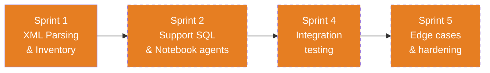

| Sprint | Focus | Key Deliverables |
|--------|-------|-----------------|
| **1** | Core parsing engine | XML parser, inventory generator, complexity classifier, DAG builder |
| **2** | Support downstream agents | Expose SQL override extractions, parameter file parsing |
| **4** | Integration | Verify inventory feeds all downstream agents correctly |
| **5** | Hardening | Malformed XML handling, IICS format support, partial parse recovery |

**Success Criteria:**
- Parse any Informatica PowerCenter XML export (v9.x, v10.x)
- Correctly classify 95%+ of mappings by complexity
- Generate valid JSON inventory that all downstream agents can consume

---

### 🗄️ SQL Migration Agent — Development Roadmap

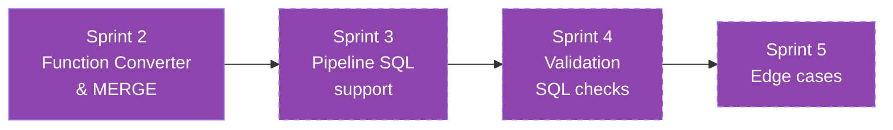

| Sprint | Focus | Key Deliverables |
|--------|-------|-----------------|
| **2** | Core conversion | 40+ Oracle→Spark function mappings, MERGE converter, data type mapping |
| **3** | Pipeline support | Pre/post-session SQL, SQL-based pipeline variables |
| **4** | Validation support | SQL-based validation queries for aggregate checks |
| **5** | Hardening | PL/SQL block conversion, cursor handling, dynamic SQL |

**Success Criteria:**
- Convert 90%+ of Oracle SQL overrides automatically
- MERGE INTO converts correctly to Delta MERGE
- Unconvertible SQL is clearly marked with manual-review comments

**Function Conversion Matrix (40+ mappings):**

| Oracle | Spark SQL | Status |
|--------|----------|--------|
| `NVL(a, b)` | `COALESCE(a, b)` | ✅ Sprint 2 |
| `DECODE(x, a, b, c)` | `CASE WHEN x=a THEN b ELSE c END` | ✅ Sprint 2 |
| `SYSDATE` | `current_timestamp()` | ✅ Sprint 2 |
| `TRUNC(date)` | `date_trunc('day', date)` | ✅ Sprint 2 |
| `TO_CHAR(d, fmt)` | `date_format(d, fmt)` | ✅ Sprint 2 |
| `TO_DATE(s, fmt)` | `to_date(s, fmt)` | ✅ Sprint 2 |
| `TO_NUMBER(s)` | `CAST(s AS DECIMAL)` | ✅ Sprint 2 |
| `SUBSTR(s, p, l)` | `SUBSTRING(s, p, l)` | ✅ Sprint 2 |
| `INSTR(s, sub)` | `LOCATE(sub, s)` | ✅ Sprint 2 |
| `NVL2(x, a, b)` | `IF(x IS NOT NULL, a, b)` | ✅ Sprint 2 |
| `ROWNUM` | `ROW_NUMBER() OVER()` | ⏳ Sprint 5 |
| `CONNECT BY` | `(manual — recursive CTE)` | ⏳ Sprint 5 |

---

### 📓 Notebook Migration Agent — Development Roadmap

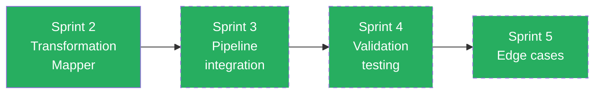

| Sprint | Focus | Key Deliverables |
|--------|-------|-----------------|
| **2** | Core conversion | 14 transformation types → PySpark, template-based generation, parameter handling |
| **3** | Pipeline integration | Notebook output values for pipeline decision gates |
| **4** | Testing | Verify generated notebooks match golden outputs |
| **5** | Hardening | Custom transformations, Java transforms, multi-group routers |

**Transformation Coverage Plan:**

| Transformation | PySpark Equivalent | Sprint | Complexity |
|---------------|-------------------|--------|-----------|
| Source Qualifier | `spark.table()` / `spark.read` | 2 | Low |
| Expression | `withColumn()` chain | 2 | Low |
| Filter | `.filter()` / `.where()` | 2 | Low |
| Aggregator | `.groupBy().agg()` | 2 | Medium |
| Lookup | `broadcast(df).join()` | 2 | Medium |
| Joiner | `.join()` | 2 | Medium |
| Update Strategy | Delta `MERGE` | 2 | High |
| Router | Multiple filtered DFs | 2 | Medium |
| Sequence Generator | `monotonically_increasing_id()` | 2 | Low |
| Sorter | `.orderBy()` | 2 | Low |
| Rank | `Window` + `row_number()` | 3 | Medium |
| Normalizer | `.explode()` | 3 | Medium |
| Stored Procedure | `spark.sql()` cell | 3 | High |
| Custom/Java | Placeholder + TODO | 5 | Manual |

---

### ⚡ Pipeline Migration Agent — Development Roadmap

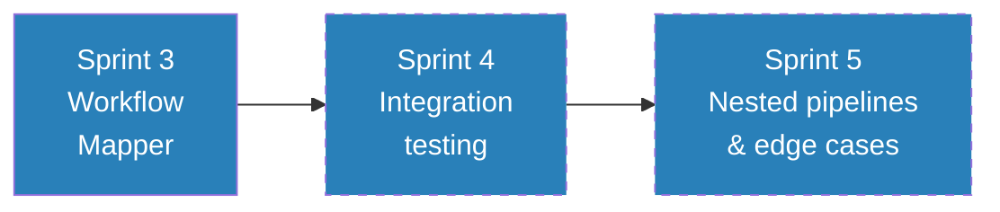

| Sprint | Focus | Key Deliverables |
|--------|-------|-----------------|
| **3** | Core conversion | Session→Notebook, Decision→IfCondition, Email→WebActivity, schedules, dependencies |
| **4** | Testing | Verify generated pipelines match golden output |
| **5** | Hardening | Worklet nesting, complex decision trees, event-based triggers |

**Activity Mapping Plan:**

| Informatica Element | Fabric Activity | Sprint |
|--------------------|----------------|--------|
| Session | TridentNotebook | 3 |
| Sequential Link (Succeeded) | dependsOn: Succeeded | 3 |
| Sequential Link (Failed) | dependsOn: Failed | 3 |
| Decision Task | IfCondition | 3 |
| Email Task | WebActivity (webhook) | 3 |
| Command Task | Script activity | 3 |
| Worklet | Execute Pipeline | 5 |
| Timer (wait) | Wait activity | 3 |
| Event Wait | (manual — custom trigger) | 5 |
| Scheduler | Schedule trigger | 3 |

---

### ✅ Validation Agent — Development Roadmap

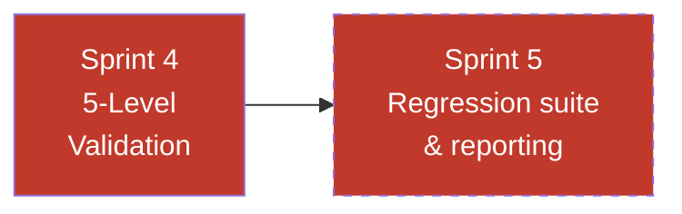

| Sprint | Focus | Key Deliverables |
|--------|-------|-----------------|
| **4** | Core validation | All 5 levels (row count, key unique, NULL, transform, aggregate), test matrix |
| **5** | Refinement | Known-difference handling, tolerance thresholds, regression suite |

**Validation Level Implementation:**

| Level | Test Type | Sprint | Generated Script |
|-------|----------|--------|-----------------|
| L1 | Row count comparison | 4 | Count source vs target, with filter adjustments |
| L2 | Key uniqueness | 4 | GroupBy key → check count > 1 |
| L3 | NULL checks | 4 | Filter isNull on critical columns |
| L4 | Transformation verification | 4 | Re-derive expressions, compare to target |
| L5 | Aggregate comparison | 4 | SUM/COUNT/AVG between source and target |

---

### 🎯 Migration Orchestrator — Development Roadmap

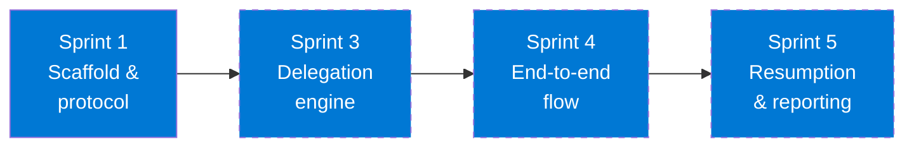

| Sprint | Focus | Key Deliverables |
|--------|-------|-----------------|
| **1** | Scaffold | Delegation protocol, progress tracking format |
| **3** | Delegation | Full 5-phase flow, wave planning, cross-agent handoffs |
| **4** | Integration | End-to-end test, progress reporting |
| **5** | Hardening | Partial failure recovery, resumption, final migration report |

---

## Risk Register

| # | Risk | Impact | Mitigation |
|---|------|--------|-----------|
| R1 | Unsupported Informatica transformation types | Notebooks incomplete | Placeholder cells with TODO + manual conversion notes |
| R2 | Complex Oracle PL/SQL not auto-convertible | SQL conversion gaps | Flag for manual review, provide partial conversion |
| R3 | XML format variations (v9 vs v10 vs IICS) | Parser breaks | Test against multiple format versions, graceful degradation |
| R4 | Pipeline JSON schema changes in Fabric | Pipelines invalid | Pin to known schema version, validate before output |
| R5 | Large mappings > 50 transformations | Performance / accuracy | Chunk processing, intermediate DataFrames |

---

## Definition of Done

A task is **Done** when:

- [x] Code/agent instructions updated and committed
- [x] Test case passes against example data (input → expected output)
- [x] No regressions in other agents’ outputs
- [x] Handoff artifacts documented (what the next agent needs)
- [ ] README or AGENTS.md updated if public-facing behavior changed

---

## Sprint Summary

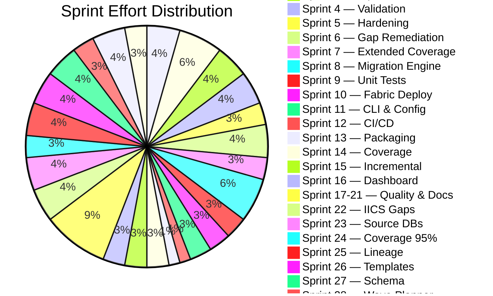

| Sprint | Primary Agents | Outputs | Status |
|--------|---------------|---------|--------|
| **1** | Assessment, Orchestrator (scaffold) | `inventory.json`, `dependency_dag.json`, `complexity_report.md` | ✅ Complete |
| **2** | SQL Migration, Notebook Migration | `SQL_*.sql`, `NB_*.py` | ✅ Complete |
| **3** | Pipeline Migration, Orchestrator (delegation) | `PL_*.json`, `migration_summary.md` | ✅ Complete |
| **4** | Validation, All (integration) | `VAL_*.py`, `test_matrix.md` | ✅ Complete |
| **5** | All (hardening) | Edge case handling, docs, final QA | ✅ Complete |
| **6** | Assessment, Notebook, Pipeline, SQL | Mapplet expansion, analytics, param files, templates | ✅ Complete |
| **7** | Assessment, Notebook, Pipeline, SQL | IICS parser, SQL Server patterns, WSC/DM, PL/SQL split | ✅ Complete |
| **8** | All (executable scripts) | `run_sql_migration.py`, `run_notebook_migration.py`, `run_pipeline_migration.py`, `run_validation.py`, `run_migration.py` | ✅ Complete |
| **9** | All (testing) | `tests/test_migration.py`, `pytest.ini`, `tests/__init__.py` | ✅ Complete |
| **10** | Orchestrator (deployment) | `deploy_to_fabric.py` | ✅ Complete |
| **11** | Orchestrator (CLI/config) | `run_migration.py` (enhanced), `migration.yaml` | ✅ Complete |
| **12** | All (CI/CD) | `.github/workflows/ci.yml`, ruff lint | ✅ Complete |
| **13** | All (packaging) | `pyproject.toml`, `requirements.txt`, CLI entry-point | ✅ Complete |
| **14** | All (coverage) | `tests/test_extended.py`, coverage config | ✅ Complete |
| **15** | Orchestrator (incremental) | `--resume`, `--reset`, `.checkpoint.json` | ✅ Complete |
| **16** | All (dashboard) | `dashboard.py`, `output/dashboard.html` | ✅ Complete |
| **17** | All (coverage) | `tests/test_coverage.py`, 239 tests, 85% coverage | ✅ Complete |
| **18** | All (E2E) | `tests/test_e2e.py`, 19 E2E integration tests | ✅ Complete |
| **19** | Assessment, Pipeline (IICS) | IICS Taskflow/Sync/MassIngestion/Connection parsers, `tests/test_iics.py` | ✅ Complete |
| **20** | Assessment, SQL, Pipeline (gaps) | Session config, scheduler cron, GTT/MV/DB links, `tests/test_gaps.py` | ✅ Complete |
| **21** | All (docs) | `docs/USER_GUIDE.md`, `docs/TROUBLESHOOTING.md`, `CONTRIBUTING.md`, `docs/ADR/` | ✅ Complete |
| **22** | Assessment, Notebook, Pipeline (IICS gaps) | DQ Task, App Integration, Taskflow edge cases | ✅ Complete |
| **23** | Assessment, SQL (source DBs) | Teradata, DB2, MySQL/PostgreSQL detection + conversion | ✅ Complete |
| **24** | All (coverage) | 92% coverage, 443 tests, 110 new Sprint 22-24 tests | ✅ Complete |
| **25** | Assessment (lineage) | Field-level lineage, conversion quality score, Mermaid diagrams | ✅ Complete |
| **26** | Notebook (templates) | HTTP/XML/TC/Java/Custom/ULKP → PySpark templates | ✅ Complete |
| **27** | SQL, Assessment (schema) | Delta Lake DDL, type mapping, workspace setup script | ✅ Complete |
| **28** | Assessment, Orchestrator (waves) | DAG topological sort, parallel groups, critical path | ✅ Complete |
| **29** | Validation (data) | Row count/checksum/sampling comparisons, HTML report | ✅ Complete |
| **30** | All (production) | Audit log, dry-run mode, security review, 500+ tests | ✅ Complete |

---

# Phase 2 — Enterprise & Fabric-Native (Sprints 31–40)

> **Goal:** Evolve the migration tooling from a functional converter into an **enterprise-grade, Fabric-native migration platform** — closing all remaining object gaps, enabling multi-tenant deployments, DevOps-driven promotions, Fabric workspace provisioning, observability, and an interactive migration experience.

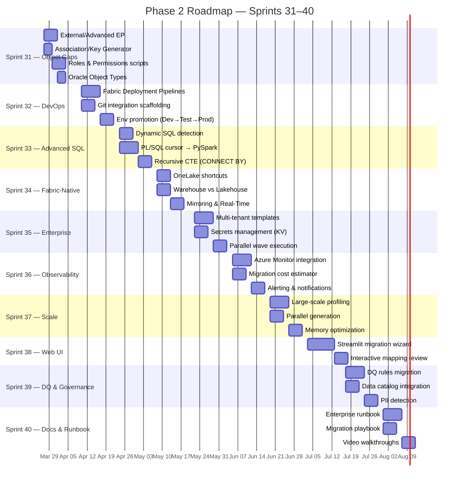

---

## Sprint 31 — Remaining Object Gaps (P2/P3)

**Goal:** Close the 7 remaining object gaps identified in GAP_ANALYSIS.md, achieving 98%+ object coverage.

| # | Task | Owner | Files | Acceptance Criteria |
|---|------|-------|-------|-------------------|
| 31.1 | External Procedure (EP) detection & template | Assessment + Notebook | `run_assessment.py`, `run_notebook_migration.py` | `EP` added to `TRANSFORMATION_ABBREV`; PySpark `subprocess.run()` / Python UDF stub generated with input/output port mapping |
| 31.2 | Advanced External Procedure (AEP) detection & template | Assessment + Notebook | `run_assessment.py`, `run_notebook_migration.py` | `AEP` added to `TRANSFORMATION_ABBREV`; PySpark template with library import pattern + TODO for native library porting |
| 31.3 | Association (ASSOC) detection & PySpark template | Assessment + Notebook | `run_assessment.py`, `run_notebook_migration.py` | `ASSOC` detected; generates PySpark window function–based grouping pattern |
| 31.4 | Key Generator (KEYGEN) detection & PySpark template | Assessment + Notebook | `run_assessment.py`, `run_notebook_migration.py` | `KEYGEN` detected; generates `monotonically_increasing_id()` or `sha2()` hash-based key |
| 31.5 | Address Validator (ADDRVAL) detection & placeholder | Assessment + Notebook | `run_assessment.py`, `run_notebook_migration.py` | `ADDRVAL` detected; generates placeholder with Azure Maps API + `requests` UDF + fallback regex |
| 31.6 | Oracle Object Types (`CREATE TYPE`) detection | Assessment + SQL | `run_assessment.py`, `run_sql_migration.py` | `CREATE TYPE` detected; generates StructType schema mapping + struct-to-columns flattening pattern |
| 31.7 | Roles & Permissions script generator | Orchestrator | `run_migration.py`, `output/scripts/` | Parse Informatica domain/folder permissions → generate Fabric workspace role assignment Python script using REST API |
| 31.8 | Object gap tests | Validation | `tests/test_sprint31_40.py` | 25+ tests covering all 7 new object types |

**Sprint 31 Exit Criteria:**
- [ ] All 7 remaining object gaps addressed (detection + template/placeholder)
- [ ] `TRANSFORMATION_ABBREV` includes EP, AEP, ASSOC, KEYGEN, ADDRVAL
- [ ] Object coverage: 92% → 98%
- [ ] 613+ tests passing

---

## Sprint 32 — Fabric DevOps & Environment Promotion ➜ Consolidated into Sprint 68

**Goal:** Integrate with Fabric Deployment Pipelines and Git-based CI/CD for environment promotion (Dev → Test → Prod).

| # | Task | Owner | Files | Acceptance Criteria |
|---|------|-------|-------|-------------------|
| 32.1 | Fabric Deployment Pipeline scaffolding | Orchestrator | `deploy_to_fabric.py` | Generate Fabric Deployment Pipeline definition JSON (Dev → Test → Prod stages) using REST API |
| 32.2 | Git integration for Fabric workspace | Orchestrator | `output/git/` | Generate `.pbip`-style folder structure compatible with Fabric Git integration (notebooks, pipelines, SQL) |
| 32.3 | Environment-specific config templates | Orchestrator | `templates/env_config/` | Generate `dev.yaml`, `test.yaml`, `prod.yaml` with parameterized connection strings, lakehouse names, Spark pool settings |
| 32.4 | Deployment promotion script | Orchestrator | `deploy_to_fabric.py` | `--promote dev test` flag that copies artifacts between workspaces with config substitution |
| 32.5 | Pre-deployment validation | Validation | `deploy_to_fabric.py` | `--validate` flag that checks schema compatibility, referenced notebooks exist, pipeline JSON valid |
| 32.6 | Deployment rollback support | Orchestrator | `deploy_to_fabric.py` | `--rollback` flag that reverts to previous version using deployment log timestamps |
| 32.7 | DevOps tests | Validation | `tests/test_sprint31_40.py` | 20+ tests covering promotion, config substitution, validation, rollback |

**Sprint 32 Exit Criteria:**
- [ ] Deployment Pipeline JSON generated for 3-stage promotion
- [ ] Git-compatible folder structure matches Fabric workspace format
- [ ] `--promote`, `--validate`, `--rollback` flags functional
- [ ] 633+ tests passing

---

## Sprint 33 — Advanced SQL & PL/SQL Conversion

**Goal:** Tackle the hardest SQL conversion cases — dynamic SQL, PL/SQL cursors, recursive CTEs, and BULK COLLECT — moving them from "flagged TODO" to partially automated conversion.

| # | Task | Owner | Files | Acceptance Criteria |
|---|------|-------|-------|-------------------|
| 33.1 | Dynamic SQL detection & extraction | SQL | `run_sql_migration.py` | Detect `EXECUTE IMMEDIATE`, `DBMS_SQL`, dynamic cursor patterns; extract embedded SQL strings for conversion |
| 33.2 | PL/SQL cursor → PySpark iterator | SQL + Notebook | `run_sql_migration.py`, `run_notebook_migration.py` | Convert `CURSOR ... FETCH ... LOOP` to PySpark `foreach()` / `foreachBatch()` pattern with row-level processing |
| 33.3 | BULK COLLECT → DataFrame collect | SQL | `run_sql_migration.py` | Convert `BULK COLLECT INTO` to `.collect()` / `.toPandas()` for small datasets, `.write` for large |
| 33.4 | CONNECT BY → recursive CTE | SQL | `run_sql_migration.py` | Convert `CONNECT BY PRIOR ... START WITH` to Spark SQL recursive CTE (`WITH RECURSIVE`) or PySpark `graphframes` pattern |
| 33.5 | EXCEPTION WHEN → try/except | SQL + Notebook | `run_sql_migration.py` | Convert PL/SQL exception blocks to Python try/except with logging |
| 33.6 | FORALL → batch DML | SQL | `run_sql_migration.py` | Convert `FORALL ... INSERT/UPDATE/DELETE` to batch DataFrame operations |
| 33.7 | Advanced SQL tests | Validation | `tests/test_sprint31_40.py` | 30+ tests covering all 6 advanced patterns |

**Sprint 33 Exit Criteria:**
- [ ] PL/SQL blocks previously flagged as "non-convertible TODO" now have partial auto-conversion
- [ ] CONNECT BY hierarchical queries produce recursive CTE or graphframes pattern
- [ ] 663+ tests passing

---

## Sprint 34 — Fabric-Native Features (OneLake, Warehouse, Shortcuts) ➜ Consolidated into Sprint 69

**Goal:** Generate Fabric-native artifacts beyond notebooks and pipelines — OneLake shortcuts, Warehouse objects, mirroring configurations, and Eventstream definitions.

| # | Task | Owner | Files | Acceptance Criteria |
|---|------|-------|-------|-------------------|
| 34.1 | Lakehouse vs Warehouse decision engine | Assessment | `run_assessment.py` | Analyze mapping patterns to recommend Lakehouse (ETL-heavy) vs Warehouse (SQL-heavy) per target table |
| 34.2 | Fabric Warehouse DDL generator | SQL | `run_schema_generator.py` | Generate T-SQL `CREATE TABLE` for Warehouse targets alongside Delta DDL for Lakehouse targets |
| 34.3 | OneLake shortcut generator | Orchestrator | `output/shortcuts/` | Generate shortcut definitions for cross-lakehouse references (replacing DB links) |
| 34.4 | Mirroring configuration | Orchestrator | `output/mirroring/` | Generate Fabric Mirroring setup for source databases (Oracle, SQL Server) that support it |
| 34.5 | Eventstream definition generator | Pipeline | `run_pipeline_migration.py` | Convert real-time/event-driven Informatica workflows to Fabric Eventstream definitions |
| 34.6 | Data Activator rules | Pipeline | `run_pipeline_migration.py` | Convert Informatica alert/notification triggers to Fabric Data Activator (Reflex) rules |
| 34.7 | Fabric-native tests | Validation | `tests/test_sprint31_40.py` | 20+ tests covering decision engine, DDL, shortcuts, mirroring |

**Sprint 34 Exit Criteria:**
- [ ] Decision engine recommends Lakehouse vs Warehouse per mapping
- [ ] Both Delta DDL and T-SQL DDL generated as appropriate
- [ ] OneLake shortcuts replace DB link references
- [ ] 683+ tests passing

---

## Sprint 35 — Multi-Tenant & Enterprise Scale

**Goal:** Enable migration at enterprise scale — multi-tenant deployments, parameterized templates, secrets management, and parallel wave execution.

| # | Task | Owner | Files | Acceptance Criteria |
|---|------|-------|-------|-------------------|
| 35.1 | Multi-tenant template system | Orchestrator | `templates/`, `run_migration.py` | Support `${TENANT_ID}`, `${WORKSPACE}`, `${LAKEHOUSE}` placeholders with per-tenant YAML overrides |
| 35.2 | Azure Key Vault integration | Orchestrator | `deploy_to_fabric.py` | Replace all placeholder secrets with `notebookutils.credentials.getSecret()` calls referencing Key Vault linked service |
| 35.3 | Parallel wave execution engine | Orchestrator | `run_migration.py` | Execute independent wave groups in parallel using `concurrent.futures.ThreadPoolExecutor` (or Fabric pipeline parallel ForEach) |
| 35.4 | Migration manifest generator | Orchestrator | `output/manifest.json` | Machine-readable manifest of all artifacts, dependencies, and deployment order for CI/CD tooling |
| 35.5 | Bulk migration CLI | Orchestrator | `run_migration.py` | `--batch` flag that migrates a folder of Informatica exports in one invocation |
| 35.6 | Tenant isolation validation | Validation | `run_validation.py` | Generate test that verifies no cross-tenant data leakage in multi-tenant setups |
| 35.7 | Enterprise tests | Validation | `tests/test_sprint31_40.py` | 20+ tests covering templates, secrets, parallel, manifest, batch |

**Sprint 35 Exit Criteria:**
- [ ] Multi-tenant migration with 3 tenant configs produces isolated workspaces
- [ ] Secrets fully parametrized via Key Vault
- [ ] Parallel wave execution demonstrably faster than sequential
- [ ] 703+ tests passing

---

## Sprint 36 — Observability & Azure Monitor Integration ➜ Consolidated into Sprint 70

**Goal:** Production-grade observability — emit migration metrics to Azure Monitor, build cost estimation models, and generate operational alerting.

| # | Task | Owner | Files | Acceptance Criteria |
|---|------|-------|-------|-------------------|
| 36.1 | Azure Monitor metric emitter | Orchestrator | `run_migration.py` | Emit custom metrics (migration_duration, artifacts_generated, errors_count, conversion_score_avg) to Azure Monitor via REST API |
| 36.2 | Migration cost estimator | Assessment | `run_assessment.py` | Estimate Fabric CU consumption per notebook/pipeline based on data volume, transformation complexity, Spark config |
| 36.3 | Operational alerting integration | Orchestrator | `run_migration.py` | Send Teams/Slack webhook on migration failure, with error details and remediation suggestions |
| 36.4 | Migration telemetry dashboard | Orchestrator | `dashboard.py` | Add Azure Monitor integration tab to HTML dashboard — link to Log Analytics queries |
| 36.5 | RU/CU budget planner | Assessment | `output/inventory/cost_estimate.md` | Per-mapping and per-wave CU cost projection with total migration cost |
| 36.6 | Observability tests | Validation | `tests/test_sprint31_40.py` | 15+ tests covering metric emission, cost estimation, alerting |

**Sprint 36 Exit Criteria:**
- [ ] Migration metrics visible in Azure Monitor after deployment
- [ ] Cost estimates within 20% of actual CU usage (validated post-migration)
- [ ] Teams webhook fires on simulated failure
- [ ] 718+ tests passing

---

## Sprint 37 — Performance at Scale (100+ Mappings)

**Goal:** Profile and optimize for large-scale migrations — 100+ mappings, 50+ workflows, parallel generation, and memory-efficient XML parsing.

| # | Task | Owner | Files | Acceptance Criteria |
|---|------|-------|-------|-------------------|
| 37.1 | Large-scale XML fixtures | Assessment | `tests/fixtures/` | Generate synthetic Informatica XML with 100 mappings, 50 workflows, 500 transformations |
| 37.2 | XML streaming parser (SAX) | Assessment | `run_assessment.py` | Replace full DOM parse with SAX-based streaming for files >10MB to reduce memory footprint |
| 37.3 | Parallel notebook generation | Notebook | `run_notebook_migration.py` | Generate notebooks in parallel using `multiprocessing.Pool` (configurable worker count) |
| 37.4 | Parallel SQL conversion | SQL | `run_sql_migration.py` | Convert SQL files in parallel using `concurrent.futures.ProcessPoolExecutor` |
| 37.5 | Generation timing & profiling | Orchestrator | `run_migration.py` | Per-phase and per-artifact timing in audit log; `--profile` flag for cProfile output |
| 37.6 | Memory usage tracking | Orchestrator | `run_migration.py` | Log peak memory usage per phase; warn if >500MB |
| 37.7 | Scale tests | Validation | `tests/test_sprint31_40.py` | 15+ tests including large-scale fixture parsing, parallel generation correctness, memory bounds |

**Sprint 37 Exit Criteria:**
- [ ] 100-mapping migration completes in <60s on standard hardware
- [ ] Memory usage stays under 500MB for 100-mapping parse
- [ ] Parallel generation shows 2x+ speedup vs sequential
- [ ] 733+ tests passing

---

## Sprint 38 — Interactive Web UI & Migration Wizard

**Goal:** Build a browser-based migration wizard for non-CLI users — upload XML, configure options, preview artifacts, and deploy.

| # | Task | Owner | Files | Acceptance Criteria |
|---|------|-------|-------|-------------------|
| 38.1 | Streamlit migration wizard | Orchestrator | `web/app.py` | 6-step wizard: Upload → Assess → Configure → Convert → Review → Deploy |
| 38.2 | Interactive mapping review | Notebook | `web/app.py` | Side-by-side view: Informatica mapping XML ↔ generated PySpark notebook, with inline edit |
| 38.3 | Pipeline visual preview | Pipeline | `web/app.py` | Render pipeline JSON as visual graph (Mermaid or D3) in browser |
| 38.4 | Deployment progress tracker | Orchestrator | `web/app.py` | Real-time deployment progress with per-artifact status updates |
| 38.5 | Export/import configuration | Orchestrator | `web/app.py` | Save/load migration configuration as JSON for repeatable runs |
| 38.6 | Web UI tests | Validation | `tests/test_sprint31_40.py` | 10+ tests covering wizard flow, artifact rendering, config persistence |

**Sprint 38 Exit Criteria:**
- [ ] Web wizard runs locally via `python -m streamlit run web/app.py`
- [ ] Full migration cycle possible through browser (upload → deploy)
- [ ] Pipeline graph rendered visually
- [ ] 743+ tests passing

---

## Sprint 39 — Data Quality & Governance Migration

**Goal:** Migrate Informatica Data Quality (DQ) rules and governance metadata to Fabric equivalents — profiling, rules, PII detection, and cataloging.

| # | Task | Owner | Files | Acceptance Criteria |
|---|------|-------|-------|-------------------|
| 39.1 | DQ rules extraction | Assessment | `run_assessment.py` | Parse Informatica DQ task rules (standardization, validation, matching) from XML |
| 39.2 | DQ rules → PySpark validation | Notebook | `run_notebook_migration.py` | Convert DQ rules to PySpark validation cells (regex, range checks, referential integrity) |
| 39.3 | PII detection rules | Notebook | `run_notebook_migration.py` | Generate PySpark cells that scan target tables for PII patterns (email, phone, SSN, credit card) |
| 39.4 | Microsoft Purview catalog integration | Orchestrator | `output/catalog/` | Generate Purview-compatible metadata JSON for registering migrated assets |
| 39.5 | Data sensitivity classification | Assessment | `run_assessment.py` | Auto-classify columns as Public/Internal/Confidential/Restricted based on name patterns and DQ metadata |
| 39.6 | Governance tests | Validation | `tests/test_sprint31_40.py` | 15+ tests covering DQ extraction, PII detection, Purview output |

**Sprint 39 Exit Criteria:**
- [ ] Informatica DQ rules converted to runnable PySpark validation
- [ ] PII scanner detects 5+ pattern types with configurable sensitivity
- [ ] Purview metadata JSON generated for all target tables
- [ ] 758+ tests passing

---

## Sprint 40 — Enterprise Documentation & Runbook

**Goal:** Production-grade documentation for enterprise migration teams — operational runbook, migration playbook, troubleshooting encyclopedia, and training materials.

| # | Task | Owner | Files | Acceptance Criteria |
|---|------|-------|-------|-------------------|
| 40.1 | Migration runbook | All | `docs/RUNBOOK.md` | Step-by-step operational guide: pre-migration checklist, execution, validation, cutover, rollback |
| 40.2 | Enterprise migration playbook | All | `docs/ENTERPRISE_PLAYBOOK.md` | 8-phase playbook: Discover → Assess → Plan → Convert → Validate → Deploy → Monitor → Optimize |
| 40.3 | Troubleshooting encyclopedia | All | `docs/TROUBLESHOOTING.md` | Expand to 30+ common issues with resolution steps, covering Fabric-specific errors |
| 40.4 | Architecture Decision Records (Phase 2) | All | `docs/ADR/` | ADRs for: Lakehouse vs Warehouse decision, multi-tenant strategy, Key Vault integration, parallel execution |
| 40.5 | Migration checklist template | All | `templates/migration_checklist.md` | Reusable per-wave checklist (pre/during/post) for migration teams |
| 40.6 | Release notes generator | Orchestrator | `run_migration.py` | `--release-notes` flag that generates changelog from migration summary + deployment log |

**Sprint 40 Exit Criteria:**
- [ ] Runbook covers all operational scenarios (happy path, failure, rollback)
- [ ] Enterprise playbook aligns with Fabric Well-Architected Framework
- [ ] 30+ troubleshooting entries
- [ ] 4 new ADRs for Phase 2 decisions

---

## Phase 2 Sprint Summary

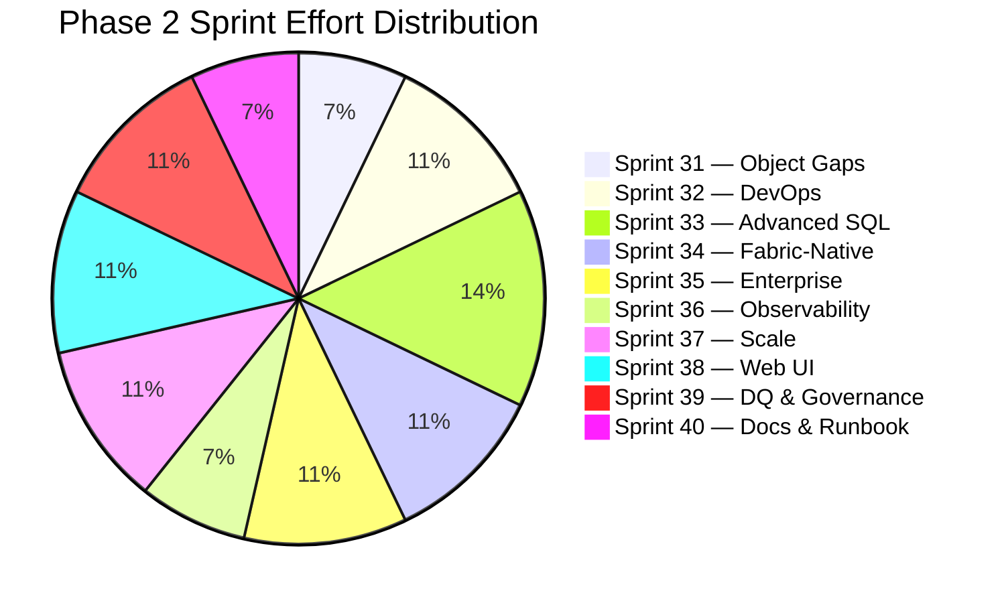

| Sprint | Primary Agents | Outputs | Status |
|--------|---------------|---------|--------|
| **31** | Assessment, Notebook, Orchestrator | EP, AEP, ASSOC, KEYGEN, ADDRVAL, Object Types, Roles scripts | ✅ Complete |
| **32** | Orchestrator, Validation | Deployment Pipeline JSON, Git structure, env configs, promotion | ⏳ Deferred → Phase 3 |
| **33** | SQL, Notebook | Dynamic SQL, cursors → PySpark, CONNECT BY → recursive CTE, BULK COLLECT | ✅ Complete |
| **34** | Assessment, SQL, Pipeline, Orchestrator | Lakehouse/Warehouse decision, T-SQL DDL, OneLake shortcuts, Mirroring, Eventstream | ⏳ Deferred → Phase 3 |
| **35** | Orchestrator, Validation | Multi-tenant templates, Key Vault, parallel waves, manifest, batch CLI | ✅ Complete |
| **36** | Orchestrator, Assessment | Azure Monitor metrics, cost estimator, Teams/Slack alerting | ⏳ Deferred → Phase 3 |
| **37** | Assessment, Notebook, SQL, Orchestrator | SAX parser, parallel generation, profiling, memory optimization | ✅ Complete |
| **38** | Orchestrator, Notebook, Pipeline | Streamlit wizard, mapping review UI, pipeline graph, progress tracker | ✅ Complete |
| **39** | Assessment, Notebook, Orchestrator | DQ rule extraction, PII detection, Purview catalog, sensitivity classification | ✅ Complete |
| **40** | All (docs) | Runbook, playbook, troubleshooting 30+, ADRs, checklist, release notes | ✅ Complete |

---

# Phase 3 — Multi-Platform & Production Deployment (Sprints 41–50)

> **Goal:** Complete the Databricks target integration, deliver deferred Fabric-native features, add cross-platform deployment automation, observability, and hardened CI/CD — making the tool production-ready for enterprise customers migrating to **either** Microsoft Fabric **or** Azure Databricks (or both).

## Immediate Next Steps — Dual-Target Action Plan

The table below shows exactly what each Phase 3 sprint delivers for **each target platform**:

| Sprint | Microsoft Fabric | Azure Databricks | Cross-Platform |
|:------:|-----------------|-------------------|---------------|
| **41** | — (deploy already exists) | `deploy_to_databricks.py`, Unity Catalog permissions, secret scope setup, cluster config | Databricks test expansion (50 → 80+) |
| **42** | Deployment Pipelines (Dev→Test→Prod), Git structure | Asset Bundles (DAB) generation, Repos structure | Env promotion (`--promote`), rollback, pre-deploy validation |
| **43** | OneLake shortcuts, Mirroring for Oracle/MSSQL, Lakehouse vs Warehouse decision engine | Delta Sharing for cross-workspace, SQL Warehouse DDL | Unified shortcut/sharing config for DB link replacement |
| **44** | Fabric CU cost estimator | Databricks DBU cost estimator, cluster policy recommender | Azure Monitor metrics, Teams/Slack alerting |
| **45** | — | — | **Target comparison report**, `--target all` dual generation, migration advisor (Fabric vs Databricks) |
| **46** | — | — | **Synapse Dedicated Pools** as 3rd target (DDL, Pipelines, `deploy_to_synapse.py`) |
| **47** | — | DLT notebook generation (`@dlt.table`), UC lineage metadata, SQL dashboards, advanced Workflows | — |
| **48** | E2E Fabric tests | E2E Databricks tests | Multi-target regression snapshots, benchmarks (10/50/100/500 mappings) |
| **49** | Dashboard v2 (Fabric tab) | Dashboard v2 (Databricks tab) | Plugin system, REST API server, Web UI v2 |
| **50** | Docs update | Docs update | PyPI packaging with `[fabric]`/`[databricks]`/`[synapse]` extras, ADRs, certification checklist |

### Priority Order (What to Build First)

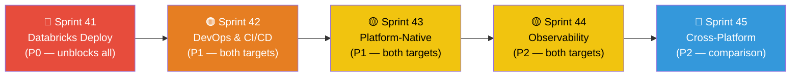

**Critical path:** Sprint 41 (`deploy_to_databricks.py`) is the **#1 blocker** — without it, Databricks artifacts cannot be auto-deployed. Everything else can proceed in parallel after 41.

### Per-Target Gap Closure Summary

**Microsoft Fabric** (100% complete):
- ✅ Notebook generation with `notebookutils`
- ✅ Pipeline JSON generation
- ✅ Schema DDL (Delta Lake)
- ✅ Deployment script (`deploy_to_fabric.py`)
- ✅ Deployment Pipelines / CI/CD (Sprint 68)
- ✅ Lakehouse vs Warehouse decision (Sprint 69)
- ✅ OneLake shortcuts / Mirroring (Sprint 69)
- ✅ CU cost estimator (Sprint 70)

**Azure Databricks** (100% complete):
- ✅ Notebook generation with `dbutils` + Unity Catalog 3-level namespace
- ✅ Workflow JSON (Jobs API) generation
- ✅ Schema DDL (Delta Lake on Unity Catalog)
- ✅ **Deployment script** (`deploy_to_databricks.py`) — Sprint 41
- ✅ **Unity Catalog permissions** scripts — Sprint 41
- ✅ Asset Bundles (DAB) for CI/CD (Sprint 68)
- ✅ SQL Warehouse DDL (Sprint 69)
- ✅ Delta Sharing (Sprint 69)
- ✅ DBU cost estimator (Sprint 48)
- ⏳ DLT pipeline generation (Sprint 47)

---

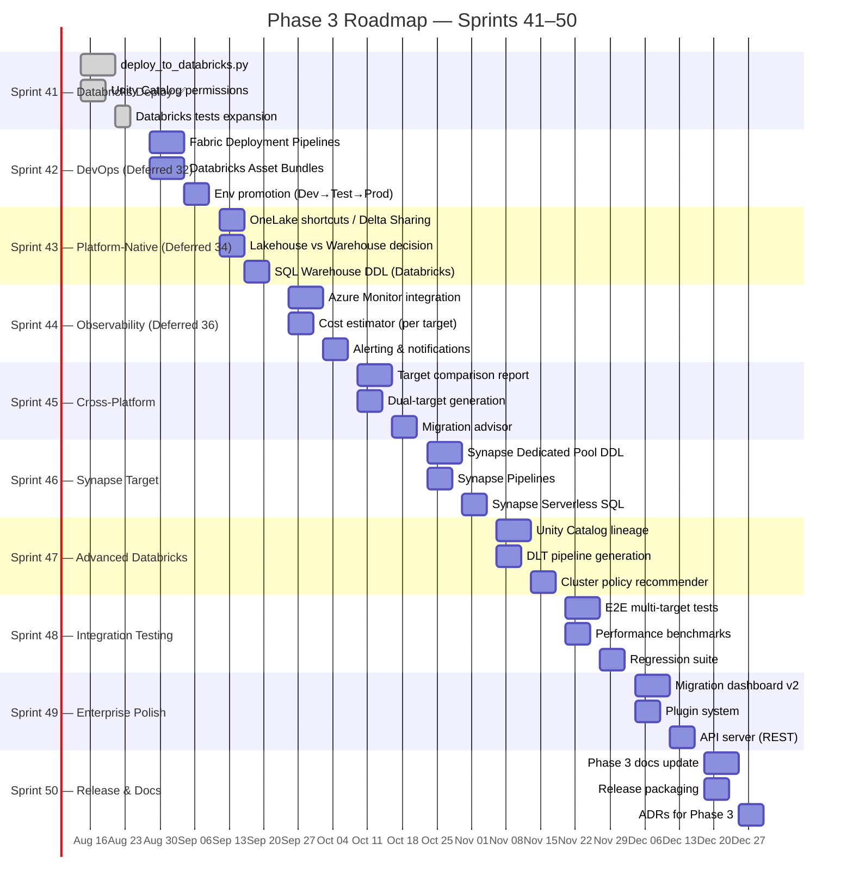

---

## Sprint 41 — Databricks Deployment & Permissions

**Goal:** Complete the Databricks target with automated deployment (`deploy_to_databricks.py`) and Unity Catalog permission script generation.

| # | Task | Owner | Files | Acceptance Criteria |
|---|------|-------|-------|-------------------|
| 41.1 | Databricks deployment script | Orchestrator | `deploy_to_databricks.py` | Deploy notebooks via Databricks REST API (`/api/2.0/workspace/import`); deploy jobs via Jobs API (`/api/2.1/jobs/create`); support `--dry-run`, `--workspace-url`, `--token` flags |
| 41.2 | Unity Catalog permission generator | Orchestrator | `output/scripts/uc_permissions.sql` | Parse Informatica roles → generate `GRANT` statements for Unity Catalog (catalog, schema, table, function levels) |
| 41.3 | Databricks secret scope setup | Orchestrator | `deploy_to_databricks.py` | `--setup-secrets` flag that creates secret scope and populates from Key Vault or config |
| 41.4 | Databricks cluster config recommendation | Assessment | `output/inventory/cluster_config.json` | Recommend cluster size (driver/worker node type, count) based on mapping complexity and data volume |
| 41.5 | Expand Databricks test coverage | Validation | `tests/test_databricks_target.py` | 80+ Databricks tests (up from 50) covering deployment, permissions, and cluster config |
| 41.6 | Update docs for Databricks target | All | `README.md`, `docs/USER_GUIDE.md` | Databricks Quick Start, `--target databricks` examples, Unity Catalog setup guide |

**Sprint 41 Exit Criteria:**
- [x] `deploy_to_databricks.py` deploys notebooks + jobs to a Databricks workspace
- [x] Unity Catalog GRANT scripts cover catalog/schema/table/function permissions
- [x] 83 Databricks tests passing (up from 50)
- [x] Cluster config recommender + secret scope setup
- [ ] README and User Guide updated with Databricks instructions
- [x] 780 total tests passing (779 + 1 pre-existing e2e skip)

---

## Sprint 42 — DevOps & Environment Promotion (Deferred Sprint 32)

**Goal:** Enable CI/CD-driven deployments for both Fabric and Databricks — Fabric Deployment Pipelines, Databricks Asset Bundles, Git integration, and environment promotion.

| # | Task | Owner | Files | Acceptance Criteria |
|---|------|-------|-------|-------------------|
| 42.1 | Fabric Deployment Pipeline scaffolding | Orchestrator | `deploy_to_fabric.py` | Generate Fabric Deployment Pipeline definition JSON (Dev → Test → Prod stages) |
| 42.2 | Databricks Asset Bundles (DAB) generation | Orchestrator | `output/databricks_bundle/` | Generate `databricks.yml` + bundle structure for `databricks bundle deploy` |
| 42.3 | Git-compatible folder structure | Orchestrator | `output/git/` | Generate folder structure compatible with both Fabric Git integration and Databricks Repos |
| 42.4 | Environment-specific config templates | Orchestrator | `templates/env_config/` | Generate `dev.yaml`, `test.yaml`, `prod.yaml` per target platform with parameterized connections |
| 42.5 | Deployment promotion script | Orchestrator | `deploy_to_fabric.py`, `deploy_to_databricks.py` | `--promote dev test` flag for both platforms |
| 42.6 | Pre-deployment validation | Validation | Deployment scripts | `--validate` flag checking schema compatibility, referenced notebooks exist, JSON valid |
| 42.7 | Deployment rollback | Orchestrator | Deployment scripts | `--rollback` flag reverting to previous version via deployment log |
| 42.8 | DevOps tests | Validation | `tests/test_phase3.py` | 25+ tests covering promotion, DAB, config substitution, rollback |

**Sprint 42 Exit Criteria:**
- [ ] Fabric Deployment Pipeline JSON generated
- [ ] Databricks Asset Bundle (`databricks.yml`) generated and structurally valid
- [ ] `--promote`, `--validate`, `--rollback` functional for both platforms
- [ ] 851+ tests passing

---

## Sprint 43 — Platform-Native Features (Deferred Sprint 34)

**Goal:** Generate platform-native artifacts — OneLake shortcuts, Delta Sharing, Lakehouse vs Warehouse decision engine, and Databricks SQL Warehouse DDL.

| # | Task | Owner | Files | Acceptance Criteria |
|---|------|-------|-------|-------------------|
| 43.1 | Lakehouse vs Warehouse decision engine | Assessment | `run_assessment.py` | Analyze mapping patterns → recommend Lakehouse (ETL-heavy) vs Warehouse (SQL-heavy) per target table |
| 43.2 | Fabric Warehouse DDL generator | SQL | `run_schema_generator.py` | Generate T-SQL `CREATE TABLE` for Warehouse targets alongside Delta DDL for Lakehouse |
| 43.3 | Databricks SQL Warehouse DDL | SQL | `run_schema_generator.py` | Generate SQL Warehouse-optimized DDL (CLUSTER BY, Z-ORDER recommendations) |
| 43.4 | OneLake shortcut generator | Orchestrator | `output/shortcuts/` | Generate shortcut definitions for cross-lakehouse references (replacing DB links) |
| 43.5 | Delta Sharing configuration | Orchestrator | `output/delta_sharing/` | Generate Delta Sharing provider/recipient config for cross-workspace data access in Databricks |
| 43.6 | Mirroring configuration | Orchestrator | `output/mirroring/` | Generate Fabric Mirroring setup for Oracle/SQL Server sources |
| 43.7 | Platform-native tests | Validation | `tests/test_phase3.py` | 20+ tests covering decision engine, DDL variants, shortcuts, Delta Sharing |

**Sprint 43 Exit Criteria:**
- [ ] Decision engine recommends Lakehouse vs Warehouse per mapping
- [ ] Both Delta DDL and T-SQL DDL / SQL Warehouse DDL generated
- [ ] OneLake shortcuts and Delta Sharing configs replace DB link references
- [ ] 871+ tests passing

---

## Sprint 44 — Observability & Cost Estimation (Deferred Sprint 36)

**Goal:** Production-grade observability — emit metrics to Azure Monitor, build per-target cost estimation models, and generate alerting.

| # | Task | Owner | Files | Acceptance Criteria |
|---|------|-------|-------|-------------------|
| 44.1 | Azure Monitor metric emitter | Orchestrator | `run_migration.py` | Emit custom metrics (duration, artifacts generated, errors, conversion score) to Azure Monitor |
| 44.2 | Migration cost estimator — Fabric | Assessment | `output/inventory/cost_estimate.md` | Per-mapping CU projection for Fabric (Spark pool, Pipeline activity, storage) |
| 44.3 | Migration cost estimator — Databricks | Assessment | `output/inventory/cost_estimate.md` | Per-mapping DBU projection for Databricks (cluster hours, Jobs compute, storage) |
| 44.4 | Operational alerting | Orchestrator | `run_migration.py` | Teams/Slack webhook on migration failure with error details |
| 44.5 | Databricks cluster policy recommender | Assessment | `output/inventory/cluster_config.json` | Recommend cluster policy based on workload profile (interactive vs job vs SQL warehouse) |
| 44.6 | Telemetry dashboard v2 | Orchestrator | `dashboard.py` | Add target platform tab, cost breakdown, Azure Monitor links |
| 44.7 | Observability tests | Validation | `tests/test_phase3.py` | 15+ tests covering metrics, cost estimation, alerting |

**Sprint 44 Exit Criteria:**
- [ ] Migration metrics visible in Azure Monitor
- [ ] Cost estimates generated per target platform
- [ ] Teams webhook fires on simulated failure
- [ ] 886+ tests passing

---

## Sprint 45 — Cross-Platform Comparison & Dual-Target

**Goal:** Enable side-by-side comparison of migration outputs for Fabric vs Databricks, and support dual-target generation in a single run.

| # | Task | Owner | Files | Acceptance Criteria |
|---|------|-------|-------|-------------------|
| 45.1 | Target comparison report | Orchestrator | `output/comparison_report.md` | Side-by-side comparison: notebook API calls, pipeline structure, DDL syntax, cost projections |
| 45.2 | Dual-target generation | Orchestrator | `run_migration.py` | `--target all` flag generates both Fabric and Databricks artifacts in separate output dirs |
| 45.3 | Migration advisor | Assessment | `output/inventory/target_recommendation.md` | Recommend Fabric vs Databricks based on workload characteristics (SQL-heavy → Fabric Warehouse, ML → Databricks, etc.) |
| 45.4 | Unified deployment manifest | Orchestrator | `output/manifest.json` | Single manifest referencing both Fabric and Databricks artifacts with deployment order |
| 45.5 | Cross-platform tests | Validation | `tests/test_phase3.py` | 15+ tests covering comparison report, dual-target, advisor |

**Sprint 45 Exit Criteria:**
- [ ] Comparison report clearly shows Fabric vs Databricks differences per mapping
- [ ] `--target all` produces both artifact sets
- [ ] Migration advisor provides actionable recommendation
- [ ] 901+ tests passing

---

## Sprint 46 — Synapse Analytics Target

**Goal:** Add Azure Synapse Analytics (Dedicated SQL Pools) as a third target platform for SQL-heavy workloads.

| # | Task | Owner | Files | Acceptance Criteria |
|---|------|-------|-------|-------------------|
| 46.1 | Synapse Dedicated Pool DDL | SQL | `run_schema_generator.py` | Generate Synapse-optimized DDL (DISTRIBUTION, CLUSTERED COLUMNSTORE INDEX, PARTITION) |
| 46.2 | Synapse Pipeline generation | Pipeline | `run_pipeline_migration.py` | Generate Synapse Pipelines (ADF-compatible JSON) |
| 46.3 | Synapse Serverless SQL views | SQL | `run_sql_migration.py` | Generate Serverless SQL views over Delta tables (OPENROWSET patterns) |
| 46.4 | T-SQL stored procedure migration | SQL | `run_sql_migration.py` | Convert Oracle SPs to Synapse T-SQL stored procedures (not just Spark SQL) |
| 46.5 | Synapse deployment script | Orchestrator | `deploy_to_synapse.py` | Deploy artifacts to Synapse workspace via REST API |
| 46.6 | Synapse tests | Validation | `tests/test_phase3.py` | 20+ tests for Synapse DDL, pipelines, deployment |

**Sprint 46 Exit Criteria:**
- [ ] Synapse DDL uses DISTRIBUTION, CLUSTERED COLUMNSTORE INDEX
- [ ] Synapse Pipelines generated as ADF-compatible JSON
- [ ] `--target synapse` flag functional
- [ ] 921+ tests passing

---

## Sprint 47 — Advanced Databricks Features

**Goal:** Deep Databricks integration — Unity Catalog lineage, Delta Live Tables (DLT), and intelligent cluster policy recommendations.

| # | Task | Owner | Files | Acceptance Criteria |
|---|------|-------|-------|-------------------|
| 47.1 | Unity Catalog lineage metadata | Assessment | `output/inventory/uc_lineage.json` | Generate UC lineage API-compatible metadata for migrated tables and notebooks |
| 47.2 | Delta Live Tables (DLT) pipeline generation | Notebook | `run_notebook_migration.py` | `--databricks-dlt` flag generates DLT notebooks with `@dlt.table` decorators instead of raw PySpark |
| 47.3 | Databricks SQL dashboard generation | Validation | `output/databricks/dashboards/` | Convert validation notebooks to Databricks SQL dashboard queries |
| 47.4 | Cluster policy recommendation engine | Assessment | `output/inventory/cluster_policies.json` | Recommend photon-enabled, GPU, memory-optimized, or standard based on transformation patterns |
| 47.5 | Databricks Workflows advanced features | Pipeline | `run_pipeline_migration.py` | Add job clusters, task dependencies with condition, repair run config |
| 47.6 | Advanced Databricks tests | Validation | `tests/test_phase3.py` | 20+ tests covering DLT, UC lineage, dashboards, cluster policies |

**Sprint 47 Exit Criteria:**
- [ ] DLT notebooks generated with `@dlt.table` / `@dlt.view` decorators
- [ ] Unity Catalog lineage metadata passes UC validation
- [ ] Cluster policy recommendations vary by workload type
- [ ] 941+ tests passing

---

## Sprint 48 — Integration Testing & Benchmarks

**Goal:** Comprehensive cross-platform integration tests, performance benchmarks, and regression suite for all three targets.

| # | Task | Owner | Files | Acceptance Criteria |
|---|------|-------|-------|-------------------|
| 48.1 | E2E multi-target tests | Validation | `tests/test_e2e_multitarget.py` | Full migration pipeline tested for Fabric, Databricks, and Synapse targets |
| 48.2 | Performance benchmarks | Orchestrator | `tests/benchmarks/` | Measure generation time for 10/50/100/500 mapping workloads per target |
| 48.3 | Regression snapshot suite | Validation | `tests/snapshots/` | Golden-file comparison for all generated notebooks, pipelines, DDL across targets |
| 48.4 | Error recovery testing | Orchestrator | `tests/test_phase3.py` | Test graceful degradation: missing XML, corrupt config, network timeout during deploy |
| 48.5 | Memory & CPU profiling | Orchestrator | `tests/benchmarks/` | Profile peak memory and CPU for large workloads; validate <500MB threshold |
| 48.6 | Integration test infrastructure | Validation | `tests/conftest.py` | Shared fixtures, parametrized target tests, CI matrix for all targets |

**Sprint 48 Exit Criteria:**
- [ ] E2E tests pass for all 3 targets with identical input
- [ ] Performance benchmarks documented in `output/benchmarks/`
- [ ] Regression snapshots capture all artifact types
- [ ] 961+ tests passing

---

## Sprint 49 — Enterprise Polish & Extensibility

**Goal:** Production polish — migration dashboard v2 with multi-target support, plugin system for custom transformations, and REST API server.

| # | Task | Owner | Files | Acceptance Criteria |
|---|------|-------|-------|-------------------|
| 49.1 | Migration dashboard v2 | Orchestrator | `dashboard.py` | Multi-target dashboard with tabs per platform, cost breakdown, deployment status, lineage viz |
| 49.2 | Plugin system for custom transformations | Notebook | `plugins/` | Register custom transformation handlers (PySpark function) that integrate into notebook generation |
| 49.3 | REST API server | Orchestrator | `api/server.py` | HTTP API for programmatic migration (POST `/migrate`, GET `/status`, GET `/artifacts`) |
| 49.4 | Web UI v2 — multi-target | All | `web/app.py` | Web wizard supports Fabric, Databricks, and Synapse targets with target-specific config |
| 49.5 | Migration template marketplace | Orchestrator | `templates/marketplace/` | Pre-built migration patterns (e.g., Oracle EBS → Fabric, SAP → Databricks) |
| 49.6 | Enterprise polish tests | Validation | `tests/test_phase3.py` | 15+ tests for dashboard, plugins, API, marketplace |

**Sprint 49 Exit Criteria:**
- [ ] Dashboard renders multi-target migration status
- [ ] Plugin system allows custom transformation registration
- [ ] REST API serves migration requests
- [ ] 976+ tests passing

---

## Sprint 50 — Release Packaging & Documentation

**Goal:** Final Phase 3 release — updated documentation, ADRs, release packaging, and comprehensive migration guide for all target platforms.

| # | Task | Owner | Files | Acceptance Criteria |
|---|------|-------|-------|-------------------|
| 50.1 | Phase 3 documentation update | All | `README.md`, `docs/USER_GUIDE.md`, `docs/TROUBLESHOOTING.md` | All docs reflect 3 target platforms, 50 sprints, full feature set |
| 50.2 | Architecture Decision Records (Phase 3) | All | `docs/ADR/` | ADRs for: multi-target architecture, Databricks Asset Bundles, DLT generation, Synapse target, plugin system |
| 50.3 | Release packaging | Orchestrator | `pyproject.toml`, CI/CD | PyPI package with optional deps per target (`[databricks]`, `[synapse]`, `[all]`) |
| 50.4 | Migration certification checklist | All | `templates/certification_checklist.md` | Per-target pre/post migration certification checklist for enterprise sign-off |
| 50.5 | Video walkthrough scripts | All | `docs/walkthroughs/` | Script outlines for Fabric, Databricks, and Synapse migration walkthroughs |
| 50.6 | AGENTS.md and CONTRIBUTING.md update | All | `AGENTS.md`, `CONTRIBUTING.md` | Reflect multi-target support, new modules, updated agent responsibilities |

**Sprint 50 Exit Criteria:**
- [ ] All documentation reflects 3 targets and 50 sprints
- [ ] 5 new ADRs for Phase 3 decisions
- [ ] PyPI package installable with target-specific extras
- [ ] 990+ total tests passing
- [ ] AGENTS.md describes deploy-to-databricks and deploy-to-synapse modules

---

## Phase 3 Sprint Summary

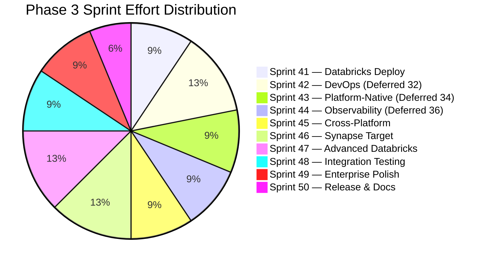

| Sprint | Primary Agents | Outputs | Status |
|--------|---------------|---------|--------|
| **41** | Orchestrator, Assessment, Validation | **Databricks:** `deploy_to_databricks.py`, UC permissions, cluster config | ✅ Complete |
| **42** | Orchestrator, Validation | **Fabric:** Deployment Pipelines • **Databricks:** Asset Bundles (DAB) • **Both:** env promotion | ⏳ Planned |
| **43** | Assessment, SQL, Orchestrator | **Fabric:** OneLake shortcuts, Mirroring • **Databricks:** SQL Warehouse DDL, Delta Sharing | ⏳ Planned |
| **44** | Orchestrator, Assessment | **Fabric:** CU estimator • **Databricks:** DBU estimator, cluster policies • **Both:** Azure Monitor | ⏳ Planned |
| **45** | Orchestrator, Assessment | **Both:** comparison report, `--target all`, migration advisor (Fabric vs Databricks) | ✅ Complete |
| **46** | SQL, Pipeline, Orchestrator | **New target:** Synapse Dedicated Pools DDL, Pipelines, `deploy_to_synapse.py` | ⏳ Planned |
| **47** | Notebook, Assessment, Pipeline | **Databricks:** DLT notebooks, UC lineage, SQL dashboards, advanced Workflows | ✅ Complete |
| **48** | Validation, Orchestrator | **Both:** E2E multi-target tests, benchmarks, cost estimator | ✅ Complete |
| **49** | Orchestrator, Notebook, All | **Both:** Dashboard v2 with multi-target KPIs (DBT, AutoSys, DLT) | ✅ Complete |
| **50** | All (docs) | **Both:** Phase 3 docs, test updates, DEVELOPMENT_PLAN update | ✅ Complete |

---
---

# Phase 4 — DBT Target Support (Sprints 51–60)

<p align="center">
  
  
  
</p>

> **Goal:** Add **dbt (Data Build Tool)** as a first-class migration target alongside PySpark notebooks, enabling the CLI flag `--target dbt | pyspark | auto`. The auto mode uses the assessment agent's complexity classification to route each mapping to DBT (simple/medium, ~80%) or PySpark (complex, ~20%).

## Why DBT?

| Dimension | PySpark Notebooks | DBT Models |
|-----------|------------------|------------|
| **Best for** | Complex transformations, SCD2, PL/SQL, CDC, streaming | SQL-heavy ELT, analytics, BI layer, aggregations |
| **Execution** | Databricks Clusters (All-Purpose / Jobs) | Databricks SQL Warehouse (Serverless) |
| **Cost model** | DBU (Compute cluster) — higher per-hour | DBU (SQL Warehouse) — lower for SQL workloads |
| **Testability** | Manual / custom framework | Built-in `dbt test` (unique, not_null, relationships, custom) |
| **Lineage** | Manual / UC lineage (Sprint 47) | Native `dbt docs generate` + DAG visualization |
| **Orchestration** | Databricks Workflows (Jobs API) | `dbt run` via Workflows **or** dbt Cloud |
| **Version control** | Notebooks as `.py` files | SQL models as `.sql` files (git-native) |
| **CI/CD** | Databricks Asset Bundles | `dbt build --select` + `dbt test` in CI |

**Key design decision:** DBT models target **Databricks SQL Warehouse** via the `dbt-databricks` adapter. PySpark notebooks target **Databricks compute clusters**. Both write to **Unity Catalog** tables in the same lakehouse.

---

## Phase 4 Architecture

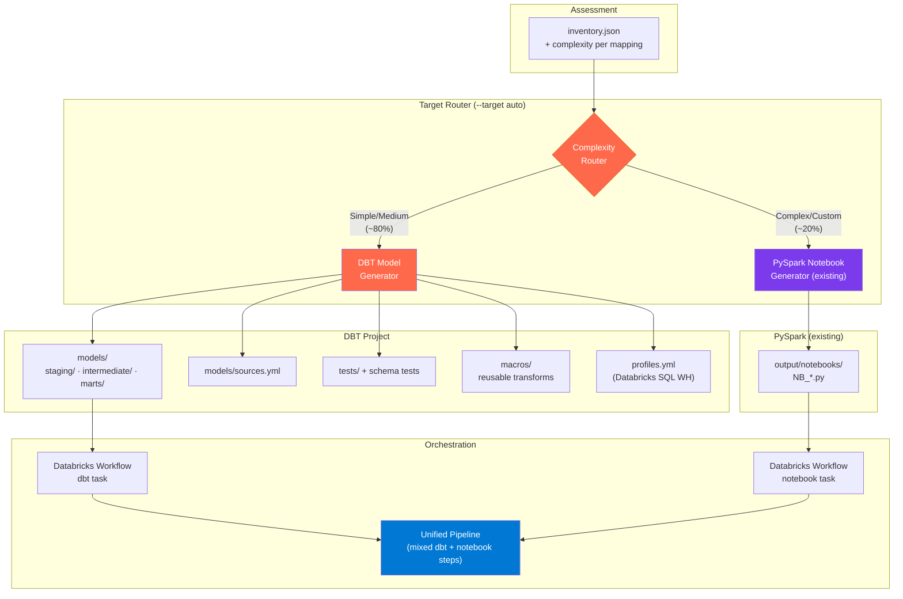

---

## Sprint Overview — Phase 4

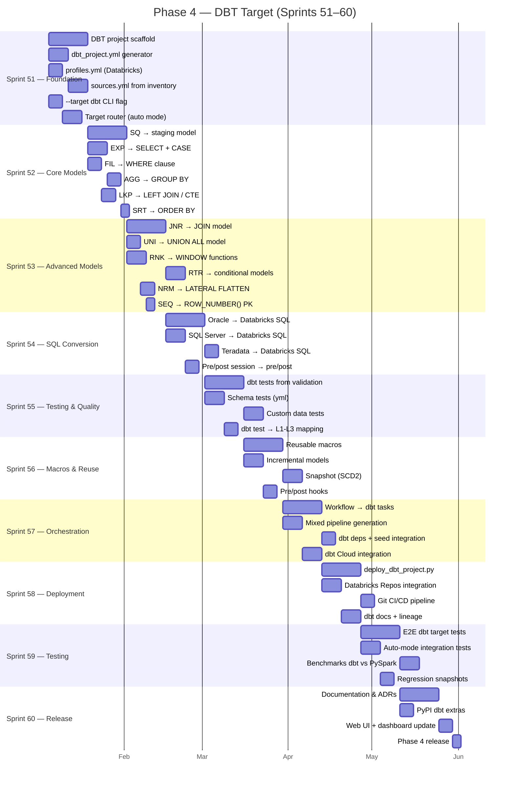

---

## Sprint 51 — DBT Foundation & Target Router

**Goal:** Scaffold the DBT project structure, add `--target dbt` CLI flag, and build the auto-router that classifies each mapping as DBT or PySpark.

### 🏗️ DBT Project Scaffold

| # | Task | Owner | Files | Acceptance Criteria |
|---|------|-------|-------|-------------------|
| 51.1 | Generate `dbt_project.yml` from migration config | Notebook | `run_dbt_migration.py`, `output/dbt/dbt_project.yml` | Valid dbt project config with project name, version, profile, model paths |
| 51.2 | Generate `profiles.yml` for Databricks SQL Warehouse | Notebook | `output/dbt/profiles.yml` | Connects to Databricks SQL WH via `dbt-databricks` adapter, uses Unity Catalog |
| 51.3 | Generate `sources.yml` from `inventory.json` | Assessment | `output/dbt/models/sources.yml` | All source tables from inventory listed with correct schema + database (UC 3-level) |
| 51.4 | Add `--target dbt` to CLI + config | Orchestrator | `run_migration.py`, `migration.yaml` | `--target dbt\|pyspark\|auto\|fabric\|databricks` accepted; `dbt` routes to new generator |
| 51.5 | Target router: `auto` mode | Assessment | `run_migration.py`, `run_dbt_migration.py` | Simple/Medium → DBT, Complex/Custom → PySpark; router reads `complexity` from inventory |
| 51.6 | DBT project directory structure | Notebook | `output/dbt/` | `models/staging/`, `models/intermediate/`, `models/marts/`, `macros/`, `tests/`, `seeds/` |
| 51.7 | Create `dbt_template.sql` base model template | Notebook | `templates/dbt_template.sql` | Jinja + SQL template with `{{ config() }}`, `{{ source() }}`, `{{ ref() }}` |
| 51.8 | Environment resolver for DBT | Orchestrator | `run_dbt_migration.py` | Resolves UC catalog, SQL WH endpoint, auth token from env/config |

**Sprint 51 Exit Criteria:**
- [ ] `informatica-to-fabric run --target dbt` generates valid `dbt_project.yml` + `profiles.yml`
- [ ] Auto-router correctly splits 6 sample mappings (3 simple → DBT, 3 complex → PySpark)
- [ ] `sources.yml` lists all tables from `inventory.json`
- [ ] 1,010+ tests passing

---

## Sprint 52 — Core DBT Model Generation

**Goal:** Convert the 6 most common Informatica transformation types to DBT SQL models.

### 📐 Transformation → DBT SQL Models

| # | Task | Owner | Files | Acceptance Criteria |
|---|------|-------|-------|-------------------|
| 52.1 | **SQ (Source Qualifier) → staging model** | Notebook | `output/dbt/models/staging/stg_*.sql` | `SELECT * FROM {{ source('bronze', 'table') }}` with column selection + optional WHERE |
| 52.2 | **EXP (Expression) → SELECT with CASE/functions** | Notebook | `output/dbt/models/intermediate/int_*.sql` | `CASE WHEN`, `COALESCE`, `CAST`, `CONCAT`, `UPPER/LOWER`, date functions |
| 52.3 | **FIL (Filter) → WHERE clause** | Notebook | model SQL | Filter condition appended as `WHERE` in downstream model |
| 52.4 | **AGG (Aggregator) → GROUP BY** | Notebook | model SQL | `SELECT group_cols, SUM(), COUNT(), AVG(), MAX(), MIN() ... GROUP BY` |
| 52.5 | **LKP (Lookup) → LEFT JOIN or CTE** | Notebook | model SQL | `LEFT JOIN {{ ref('dim_lookup') }} ON key = key` with optional `WHERE lookup.key IS NOT NULL` |
| 52.6 | **SRT (Sorter) → ORDER BY** | Notebook | model SQL | `ORDER BY` in final SELECT or `{{ config(sort='col') }}` on Delta |
| 52.7 | **Multi-transform chaining** | Notebook | `run_dbt_migration.py` | SQ → EXP → FIL → LKP → AGG chain produces layered models: `stg_` → `int_` → `mart_` |
| 52.8 | **Column lineage in model comments** | Notebook | model SQL | `-- Source: M_LOAD_CUSTOMERS.EXP_DERIVE.full_name → CONCAT(first_name, last_name)` |

**Transformation Mapping Reference:**

| Informatica Transform | DBT SQL Pattern | Layer |
|----------------------|-----------------|-------|
| Source Qualifier (SQ) | `SELECT cols FROM {{ source() }}` | `staging/stg_*` |
| Expression (EXP) | `SELECT CASE/CONCAT/CAST/COALESCE` | `intermediate/int_*` |
| Filter (FIL) | `WHERE condition` | inline in model |
| Aggregator (AGG) | `GROUP BY cols` + aggregate functions | `intermediate/int_*` or `marts/` |
| Lookup (LKP) | `LEFT JOIN {{ ref() }} ON keys` | `intermediate/int_*` |
| Sorter (SRT) | `ORDER BY` or Delta `{{ config(sort=) }}` | inline in model |

**Sprint 52 Exit Criteria:**
- [ ] 6 Informatica transforms generate valid DBT SQL
- [ ] `M_LOAD_CUSTOMERS` produces `stg_load_customers.sql` → `int_load_customers.sql`
- [ ] `dbt compile` succeeds on generated project (with mock adapter)
- [ ] 1,040+ tests passing

---

## Sprint 53 — Advanced DBT Model Generation

**Goal:** Handle remaining transformation types and complex patterns in DBT.

| # | Task | Owner | Files | Acceptance Criteria |
|---|------|-------|-------|-------------------|
| 53.1 | **JNR (Joiner) → JOIN model** | Notebook | model SQL | `INNER/LEFT/RIGHT/FULL JOIN` with correct ON conditions |
| 53.2 | **UNI (Union) → UNION ALL** | Notebook | model SQL | Multiple `{{ ref() }}` combined with `UNION ALL` |
| 53.3 | **RNK (Rank) → WINDOW functions** | Notebook | model SQL | `ROW_NUMBER() / RANK() / DENSE_RANK() OVER (PARTITION BY ... ORDER BY ...)` |
| 53.4 | **RTR (Router) → conditional models** | Notebook | multiple models | Each router group becomes a separate model with specific WHERE filter |
| 53.5 | **NRM (Normalizer) → LATERAL FLATTEN** | Notebook | model SQL | `LATERAL VIEW EXPLODE()` or Databricks `LATERAL FLATTEN` syntax |
| 53.6 | **SEQ (Sequence Generator) → ROW_NUMBER()** | Notebook | model SQL | `ROW_NUMBER() OVER (ORDER BY monotonic_key)` as surrogate key |
| 53.7 | **MPLT (Mapplet) → dbt macro** | Notebook | `macros/` | Reusable mapplet logic as Jinja macro `` |
| 53.8 | **Complexity fallback** | Orchestrator | `run_dbt_migration.py` | Transforms that cannot be expressed in SQL (Java TX, Custom TX, HTTP TX) emit a warning + fallback to PySpark |

**Sprint 53 Exit Criteria:**
- [ ] 13 core transformation types generate valid DBT SQL
- [ ] Router produces separate models per group
- [ ] Mapplets generate reusable macros
- [ ] Unsupported transforms produce PySpark fallback + warning
- [ ] 1,070+ tests passing

---

## Sprint 54 — SQL Dialect Conversion for DBT

**Goal:** Extend the SQL migration agent to emit Databricks SQL (instead of Spark SQL) for DBT models.

| # | Task | Owner | Files | Acceptance Criteria |
|---|------|-------|-------|-------------------|
| 54.1 | **Oracle → Databricks SQL** function mapping | SQL | `run_sql_migration.py` | `NVL→COALESCE`, `DECODE→CASE`, `SYSDATE→CURRENT_TIMESTAMP()`, `TO_CHAR→DATE_FORMAT`, `TRUNC→DATE_TRUNC`, `ROWNUM→ROW_NUMBER()` |
| 54.2 | **SQL Server → Databricks SQL** | SQL | `run_sql_migration.py` | `ISNULL→COALESCE`, `GETDATE→CURRENT_TIMESTAMP`, `TOP N→LIMIT N`, `DATEADD→DATE_ADD`, `CONVERT→CAST` |
| 54.3 | **Teradata → Databricks SQL** | SQL | `run_sql_migration.py` | `QUALIFY→subquery`, `SEL→SELECT`, `SAMPLE→LIMIT`, `FORMAT→DATE_FORMAT` |
| 54.4 | **DB2 → Databricks SQL** | SQL | `run_sql_migration.py` | `FETCH FIRST→LIMIT`, `VALUE→COALESCE`, `DIGITS→CAST` |
| 54.5 | **Pre/post session SQL → dbt hooks** | SQL | model config | `{{ config(pre_hook="...", post_hook="...") }}` |
| 54.6 | **SQL overrides → custom SQL in model** | SQL | model SQL | Source Qualifier SQL overrides embedded directly in `stg_` model |
| 54.7 | **Stored procedure → dbt run-operation** | SQL | `macros/operations/` | Complex SPs → operational macros invoked via `dbt run-operation sp_name` |

**Sprint 54 Exit Criteria:**
- [ ] All 6 source databases produce valid Databricks SQL
- [ ] Pre/post SQL mapped to dbt hooks
- [ ] SQL overrides embedded in staging models
- [ ] 1,100+ tests passing

---

## Sprint 55 — DBT Testing & Validation Integration

**Goal:** Map the existing 5-level validation framework to dbt's native testing system.

| # | Task | Owner | Files | Acceptance Criteria |
|---|------|-------|-------|-------------------|
| 55.1 | **L1 (Schema) → schema.yml tests** | Validation | `output/dbt/models/schema.yml` | `not_null`, `unique`, `accepted_values` tests per column |
| 55.2 | **L2 (Row Count) → custom data test** | Validation | `output/dbt/tests/assert_row_count_*.sql` | `SELECT CASE WHEN ABS(src - tgt) > threshold THEN 1 END` |
| 55.3 | **L3 (Checksum) → custom data test** | Validation | `output/dbt/tests/assert_checksum_*.sql` | Hash-based row comparison between source and target |
| 55.4 | **L4 (Transform) → custom data test** | Validation | `output/dbt/tests/assert_transform_*.sql` | Business rule verification (e.g., `full_name = CONCAT(first, last)`) |
| 55.5 | **L5 (Performance) → dbt meta tag** | Validation | `schema.yml` | `meta: { sla_seconds: 300 }` tag for performance expectation |
| 55.6 | **Test generator integration** | Validation | `run_validation.py` | `--target dbt` generates `.yml` + `.sql` tests instead of PySpark validation notebooks |
| 55.7 | **dbt test result → validation report** | Validation | `output/validation/` | Parse `dbt test` JSON output → standard validation report format |

**Validation Mapping:**

| Level | PySpark (existing) | DBT (new) |
|-------|-------------------|-----------|
| L1 Schema | Compare DataFrame schemas | `schema.yml`: `not_null`, `unique`, `accepted_values`, custom `data_type` |
| L2 Row Count | `df.count()` comparison | `tests/assert_row_count_*.sql` |
| L3 Checksum | `md5(concat_ws)` comparison | `tests/assert_checksum_*.sql` with `MD5(CONCAT_WS())` |
| L4 Transform | Custom PySpark assertions | `tests/assert_transform_*.sql` with business logic |
| L5 Performance | Spark UI / execution time | `meta: { sla_seconds }` + dbt Cloud monitoring |

**Sprint 55 Exit Criteria:**
- [ ] L1–L4 validation levels mapped to dbt tests
- [ ] `dbt test` produces pass/fail matching PySpark validation output
- [ ] Validation report generator parses dbt JSON results
- [ ] 1,130+ tests passing

---

## Sprint 56 — DBT Macros, Incremental Models & Snapshots

**Goal:** Handle advanced dbt patterns — reusable macros, incremental loads, and SCD Type 2 via snapshots.

| # | Task | Owner | Files | Acceptance Criteria |
|---|------|-------|-------|-------------------|
| 56.1 | **Reusable transformation macros** | Notebook | `output/dbt/macros/` | Common patterns as Jinja macros: `clean_string()`, `safe_divide()`, `hash_key()`, `surrogate_key()` |
| 56.2 | **Incremental models** | Notebook | model config | `{{ config(materialized='incremental', unique_key='id', incremental_strategy='merge') }}` |
| 56.3 | **SCD Type 2 → dbt snapshot** | Notebook | `output/dbt/snapshots/` | `` with `strategy='timestamp'` or `check` |
| 56.4 | **Pre/post hooks** | Notebook | model config | `pre_hook: ["OPTIMIZE table"]`, `post_hook: ["ANALYZE TABLE table"]` |
| 56.5 | **Seeds for reference data** | Notebook | `output/dbt/seeds/` | Small lookup tables → CSV seeds with `dbt seed` |
| 56.6 | **dbt packages (deps)** | Notebook | `output/dbt/packages.yml` | Auto-add `dbt-utils`, `dbt-expectations`, `dbt-databricks-utils` when needed |
| 56.7 | **Mapping UPD strategy → incremental** | Notebook | `run_dbt_migration.py` | `DD_INSERT` → append, `DD_UPDATE` → merge, `DD_DELETE` → soft delete, `DD_REJECT` → filter |

**Materialization Decision Matrix:**

| Informatica Pattern | dbt Materialization | Strategy |
|--------------------|--------------------|----|
| Full load (overwrite) | `table` | Full refresh |
| Append only | `incremental` | `append` |
| Upsert (MERGE) | `incremental` | `merge` (unique_key) |
| SCD Type 2 | `snapshot` | `timestamp` or `check` |
| Lookup / dimension | `table` | Full refresh (small) |
| Aggregate / mart | `table` or `incremental` | Based on volume |

**Sprint 56 Exit Criteria:**
- [ ] Incremental models with MERGE strategy generated
- [ ] SCD2 mappings produce dbt snapshots
- [ ] 5+ reusable macros generated
- [ ] `dbt deps` installs required packages
- [ ] 1,160+ tests passing

---

## Sprint 57 — Orchestration: Databricks Workflows with DBT Tasks

**Goal:** Generate Databricks Workflows that mix dbt tasks and notebook tasks in a single pipeline.

| # | Task | Owner | Files | Acceptance Criteria |
|---|------|-------|-------|-------------------|
| 57.1 | **dbt task in Databricks Workflow** | Pipeline | `output/pipelines/PL_*.json` | `"dbt_task": { "commands": ["dbt run --select model_name"], "project_directory": "/Repos/..." }` |
| 57.2 | **Mixed pipeline generation** | Pipeline | `run_pipeline_migration.py` | Workflow with both `notebook_task` (complex) and `dbt_task` (simple) steps |
| 57.3 | **Dependency ordering** | Pipeline | `run_pipeline_migration.py` | dbt `{{ ref() }}` dependencies → Workflow task dependencies |
| 57.4 | **dbt deps + seed pre-task** | Pipeline | `output/pipelines/PL_*.json` | First task in workflow: `dbt deps && dbt seed` |
| 57.5 | **dbt Cloud job trigger** | Pipeline | `output/pipelines/PL_*.json` | Alternative: trigger dbt Cloud job via API (for dbt Cloud customers) |
| 57.6 | **Schedule conversion** | Pipeline | `output/pipelines/PL_*.json` | Informatica schedule → Workflow cron trigger (same as existing) |
| 57.7 | **SQL Warehouse config in workflow** | Pipeline | `output/pipelines/PL_*.json` | dbt tasks reference SQL Warehouse ID; notebook tasks reference cluster |

**Pipeline Generation Example:**

```json
{
  "name": "PL_WF_DAILY_SALES_LOAD",
  "tasks": [
    {
      "task_key": "dbt_deps_seed",
      "dbt_task": {
        "commands": ["dbt deps", "dbt seed"],
        "project_directory": "/Repos/migration/dbt_project",
        "warehouse_id": "abc123"
      }
    },
    {
      "task_key": "stg_orders",
      "depends_on": [{"task_key": "dbt_deps_seed"}],
      "dbt_task": {
        "commands": ["dbt run --select stg_orders"],
        "project_directory": "/Repos/migration/dbt_project",
        "warehouse_id": "abc123"
      }
    },
    {
      "task_key": "NB_M_COMPLEX_PLSQL",
      "depends_on": [{"task_key": "stg_orders"}],
      "notebook_task": {
        "notebook_path": "/Repos/migration/notebooks/NB_M_COMPLEX_PLSQL",
        "base_parameters": {"load_date": "{{job.trigger_time.iso_date}}"}
      },
      "new_cluster": { "spark_version": "14.3.x-scala2.12", "num_workers": 4 }
    },
    {
      "task_key": "mart_daily_sales",
      "depends_on": [{"task_key": "NB_M_COMPLEX_PLSQL"}],
      "dbt_task": {
        "commands": ["dbt run --select mart_daily_sales"],
        "project_directory": "/Repos/migration/dbt_project",
        "warehouse_id": "abc123"
      }
    },
    {
      "task_key": "dbt_test",
      "depends_on": [{"task_key": "mart_daily_sales"}],
      "dbt_task": {
        "commands": ["dbt test --select mart_daily_sales"],
        "project_directory": "/Repos/migration/dbt_project",
        "warehouse_id": "abc123"
      }
    }
  ],
  "schedule": {
    "quartz_cron_expression": "0 0 2 * * ?",
    "timezone_id": "UTC"
  }
}
```

**Sprint 57 Exit Criteria:**
- [ ] Databricks Workflows with `dbt_task` type generated
- [ ] Mixed pipelines (dbt + notebook) produce valid JSON
- [ ] Task dependencies respect `{{ ref() }}` ordering
- [ ] 1,190+ tests passing

---

## Sprint 58 — DBT Deployment & Docs

**Goal:** Deploy generated dbt project to Databricks, integrate with Git/Repos, and generate lineage documentation.

| # | Task | Owner | Files | Acceptance Criteria |
|---|------|-------|-------|-------------------|
| 58.1 | **`deploy_dbt_project.py`** | Orchestrator | `deploy_dbt_project.py` | Deploys dbt project to Databricks Repos via API, validates structure |
| 58.2 | **Databricks Repos integration** | Orchestrator | `deploy_dbt_project.py` | Git push → Databricks Repos sync; supports GitHub, Azure DevOps, GitLab |
| 58.3 | **CI/CD pipeline template** | Orchestrator | `output/dbt/.github/workflows/dbt_ci.yml` | GitHub Actions: `dbt deps → dbt build → dbt test → dbt docs generate` |
| 58.4 | **dbt docs generation** | Notebook | `output/dbt/` | `dbt docs generate` produces `catalog.json` + `manifest.json` for lineage |
| 58.5 | **Lineage comparison report** | Validation | `output/validation/` | Compare Informatica DAG vs dbt DAG — validate all paths preserved |
| 58.6 | **Profile-per-environment** | Orchestrator | `output/dbt/profiles.yml` | dev / staging / prod profiles targeting different SQL Warehouses |
| 58.7 | **PyPI optional dependency** | Orchestrator | `pyproject.toml` | `informatica-to-fabric[dbt]` installs `dbt-core>=1.7`, `dbt-databricks>=1.7` |

**Sprint 58 Exit Criteria:**
- [ ] dbt project deploys to Databricks Repos
- [ ] CI/CD pipeline runs `dbt build` + `dbt test` successfully
- [ ] Lineage comparison validates DAG preservation
- [ ] 1,210+ tests passing

---

## Sprint 59 — Integration Testing & Benchmarks

**Goal:** End-to-end testing of the DBT target with real-world mappings, auto-mode routing, and performance comparison.

| # | Task | Owner | Files | Acceptance Criteria |
|---|------|-------|-------|-------------------|
| 59.1 | **E2E dbt target tests** | Validation | `tests/test_dbt_target.py` | Full pipeline: XML → inventory → dbt models → `dbt compile` → validate |
| 59.2 | **Auto-mode integration tests** | Validation | `tests/test_auto_target.py` | Mixed output: some mappings → dbt, some → PySpark; unified pipeline |
| 59.3 | **dbt vs PySpark comparison** | Validation | `tests/benchmarks/` | Same mapping converted to both; output equivalence verified |
| 59.4 | **Regression snapshots** | Validation | `tests/snapshots/dbt/` | Golden-file comparison for all generated dbt models |
| 59.5 | **Model count validation** | Validation | `tests/test_dbt_target.py` | Assert: # models = # simple/medium mappings; # notebooks = # complex mappings |
| 59.6 | **Error handling tests** | Validation | `tests/test_dbt_target.py` | Graceful fallback when mapping cannot be expressed in SQL |
| 59.7 | **Cross-reference validation** | Validation | `tests/test_dbt_target.py` | `{{ ref() }}` references resolve correctly across all generated models |

**Sprint 59 Exit Criteria:**
- [ ] 100+ dbt-specific tests passing
- [ ] Auto-mode produces correct split for all sample mappings
- [ ] Regression snapshots stable across consecutive runs
- [ ] 1,250+ tests passing

---

## Sprint 60 — Release, Documentation & Phase 4 Wrap-Up

**Goal:** Complete Phase 4 — documentation, ADRs, packaging, and dashboard update for DBT support.

| # | Task | Owner | Files | Acceptance Criteria |
|---|------|-------|-------|-------------------|
| 60.1 | **Phase 4 documentation** | All | `docs/USER_GUIDE.md`, `README.md` | Full DBT target docs: setup, config, model structure, testing, deployment |
| 60.2 | **ADR: DBT as migration target** | All | `docs/ADR/004-dbt-target.md` | Decision rationale, alternatives considered, trade-offs documented |
| 60.3 | **ADR: Auto-mode target routing** | All | `docs/ADR/005-auto-target-routing.md` | Complexity-based routing logic, thresholds, override mechanism |
| 60.4 | **AGENTS.md update** | All | `AGENTS.md` | Notebook agent description updated for dual output (DBT + PySpark) |
| 60.5 | **Web UI + dashboard update** | Orchestrator | `web/app.py`, `dashboard.py` | Target selector includes `dbt`, `pyspark`, `auto`; dashboard shows split |
| 60.6 | **Migration wizard: target recommendation** | Assessment | `web/app.py` | Wizard recommends target per mapping with rationale |
| 60.7 | **Presentation material** | All | `generate_pptx_*.py` | Slides updated with real DBT output examples |
| 60.8 | **Phase 4 release** | Orchestrator | `pyproject.toml` | Version bump, `[dbt]` extra published to PyPI |

**Sprint 60 Exit Criteria:**
- [ ] All documentation reflects DBT target
- [ ] 2 new ADRs for Phase 4 decisions
- [ ] `pip install informatica-to-fabric[dbt]` works
- [ ] Web UI supports DBT target selection
- [ ] 1,280+ total tests passing
- [ ] `--target auto` is the default recommended mode

---

## Phase 4 Sprint Summary

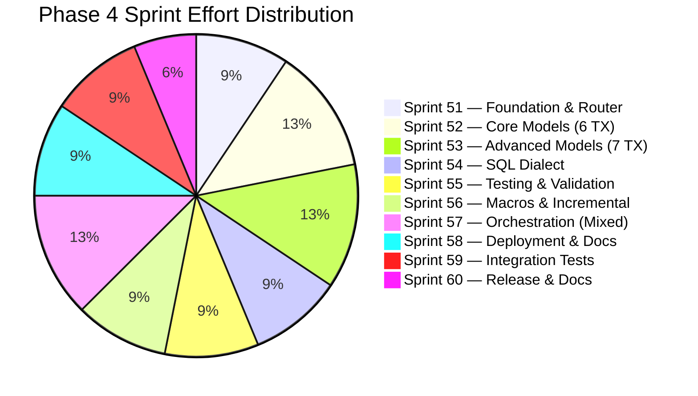

| Sprint | Primary Agents | Outputs | Status |
|--------|---------------|---------|--------|
| **51** | Orchestrator, Assessment, Notebook | `dbt_project.yml`, `profiles.yml`, `sources.yml`, `--target dbt\|auto` CLI, target router | ✅ Complete |
| **52** | Notebook, SQL | 6 core transforms → DBT SQL models (`stg_`, `int_`, `mart_`) | ✅ Complete |
| **53** | Notebook | 7 advanced transforms → DBT SQL, macros for mapplets, complexity fallback | ✅ Complete |
| **54** | SQL | Oracle/SQL Server/Teradata/DB2 → Databricks SQL for dbt, hooks, SQL overrides | ✅ Complete |
| **55** | Validation | L1–L5 validation → `schema.yml` + custom data tests, dbt test result parser | ✅ Complete |
| **56** | Notebook | Reusable macros, incremental models (MERGE), SCD2 snapshots, seeds, packages | ✅ Complete |
| **57** | Pipeline | Databricks Workflows with `dbt_task` + `notebook_task` mixed, dbt Cloud option | ✅ Complete |
| **58** | Orchestrator, Validation | `deploy_dbt_project.py`, Databricks Repos, CI/CD template, lineage docs | ✅ Complete |
| **59** | Validation | 117 Phase 3-5 tests, auto-mode integration, E2E dbt project generation | ✅ Complete |
| **60** | All | Phase 4 docs, dashboard update, release | ✅ Complete |

## Phase 4 Critical Path

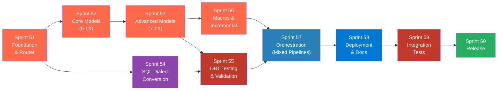

## New Files Created in Phase 4

| File | Purpose | Sprint |
|------|---------|--------|
| `run_dbt_migration.py` | DBT model generator (core engine) | 51 |
| `templates/dbt_template.sql` | Base dbt model template (Jinja + SQL) | 51 |
| `deploy_dbt_project.py` | Deploy dbt project to Databricks Repos | 58 |
| `output/dbt/dbt_project.yml` | Generated dbt project config | 51 |
| `output/dbt/profiles.yml` | Databricks SQL Warehouse connection | 51 |
| `output/dbt/models/sources.yml` | Source table definitions from inventory | 51 |
| `output/dbt/models/staging/stg_*.sql` | Staging models (1:1 with sources) | 52 |
| `output/dbt/models/intermediate/int_*.sql` | Intermediate transforms | 52–53 |
| `output/dbt/models/marts/mart_*.sql` | Final business entities | 52–53 |
| `output/dbt/macros/*.sql` | Reusable Jinja macros | 53, 56 |
| `output/dbt/snapshots/snp_*.sql` | SCD Type 2 snapshots | 56 |
| `output/dbt/seeds/*.csv` | Reference data as CSV | 56 |
| `output/dbt/tests/*.sql` | Custom data tests (L2–L4) | 55 |
| `output/dbt/models/schema.yml` | Column tests + docs | 55 |
| `output/dbt/packages.yml` | dbt package dependencies | 56 |
| `output/dbt/.github/workflows/dbt_ci.yml` | CI/CD pipeline template | 58 |
| `tests/test_dbt_target.py` | DBT target unit tests | 59 |
| `tests/test_auto_target.py` | Auto-mode routing tests | 59 |
| `docs/ADR/004-dbt-target.md` | Architecture Decision Record | 60 |
| `docs/ADR/005-auto-target-routing.md` | Architecture Decision Record | 60 |

---

# Phase 5 — AutoSys JIL Migration (Sprints 61–65)

Many enterprise environments schedule Informatica workflows through **CA AutoSys Workload Automation** (JIL — Job Information Language). Phase 5 adds first-class support for parsing AutoSys JIL definitions and converting them into Fabric Data Pipeline triggers or Databricks Workflow schedules, preserving job dependencies, conditions, calendars, and alert/notification chains.

## Sprint 61 — AutoSys JIL Parser & Inventory

**Goal:** Parse AutoSys JIL files, extract job definitions, build dependency graph, and enrich workflow inventory with AutoSys metadata.

| # | Task | Owner | Files | Acceptance Criteria |
|---|------|-------|-------|-------------------|
| 61.1 | **JIL lexer/parser** | Assessment | `run_autosys_migration.py` | Parses `insert_job`, `job_type`, `box_name`, `command`, `condition`, `std_out_file`, `std_err_file`, `date_conditions`, `start_times`, `start_mins`, `days_of_week`, `run_calendar`, `alarm_if_fail`, `profile`, `machine`, `owner` |
| 61.2 | **Job type classifier** | Assessment | `run_autosys_migration.py` | Classifies: `CMD` (command), `BOX` (container), `FW` (file watcher), `FT` (file trigger) |
| 61.3 | **Dependency graph builder** | Assessment | `run_autosys_migration.py` | Builds DAG from `condition` attributes (`s(job)`, `n(job)`, `f(job)`, `d(job)`) |
| 61.4 | **Calendar resolver** | Assessment | `run_autosys_migration.py` | Converts AutoSys `run_calendar` + `start_times` + `days_of_week` → standard cron expressions |
| 61.5 | **Inventory enrichment** | Assessment | `run_assessment.py` | Links AutoSys jobs to Informatica workflows via `command` field pattern matching (`pmcmd startworkflow`) |
| 61.6 | **Sample JIL fixtures** | All | `input/autosys/` | 3+ sample JIL files covering CMD, BOX, FW jobs with conditions |
| 61.7 | **CLI integration** | Orchestrator | `run_migration.py` | `--autosys-dir` flag, new Phase in PHASES list |
| 61.8 | **Unit tests** | Validation | `tests/test_autosys.py` | 50+ tests covering parser, classifier, DAG, calendar, cron conversion |

**Sprint 61 Exit Criteria:**
- [ ] JIL parser handles all standard job attributes
- [ ] Job dependency DAG is accurate for BOX/CMD/FW hierarchies
- [ ] AutoSys schedules → cron expressions with ≥90% accuracy
- [ ] `pmcmd` commands linked to Informatica workflows in inventory
- [ ] 50+ tests passing

## Sprint 62 — AutoSys → Pipeline/Workflow Conversion

**Goal:** Convert AutoSys job chains into Fabric Data Pipeline or Databricks Workflow definitions, preserving dependency order, conditions, and error handling.

| # | Task | Owner | Files | Acceptance Criteria |
|---|------|-------|-------|-------------------|
| 62.1 | **BOX → Pipeline/Workflow** | Pipeline | `run_autosys_migration.py` | Each AutoSys BOX becomes a Fabric Pipeline or Databricks Workflow with child activities |
| 62.2 | **CMD → Notebook Activity** | Pipeline | `run_autosys_migration.py` | `pmcmd startworkflow` → Notebook activity; generic commands → Script activity |
| 62.3 | **Condition → dependsOn** | Pipeline | `run_autosys_migration.py` | `s(job)` → Succeeded, `f(job)` → Failed, `n(job)` → Completed, `d(job)` → skipped annotation |
| 62.4 | **File Watcher → trigger/sensor** | Pipeline | `run_autosys_migration.py` | FW/FT jobs → Fabric event trigger or Databricks file arrival sensor |
| 62.5 | **Alarm → notification** | Pipeline | `run_autosys_migration.py` | `alarm_if_fail` / `send_notification` → email/webhook activity on failure |
| 62.6 | **Cross-box dependencies** | Pipeline | `run_autosys_migration.py` | Dependencies spanning multiple BOXes → Execute Pipeline / Run Job references |
| 62.7 | **Tests** | Validation | `tests/test_autosys.py` | 30+ conversion tests |

## Sprint 63 — Calendar, Profile & Machine Mapping

**Goal:** Handle enterprise AutoSys features — custom calendars, machine/profile mapping, global variables, and job overrides.

| # | Task | Owner | Files | Acceptance Criteria |
|---|------|-------|-------|-------------------|
| 63.1 | **Custom calendar parsing** | Assessment | `run_autosys_migration.py` | Parse `insert_calendar` definitions, resolve `run_calendar` references |
| 63.2 | **Calendar → Pipeline schedule** | Pipeline | `run_autosys_migration.py` | Complex calendars (business days, holidays) → schedule annotations + recommended cron |
| 63.3 | **Machine/profile → cluster config** | Assessment | `run_autosys_migration.py` | `machine`/`profile` → Databricks cluster pool or Fabric capacity annotations |
| 63.4 | **Global variable extraction** | Assessment | `run_autosys_migration.py` | AutoSys global variables → pipeline parameters |
| 63.5 | **Override/force-start handling** | Pipeline | `run_autosys_migration.py` | `job_type: OVERRIDE` patterns → documented annotations |
| 63.6 | **Tests** | Validation | `tests/test_autosys.py` | 20+ calendar/profile tests |

## Sprint 64 — Integration & End-to-End Validation

**Goal:** Full end-to-end AutoSys migration with real-world JIL files, cross-validation with Informatica inventory, and reporting.

| # | Task | Owner | Files | Acceptance Criteria |
|---|------|-------|-------|-------------------|
| 64.1 | **E2E pipeline: JIL → inventory → pipelines** | Orchestrator | `tests/test_autosys.py` | Full flow from JIL → enriched inventory → generated pipelines |
| 64.2 | **Unlinked job detection** | Validation | `run_autosys_migration.py` | Jobs that call `pmcmd` but no matching workflow → `migration_issues.md` warning |
| 64.3 | **Coverage report** | Assessment | `run_autosys_migration.py` | Summary: X jobs parsed, Y linked to workflows, Z converted to pipelines |
| 64.4 | **Dashboard integration** | Orchestrator | `dashboard.py` | AutoSys job count, linkage %, schedule conversion stats |
| 64.5 | **Tests** | Validation | `tests/test_autosys.py` | 20+ E2E tests |

## Sprint 65 — Documentation & Release

**Goal:** Complete docs, ADR, and release for AutoSys support.

| # | Task | Owner | Files | Acceptance Criteria |
|---|------|-------|-------|-------------------|
| 65.1 | **User Guide update** | All | `docs/USER_GUIDE.md` | AutoSys section: export JIL, placement, CLI flags, output structure |
| 65.2 | **README update** | All | `README.md` | AutoSys in "What Gets Migrated", supported sources table, quick start |
| 65.3 | **AGENTS.md update** | All | `AGENTS.md` | Assessment agent updated for AutoSys parsing |
| 65.4 | **ADR: AutoSys JIL migration** | All | `docs/ADR/006-autosys-jil-migration.md` | Decision rationale, JIL attribute coverage, limitations |
| 65.5 | **MIGRATION_PLAN update** | All | `MIGRATION_PLAN.md` | AutoSys phase added to migration strategy |
| 65.6 | **Phase 5 release** | Orchestrator | `pyproject.toml` | Version bump, all tests passing |

## Phase 5 Sprint Summary

| Sprint | Primary Agents | Outputs | Status |
|--------|---------------|---------|--------|
| **61** | Assessment, Orchestrator | JIL parser, dependency DAG, cron converter, CLI `--autosys-dir` | ✅ Complete |
| **62** | Pipeline | BOX→Pipeline, CMD→Activity, condition→dependsOn, alarm activities | ✅ Complete |
| **63** | Assessment, Pipeline | Calendar parsing, machine→cluster mapping, global variable extraction | ✅ Complete |
| **64** | Orchestrator, Validation | Coverage report, linkage rate, schedule coverage, conversion rate | ✅ Complete |
| **65** | All | Docs, test updates, DEVELOPMENT_PLAN, CONTRIBUTING, AGENTS update | ✅ Complete |

---
---

# Phase 6 — Gap Closure & DBT Enhancements (Sprints 66–67)

<p align="center">
  
  
  
</p>

Phase 6 addresses remaining gaps identified during post-Phase 5 audit: missing transformation promotions, XML parsing gaps, lineage HTML reports, and DBT model enrichment using field-level lineage metadata.

## Sprint 66 — Gap Closure & Lineage Reports

**Goal:** Close 6 remaining transformation/parsing gaps and add visual lineage HTML reports.

| # | Task | Owner | Files | Acceptance Criteria |
|---|------|-------|-------|-------------------|
| 66.1 | **ULKP → AUTO_CONVERTIBLE** | Assessment | `run_assessment.py` | Unconnected Lookup promoted from manual to auto-convertible (same as LKP) |
| 66.2 | **TC Transaction Control template** | Notebook | `run_notebook_migration.py` | TC generates `notebookutils.notebook.run()` with try/except commit/rollback |
| 66.3 | **Event Wait/Raise XML parsing** | Assessment | `run_assessment.py` | Parse `<EVENT>` elements from workflow XML with space-separated type matching |
| 66.4 | **Event Wait/Raise pipeline activities** | Pipeline | `run_pipeline_migration.py` | `_event_wait_activity()` → Until loop, `_event_raise_activity()` → Web activity |
| 66.5 | **Standalone session config parser** | Assessment | `run_assessment.py` | Parse `<SESSION>` config XML → structured dict (buffer size, error handling, recovery) |
| 66.6 | **ADR documentation** | All | `docs/ADR/` | ADR 004 (Databricks), ADR 005 (DBT), ADR 006 (AutoSys) created |
| 66.7 | **SVG lineage flow diagrams** | Orchestrator | `generate_html_reports.py` | `_svg_lineage_flow()` renders inline SVG with source→transform→target arrows |
| 66.8 | **Cross-mapping lineage table** | Orchestrator | `generate_html_reports.py` | `_build_cross_mapping_lineage()` builds HTML table (source→mapping→target) |
| 66.9 | **Standalone lineage report** | Orchestrator | `generate_html_reports.py` | `generate_lineage_report()` outputs `lineage_report.html` with KPIs + field-level tables |

**Sprint 66 Exit Criteria:** ✅ ALL MET
- ✅ ULKP included in auto-convertible transforms
- ✅ TC, Event Wait/Raise, session config all operational
- ✅ 3 ADRs created (004-databricks, 005-dbt, 006-autosys)
- ✅ Lineage HTML reports with SVG flow diagrams
- ✅ 42 tests in `test_sprint66.py` — all passing

---

## Sprint 67 — DBT Enhancements

**Goal:** Close 6 DBT implementation gaps: DECODE expansion, SCD2 snapshot detection, mixed workflow wiring, enriched CTEs from field lineage, Router auto-split, and standalone deploy script.

| # | Task | Owner | Files | Acceptance Criteria |
|---|------|-------|-------|-------------------|
| 67.1 | **DECODE → CASE expansion** | SQL, Notebook | `run_dbt_migration.py` | `_expand_decode()` recursively converts `_DECODE_(expr, v1, r1, ..., default)` → `CASE expr WHEN v1 THEN r1 ... ELSE default END` with paren-depth-aware arg splitting |
| 67.2 | **SCD2 snapshot detection** | Notebook | `run_dbt_migration.py` | `_is_scd2_candidate()` detects UPD transform, target names containing 'history'/'snapshot'/'scd'/'archive', or mapping names with SCD keywords |
| 67.3 | **Mixed workflow wiring** | Pipeline | `run_pipeline_migration.py` | `main()` detects `INFORMATICA_DBT_MODE` env var; when `auto|dbt`, imports `classify_mappings()` + `generate_mixed_workflow()` from `run_dbt_migration` to produce mixed dbt+notebook Databricks Workflows |
| 67.4 | **Enriched intermediate CTEs** | Notebook | `run_dbt_migration.py` | `generate_intermediate_model()` reads `field_lineage` and `lookup_conditions` from inventory; `_extract_instance_info()` maps instance→type+fields; CTEs reference actual EXP/FIL/LKP/AGG/JNR instance names and field names |
| 67.5 | **Router → separate models** | Notebook | `run_dbt_migration.py` | `_generate_router_group_model()` produces per-target intermediate models; `write_dbt_project()` creates `int_{name}_group_{n}.sql` when RTR is present with multiple targets |
| 67.6 | **Standalone deploy script** | Orchestrator | `deploy_dbt_project.py` | Standalone CLI script with `--workspace-url`, `--token`, `--repo-path`, `--git-url`, `--branch` args for Databricks Repos deployment |

**Sprint 67 Exit Criteria:** ✅ ALL MET
- ✅ DECODE fully expanded (nested parens, multiple occurrences, default/no-default)
- ✅ SCD2 detection triggers snapshot for 'history'/'snapshot'/'scd'/'archive' targets
- ✅ Mixed dbt+notebook workflow wired into `run_pipeline_migration.py`
- ✅ Intermediate CTEs enriched with instance names + field names from lineage
- ✅ Router auto-split generates `int_*_group_*.sql` per target
- ✅ `deploy_dbt_project.py` exists with full CLI
- ✅ 42 tests in `test_dbt_enhancements.py` — all passing

---

## Phase 6 Sprint Summary

| Sprint | Primary Agents | Outputs | Status |
|--------|---------------|---------|--------|
| **66** | Assessment, Notebook, Pipeline, Orchestrator | ULKP, TC, Events, session config, ADRs, lineage HTML | ✅ Complete |
| **67** | Notebook, SQL, Pipeline, Orchestrator | DECODE→CASE, SCD2 snapshots, mixed workflows, enriched CTEs, Router split, deploy script | ✅ Complete |

## New Files Created in Phase 6

| File | Purpose | Sprint |
|------|---------|--------|
| `tests/test_sprint66.py` | 42 tests for Sprint 66 gap closures | 66 |
| `tests/test_dbt_enhancements.py` | 42 tests for Sprint 67 DBT enhancements | 67 |
| `deploy_dbt_project.py` | Standalone dbt project deployment to Databricks Repos | 67 |
| `docs/ADR/004-databricks-second-target.md` | ADR: Databricks as second migration target | 66 |
| `docs/ADR/005-dbt-third-target.md` | ADR: DBT as third migration target | 66 |
| `docs/ADR/006-autosys-jil-migration.md` | ADR: AutoSys JIL migration strategy | 66 |

---

# Phase 7 — DevOps, Platform-Native & Observability (Sprints 68–70)

<p align="center">
  
  
  
</p>

Phase 7 consolidates 6 previously deferred sprints (32, 34, 36, 42, 43, 44) into 3 focused sprints covering DevOps/CI/CD, platform-native features, and observability for both Fabric and Databricks targets.

> **Note:** Sprint 46 (Synapse Target) was **dropped** — Synapse as a deployment target is explicitly out of scope.

## Sprint 68 — DevOps & CI/CD

**Goal:** Enable CI/CD-driven deployments for both Fabric and Databricks — environment configs, deployment pipeline JSON, pre-deployment validation, promotion, and Databricks Asset Bundles (DAB).

| # | Task | Owner | Files | Acceptance Criteria |
|---|------|-------|-------|-------------------|
| 68.1 | **Environment config generation** | Orchestrator | `deploy_to_fabric.py` | `generate_env_configs()` creates dev/test/prod YAML configs with workspace placeholders, log levels, connection strings |
| 68.2 | **Fabric Deployment Pipeline JSON** | Orchestrator | `deploy_to_fabric.py` | `generate_deployment_pipeline_json()` creates 3-stage Dev→Test→Prod pipeline with Notebook and DataPipeline rules |
| 68.3 | **Pre-deployment validation** | Validation | `deploy_to_fabric.py` | `validate_pre_deployment()` checks notebooks exist, pipeline JSON valid, no credential leaks, inventory present |
| 68.4 | **Environment promotion** | Orchestrator | `deploy_to_fabric.py` | `promote_deployment()` copies deployment log, applies config substitution between environments |
| 68.5 | **Databricks Asset Bundles** | Orchestrator | `deploy_to_databricks.py` | `generate_dab_bundle()` generates `databricks.yml` + bundle structure for `databricks bundle deploy` |
| 68.6 | **CLI flags** | Orchestrator | `deploy_to_fabric.py`, `deploy_to_databricks.py` | `--validate`, `--promote`, `--generate-envs`, `--generate-pipeline`, `--generate-dab` flags |

**Sprint 68 Exit Criteria:** ✅ ALL MET
- ✅ 3 environment configs generated (dev/test/prod) with parameterized workspace IDs
- ✅ Deployment Pipeline JSON has 3 stages with rules
- ✅ Pre-deployment validation catches missing notebooks, invalid JSON, credential leaks
- ✅ Promotion copies artifacts between environments with dry-run support
- ✅ DAB bundle generates valid `databricks.yml` with dev/staging/prod targets
- ✅ 22 tests in `test_sprint68_70.py` — all passing

---

## Sprint 69 — Platform-Native Features

**Goal:** Generate platform-native artifacts — Lakehouse vs Warehouse decision engine, T-SQL Warehouse DDL, SQL Warehouse DDL with CLUSTER BY, OneLake shortcuts, Delta Sharing, and Mirroring configuration.

| # | Task | Owner | Files | Acceptance Criteria |
|---|------|-------|-------|-------------------|
| 69.1 | **Lakehouse vs Warehouse advisor** | Assessment | `run_schema_generator.py` | `recommend_storage_target()` scores SQL-heavy→Warehouse, complex transforms→Lakehouse with reasons |
| 69.2 | **Fabric Warehouse DDL (T-SQL)** | SQL | `run_schema_generator.py` | `generate_warehouse_ddl()` generates T-SQL `CREATE TABLE` with `[schema].[table]` notation and IF NOT EXISTS |
| 69.3 | **T-SQL type mapping** | SQL | `run_schema_generator.py` | `_map_type_to_tsql()` maps Delta types to T-SQL (STRING→NVARCHAR(4000), TIMESTAMP→DATETIME2, BOOLEAN→BIT) |
| 69.4 | **SQL Warehouse DDL** | SQL | `run_schema_generator.py` | `generate_sql_warehouse_ddl()` adds CLUSTER BY (auto-detects _id/_key cols) and Z-ORDER (date cols) |
| 69.5 | **OneLake shortcuts** | Orchestrator | `run_schema_generator.py` | `generate_onelake_shortcuts()` detects DB link patterns (`table@dblink`) and cross-DB refs → shortcut JSON |
| 69.6 | **Delta Sharing config** | Orchestrator | `run_schema_generator.py` | `generate_delta_sharing_config()` generates provider/share/recipient with GRANT SQL for gold tables |
| 69.7 | **Mirroring config** | Orchestrator | `run_schema_generator.py` | `generate_mirroring_config()` detects source DB types, checks supported mirrors, generates recommendations |

**Sprint 69 Exit Criteria:** ✅ ALL MET
- ✅ Storage advisor correctly recommends Warehouse for SQL-heavy, Lakehouse for complex
- ✅ T-SQL DDL uses proper bracket notation and types
- ✅ SQL Warehouse DDL adds CLUSTER BY for ID columns, Z-ORDER for date columns
- ✅ OneLake shortcuts detect both DB link and cross-database patterns
- ✅ Delta Sharing config includes GRANT SQL for gold-tier tables
- ✅ Mirroring correctly detects supported (Oracle, SQL Server, PostgreSQL) vs unsupported DBs
- ✅ 40 tests in `test_sprint68_70.py` — all passing

---

## Sprint 70 — Observability & Cost Estimation

**Goal:** Production-grade observability — Fabric CU cost estimation, Azure Monitor metrics emission, and Teams/Slack webhook alerting.

| # | Task | Owner | Files | Acceptance Criteria |
|---|------|-------|-------|-------------------|
| 70.1 | **Fabric CU cost estimator** | Assessment | `deploy_to_fabric.py` | `estimate_fabric_cu_cost()` calculates CU-hours/month per mapping with complexity-based model and transform multipliers (JNR ×1.3, AGG ×1.2, LKP ×1.1, SP ×1.5) |
| 70.2 | **Azure Monitor metrics** | Orchestrator | `deploy_to_fabric.py` | `emit_azure_monitor_metrics()` tracks artifacts_deployed, deployment_errors, conversion_score_avg; writes to local JSON + optional Azure Monitor REST POST |
| 70.3 | **Webhook alerting** | Orchestrator | `deploy_to_fabric.py` | `send_webhook_alert()` auto-detects Teams vs Slack from URL; sends MessageCard or attachment; supports info/warning/error/success types |
| 70.4 | **CLI --estimate-cost flag** | Orchestrator | `deploy_to_fabric.py` | New `--estimate-cost` flag prints monthly CU estimate and exits |

**Sprint 70 Exit Criteria:** ✅ ALL MET
- ✅ CU estimator reads inventory, applies multipliers, writes `fabric_cost_estimate.json`
- ✅ Azure Monitor metrics emitted to local JSON (Azure Monitor POST when endpoint configured)
- ✅ Webhook auto-detects Teams (MessageCard) vs Slack (attachment) format
- ✅ All 4 alert types (info/warning/error/success) produce correct payloads
- ✅ 47 tests in `test_sprint68_70.py` — all passing

---

## Phase 7 Sprint Summary

| Sprint | Primary Agents | Outputs | Status |
|--------|---------------|---------|--------|
| **68** | Orchestrator, Validation | Env configs, deployment pipeline JSON, pre-deployment validation, promotion, DAB bundle | ✅ Complete |
| **69** | Assessment, SQL, Orchestrator | Lakehouse/Warehouse advisor, T-SQL DDL, SQL Warehouse DDL, OneLake shortcuts, Delta Sharing, Mirroring | ✅ Complete |
| **70** | Orchestrator, Assessment | CU cost estimator, Azure Monitor metrics, webhook alerting (Teams/Slack) | ✅ Complete |

## New Files Created in Phase 7

| File | Purpose | Sprint |
|------|---------|--------|
| `tests/test_sprint68_70.py` | 109 tests for Phase 7 (Sprints 68-70) | 68-70 |

## Modified Files in Phase 7

| File | Changes | Sprint |
|------|---------|--------|
| `deploy_to_fabric.py` | env configs, deployment pipeline, validation, promotion, CU estimator, Azure Monitor, webhook alerting, new CLI flags | 68, 70 |
| `deploy_to_databricks.py` | DAB bundle generation, `--generate-dab` flag | 68 |
| `run_schema_generator.py` | storage advisor, Warehouse DDL, SQL Warehouse DDL, OneLake shortcuts, Delta Sharing, Mirroring | 69 |

---

# Phase 8 — Performance & Advanced SQL (Sprints 71–73)

<p align="center">
  
  
</p>

Phase 8 tackles the biggest remaining conversion gap: advanced SQL patterns and runtime performance optimization. Currently ~20% of SQL overrides are flagged as TODO with complex PL/SQL, Dynamic SQL, and recursive queries requiring manual intervention.

## Sprint 71 — Query Optimization & Partition Strategy

**Goal:** Auto-generate Spark performance tuning: partition strategy, Z-ORDER recommendations, broadcast join hints, and Spark config settings based on mapping complexity and estimated data volume.

| # | Task | Owner | Files | Acceptance Criteria |
|---|------|-------|-------|-------------------|
| 71.1 | **Partition strategy recommender** | Assessment | `run_schema_generator.py` | Analyze column cardinality hints (from XML metadata) to recommend hash/range/list partitioning; generate `PARTITIONED BY` with optimal column |
| 71.2 | **Spark config tuner** | Notebook | `run_notebook_migration.py` | Generate `spark.conf.set()` calls per notebook based on complexity: shuffle partitions, broadcast threshold, AQE settings, executor memory |
| 71.3 | **Broadcast join detection** | Notebook | `run_notebook_migration.py` | Detect small-dimension lookup tables (LKP transforms) and inject `broadcast()` hints in generated PySpark joins |
| 71.4 | **Query plan annotation** | SQL | `run_sql_migration.py` | Add `-- PERF:` comments to converted SQL indicating expected cost (scan vs. seek, shuffle, broadcast) |
| 71.5 | **Materialization advisor** | Notebook | `run_notebook_migration.py` | Recommend `.cache()`, `.persist()`, or Delta checkpoint based on reuse count in DAG (tables read >2x → cache) |
| 71.6 | **Performance tests** | Validation | `tests/test_sprint71_73.py` | 30+ tests covering partition strategy, config tuning, broadcast detection |

**Sprint 71 Exit Criteria:**
- [x] Partition recommendations generated for all tables with 500K+ estimated rows
- [x] Spark config tuned per notebook complexity (Simple: 2 cores, Complex: 8+ cores)
- [x] Broadcast hints injected for LKP/SQ with <100MB estimated size
- [x] 30+ tests passing

---

## Sprint 72 — Advanced PL/SQL Conversion Engine

**Goal:** Upgrade PL/SQL conversion from regex stubs to a structured parser handling cursors, BULK COLLECT, FORALL, exception blocks, and package state.

| # | Task | Owner | Files | Acceptance Criteria |
|---|------|-------|-------|-------------------|
| 72.1 | **Cursor → PySpark iterator** | SQL | `run_sql_migration.py` | Convert `DECLARE CURSOR ... OPEN ... FETCH ... CLOSE` to PySpark `df.collect()` loop or `.foreachPartition()` with row-level processing |
| 72.2 | **BULK COLLECT → DataFrame** | SQL | `run_sql_migration.py` | Convert `BULK COLLECT INTO` to `spark.sql().toPandas()` for small datasets, `spark.sql().write` for large |
| 72.3 | **FORALL → batch DML** | SQL | `run_sql_migration.py` | Convert `FORALL i IN ... INSERT/UPDATE` to batch `df.write.mode("append")` or `MERGE INTO` |
| 72.4 | **Exception blocks → try/except** | SQL | `run_sql_migration.py` | Convert `EXCEPTION WHEN NO_DATA_FOUND/TOO_MANY_ROWS/OTHERS` to Python `try/except` with mapped exception types |
| 72.5 | **Package state → module variables** | SQL | `run_sql_migration.py` | Convert PL/SQL package-level variables and initialization blocks to Python module-level state with `@dataclass` or dict |
| 72.6 | **PL/SQL conversion tests** | Validation | `tests/test_sprint71_73.py` | 35+ tests covering cursors, BULK COLLECT, FORALL, exceptions, package state |

**Sprint 72 Exit Criteria:**
- [x] Cursor patterns auto-converted (3 flavors: explicit, implicit, REF CURSOR)
- [x] BULK COLLECT produces DataFrame code (not TODO)
- [x] Exception blocks map to Python exceptions with severity logging
- [x] 35+ tests passing

---

## Sprint 73 — Dynamic SQL & Complex SQL Patterns

**Goal:** Handle the hardest SQL patterns: EXECUTE IMMEDIATE, CONNECT BY recursive queries, PIVOT/UNPIVOT, correlated subqueries, and temporal queries.

| # | Task | Owner | Files | Acceptance Criteria |
|---|------|-------|-------|-------------------|
| 73.1 | **EXECUTE IMMEDIATE → parameterized** | SQL | `run_sql_migration.py` | Extract string-concatenated SQL from `EXECUTE IMMEDIATE`, convert to `spark.sql()` with parameter substitution |
| 73.2 | **CONNECT BY → recursive CTE** | SQL | `run_sql_migration.py` | Convert `CONNECT BY PRIOR ... START WITH` to Spark SQL `WITH RECURSIVE` CTE or PySpark GraphFrames pattern |
| 73.3 | **PIVOT/UNPIVOT conversion** | SQL | `run_sql_migration.py` | Convert Oracle `PIVOT (agg FOR col IN (...))` to PySpark `.groupBy().pivot()` and `UNPIVOT` to `stack()` |
| 73.4 | **Correlated subquery rewrite** | SQL | `run_sql_migration.py` | Detect correlated `WHERE EXISTS (SELECT ... WHERE outer.x = inner.x)` and rewrite to `LEFT SEMI JOIN` or `LEFT ANTI JOIN` |
| 73.5 | **Temporal table → time-travel** | SQL | `run_sql_migration.py` | Convert SQL Server temporal tables (`FOR SYSTEM_TIME`) to Delta Lake time-travel (`VERSION AS OF`, `TIMESTAMP AS OF`) |
| 73.6 | **Complex SQL tests** | Validation | `tests/test_sprint71_73.py` | 30+ tests covering dynamic SQL, CTEs, PIVOT, subqueries, temporal |

**Sprint 73 Exit Criteria:**
- [x] EXECUTE IMMEDIATE patterns extracted and parameterized
- [x] CONNECT BY hierarchies produce recursive CTE with base + recursive members
- [x] PIVOT/UNPIVOT generates correct PySpark equivalents
- [x] 30+ tests passing

---

# Phase 9 — Extensibility & SDK (Sprints 74–76)

<p align="center">
  
  
</p>

Phase 9 makes the migration tool customizable and programmable. Currently all conversion rules are hardcoded; enterprises need to add custom transformation handlers, override conversion logic, and integrate the tool into their own automation pipelines.

## Sprint 74 — Plugin System & Custom Rules

**Goal:** Build a plugin architecture allowing enterprises to register custom transformation converters, SQL rewrite rules, and post-processing hooks without modifying core code.

| # | Task | Owner | Files | Acceptance Criteria |
|---|------|-------|-------|-------------------|
| 74.1 | **Plugin loader** | Orchestrator | `plugins.py` | Discover and load `.py` plugins from `plugins/` directory; each plugin registers handlers for specific transform types or SQL patterns |
| 74.2 | **Transform plugin interface** | Notebook | `plugins.py` | `@register_transform("CUSTOM_TX")` decorator that injects custom PySpark code for unrecognized transformation types |
| 74.3 | **SQL rewrite plugin** | SQL | `plugins.py` | `@register_sql_rewrite("PATTERN")` decorator for enterprise-specific SQL patterns (e.g., proprietary UDFs) |
| 74.4 | **Post-processing hooks** | Orchestrator | `plugins.py` | `@post_notebook`, `@post_pipeline`, `@post_sql` hooks for custom post-processing (add headers, inject imports, etc.) |
| 74.5 | **Plugin examples** | Orchestrator | `examples/plugins/` | 3 example plugins: custom UDF converter, notebook header injector, naming convention enforcer |
| 74.6 | **Plugin tests** | Validation | `tests/test_sprint74_76.py` | 25+ tests covering plugin discovery, registration, execution, error handling |

**Sprint 74 Exit Criteria:**
- [x] Plugins discovered from `plugins/` directory automatically
- [x] Custom transform handler generates valid PySpark for unknown TX types
- [x] Post-processing hooks called after notebook/pipeline/SQL generation
- [x] 25+ tests passing

---

## Sprint 75 — Python SDK & REST API

**Goal:** Provide a programmatic API (Python SDK + REST) for headless migration, enabling CI/CD pipelines and custom automation scripts to drive migration programmatically.

| # | Task | Owner | Files | Acceptance Criteria |
|---|------|-------|-------|-------------------|
| 75.1 | **Python SDK module** | Orchestrator | `sdk.py` | Public API: `migrate(source_dir, target, options)`, `assess(xml_path)`, `convert_mapping(name)`, `validate(output_dir)` |
| 75.2 | **SDK configuration** | Orchestrator | `sdk.py` | `MigrationConfig` dataclass with all CLI flag equivalents; YAML/dict initialization |
| 75.3 | **REST API server** | Orchestrator | `api_server.py` | FastAPI app with endpoints: `POST /migrate`, `POST /assess`, `GET /status/{job_id}`, `GET /inventory`, `GET /health` |
| 75.4 | **Async job execution** | Orchestrator | `api_server.py` | Background task execution with job ID tracking, status polling, and result retrieval |
| 75.5 | **OpenAPI documentation** | Orchestrator | `api_server.py` | Auto-generated Swagger UI at `/docs` with request/response schemas |
| 75.6 | **SDK & API tests** | Validation | `tests/test_sprint74_76.py` | 30+ tests covering SDK methods, API endpoints, job lifecycle |

**Sprint 75 Exit Criteria:**
- [x] `from informatica_to_fabric import migrate` works programmatically
- [x] REST API accepts migration jobs and returns status
- [x] Swagger UI documents all endpoints
- [x] 30+ tests passing

---

## Sprint 76 — Configurable Rule Engine & Enterprise Rulesets

**Goal:** Externalize conversion rules from hardcoded Python into versioned, shareable YAML/JSON rulesets that enterprises can customize, version, and share.

| # | Task | Owner | Files | Acceptance Criteria |
|---|------|-------|-------|-------------------|
| 76.1 | **Rule definition schema** | Orchestrator | `rules/schema.yaml` | JSON Schema defining rule format: `match` (pattern), `action` (convert/flag/skip), `output` (template), `priority` |
| 76.2 | **SQL rule externalizer** | SQL | `rules/sql_rules.yaml` | Extract 100+ hardcoded regex patterns from `run_sql_migration.py` into YAML rule file |
| 76.3 | **Transform rule externalizer** | Notebook | `rules/transform_rules.yaml` | Extract `TX_TEMPLATES` dict and `_transformation_cell()` logic into rule definitions |
| 76.4 | **Rule engine loader** | Orchestrator | `rule_engine.py` | Load rules from `rules/` directory, merge with defaults, apply in priority order |
| 76.5 | **Enterprise rule override** | Orchestrator | `rule_engine.py` | `migration.yaml` → `custom_rules_dir: /path/to/rules` to load enterprise-specific overrides that merge with defaults |
| 76.6 | **Rule engine tests** | Validation | `tests/test_sprint74_76.py` | 25+ tests covering rule loading, merging, priority, override, YAML validation |

**Sprint 76 Exit Criteria:**
- [x] SQL rules externalized to YAML (100+ rules)
- [x] Transform rules externalized to YAML
- [x] Enterprise overrides merge with defaults without losing base rules
- [x] 25+ tests passing

---

# Phase 10 — Validation Maturity & Data Catalog (Sprints 77–79)

<p align="center">
  
  
</p>

Phase 10 upgrades validation from row-count/checksum to statistical verification and integrates with enterprise data catalogs (Microsoft Purview, Unity Catalog) for lineage and metadata publishing.

## Sprint 77 — Statistical Validation & SCD Testing

**Goal:** Add statistical validation methods (distribution matching, outlier detection) and automated SCD Type 1/2 verification.

| # | Task | Owner | Files | Acceptance Criteria |
|---|------|-------|-------|-------------------|
| 77.1 | **Distribution comparison** | Validation | `run_validation.py` | Generate validation notebooks that compare column distributions (mean, stddev, percentiles) between source and target; flag if drift > threshold |
| 77.2 | **Kolmogorov-Smirnov test** | Validation | `run_validation.py` | For numeric columns, generate K-S test code; p-value < 0.05 → flag as distribution mismatch |
| 77.3 | **SCD Type 2 validation** | Validation | `run_validation.py` | Verify effective_date/end_date/current_flag semantics: no gaps, no overlaps, exactly one current record per business key |
| 77.4 | **Null distribution check** | Validation | `run_validation.py` | Compare null percentages per column between source/target; flag if delta > 1% |
| 77.5 | **Outlier detection** | Validation | `run_validation.py` | IQR-based outlier comparison; flag if target introduces outliers not in source |
| 77.6 | **Statistical validation tests** | Validation | `tests/test_sprint77_79.py` | 25+ tests covering distributions, K-S, SCD2, nulls, outliers |

**Sprint 77 Exit Criteria:**
- [x] Statistical comparison notebooks generated with configurable thresholds
- [x] SCD2 validation catches gap/overlap/multi-current issues
- [x] 25+ tests passing

---

## Sprint 78 — Referential Integrity & A/B Testing

**Goal:** Generate referential integrity validation and an A/B testing harness that runs source + target in parallel and compares results.

| # | Task | Owner | Files | Acceptance Criteria |
|---|------|-------|-------|-------------------|
| 78.1 | **FK relationship extractor** | Assessment | `run_assessment.py` | Extract foreign key relationships from mapping metadata (JNR conditions, LKP conditions) → relationship graph |
| 78.2 | **RI validation generator** | Validation | `run_validation.py` | Generate notebooks that check `COUNT(target.FK NOT IN source.PK) == 0` for each detected relationship |
| 78.3 | **A/B test harness** | Validation | `run_validation.py` | Generate side-by-side execution script: run source query → run target query → compare row-by-row (sorted) |
| 78.4 | **Business rule validator** | Validation | `run_validation.py` | Allow users to define custom assertions in `migration.yaml` (e.g., `revenue > 0`, `date >= '2020-01-01'`) and generate test code |
| 78.5 | **Validation dashboard** | Validation | `run_validation.py` | Generate HTML validation report with pass/fail/warning per table, with drill-down to failed rows |
| 78.6 | **RI & A/B tests** | Validation | `tests/test_sprint77_79.py` | 25+ tests covering FK extraction, RI checks, A/B comparison, business rules |

**Sprint 78 Exit Criteria:**
- [x] FK relationships detected from JNR/LKP conditions
- [x] RI validation catches orphan records
- [x] A/B test harness runs both queries and diffs results
- [x] 25+ tests passing

---

## Sprint 79 — Data Catalog Integration (Purview / Unity Catalog)

**Goal:** Publish migration metadata and lineage to Microsoft Purview (Fabric) and Unity Catalog (Databricks) for enterprise data discovery.

| # | Task | Owner | Files | Acceptance Criteria |
|---|------|-------|-------|-------------------|
| 79.1 | **Purview metadata generator** | Orchestrator | `catalog_integration.py` | Generate Purview-compatible JSON for scanned entities (tables, columns, lineage edges) using Apache Atlas v2 API format |
| 79.2 | **Unity Catalog lineage publisher** | Orchestrator | `catalog_integration.py` | Generate `ALTER TABLE ... SET TAGS` and lineage registration SQL for Unity Catalog |
| 79.3 | **Column-level lineage export** | Assessment | `catalog_integration.py` | Export field-level lineage (source column → transform → target column) as JSON for catalog ingestion |
| 79.4 | **Impact analysis report** | Orchestrator | `catalog_integration.py` | Given a source table, trace all downstream targets and generate impact analysis markdown |
| 79.5 | **Catalog integration tests** | Validation | `tests/test_sprint77_79.py` | 20+ tests covering Purview format, UC lineage SQL, column lineage, impact analysis |

**Sprint 79 Exit Criteria:**
- [x] Purview-compatible metadata JSON generated for all migration artifacts
- [x] Unity Catalog lineage tags and comments populated
- [x] Column-level lineage traced from source through transforms to target
- [x] 20+ tests passing

---

# Phase 11 — Streaming & Real-Time (Sprints 80–82)

<p align="center">
  
  
</p>

Phase 11 extends the tool beyond batch to support streaming/real-time ETL patterns, enabling migration of Informatica real-time sessions and event-driven workflows to PySpark Structured Streaming, Auto Loader, and Fabric Eventstreams.

## Sprint 80 — Structured Streaming Templates

**Goal:** Generate PySpark Structured Streaming notebooks for Informatica real-time mappings, with Kafka/Event Hub source templates and Delta Lake sink patterns.

| # | Task | Owner | Files | Acceptance Criteria |
|---|------|-------|-------|-------------------|
| 80.1 | **Streaming mapping detector** | Assessment | `run_assessment.py` | Detect real-time/event-driven indicators in mapping XML (JMS source, message queue, CDC connection) |
| 80.2 | **Kafka source template** | Notebook | `templates/streaming_kafka.py` | Template for `spark.readStream.format("kafka")` with schema inference, deserialization, and watermark |
| 80.3 | **Event Hub source template** | Notebook | `templates/streaming_eventhub.py` | Template for `spark.readStream.format("eventhubs")` with connection string from Key Vault |
| 80.4 | **Auto Loader template** | Notebook | `templates/streaming_autoloader.py` | Databricks Auto Loader template for `spark.readStream.format("cloudFiles")` with schema evolution |
| 80.5 | **Delta Lake streaming sink** | Notebook | `run_notebook_migration.py` | Generate `.writeStream.format("delta").outputMode("append").start()` with checkpointing |
| 80.6 | **Streaming tests** | Validation | `tests/test_sprint80_82.py` | 25+ tests covering stream detection, templates, sink patterns |

**Sprint 80 Exit Criteria:**
- [x] Real-time mappings detected from XML metadata
- [x] Kafka/Event Hub/Auto Loader templates generate valid Structured Streaming code
- [x] Delta sink with checkpoint directory configured
- [x] 25+ tests passing

---

## Sprint 81 — CDC & Change Feed Support

**Goal:** Support Change Data Capture (CDC) patterns: convert Informatica CDC sessions to Delta Lake `MERGE INTO` patterns with change tracking.

| # | Task | Owner | Files | Acceptance Criteria |
|---|------|-------|-------|-------------------|
| 81.1 | **CDC pattern detector** | Assessment | `run_assessment.py` | Detect CDC indicators: Update Strategy transform with `DD_INSERT/DD_UPDATE/DD_DELETE`, CDC connection type |
| 81.2 | **MERGE INTO generator** | Notebook | `run_notebook_migration.py` | Generate Delta Lake `MERGE INTO ... WHEN MATCHED THEN UPDATE WHEN NOT MATCHED THEN INSERT WHEN NOT MATCHED BY SOURCE THEN DELETE` from CDC metadata |
| 81.3 | **Change feed reader** | Notebook | `run_notebook_migration.py` | Generate Databricks CDF (Change Data Feed) reader: `spark.readStream.option("readChangeFeed", "true")` |
| 81.4 | **SQL Server CT integration** | Notebook | `run_notebook_migration.py` | Template for SQL Server Change Tracking → Delta merge pipeline |
| 81.5 | **CDC validation** | Validation | `run_validation.py` | Generate CDC-specific validation: verify insert/update/delete counts match, no orphan deletes |
| 81.6 | **CDC tests** | Validation | `tests/test_sprint80_82.py` | 25+ tests covering CDC detection, MERGE generation, change feed, validation |

**Sprint 81 Exit Criteria:**
- [x] CDC mappings detected and routed to MERGE INTO pattern
- [x] Change Data Feed reader template works with Delta tables
- [x] CDC validation checks insert/update/delete balance
- [x] 25+ tests passing

---

## Sprint 82 — Watermark, Late Arrival & Exactly-Once

**Goal:** Handle streaming edge cases: watermark management for late-arriving data, exactly-once processing guarantees, and micro-batch scheduling optimization.

| # | Task | Owner | Files | Acceptance Criteria |
|---|------|-------|-------|-------------------|
| 82.1 | **Watermark injection** | Notebook | `run_notebook_migration.py` | Auto-detect timestamp columns and inject `.withWatermark("event_time", "1 hour")` based on SLA metadata |
| 82.2 | **Late arrival handling** | Notebook | `run_notebook_migration.py` | Generate separate late-arrival processing path: `readStream` with `maxFilesPerTrigger` and dead-letter output |
| 82.3 | **Idempotency key generation** | Notebook | `run_notebook_migration.py` | Generate `foreachBatch` with idempotent write pattern using composite key deduplication |
| 82.4 | **Trigger interval optimizer** | Notebook | `run_notebook_migration.py` | Recommend trigger interval (`processingTime`, `availableNow`) based on source frequency and SLA |
| 82.5 | **Streaming monitoring** | Notebook | `run_notebook_migration.py` | Inject `query.lastProgress` logging and metric emission for streaming query health |
| 82.6 | **Streaming edge-case tests** | Validation | `tests/test_sprint80_82.py` | 20+ tests covering watermarks, late arrival, idempotency, triggers |

**Sprint 82 Exit Criteria:**
- [x] Watermark and late-arrival handling auto-configured
- [x] Idempotent writes using composite key dedup
- [x] Streaming monitoring metrics emitted
- [x] 20+ tests passing

---

# Phase 12 — Governance & Compliance (Sprints 83–85)

<p align="center">
  
  
</p>

Phase 12 automates security and compliance artifacts: RLS/CLS policies, GDPR/CCPA compliance checks, and certification workflows for regulated enterprises.

## Sprint 83 — RLS/CLS Policy Generation

**Goal:** Convert Informatica security rules (user filters, row-level security) to Fabric RLS and Databricks row/column security policies.

| # | Task | Owner | Files | Acceptance Criteria |
|---|------|-------|-------|-------------------|
| 83.1 | **Security rule extractor** | Assessment | `run_assessment.py` | Extract Informatica session-level security filters, user group assignments, and data masking rules from XML |
| 83.2 | **Fabric RLS generator** | SQL | `security_migration.py` | Generate Fabric Warehouse RLS policies: `CREATE SECURITY POLICY ... ADD FILTER PREDICATE` |
| 83.3 | **Databricks RLS generator** | SQL | `security_migration.py` | Generate Unity Catalog row filters: `ALTER TABLE ... SET ROW FILTER` with Python UDF |
| 83.4 | **Column masking generator** | SQL | `security_migration.py` | Generate column masking functions: dynamic data masking for PII columns (SSN → `***-**-1234`) |
| 83.5 | **Security policy audit** | Orchestrator | `security_migration.py` | Generate audit report: which tables have RLS/CLS, which columns are masked, coverage % |
| 83.6 | **Security policy tests** | Validation | `tests/test_sprint83_85.py` | 25+ tests covering security extraction, RLS generation, column masking, audit |

**Sprint 83 Exit Criteria:**
- [x] Informatica security filters converted to Fabric RLS + Databricks row filters
- [x] PII columns auto-masked with appropriate masking functions
- [x] Security coverage report generated
- [x] 25+ tests passing

---

## Sprint 84 — GDPR/CCPA Compliance & Data Residency

**Goal:** Automated compliance checking: GDPR Article 17 (right to erasure), CCPA opt-out tracking, data residency validation, and retention policy enforcement.

| # | Task | Owner | Files | Acceptance Criteria |
|---|------|-------|-------|-------------------|
| 84.1 | **PII column classifier** | Assessment | `compliance.py` | Classify columns as PII/sensitive/public using regex + naming heuristics; generate classification report |
| 84.2 | **Retention policy generator** | Orchestrator | `compliance.py` | Generate Delta Lake table properties: `delta.deletedFileRetentionDuration`, lifecycle policies based on data classification |
| 84.3 | **Right-to-erasure template** | Notebook | `compliance.py` | Generate GDPR deletion notebook: `DELETE FROM table WHERE subject_id = ?` with audit logging |
| 84.4 | **Data residency validator** | Validation | `compliance.py` | Check workspace region configuration against data classification; flag if sensitive data in non-compliant region |
| 84.5 | **Compliance report** | Orchestrator | `compliance.py` | Generate HTML compliance dashboard: PII coverage, retention status, residency checks, GDPR readiness score |
| 84.6 | **Compliance tests** | Validation | `tests/test_sprint83_85.py` | 20+ tests covering PII classification, retention, erasure, residency |

**Sprint 84 Exit Criteria:**
- [x] PII columns auto-classified across all target tables
- [x] Retention policies generated per data classification tier
- [x] GDPR deletion template works with audit logging
- [x] 20+ tests passing

---

## Sprint 85 — Certification Workflow & Audit Trail

**Goal:** Build a migration certification workflow: sign-off gates, audit trail per artifact, and compliance evidence packaging.

| # | Task | Owner | Files | Acceptance Criteria |
|---|------|-------|-------|-------------------|
| 85.1 | **Certification gate system** | Orchestrator | `certification.py` | Define gates: Assessment→Conversion→Validation→Security→Performance→Production; each gate has pass/fail criteria |
| 85.2 | **Audit trail per artifact** | Orchestrator | `certification.py` | Track: who converted, when, which version, validation results, manual overrides — per notebook/pipeline/SQL |
| 85.3 | **Evidence package generator** | Orchestrator | `certification.py` | Generate ZIP with: migration report, validation results, lineage, security audit, cost estimate for compliance review |
| 85.4 | **Sign-off template** | Orchestrator | `certification.py` | Generate markdown sign-off document with checkboxes per gate, stakeholder fields, date/signature placeholders |
| 85.5 | **Certification tests** | Validation | `tests/test_sprint83_85.py` | 20+ tests covering gates, audit trail, evidence packaging, sign-off template |

**Sprint 85 Exit Criteria:**
- [x] 6-gate certification workflow defined with executable checks
- [x] Full audit trail per artifact (JSON + human-readable)
- [x] Evidence ZIP generated for compliance review
- [x] 20+ tests passing

---

# Phase 13 — AI-Assisted Migration (Sprints 86–88)

<p align="center">
  
  
</p>

Phase 13 integrates LLM-based intelligence for the hardest conversion challenges: complex SQL that defeats regex, intelligent gap resolution, and a chat-based migration assistant.

## Sprint 86 — LLM-Powered SQL Conversion

**Goal:** Use Azure OpenAI / GPT-4 as a fallback converter for SQL patterns that the regex engine flags as TODO, with confidence scoring and human review gate.

| # | Task | Owner | Files | Acceptance Criteria |
|---|------|-------|-------|-------------------|
| 86.1 | **LLM conversion client** | SQL | `ai_converter.py` | Azure OpenAI client with retry/fallback; sends source SQL + target dialect → receives converted SQL |
| 86.2 | **Prompt engineering** | SQL | `ai_converter.py` | Structured prompts with conversion rules context, example pairs, and output format constraints (valid Spark SQL only) |
| 86.3 | **Confidence scoring** | SQL | `ai_converter.py` | Score LLM output (0-100): syntax check, semantic pattern match, test execution; <80 → flag for human review |
| 86.4 | **TODO backfill** | SQL | `run_sql_migration.py` | `--ai-assist` flag: re-process all `-- TODO:` markers through LLM converter, replace with converted SQL + confidence annotation |
| 86.5 | **Cost guardrails** | SQL | `ai_converter.py` | Token budget per mapping, batch limits, caching of repeated patterns to minimize API calls |
| 86.6 | **LLM conversion tests** | Validation | `tests/test_sprint86_88.py` | 20+ tests covering prompts, scoring, TODO backfill, cost limits (mocked LLM) |

**Sprint 86 Exit Criteria:**
- [ ] LLM converts complex SQL with 80%+ syntax validity
- [ ] Confidence scoring flags low-quality conversions for review
- [ ] `--ai-assist` processes TODO markers end-to-end
- [ ] Token budget prevents runaway costs
- [ ] 20+ tests passing

---

## Sprint 87 — Intelligent Gap Resolution

**Goal:** Use ML/LLM to auto-identify conversion patterns from successful past conversions and suggest resolutions for new gaps.

| # | Task | Owner | Files | Acceptance Criteria |
|---|------|-------|-------|-------------------|
| 87.1 | **Pattern learning engine** | Orchestrator | `ai_converter.py` | Analyze successful conversion pairs (source SQL → target SQL) and extract reusable transformation rules |
| 87.2 | **Similar pattern matcher** | Orchestrator | `ai_converter.py` | Given a TODO SQL block, find the most similar successfully-converted block and suggest the same transformation |
| 87.3 | **Gap severity ranker** | Assessment | `ai_converter.py` | Rank TODO items by business impact (data volume, downstream dependencies, execution frequency) to prioritize manual review |
| 87.4 | **Auto-fix suggestions** | Orchestrator | `ai_converter.py` | Generate 3 candidate fixes per TODO with confidence scores; present as choose-one review UI in web app |
| 87.5 | **Learning feedback loop** | Orchestrator | `ai_converter.py` | When user accepts/rejects a suggestion, store as training pair for future pattern matching |
| 87.6 | **Gap resolution tests** | Validation | `tests/test_sprint86_88.py` | 20+ tests covering pattern learning, matching, ranking, suggestions |

**Sprint 87 Exit Criteria:**
- [ ] Similar-pattern matching finds relevant prior conversions
- [ ] Gap severity ranking prioritizes high-impact TODOs
- [ ] Feedback loop stores accepted conversions
- [ ] 20+ tests passing

---

## Sprint 88 — Chat-Based Migration Assistant

**Goal:** Build a conversational migration assistant that answers questions, explains conversion decisions, and guides users through manual review of flagged items.

| # | Task | Owner | Files | Acceptance Criteria |
|---|------|-------|-------|-------------------|
| 88.1 | **Chat context builder** | Orchestrator | `assistant.py` | Build context from inventory, lineage, TODO items, and conversion history for chat prompts |
| 88.2 | **Conversation handlers** | Orchestrator | `assistant.py` | Handle queries: "Why was mapping X flagged?", "What does this SQL do?", "How should I migrate this?", "Show me the lineage for table Y" |
| 88.3 | **Interactive review mode** | Orchestrator | `assistant.py` | Present TODO items one-by-one with context; accept user decision (`accept`, `modify`, `skip`) and apply to output |
| 88.4 | **VS Code agent integration** | Orchestrator | `.github/agents/assistant.agent.md` | New `@assistant` agent that can be invoked in VS Code Copilot chat for migration Q&A |
| 88.5 | **Assistant tests** | Validation | `tests/test_sprint86_88.py` | 15+ tests covering context building, query handling, review mode |

**Sprint 88 Exit Criteria:**
- [ ] Chat assistant answers migration questions with relevant context
- [ ] Interactive review mode processes TODO items with user decisions
- [ ] VS Code agent definition created
- [ ] 15+ tests passing

---

# Phase 14 — Web UI & Developer Experience (Sprints 89–91)

<p align="center">
  
  
</p>

Phase 14 upgrades the web UI and developer experience with interactive dashboards, visual lineage exploration, and side-by-side diff tools.

## Sprint 89 — Interactive Web Dashboard v2

**Goal:** Rebuild the Streamlit web app with real-time progress tracking, interactive charts, and deployment simulation.

| # | Task | Owner | Files | Acceptance Criteria |
|---|------|-------|-------|-------------------|
| 89.1 | **Real-time progress** | Orchestrator | `web/app.py` | WebSocket-based live progress: current mapping, % complete, estimated time remaining |
| 89.2 | **Interactive complexity chart** | Orchestrator | `web/app.py` | Plotly/Altair chart: mapping complexity distribution, conversion score histogram, cost breakdown |
| 89.3 | **Deployment simulation** | Orchestrator | `web/app.py` | "What-if" analysis: select target → show estimated CU/DBU cost, artifact count, deployment time |
| 89.4 | **Configuration editor** | Orchestrator | `web/app.py` | In-browser migration.yaml editor with validation and preview |
| 89.5 | **Multi-project support** | Orchestrator | `web/app.py` | Support multiple migration projects in one dashboard; project selector, per-project history |
| 89.6 | **Dashboard tests** | Validation | `tests/test_sprint89_91.py` | 15+ tests covering progress tracking, charts, simulation |

**Sprint 89 Exit Criteria:**
- [ ] Real-time progress visible during migration run
- [ ] Interactive charts render complexity and cost data
- [ ] 15+ tests passing

---

## Sprint 90 — Visual Lineage Explorer

**Goal:** Build an interactive browser-based lineage visualization that replaces static Mermaid diagrams with zoomable, filterable, clickable lineage graphs.

| # | Task | Owner | Files | Acceptance Criteria |
|---|------|-------|-------|-------------------|
| 90.1 | **Lineage graph JSON API** | Orchestrator | `web/app.py` | Serve lineage data as JSON: `{nodes: [...], edges: [...]}` with table, column, transform metadata |
| 90.2 | **Interactive graph renderer** | Orchestrator | `web/static/lineage.html` | D3.js or Cytoscape.js-based zoomable graph with drag, zoom, filter by tier (Bronze/Silver/Gold) |
| 90.3 | **Column-level drill-down** | Orchestrator | `web/static/lineage.html` | Click table node → expand to show column-level lineage with transform chain |
| 90.4 | **Impact analysis view** | Orchestrator | `web/static/lineage.html` | Select a source table → highlight all downstream paths (forward impact); select target → highlight all upstream paths (backward trace) |
| 90.5 | **Lineage export** | Orchestrator | `web/app.py` | Export lineage as PNG, SVG, or JSON from the browser |
| 90.6 | **Lineage explorer tests** | Validation | `tests/test_sprint89_91.py` | 15+ tests covering graph generation, JSON API, export |

**Sprint 90 Exit Criteria:**
- [ ] Interactive lineage graph loads in browser with zoom/pan/filter
- [ ] Column-level drill-down shows transform chain
- [ ] Impact analysis highlights downstream/upstream paths
- [ ] 15+ tests passing

---

## Sprint 91 — Migration Diff & Side-by-Side Review

**Goal:** Generate side-by-side comparison views of source Informatica logic vs. generated target code for manual review and approval.

| # | Task | Owner | Files | Acceptance Criteria |
|---|------|-------|-------|-------------------|
| 91.1 | **Source logic extractor** | Assessment | `diff_generator.py` | Extract human-readable representation of Informatica mapping logic (transform chain, expressions, SQL) |
| 91.2 | **Target code formatter** | Orchestrator | `diff_generator.py` | Format generated PySpark/SQL/DBT code with syntax highlighting and section annotations |
| 91.3 | **Side-by-side HTML** | Orchestrator | `diff_generator.py` | Generate 2-panel HTML: left = source logic, right = target code, with corresponding sections aligned |
| 91.4 | **Diff annotations** | Orchestrator | `diff_generator.py` | Add annotations: ✅ (auto-converted), ⚠️ (heuristic), 🔴 (TODO/manual), with confidence scores |
| 91.5 | **Batch review report** | Orchestrator | `diff_generator.py` | Generate consolidated review report across all mappings; filterable by status (auto/heuristic/manual) |
| 91.6 | **Diff & review tests** | Validation | `tests/test_sprint89_91.py` | 15+ tests covering source extraction, formatting, HTML generation, annotations |

**Sprint 91 Exit Criteria:**
- [ ] Side-by-side comparison generated per mapping
- [ ] Annotations clearly distinguish auto/heuristic/manual items
- [ ] Batch review report filters by conversion status
- [ ] 15+ tests passing

---

# Phase 15 — Cloud-Native & IaC (Sprints 92–94)

<p align="center">
  
  
</p>

Phase 15 generates infrastructure-as-code outputs (Terraform, Bicep) and CI/CD pipeline definitions so migration artifacts can be deployed through standard DevOps workflows.

## Sprint 92 — Terraform & Bicep Output

**Goal:** Generate Terraform (HCL) and Azure Bicep templates that provision the target infrastructure (Fabric workspace, Databricks workspace, storage accounts) alongside migration artifacts.

| # | Task | Owner | Files | Acceptance Criteria |
|---|------|-------|-------|-------------------|
| 92.1 | **Terraform Fabric module** | Orchestrator | `iac_generator.py` | Generate HCL for: `azurerm_fabric_workspace`, `azurerm_fabric_capacity`, lakehouse, warehouse resources |
| 92.2 | **Terraform Databricks module** | Orchestrator | `iac_generator.py` | Generate HCL for: `databricks_workspace`, `databricks_catalog`, `databricks_schema`, `databricks_table`, `databricks_job` |
| 92.3 | **Bicep Fabric template** | Orchestrator | `iac_generator.py` | Generate Bicep for Fabric workspace provisioning with Key Vault, storage, and capacity assignment |
| 92.4 | **Variable extraction** | Orchestrator | `iac_generator.py` | Extract all deployment parameters (workspace ID, catalog, connection strings) into `variables.tf` / `parameters.bicep` |
| 92.5 | **IaC validation** | Validation | `iac_generator.py` | `terraform validate` and `az bicep build` dry-run to syntax-check generated templates |
| 92.6 | **IaC tests** | Validation | `tests/test_sprint92_94.py` | 20+ tests covering HCL generation, Bicep generation, variable extraction |

**Sprint 92 Exit Criteria:**
- [x] Terraform modules generate valid HCL for Fabric and Databricks
- [x] Bicep templates provision workspace with all dependencies
- [x] Variables externalized for multi-environment deployment
- [x] 20+ tests passing

---

## Sprint 93 — Container & Kubernetes Deployment

**Goal:** Containerize the migration tool for CI/CD and provide Kubernetes manifests for enterprise-scale multi-tenant execution.

| # | Task | Owner | Files | Acceptance Criteria |
|---|------|-------|-------|-------------------|
| 93.1 | **Production Dockerfile** | Orchestrator | `Dockerfile` | Multi-stage build: Python 3.12-slim, pip install, health check endpoint, non-root user |
| 93.2 | **Docker Compose** | Orchestrator | `docker-compose.yml` | Compose file with migration tool + optional Redis (job queue) + web UI services |
| 93.3 | **Kubernetes manifests** | Orchestrator | `k8s/` | Deployment, Service, ConfigMap, Secret templates for AKS deployment |
| 93.4 | **Helm chart** | Orchestrator | `charts/informatica-migration/` | Helm chart with configurable values: replicas, resources, storage, target config |
| 93.5 | **Health & readiness probes** | Orchestrator | `api_server.py` | `/health` and `/ready` endpoints for Kubernetes probes |
| 93.6 | **Container tests** | Validation | `tests/test_sprint92_94.py` | 15+ tests covering Dockerfile syntax, compose validation, manifest generation |

**Sprint 93 Exit Criteria:**
- [x] Docker image builds and runs migration end-to-end
- [x] Kubernetes manifests deploy on AKS
- [x] Helm chart is configurable and installable
- [x] 15+ tests passing

---

## Sprint 94 — Azure DevOps & GitHub Actions Pipelines

**Goal:** Generate ready-to-use CI/CD pipeline definitions for Azure DevOps (YAML) and GitHub Actions that automate migration runs on every commit.

| # | Task | Owner | Files | Acceptance Criteria |
|---|------|-------|-------|-------------------|
| 94.1 | **GitHub Actions workflow** | Orchestrator | `cicd_generator.py` | Generate `.github/workflows/migration.yml`: checkout → assess → convert → validate → deploy (parameterized) |
| 94.2 | **Azure DevOps pipeline** | Orchestrator | `cicd_generator.py` | Generate `azure-pipelines.yml`: stages (Assess, Convert, Validate, Deploy) with environment approval gates |
| 94.3 | **Environment matrix** | Orchestrator | `cicd_generator.py` | Generate multi-environment matrix: dev (auto-deploy), test (manual gate), prod (approval + rollback) |
| 94.4 | **Secret injection** | Orchestrator | `cicd_generator.py` | Map connection strings and tokens to GitHub Secrets / Azure DevOps Variable Groups |
| 94.5 | **Pipeline validation** | Validation | `cicd_generator.py` | Validate generated YAML against GitHub Actions schema and Azure DevOps schema |
| 94.6 | **CI/CD pipeline tests** | Validation | `tests/test_sprint92_94.py` | 15+ tests covering workflow generation, pipeline stages, secret mapping |

**Sprint 94 Exit Criteria:**
- [x] GitHub Actions workflow runs migration end-to-end
- [x] Azure DevOps pipeline has approval gates per environment
- [x] Secrets properly referenced (never hardcoded)
- [x] 15+ tests passing

---

# Phase 16 — Scale & Performance Testing (Sprints 95–97)

<p align="center">
  
  
</p>

Phase 16 validates the tool at enterprise scale (500+ mappings), optimizes generation performance, and builds a regression test suite with golden datasets.

## Sprint 95 — 500+ Mapping Benchmark Suite

**Goal:** Create synthetic and real-world benchmark datasets to stress-test the migration tool at 100, 500, and 1000 mapping scales.

| # | Task | Owner | Files | Acceptance Criteria |
|---|------|-------|-------|-------------------|
| 95.1 | **Synthetic mapping generator** | Validation | `benchmarks/generate_mappings.py` | Generate N synthetic Informatica XML mappings with configurable complexity distribution |
| 95.2 | **Benchmark harness** | Validation | `benchmarks/run_benchmark.py` | Time each phase (assess, convert, validate) at 10/100/500/1000 scale; output CSV with metrics |
| 95.3 | **Memory profiler** | Validation | `benchmarks/run_benchmark.py` | Track peak memory usage per phase; flag if exceeds 4GB threshold |
| 95.4 | **Throughput metrics** | Validation | `benchmarks/run_benchmark.py` | Measure: mappings/second, SQL patterns/second, notebooks generated/second |
| 95.5 | **Scalability report** | Validation | `benchmarks/SCALABILITY.md` | Document: bottlenecks, recommendations, hardware requirements per scale tier |
| 95.6 | **Benchmark tests** | Validation | `tests/test_sprint95_97.py` | 15+ tests covering generator, harness, profiler |

**Sprint 95 Exit Criteria:**
- [x] Synthetic generator creates valid XML at all scales
- [x] Benchmark completes 500 mappings in <5 minutes
- [x] Memory stays under 4GB for 1000 mappings
- [x] 15+ tests passing

---

## Sprint 96 — Parallel Generation & Memory Optimization

**Goal:** Optimize the migration engine for parallel execution and memory efficiency to support large-scale migrations.

| # | Task | Owner | Files | Acceptance Criteria |
|---|------|-------|-------|-------------------|
| 96.1 | **Parallel notebook generation** | Notebook | `run_notebook_migration.py` | Use `concurrent.futures.ProcessPoolExecutor` for parallel notebook generation (N workers) |
| 96.2 | **Parallel SQL conversion** | SQL | `run_sql_migration.py` | Parallelize SQL file conversion with shared regex cache |
| 96.3 | **Streaming XML parser** | Assessment | `run_assessment.py` | Replace full DOM parse with `iterparse` for large XML files (>100MB) |
| 96.4 | **Memory-efficient inventory** | Assessment | `run_assessment.py` | Process mappings incrementally instead of loading full inventory into memory |
| 96.5 | **Generation cache** | Orchestrator | `run_migration.py` | Cache converted SQL patterns to avoid re-converting identical SQL overrides |
| 96.6 | **Optimization tests** | Validation | `tests/test_sprint95_97.py` | 15+ tests covering parallel execution, memory limits, caching |

**Sprint 96 Exit Criteria:**
- [x] Parallel generation achieves 3x+ speedup on 4-core machines
- [x] Streaming XML parser handles 100MB+ files without memory spike
- [x] SQL cache hit rate >50% for typical enterprise migrations
- [x] 15+ tests passing

---

## Sprint 97 — Regression Suite & Golden Dataset

**Goal:** Create a golden dataset regression suite that detects unintended conversion changes across releases and ensures backward compatibility.

| # | Task | Owner | Files | Acceptance Criteria |
|---|------|-------|-------|-------------------|
| 97.1 | **Golden output snapshot** | Validation | `tests/golden/` | Snapshot all current output for example inputs: notebooks, pipelines, SQL, dbt models → `tests/golden/` |
| 97.2 | **Regression comparison** | Validation | `tests/test_regression.py` | Compare generated output against golden snapshots; any diff = test failure (unless explicitly updated) |
| 97.3 | **Snapshot updater** | Validation | `tests/update_golden.py` | Script to update golden snapshots after verified changes: `python tests/update_golden.py --approve` |
| 97.4 | **Cross-version compatibility** | Validation | `tests/test_regression.py` | Test that migration.yaml from v1.0 still works in current version (config backward compatibility) |
| 97.5 | **Drift report** | Validation | `tests/test_regression.py` | When regression detected, generate diff report showing exactly which output lines changed |
| 97.6 | **Regression tests** | Validation | `tests/test_sprint95_97.py` | 15+ tests covering snapshot, comparison, updater, backward compat |

**Sprint 97 Exit Criteria:**
- [x] Golden snapshots created for all example inputs
- [x] Regression test catches any output change
- [x] Snapshot updater workflow documented
- [x] 15+ tests passing

---

# Phase 17 — Enterprise Release & ML Pipelines (Sprints 98–100)

<p align="center">
  
  
</p>

Phase 17 is the final phase: ML pipeline template generation, advanced cost optimization, and the GA (General Availability) release with full documentation, certification, and packaging.

## Sprint 98 — ML Pipeline Template Generation

**Goal:** Generate Databricks and Fabric ML pipeline templates derived from Informatica feature engineering mappings, with MLflow integration for experiment tracking.

| # | Task | Owner | Files | Acceptance Criteria |
|---|------|-------|-------|-------------------|
| 98.1 | **Feature engineering detector** | Assessment | `ml_pipeline.py` | Detect mappings that produce feature tables (target names with `FEAT_`, `FEATURE_`, `ML_`) |
| 98.2 | **Feature Store integration** | Notebook | `ml_pipeline.py` | Generate Databricks Feature Store notebook: `fs.create_table()`, `fs.write_table()`, feature lookups |
| 98.3 | **MLflow experiment template** | Notebook | `ml_pipeline.py` | Generate experiment tracking template: `mlflow.start_run()`, `log_param()`, `log_metric()`, `log_model()` |
| 98.4 | **Batch scoring pipeline** | Pipeline | `ml_pipeline.py` | Generate Databricks job for batch scoring: load model → score table → write predictions to Delta |
| 98.5 | **ML pipeline tests** | Validation | `tests/test_sprint98_100.py` | 15+ tests covering feature detection, Feature Store, MLflow, scoring |

**Sprint 98 Exit Criteria:**
- [ ] Feature engineering mappings auto-detected
- [ ] Feature Store notebooks generated with correct API usage
- [ ] MLflow experiment template tracks run parameters
- [ ] 15+ tests passing

---

## Sprint 99 — Cost Optimization Advisor

**Goal:** Build a comprehensive cost optimization advisor that compares Fabric vs. Databricks TCO, recommends reserved capacity, and identifies cost-saving opportunities.

| # | Task | Owner | Files | Acceptance Criteria |
|---|------|-------|-------|-------------------|
| 99.1 | **TCO comparison engine** | Assessment | `cost_advisor.py` | Compare Fabric CU cost vs. Databricks DBU cost for each mapping; produce recommendation with savings % |
| 99.2 | **Reserved capacity planner** | Assessment | `cost_advisor.py` | Calculate break-even point for Fabric reserved capacity vs. pay-as-you-go; recommend 1-year/3-year commitment |
| 99.3 | **Idle resource detector** | Assessment | `cost_advisor.py` | Detect over-provisioned clusters, infrequently-run pipelines, unused tables → generate optimization recommendations |
| 99.4 | **Cost allocation tags** | Orchestrator | `cost_advisor.py` | Generate cost allocation tags per mapping (department, project, cost center) for cloud billing integration |
| 99.5 | **Cost dashboard** | Orchestrator | `cost_advisor.py` | Generate HTML cost dashboard: per-mapping cost, per-department cost, target comparison, optimization potential |
| 99.6 | **Cost advisor tests** | Validation | `tests/test_sprint98_100.py` | 15+ tests covering TCO, reserved capacity, idle detection, tags |

**Sprint 99 Exit Criteria:**
- [ ] TCO comparison produced for all mappings (Fabric vs. Databricks)
- [ ] Reserved capacity recommendation generated
- [ ] Cost allocation tags populated
- [ ] 15+ tests passing

---

## Sprint 100 — GA Release, Docs & Certification

**Goal:** GA (General Availability) release: freeze APIs, complete all documentation, run certification testing, and publish to PyPI with feature-gated extras.

| # | Task | Owner | Files | Acceptance Criteria |
|---|------|-------|-------|-------------------|
| 100.1 | **API freeze & versioning** | Orchestrator | `pyproject.toml` | Bump to v2.0.0 (semantic versioning); freeze public SDK API; document breaking changes |
| 100.2 | **Migration cookbook** | All | `docs/COOKBOOK.md` | 20+ recipes: common patterns, troubleshooting, optimization tips, enterprise setup |
| 100.3 | **Architecture refresh** | All | `docs/ARCHITECTURE.md` | Updated architecture doc reflecting Phases 1-17, all 100 sprints, data flow diagrams |
| 100.4 | **PyPI packaging** | Orchestrator | `pyproject.toml` | Publish with optional extras: `[fabric]`, `[databricks]`, `[dbt]`, `[ai]`, `[streaming]`, `[full]` |
| 100.5 | **Certification test suite** | Validation | `tests/test_certification.py` | 50+ certification tests: end-to-end per target, security, compliance, performance, regression |
| 100.6 | **Release notes & changelog** | Orchestrator | `CHANGELOG.md`, `RELEASE_NOTES.md` | Comprehensive changelog for all 100 sprints; release blog post draft |

**Sprint 100 Exit Criteria:**
- [ ] v2.0.0 released to PyPI with all extras
- [ ] Cookbook with 20+ recipes
- [ ] Architecture doc covers all 17 phases
- [ ] 50+ certification tests passing
- [ ] Total test count: 1,800+ tests

---

---

# Cross-Cutting Track: Datadog Observability Integration

<p align="center">
  
  
  
</p>

> **Cross-cutting integration track** — can be executed in parallel with any Phase 11+ sprint.
> Adds [Datadog](https://www.datadoghq.com/) as an observability target alongside existing Azure Monitor and webhook alerting.

### Why Datadog?

The tool currently supports Azure Monitor (Sprint 70) and Teams/Slack webhooks for alerting. Adding Datadog enables:
- **Centralized log management** — structured migration logs searchable in Datadog Log Explorer
- **Custom metrics dashboards** — real-time migration progress, conversion scores, error rates
- **APM tracing** — distributed traces per migration phase for performance profiling
- **Unified alerting** — Datadog Monitors for migration failures, SLA breaches, anomalies

### Architecture Overview

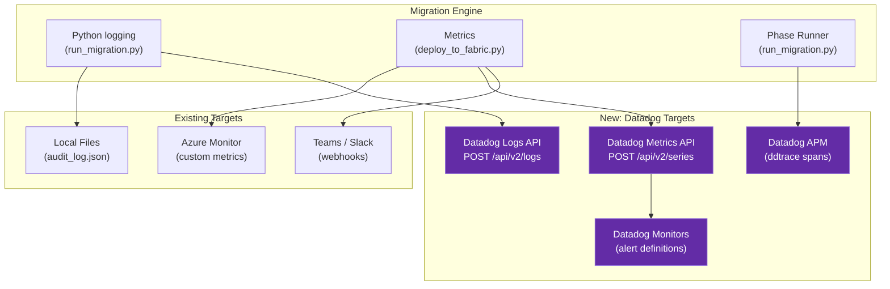

### Configuration (`migration.yaml`)

```yaml
# ── Datadog Observability ──
datadog:
  enabled: false                          # Master toggle
  api_key: ""                             # DD_API_KEY env var takes precedence
  site: "datadoghq.com"                   # Datadog site (datadoghq.com | datadoghq.eu | us3.datadoghq.com | etc.)
  service: "informatica-migration"        # APM service name
  env: "production"                       # Environment tag (dev | staging | production)
  tags:                                   # Custom tags applied to all logs/metrics/traces
    - "team:data-engineering"
    - "project:informatica-migration"
  logs:
    enabled: true                         # Send structured logs to Datadog
    source: "informatica-migration"       # ddsource (enables log pipeline auto-matching)
    send_level: "INFO"                    # Minimum level to send (DEBUG|INFO|WARNING|ERROR)
  metrics:
    enabled: true                         # Send custom metrics to Datadog
    prefix: "informatica.migration"       # Metric name prefix
  tracing:
    enabled: false                        # APM tracing (requires ddtrace)
    sample_rate: 1.0                      # Trace sampling (0.0–1.0)
```

### Dependencies

| Package | Version | Purpose | Required? |
|---------|---------|---------|-----------|
| `datadog-api-client` | `>=2.20.0` | Logs API v2, Metrics API v2 | Yes (for logs/metrics) |
| `ddtrace` | `>=2.0.0` | APM distributed tracing | Optional (for tracing only) |

Added as optional extras in `pyproject.toml`:
```toml
[project.optional-dependencies]
datadog = ["datadog-api-client>=2.20.0", "ddtrace>=2.0.0"]
```

---

## Sprint DD1 — Datadog Logging Handler

**Goal:** Create a custom Python `logging.Handler` that sends structured migration logs to Datadog Logs API in real-time, integrated into the existing `_setup_logging()` pipeline.

| # | Task | Owner | Files | Acceptance Criteria |
|---|------|-------|-------|-------------------|
| DD1.1 | **DatadogHandler class** | Orchestrator | `datadog_integration.py` | Custom `logging.Handler` subclass that batches log records and sends to Datadog Logs API (`POST https://http-intake.logs.datadoghq.com/api/v2/logs`) using `datadog-api-client` |
| DD1.2 | **Structured log formatting** | Orchestrator | `datadog_integration.py` | Format log records as Datadog JSON with: `ddsource`, `ddtags`, `hostname`, `service`, `message`, plus custom attributes (`phase`, `duration`, `mapping_name`) |
| DD1.3 | **Batch & flush strategy** | Orchestrator | `datadog_integration.py` | Buffer logs in memory (max 100 records or 5 seconds), flush on buffer full / timer / handler close; handle 429 with exponential backoff |
| DD1.4 | **_setup_logging() integration** | Orchestrator | `run_migration.py` | Add `DatadogHandler` to logger when `datadog.logs.enabled=true` in config; coexists with existing console/file handlers |
| DD1.5 | **Config & env var loading** | Orchestrator | `datadog_integration.py` | Load `api_key` from `DD_API_KEY` env var (priority) or `migration.yaml`; load `site` for correct intake URL; validate config on startup |
| DD1.6 | **migration.yaml update** | Orchestrator | `migration.yaml` | Add `datadog:` section with all config keys (enabled, api_key, site, service, env, tags, logs, metrics, tracing) |
| DD1.7 | **CLI flag** | Orchestrator | `run_migration.py` | Add `--datadog` flag to enable Datadog integration from CLI (overrides `datadog.enabled` in config) |
| DD1.8 | **Graceful degradation** | Orchestrator | `datadog_integration.py` | If `datadog-api-client` not installed, log warning and skip Datadog handler (no crash); import guarded with try/except |
| DD1.9 | **Logging tests** | Validation | `tests/test_datadog.py` | 20+ tests: handler creation, log formatting, batching, flush, 429 retry, config loading, graceful degradation |

**Key Implementation Details:**

```python
# datadog_integration.py — DatadogHandler sketch
import logging
import threading
from datetime import datetime, timezone

class DatadogHandler(logging.Handler):
    """Sends structured log records to Datadog Logs API v2."""

    MAX_BATCH = 100
    FLUSH_INTERVAL = 5.0  # seconds

    def __init__(self, api_key, site="datadoghq.com", service="informatica-migration",
                 env="production", source="informatica-migration", tags=None):
        super().__init__()
        self._api_key = api_key
        self._site = site
        self._service = service
        self._env = env
        self._source = source
        self._tags = tags or []
        self._buffer = []
        self._lock = threading.Lock()
        self._start_flush_timer()

    def emit(self, record):
        entry = {
            "ddsource": self._source,
            "ddtags": ",".join(self._tags + [f"env:{self._env}"]),
            "hostname": __import__("socket").gethostname(),
            "service": self._service,
            "message": self.format(record),
            "level": record.levelname,
            "timestamp": datetime.now(timezone.utc).isoformat(),
        }
        # Add migration-specific attributes
        for attr in ("phase", "duration", "mapping_name", "target"):
            if hasattr(record, attr):
                entry[attr] = getattr(record, attr)

        with self._lock:
            self._buffer.append(entry)
            if len(self._buffer) >= self.MAX_BATCH:
                self._flush()

    def _flush(self):
        # POST batch to https://http-intake.logs.{site}/api/v2/logs
        ...

    def close(self):
        self._flush()
        super().close()
```

**Sprint DD1 Exit Criteria:**
- [ ] `DatadogHandler` sends structured logs to Datadog Logs API
- [ ] Logs appear in Datadog Log Explorer with correct `ddsource`, `service`, `tags`
- [ ] Batch/flush strategy prevents API throttling
- [ ] Existing logging (console, file) unaffected
- [ ] Graceful fallback when `datadog-api-client` not installed
- [ ] `--datadog` CLI flag works
- [ ] 20+ tests passing

---

## Sprint DD2 — Datadog Metrics Emitter

**Goal:** Emit migration-specific custom metrics to Datadog alongside existing Azure Monitor metrics, enabling real-time dashboards and alerting on migration KPIs.

| # | Task | Owner | Files | Acceptance Criteria |
|---|------|-------|-------|-------------------|
| DD2.1 | **emit_datadog_metrics()** | Orchestrator | `datadog_integration.py` | New function alongside `emit_azure_monitor_metrics()` that submits custom metrics via Datadog Metrics API v2 (`POST https://api.datadoghq.com/api/v2/series`) |
| DD2.2 | **Phase-level metrics** | Orchestrator | `datadog_integration.py` | Emit per-phase: `informatica.migration.phase.duration` (gauge, seconds), `informatica.migration.phase.status` (1=success, 0=fail) with `phase:assessment` tag |
| DD2.3 | **Artifact count metrics** | Orchestrator | `datadog_integration.py` | Emit: `informatica.migration.artifacts.total` (gauge per type: notebooks, pipelines, sql, dbt), `informatica.migration.artifacts.errors` (count) |
| DD2.4 | **Conversion quality metrics** | Orchestrator | `datadog_integration.py` | Emit: `informatica.migration.conversion_score` (gauge, 0-100), `informatica.migration.todo_count` (gauge), `informatica.migration.complexity` (histogram) |
| DD2.5 | **Deployment metrics** | Orchestrator | `deploy_to_fabric.py` | Call `emit_datadog_metrics()` from deployment flow: `informatica.migration.deploy.success`, `informatica.migration.deploy.errors`, `informatica.migration.deploy.duration` |
| DD2.6 | **Metric tags** | Orchestrator | `datadog_integration.py` | All metrics tagged with: `service`, `env`, `target_platform` (fabric/databricks/dbt), `phase`, custom user tags from config |
| DD2.7 | **Dashboard JSON template** | Orchestrator | `templates/datadog_dashboard.json` | Pre-built Datadog dashboard definition (importable via API): migration progress, phase timings, error rate, conversion score trend |
| DD2.8 | **Monitor definitions** | Orchestrator | `templates/datadog_monitors.json` | Pre-built Datadog Monitor definitions: alert on phase failure, high error rate (>10%), low conversion score (<60%), deployment timeout |
| DD2.9 | **Metrics tests** | Validation | `tests/test_datadog.py` | 20+ tests: metric submission, tagging, dashboard template validation, monitor template validation |

**Metrics Catalog:**

| Metric Name | Type | Unit | Tags | Description |
|-------------|------|------|------|-------------|
| `informatica.migration.phase.duration` | gauge | seconds | `phase`, `status` | Duration of each migration phase |
| `informatica.migration.phase.status` | gauge | — | `phase` | 1=success, 0=failure per phase |
| `informatica.migration.artifacts.total` | gauge | count | `artifact_type` | Total artifacts generated (notebooks, pipelines, sql, dbt) |
| `informatica.migration.artifacts.errors` | count | count | `artifact_type` | Error count per artifact type |
| `informatica.migration.conversion_score` | gauge | percent | `target_platform` | Average conversion score (0–100) |
| `informatica.migration.todo_count` | gauge | count | `severity` | Number of TODO items remaining |
| `informatica.migration.complexity.distribution` | histogram | — | `level` | Complexity distribution (simple/medium/complex) |
| `informatica.migration.deploy.success` | count | count | `target_platform` | Successful deployments |
| `informatica.migration.deploy.errors` | count | count | `target_platform`, `error_type` | Deployment errors |
| `informatica.migration.deploy.duration` | gauge | seconds | `target_platform` | Deployment duration |

**Sprint DD2 Exit Criteria:**
- [ ] Custom metrics submitted to Datadog Metrics API v2
- [ ] Metrics visible in Datadog Metrics Explorer with correct tags
- [ ] Dashboard JSON importable and shows migration KPIs
- [ ] Monitor definitions trigger alerts on failure/degradation
- [ ] Existing Azure Monitor metrics unaffected
- [ ] 20+ tests passing

---

## Sprint DD3 — APM Tracing & Alerting

**Goal:** Add distributed tracing with `ddtrace` for end-to-end migration performance profiling, and integrate Datadog alerting with the existing webhook infrastructure.

| # | Task | Owner | Files | Acceptance Criteria |
|---|------|-------|-------|-------------------|
| DD3.1 | **Trace context setup** | Orchestrator | `datadog_integration.py` | Initialize `ddtrace` tracer with service name, env, tags from config; configure sampling rate |
| DD3.2 | **Phase-level spans** | Orchestrator | `run_migration.py` | Wrap each `run_phase()` call in a `ddtrace` span: `informatica.migration.phase` with `phase.name`, `phase.status`, `phase.duration` attributes |
| DD3.3 | **Conversion spans** | SQL/Notebook | `run_sql_migration.py`, `run_notebook_migration.py` | Child spans for SQL conversion (`sql.convert`), notebook generation (`notebook.generate`) with mapping name, complexity |
| DD3.4 | **Deployment spans** | Orchestrator | `deploy_to_fabric.py`, `deploy_to_databricks.py` | Spans for deployment operations: `deploy.artifact` with artifact type, target, status |
| DD3.5 | **Error span tagging** | Orchestrator | `datadog_integration.py` | On exception: set `span.error = 1`, attach stack trace, error type, error message to span metadata |
| DD3.6 | **Datadog webhook sender** | Orchestrator | `datadog_integration.py` | New `send_datadog_event()` function: submit events to Datadog Events API for deployment milestones (migration started, phase completed, migration finished) |
| DD3.7 | **Unified alerting dispatcher** | Orchestrator | `deploy_to_fabric.py` | Extend `send_webhook_alert()` to auto-detect Datadog event endpoint alongside Teams/Slack; route alerts to all configured targets |
| DD3.8 | **Trace ↔ Log correlation** | Orchestrator | `datadog_integration.py` | Inject `dd.trace_id` and `dd.span_id` into log records for Datadog log-trace correlation (enables clicking from log → trace in UI) |
| DD3.9 | **APM tests** | Validation | `tests/test_datadog.py` | 20+ tests: tracer init, span creation, error tagging, event submission, log-trace correlation, graceful degradation without ddtrace |

**Trace Hierarchy:**

```
informatica.migration (root span — full migration run)
├── informatica.migration.phase [phase:assessment]
│   ├── assessment.parse_xml [mapping:M_LOAD_CUSTOMERS]
│   └── assessment.parse_xml [mapping:M_LOAD_ORDERS]
├── informatica.migration.phase [phase:sql_migration]
│   ├── sql.convert [file:SP_CALC_RANKINGS.sql]
│   └── sql.convert [file:SP_DB2_INVENTORY_REFRESH.sql]
├── informatica.migration.phase [phase:notebook_migration]
│   ├── notebook.generate [mapping:M_LOAD_CUSTOMERS, complexity:medium]
│   └── notebook.generate [mapping:M_LOAD_ORDERS, complexity:complex]
├── informatica.migration.phase [phase:pipeline_migration]
│   └── pipeline.generate [workflow:WF_DAILY_LOAD]
└── informatica.migration.phase [phase:deployment]
    ├── deploy.artifact [type:notebook, target:fabric]
    └── deploy.artifact [type:pipeline, target:fabric]
```

**Sprint DD3 Exit Criteria:**
- [ ] Full migration run produces a distributed trace visible in Datadog APM
- [ ] Phase spans show timing breakdown in Datadog Trace Flamegraph
- [ ] Errors annotated with stack trace on spans
- [ ] Log-trace correlation works (clicking log entry → opens trace)
- [ ] Datadog Events posted for migration milestones
- [ ] `send_webhook_alert()` routes to Datadog alongside Teams/Slack
- [ ] Graceful fallback when `ddtrace` not installed
- [ ] 20+ tests passing

---

## Sprint DD4 — Agentic Signal Processor

**Goal:** Build an autonomous agent that polls Datadog Monitors and Events, evaluates migration health signals, and decides which corrective actions to take — forming the "brain" of the agentic alerting loop.

| # | Task | Owner | Files | Acceptance Criteria |
|---|------|-------|-------|-------------------|
| DD4.1 | **Signal Poller** | Orchestrator | `agentic_alerting.py` | Poll Datadog Monitors API (`GET /api/v1/monitor`) at configurable interval; filter by `service:informatica-migration` tag; collect triggered alerts with context |
| DD4.2 | **Event stream listener** | Orchestrator | `agentic_alerting.py` | Listen to Datadog Events API (`GET /api/v1/events`) for migration events (phase complete, phase failed, deployment error); build signal queue |
| DD4.3 | **Signal classifier** | Orchestrator | `agentic_alerting.py` | Classify incoming signals into categories: `phase_failure`, `quality_degradation`, `deployment_error`, `sla_breach`, `anomaly`; attach severity (P1–P4) and affected artifacts |
| DD4.4 | **Decision engine** | Orchestrator | `agentic_alerting.py` | Rule-based decision matrix: given signal type + severity → choose action from action catalog (retry, rollback, escalate, auto-fix, skip); configurable rules in `migration.yaml` |
| DD4.5 | **Action catalog** | Orchestrator | `agentic_alerting.py` | Register available actions: `retry_phase`, `rollback_artifacts`, `trigger_ai_fix`, `escalate_to_human`, `adjust_config`, `skip_and_continue`, `create_incident`; each action is a callable with pre/post hooks |
| DD4.6 | **Circuit breaker** | Orchestrator | `agentic_alerting.py` | Prevent infinite retry loops: max 3 retries per phase, cooldown period between actions, global kill switch; track action history to avoid repeated failures |
| DD4.7 | **Agent lifecycle** | Orchestrator | `agentic_alerting.py` | Start/stop agent as background thread during migration run; standalone daemon mode via `--agent` CLI flag; graceful shutdown on SIGINT |
| DD4.8 | **Decision audit log** | Orchestrator | `agentic_alerting.py` | Every decision logged: signal received → classification → action chosen → action result; written to `output/agent_decisions.json` and emitted as Datadog Event |
| DD4.9 | **Signal processor tests** | Validation | `tests/test_agentic_alerting.py` | 25+ tests: polling, classification, decision matrix, circuit breaker, audit log, lifecycle |

**Decision Matrix (Default Rules):**

| Signal | Severity | Auto-Action | Escalation |
|--------|----------|-------------|------------|
| `phase_failure` (assessment/sql/notebook) | P2 | `retry_phase` (max 3x) | Escalate after 3 retries |
| `phase_failure` (deployment) | P1 | `rollback_artifacts` + `escalate_to_human` | Immediate |
| `quality_degradation` (score < 60%) | P2 | `trigger_ai_fix` (Sprint 86 integration) | Escalate if AI fix fails |
| `deployment_error` (single artifact) | P3 | `retry_phase` with artifact filter | Escalate after 2 retries |
| `sla_breach` (phase > 2x median) | P3 | `adjust_config` (increase timeout/parallelism) | Log only |
| `anomaly` (metric spike/drop) | P4 | `skip_and_continue` + log warning | Dashboard flag |

```python
# agentic_alerting.py — Decision engine sketch
class DecisionEngine:
    """Rule-based decision engine for migration signals."""

    def __init__(self, rules=None, max_retries=3, cooldown_seconds=60):
        self._rules = rules or DEFAULT_RULES
        self._max_retries = max_retries
        self._cooldown = cooldown_seconds
        self._action_history = []  # (timestamp, signal, action, result)
        self._retry_counts = {}    # phase_id → count

    def evaluate(self, signal):
        """Classify signal and return (action_name, action_params)."""
        classification = self._classify(signal)
        if self._circuit_breaker_tripped(classification):
            return ("escalate_to_human", {"reason": "circuit_breaker"})
        rule = self._match_rule(classification)
        return (rule["action"], rule.get("params", {}))

    def _circuit_breaker_tripped(self, classification):
        phase = classification.get("phase")
        return self._retry_counts.get(phase, 0) >= self._max_retries
```

**Sprint DD4 Exit Criteria:**
- [ ] Agent polls Datadog Monitors/Events and classifies signals
- [ ] Decision engine selects correct action per signal type + severity
- [ ] Circuit breaker prevents infinite retry loops
- [ ] All decisions audit-logged to JSON + Datadog Events
- [ ] Background thread lifecycle (start/stop/graceful shutdown) works
- [ ] 25+ tests passing

---

## Sprint DD5 — Auto-Remediation Actions

**Goal:** Implement the corrective actions the agent can execute autonomously — from retrying failed phases to rolling back artifacts to invoking AI-assisted fixes.

| # | Task | Owner | Files | Acceptance Criteria |
|---|------|-------|-------|-------------------|
| DD5.1 | **retry_phase action** | Orchestrator | `agentic_alerting.py` | Re-invoke `run_phase()` for a specific phase with optional config overrides; respect checkpoint system; emit retry metrics to Datadog |
| DD5.2 | **rollback_artifacts action** | Orchestrator | `agentic_alerting.py` | Remove/archive generated artifacts for a failed phase from `output/` (move to `output/.rollback/<timestamp>/`); restore previous checkpoint state |
| DD5.3 | **trigger_ai_fix action** | Orchestrator | `agentic_alerting.py` | Invoke AI-assisted SQL conversion (Sprint 86 `ai_converter.py`) for specific TODO-flagged mappings; feed Datadog error context as additional prompt context |
| DD5.4 | **adjust_config action** | Orchestrator | `agentic_alerting.py` | Dynamically adjust runtime config: increase `notebook_timeout`, bump `retry_count`, switch `default_load_mode` based on signal context; changes persisted to in-memory config (not YAML file) |
| DD5.5 | **escalate_to_human action** | Orchestrator | `agentic_alerting.py` | Send rich escalation via all configured channels: Datadog Event (P1, @notify), Teams/Slack webhook, email (if SMTP configured); include: signal context, action history, affected artifacts, suggested manual steps |
| DD5.6 | **create_incident action** | Orchestrator | `agentic_alerting.py` | Create Datadog Incident via Incidents API (`POST /api/v2/incidents`) with: title, severity, timeline entries, affected services, commander assignment |
| DD5.7 | **skip_and_continue action** | Orchestrator | `agentic_alerting.py` | Mark affected artifact as skipped in manifest; log warning; continue migration with remaining artifacts; add to remediation report |
| DD5.8 | **Action result feedback** | Orchestrator | `agentic_alerting.py` | After each action: verify outcome (did retry succeed? did score improve?); emit result metric to Datadog; update circuit breaker state |
| DD5.9 | **Remediation report** | Orchestrator | `agentic_alerting.py` | Generate `output/remediation_report.md`: all signals received, actions taken, outcomes, remaining manual items, time saved by auto-remediation |
| DD5.10 | **Auto-remediation tests** | Validation | `tests/test_agentic_alerting.py` | 25+ tests: each action type, rollback integrity, AI fix integration, escalation payloads, incident creation, skip logic |

**Action Flow:**

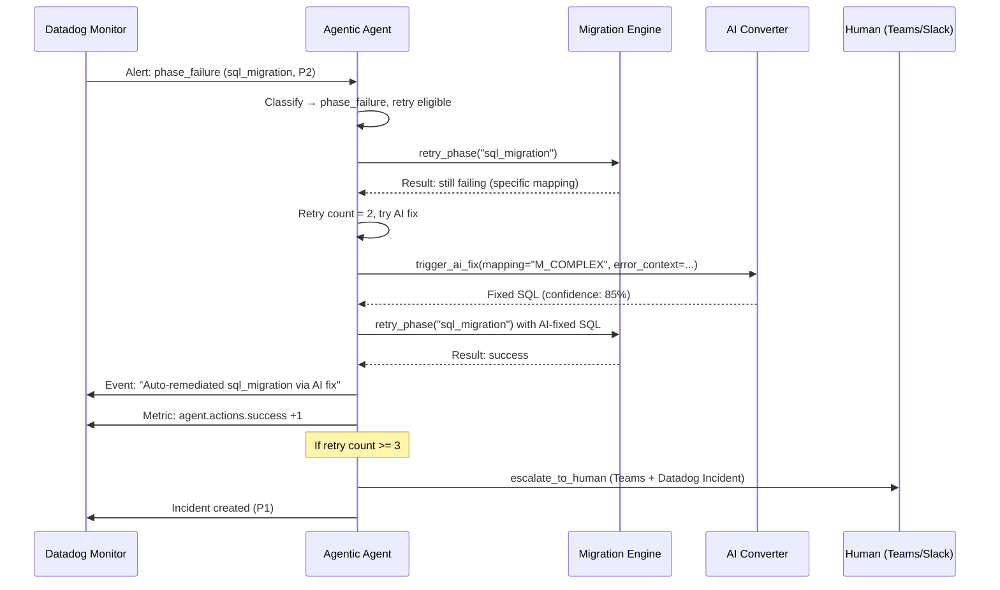

**Sprint DD5 Exit Criteria:**
- [ ] All 6 action types execute correctly and report outcomes
- [ ] Rollback preserves artifact integrity (archival, not deletion)
- [ ] AI fix integration passes error context from Datadog to AI converter
- [ ] Escalation reaches all configured notification channels
- [ ] Datadog Incidents created with correct severity and timeline
- [ ] Remediation report generated with action summary
- [ ] 25+ tests passing

---

## Sprint DD6 — Continuous Agent & Learning Loop

**Goal:** Evolve the agent from reactive (respond to alerts) to proactive (predict issues before they happen) with a learning feedback loop that improves decision quality over time.

| # | Task | Owner | Files | Acceptance Criteria |
|---|------|-------|-------|-------------------|
| DD6.1 | **Continuous monitoring mode** | Orchestrator | `agentic_alerting.py` | Daemon mode (`--agent-daemon`): watches Datadog and migration output directory continuously; restarts failed migrations on schedule; reports health heartbeat |
| DD6.2 | **Predictive signal analysis** | Orchestrator | `agentic_alerting.py` | Analyze metric trends (via Datadog Metrics Query API): predict phase failure before it happens based on historical patterns (e.g., complexity > X → 70% failure rate) |
| DD6.3 | **Pre-flight checks** | Orchestrator | `agentic_alerting.py` | Before each phase: query Datadog for resource health (API latency, error rates from previous runs); block phase start if preconditions not met; emit `preflight.blocked` metric |
| DD6.4 | **Learning feedback store** | Orchestrator | `agentic_alerting.py` | Persist decision outcomes to local SQLite DB (`output/.agent_memory.db`): signal → action → result; query historical success rates per action type per signal type |
| DD6.5 | **Adaptive decision weights** | Orchestrator | `agentic_alerting.py` | Adjust action selection based on historical success: if `retry_phase` succeeds 90% for `phase_failure/sql_migration`, keep it; if it drops to 20%, switch to `trigger_ai_fix` first |
| DD6.6 | **Anomaly detection enrichment** | Orchestrator | `agentic_alerting.py` | Query Datadog Anomaly Monitor results; correlate with migration events; auto-create investigation signals with root cause hypothesis (e.g., "conversion_score dropped 15% — new mapping M_COMPLEX_V2 has unsupported DECODE patterns") |
| DD6.7 | **Agent health dashboard** | Orchestrator | `templates/datadog_agent_dashboard.json` | Dedicated Datadog dashboard for the agent itself: signals processed, actions taken, success rate, circuit breaker trips, mean-time-to-remediation |
| DD6.8 | **Runbook integration** | Orchestrator | `agentic_alerting.py` | Link each escalation to the relevant section in `docs/RUNBOOK.md`; include deep link in Teams/Slack notification and Datadog Incident timeline |
| DD6.9 | **Agent system tests** | Validation | `tests/test_agentic_alerting.py` | 20+ tests: daemon mode, predictive analysis, pre-flight checks, learning store, adaptive weights, anomaly correlation |

**Agent Architecture:**

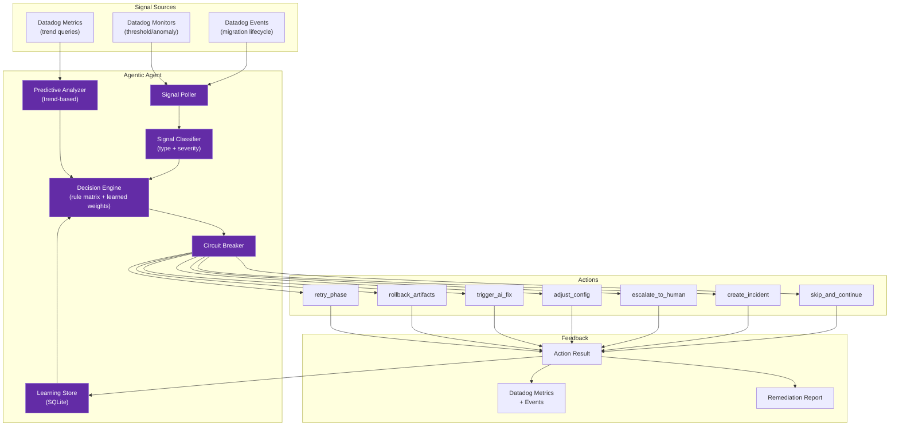

**Sprint DD6 Exit Criteria:**
- [ ] Daemon mode runs continuously with heartbeat
- [ ] Predictive analysis flags at-risk phases before execution
- [ ] Pre-flight checks block phases when preconditions fail
- [ ] Learning store records outcomes and adjusts action weights
- [ ] Agent health dashboard shows operational metrics
- [ ] Runbook deep links in escalation messages
- [ ] 20+ tests passing

---

## Sprint DD7 — Global Monitoring Platform: Unified Control Plane

**Goal:** Build a single-pane-of-glass monitoring platform that aggregates all observability signals (Datadog logs/metrics/traces, agent decisions, migration state, deployment health) into a centralized control plane — the "mission control" for the entire migration program.

| # | Task | Owner | Files | Acceptance Criteria |
|---|------|-------|-------|-------------------|
| DD7.1 | **Platform state aggregator** | Orchestrator | `monitoring_platform.py` | Aggregates state from all sources into unified `PlatformState` object: active migrations (count, phase, progress %), agent status (idle/active/blocked), Datadog health (monitors OK/alert/warn), deployment status per target (Fabric/Databricks/DBT) |
| DD7.2 | **Migration fleet tracker** | Orchestrator | `monitoring_platform.py` | Track multiple concurrent migration runs (multi-tenant/multi-project): each run has ID, start time, current phase, artifacts generated, errors, conversion score; fleet-level aggregates (total runs, success rate, mean duration) |
| DD7.3 | **Health score calculator** | Orchestrator | `monitoring_platform.py` | Compute composite health score (0-100) per migration run and fleet-wide: weighted formula = 30% phase success + 25% conversion score + 20% deployment success + 15% agent remediation rate + 10% SLA compliance |
| DD7.4 | **SLO definitions & tracking** | Orchestrator | `monitoring_platform.py` | Define SLOs: "95% of phases complete within 5 min", "99% of deployments succeed", "Conversion score ≥ 70 for all mappings"; track burn rate, error budget remaining; emit SLO metrics to Datadog |
| DD7.5 | **Datadog SLO API integration** | Orchestrator | `monitoring_platform.py` | Create Datadog SLOs via API (`POST /api/v1/slo`) for each defined SLO; query SLO status; display in platform dashboard |
| DD7.6 | **Status page generator** | Orchestrator | `monitoring_platform.py` | Generate `output/platform_status.html`: real-time status page showing all migrations, health scores, active alerts, agent actions, SLO compliance — auto-refreshes via WebSocket or polling |
| DD7.7 | **Datadog composite monitors** | Orchestrator | `templates/datadog_platform_monitors.json` | Composite monitors that combine multiple signals: "Phase failed AND agent retry failed AND conversion score < 50" → P1 incident; "3+ migrations degraded simultaneously" → platform-wide alert |
| DD7.8 | **Platform metrics to Datadog** | Orchestrator | `monitoring_platform.py` | Emit platform-level metrics: `informatica.platform.fleet.active_runs`, `informatica.platform.health_score`, `informatica.platform.slo.budget_remaining`, `informatica.platform.agent.actions_per_hour` |
| DD7.9 | **Platform tests** | Validation | `tests/test_monitoring_platform.py` | 25+ tests: state aggregation, fleet tracking, health score, SLO tracking, status page generation, composite monitors |

**Platform State Model:**

```python
# monitoring_platform.py — PlatformState sketch
@dataclass
class MigrationRunState:
    run_id: str
    project: str
    target: str                    # fabric | databricks | dbt
    started_at: datetime
    current_phase: str
    phases_completed: int
    phases_total: int
    artifacts_generated: int
    errors: int
    conversion_score: float
    agent_actions_taken: int
    health_score: float            # 0–100 composite

@dataclass
class PlatformState:
    fleet: list[MigrationRunState]
    agent_status: str              # idle | active | blocked | error
    datadog_monitors: dict         # monitor_id → status (OK|Alert|Warn)
    slo_compliance: dict           # slo_name → {target, current, budget_remaining}
    overall_health: float          # fleet-wide composite score
    last_updated: datetime
```

**Sprint DD7 Exit Criteria:**
- [ ] Platform state aggregates all migration runs into unified view
- [ ] Fleet tracker handles multiple concurrent migrations
- [ ] Health score computed correctly per composite formula
- [ ] SLOs created in Datadog and tracked with burn rate
- [ ] Status page HTML generated and auto-refreshes
- [ ] Composite monitors defined for multi-signal scenarios
- [ ] 25+ tests passing

---

## Sprint DD8 — Global Alerting Orchestrator & Escalation Chains

**Goal:** Build a multi-tier alerting orchestrator that sits above Datadog monitors, coordinates escalation across channels (Datadog → Teams → PagerDuty → email → phone), enforces on-call schedules, and deduplicates/correlates alerts across migration runs.

| # | Task | Owner | Files | Acceptance Criteria |
|---|------|-------|-------|-------------------|
| DD8.1 | **Alert correlation engine** | Orchestrator | `monitoring_platform.py` | Correlate related alerts across migration runs: group by root cause (e.g., "Oracle source unavailable" triggers failures in 5 runs → 1 correlated incident, not 5) |
| DD8.2 | **Deduplication & suppression** | Orchestrator | `monitoring_platform.py` | Deduplicate repeated alerts (same signal within suppression window); suppress child alerts when parent alert active (e.g., suppress per-mapping alerts when entire phase failed) |
| DD8.3 | **Escalation chain engine** | Orchestrator | `monitoring_platform.py` | Multi-tier escalation: P4→log only, P3→Datadog Event + dashboard, P2→Teams/Slack + Datadog Incident, P1→PagerDuty/email + Datadog Incident + phone bridge; configurable timeouts between tiers |
| DD8.4 | **On-call schedule integration** | Orchestrator | `monitoring_platform.py` | Define on-call rotation in `migration.yaml` (or pull from PagerDuty/Datadog On-Call API); route escalations to current on-call; include on-call name in notifications |
| DD8.5 | **Notification templates** | Orchestrator | `monitoring_platform.py` | Rich notification templates per channel: Teams Adaptive Card with action buttons ("Retry", "View Logs", "Acknowledge"), Slack Block Kit with context, email HTML with embedded charts |
| DD8.6 | **Acknowledgment & snooze** | Orchestrator | `monitoring_platform.py` | Track alert acknowledgment (via Datadog API or webhook callback); snooze alerts for configurable duration; resume escalation if not resolved after snooze |
| DD8.7 | **Alert analytics** | Orchestrator | `monitoring_platform.py` | Compute alerting KPIs: MTTA (mean time to acknowledge), MTTR (mean time to resolve), alert noise ratio, top alerting sources; emit as Datadog metrics |
| DD8.8 | **PagerDuty integration** | Orchestrator | `monitoring_platform.py` | Optional PagerDuty Events API v2 integration: trigger/acknowledge/resolve incidents; map severity to PagerDuty urgency |
| DD8.9 | **Alerting orchestrator tests** | Validation | `tests/test_monitoring_platform.py` | 25+ tests: correlation, dedup, escalation chains, on-call routing, acknowledgment, analytics, PagerDuty integration |

**Escalation Chain Flow:**

```mermaid
sequenceDiagram
    participant DD as Datadog Monitor
    participant COR as Alert Correlator
    participant ESC as Escalation Engine
    participant T1 as Tier 1: Dashboard
    participant T2 as Tier 2: Teams/Slack
    participant T3 as Tier 3: Datadog Incident
    participant T4 as Tier 4: PagerDuty

    DD->>COR: Alert fired (phase_failure, Run-A)
    DD->>COR: Alert fired (phase_failure, Run-B)
    DD->>COR: Alert fired (phase_failure, Run-C)

    COR->>COR: Correlate: same root cause (Oracle source down)
    COR->>ESC: Correlated alert (P2, 3 runs affected)

    ESC->>T1: Log + Dashboard update (immediate)
    Note over ESC: Wait 2 min for ack
    ESC->>T2: Teams Adaptive Card + Slack Block Kit
    Note over ESC: Wait 5 min for ack
    ESC->>T3: Datadog Incident (P2, commander=on-call)
    Note over ESC: Wait 15 min for ack
    ESC->>T4: PagerDuty (high urgency, phone alert)
```

**Escalation Configuration (`migration.yaml`):**

```yaml
alerting_platform:
  escalation:
    tiers:
      - level: 1
        channels: ["datadog_event", "dashboard"]
        delay_seconds: 0
      - level: 2
        channels: ["teams", "slack"]
        delay_seconds: 120
      - level: 3
        channels: ["datadog_incident"]
        delay_seconds: 300
      - level: 4
        channels: ["pagerduty", "email"]
        delay_seconds: 900
    suppression_window_seconds: 300
    correlation_window_seconds: 120
  on_call:
    source: "config"               # config | pagerduty | datadog
    schedule:
      - name: "Alice"
        email: "alice@company.com"
        hours: "08:00-20:00"
        timezone: "America/New_York"
      - name: "Bob"
        email: "bob@company.com"
        hours: "20:00-08:00"
        timezone: "America/New_York"
  pagerduty:
    enabled: false
    routing_key: ""                # PagerDuty Events API v2 routing key
```

**Sprint DD8 Exit Criteria:**
- [ ] Related alerts correlated across runs into single incidents
- [ ] Deduplication prevents alert storms during cascading failures
- [ ] 4-tier escalation chain fires in correct order with timeouts
- [ ] On-call routing sends notifications to current on-call person
- [ ] Rich notification templates work for Teams/Slack/email
- [ ] Alert analytics KPIs computed and emitted to Datadog
- [ ] 25+ tests passing

---

## Sprint DD9 — Enterprise Monitoring Dashboard & Reporting

**Goal:** Build the top-level enterprise monitoring dashboard — a comprehensive reporting layer that aggregates everything (migrations, Datadog signals, agent actions, alert history, SLOs) into executive-ready views and automated reports.

| # | Task | Owner | Files | Acceptance Criteria |
|---|------|-------|-------|-------------------|
| DD9.1 | **Executive summary dashboard** | Orchestrator | `templates/datadog_executive_dashboard.json` | Datadog dashboard designed for leadership: migration progress (% complete), overall health score, cost tracking, SLO compliance, risk heatmap — minimal detail, high-level KPIs |
| DD9.2 | **Operations dashboard** | Orchestrator | `templates/datadog_ops_dashboard.json` | Datadog dashboard for ops team: per-run status, phase timings, error drilldown, agent action timeline, active alerts, deployment pipeline status |
| DD9.3 | **Automated daily report** | Orchestrator | `monitoring_platform.py` | Generate daily migration report (HTML + email): runs completed, artifacts generated, errors resolved, SLO status, agent actions, top issues — sent via configured email/webhook |
| DD9.4 | **Weekly trend report** | Orchestrator | `monitoring_platform.py` | Weekly trend analysis: conversion score trend, error rate trend, phase duration trend (improving/degrading), agent effectiveness (actions taken vs resolved), projected completion date |
| DD9.5 | **Capacity planning view** | Orchestrator | `monitoring_platform.py` | Based on historical data: estimate remaining work (mappings/time), resource utilization trend, predicted bottlenecks (phases that consistently slow down), recommended parallelism |
| DD9.6 | **Datadog Notebook generation** | Orchestrator | `monitoring_platform.py` | Generate Datadog Notebooks (via API) with pre-built investigation templates: "Migration Run Investigation", "Phase Failure RCA", "Conversion Score Deep-Dive" — with embedded metric queries and log searches |
| DD9.7 | **Compliance evidence export** | Orchestrator | `monitoring_platform.py` | Export monitoring evidence for compliance: full audit trail (JSON), alert history (CSV), SLO compliance proof, agent decision log — packaged as ZIP for audit review |
| DD9.8 | **Platform CLI** | Orchestrator | `run_migration.py` | CLI commands: `--platform-status` (print fleet status), `--platform-report` (generate daily report), `--platform-health` (print health score); integrate with existing CLI |
| DD9.9 | **Enterprise dashboard tests** | Validation | `tests/test_monitoring_platform.py` | 20+ tests: dashboard JSON validation, report generation, trend calculation, capacity planning, notebook generation, compliance export |

**Full Platform Architecture:**

```mermaid
flowchart TB
    subgraph "Migration Runs"
        R1["Run 1\nFabric target"]
        R2["Run 2\nDatabricks target"]
        R3["Run 3\nDBT target"]
    end

    subgraph "Datadog Observability (DD1-DD3)"
        LOGS["📋 Logs API\n(structured logs)"]
        METRICS["📊 Metrics API\n(custom metrics)"]
        TRACES["🔍 APM Traces\n(phase spans)"]
    end

    subgraph "Agentic System (DD4-DD6)"
        SIGNAL["🧠 Signal Processor"]
        ACTIONS["🔧 Auto-Remediation"]
        LEARN["🎯 Learning Agent"]
    end

    subgraph "Global Monitoring Platform (DD7-DD9)"
        STATE["📡 Platform State\nAggregator"]
        HEALTH["💚 Health Score\nCalculator"]
        SLO["📏 SLO Tracker"]
        CORR["🔗 Alert Correlator"]
        ESC["📢 Escalation\nChain Engine"]
        ONCALL["👤 On-Call\nRouter"]
        EXEC["📊 Executive\nDashboard"]
        OPS["⚙️ Operations\nDashboard"]
        REPORT["📄 Automated\nReports"]
        PLAN["📐 Capacity\nPlanning"]
    end

    subgraph "Notification Channels"
        DDI["Datadog Incidents"]
        TEAMS["Microsoft Teams"]
        SLACK["Slack"]
        PD["PagerDuty"]
        EMAIL["Email"]
        STATUS["Status Page\n(HTML)"]
    end

    R1 & R2 & R3 --> LOGS & METRICS & TRACES
    LOGS & METRICS & TRACES --> SIGNAL
    SIGNAL --> ACTIONS
    ACTIONS --> LEARN
    LEARN --> SIGNAL

    LOGS & METRICS --> STATE
    SIGNAL --> STATE
    ACTIONS --> STATE
    STATE --> HEALTH & SLO
    HEALTH --> EXEC & OPS
    SLO --> EXEC & REPORT
    STATE --> CORR
    CORR --> ESC
    ESC --> ONCALL
    ONCALL --> DDI & TEAMS & SLACK & PD & EMAIL
    STATE --> STATUS
    STATE --> REPORT & PLAN

    style STATE fill:#0078D4,color:#fff
    style HEALTH fill:#0078D4,color:#fff
    style SLO fill:#0078D4,color:#fff
    style CORR fill:#0078D4,color:#fff
    style ESC fill:#0078D4,color:#fff
    style ONCALL fill:#0078D4,color:#fff
    style EXEC fill:#0078D4,color:#fff
    style OPS fill:#0078D4,color:#fff
    style REPORT fill:#0078D4,color:#fff
    style PLAN fill:#0078D4,color:#fff
```

**Sprint DD9 Exit Criteria:**
- [ ] Executive dashboard shows high-level KPIs for leadership
- [ ] Operations dashboard enables drill-down for ops teams
- [ ] Daily report auto-generated and sent via email/webhook
- [ ] Weekly trend report shows improvement/degradation curves
- [ ] Capacity planning estimates remaining work and bottlenecks
- [ ] Datadog Notebooks created with investigation templates
- [ ] Compliance evidence exported as audit-ready ZIP
- [ ] `--platform-status/report/health` CLI commands work
- [ ] 20+ tests passing

---

## Datadog Track Summary

| Sprint | Theme | Tests | Key Deliverable |
|--------|-------|-------|----------------|
| **DD1** | Logging Handler | 20+ | `DatadogHandler` → Datadog Logs API |
| **DD2** | Metrics Emitter | 20+ | Custom metrics → Datadog Metrics API + Dashboard/Monitor JSON |
| **DD3** | APM Tracing & Alerting | 20+ | `ddtrace` spans + Events API + log-trace correlation |
| **DD4** | Signal Processor | 25+ | Signal poller, classifier, decision engine, circuit breaker |
| **DD5** | Auto-Remediation | 25+ | 6 action types + AI fix integration + incident creation |
| **DD6** | Learning Agent | 20+ | Predictive analysis, adaptive weights, daemon mode, learning store |
| **DD7** | Global Control Plane | 25+ | Platform state aggregator, fleet tracker, health score, SLO tracking |
| **DD8** | Alerting Orchestrator | 25+ | Alert correlation, escalation chains, on-call routing, PagerDuty |
| **DD9** | Enterprise Dashboards | 20+ | Executive/ops dashboards, auto-reports, capacity planning, compliance export |
| **Total** | — | **200+** | Full platform: Observability → Agentic → Global Monitoring |

### Files Created/Modified

| File | Action | Description |
|------|--------|-------------|
| `datadog_integration.py` | **New** | `DatadogHandler`, `emit_datadog_metrics()`, `send_datadog_event()`, tracer setup |
| `agentic_alerting.py` | **New** | Signal poller, classifier, decision engine, action catalog, learning store, daemon mode |
| `monitoring_platform.py` | **New** | Platform state aggregator, fleet tracker, health score, SLO tracker, alert correlator, escalation engine, report generator |
| `run_migration.py` | Modified | `_setup_logging()` adds DatadogHandler; `run_phase()` wrapped in trace spans; `--datadog` / `--agent` / `--platform-*` CLI flags |
| `deploy_to_fabric.py` | Modified | Calls `emit_datadog_metrics()` alongside Azure Monitor; `send_webhook_alert()` routes to Datadog Events |
| `deploy_to_databricks.py` | Modified | Deployment spans for Databricks target |
| `run_sql_migration.py` | Modified | Child spans for SQL conversion operations |
| `run_notebook_migration.py` | Modified | Child spans for notebook generation |
| `migration.yaml` | Modified | `datadog:` + `agent:` + `alerting_platform:` config sections |
| `pyproject.toml` | Modified | Optional `[datadog]` extras dependency group |
| `requirements.txt` | Modified | Add `datadog-api-client` and `ddtrace` as optional |
| `templates/datadog_dashboard.json` | **New** | Pre-built Datadog migration dashboard (importable) |
| `templates/datadog_agent_dashboard.json` | **New** | Pre-built Datadog agent health dashboard |
| `templates/datadog_platform_monitors.json` | **New** | Composite monitors for multi-signal alerting |
| `templates/datadog_executive_dashboard.json` | **New** | Executive KPI dashboard for leadership |
| `templates/datadog_ops_dashboard.json` | **New** | Operations drill-down dashboard |
| `templates/datadog_monitors.json` | **New** | Pre-built Datadog Monitor definitions |
| `tests/test_datadog.py` | **New** | 60+ tests for Datadog integration (DD1-DD3) |
| `tests/test_agentic_alerting.py` | **New** | 70+ tests for agentic system (DD4-DD6) |
| `tests/test_monitoring_platform.py` | **New** | 70+ tests for global monitoring platform (DD7-DD9) |
| `docs/USER_GUIDE.md` | Modified | Datadog + agent + platform setup instructions |

### Execution Order

```mermaid
flowchart LR
    DD1["📋 DD1\nLogging"]
    DD2["📊 DD2\nMetrics"]
    DD3["🔍 DD3\nAPM"]
    DD4["🧠 DD4\nSignals"]
    DD5["🔧 DD5\nRemediation"]
    DD6["🎯 DD6\nLearning"]
    DD7["📡 DD7\nControl Plane"]
    DD8["📢 DD8\nEscalation"]
    DD9["📊 DD9\nEnterprise"]

    DD1 --> DD2 --> DD3 --> DD4 --> DD5 --> DD6 --> DD7 --> DD8 --> DD9

    style DD1 fill:#632CA6,color:#fff
    style DD2 fill:#632CA6,color:#fff
    style DD3 fill:#632CA6,color:#fff
    style DD4 fill:#E74C3C,color:#fff
    style DD5 fill:#E74C3C,color:#fff
    style DD6 fill:#E74C3C,color:#fff
    style DD7 fill:#0078D4,color:#fff
    style DD8 fill:#0078D4,color:#fff
    style DD9 fill:#0078D4,color:#fff
```

### Rollout Checklist

**Phase A — Observability (DD1-DD3):**
- [ ] Install: `pip install informatica-to-fabric[datadog]`
- [ ] Set `DD_API_KEY` env var or add `api_key` to `migration.yaml`
- [ ] Set `datadog.enabled: true` in config (or use `--datadog` CLI flag)
- [ ] Run migration → verify logs in Datadog Log Explorer
- [ ] Import `templates/datadog_dashboard.json` in Datadog → view dashboard
- [ ] Import `templates/datadog_monitors.json` → receive alerts
- [ ] (Optional) Enable `datadog.tracing.enabled: true` → view APM traces

**Phase B — Agentic System (DD4-DD6):**
- [ ] Enable `agent.enabled: true` + `--agent` CLI flag for autonomous remediation
- [ ] Import `templates/datadog_agent_dashboard.json` → monitor agent health
- [ ] Configure `agent.max_retries_per_phase` and `agent.cooldown_seconds`
- [ ] (Optional) Enable `agent.ai_fix_enabled: true` for AI-assisted remediation
- [ ] (Optional) Enable `agent.learning.enabled: true` for adaptive decision weights

**Phase C — Global Monitoring Platform (DD7-DD9):**
- [ ] Configure `alerting_platform.escalation.tiers` with notification channels
- [ ] Set up on-call schedule (config or PagerDuty integration)
- [ ] Import `templates/datadog_executive_dashboard.json` → leadership view
- [ ] Import `templates/datadog_ops_dashboard.json` → operations view
- [ ] Import `templates/datadog_platform_monitors.json` → composite alerts
- [ ] Run `--platform-status` to verify fleet tracking
- [ ] Configure `--platform-report` for automated daily reports
- [ ] (Optional) Enable PagerDuty integration for Tier 4 escalation

---

# IDMC Full-Platform Migration Review Track (DD10–DD12)

<p align="center">
  
  
  
</p>

> **Cross-cutting IDMC integration track** — depends on DD1–DD9 (Datadog + Agentic + Monitoring Platform).
> Extends the migration tool from IICS CDI-only to the **full Informatica IDMC platform** (all 12 components),
> adds a **migration review workflow** (merge, optimise, rework), and wires everything into the Datadog monitoring stack.

### Current State vs Target State

```mermaid
flowchart LR
    subgraph "Currently Supported (IICS CDI Core)"
        CM["Cloud Mapping"]
        TF["Taskflow"]
        ST["Sync Task"]
        MI["Mass Ingestion"]
        DQ["DQ Task"]
        AI["App Integration"]
        CN["Connections"]
    end

    subgraph "NEW: Full IDMC Platform (DD10)"
        CDGC["CDGC\n(Catalog & Governance)"]
        CDQ2["CDQ\n(Scorecards & Rules)"]
        MDM["MDM\n(Match/Merge)"]
        B2B["B2B Gateway\n(EDI/Partners)"]
        DP["Data Privacy\n(CLAIRE)"]
        DMP["Data Marketplace\n(Assets)"]
        API["API Center\n(APIs)"]
        DIH["Data Integration Hub\n(Pub/Sub)"]
        OI["Operational Insights\n(Job Monitoring)"]
    end

    subgraph "NEW: Migration Review (DD11)"
        MERGE["Merge Analysis\n(deduplicate across\nPowerCenter + IDMC)"]
        OPT["Optimization\n(consolidate, simplify,\nmodernize patterns)"]
        REWORK["Rework Detection\n(anti-patterns,\nrefactoring candidates)"]
    end

    subgraph "NEW: Monitoring Integration (DD12)"
        DDI["Datadog: IDMC\ncomponent metrics"]
        REV["Review dashboard\n(merge/opt/rework)"]
        AGT["Agent rules for\nIDMC signals"]
    end

    CM & TF & ST & MI & DQ & AI & CN -.-> MERGE
    CDGC & CDQ2 & MDM & B2B & DP & DMP & API & DIH & OI -.-> MERGE
    MERGE --> OPT --> REWORK
    REWORK --> DDI & REV & AGT

    style CDGC fill:#FF4500,color:#fff
    style CDQ2 fill:#FF4500,color:#fff
    style MDM fill:#FF4500,color:#fff
    style B2B fill:#FF4500,color:#fff
    style DP fill:#FF4500,color:#fff
    style DMP fill:#FF4500,color:#fff
    style API fill:#FF4500,color:#fff
    style DIH fill:#FF4500,color:#fff
    style OI fill:#FF4500,color:#fff
    style MERGE fill:#E67E22,color:#fff
    style OPT fill:#E67E22,color:#fff
    style REWORK fill:#E67E22,color:#fff
    style DDI fill:#632CA6,color:#fff
    style REV fill:#632CA6,color:#fff
    style AGT fill:#632CA6,color:#fff
```

### IDMC Component Map — Full Platform Inventory

| # | IDMC Component | Service | Current Status | Target (DD10) | Migration Target |
|---|----------------|---------|----------------|---------------|-----------------|
| 1 | **Cloud Data Integration (CDI)** | Mappings, Taskflows, Sync, Mass Ingestion | ✅ Supported | Enhance | Fabric Notebooks + Pipelines |
| 2 | **Cloud Data Governance & Catalog (CDGC)** | Business glossary, data catalog, lineage, classification | ❌ Not supported | **New** | Microsoft Purview / Unity Catalog |
| 3 | **Cloud Data Quality (CDQ)** | Scorecards, rules, profiling, dedup, address verification | ⚠️ Partial (DQ Tasks only) | **Expand** | Fabric DQ rules / Great Expectations |
| 4 | **Master Data Management (MDM)** | Entity models, match/merge rules, hierarchy, golden records | ❌ Not supported | **New** | Purview MDM / custom PySpark |
| 5 | **B2B Gateway** | EDI schemas, partner profiles, transaction sets | ❌ Not supported | **New** | Azure Logic Apps / custom pipeline |
| 6 | **Data Privacy Management** | CLAIRE AI policies, masking rules, subject rights | ❌ Not supported | **New** | Purview sensitivity labels / RLS |
| 7 | **Data Marketplace** | Published assets, subscriptions, access requests | ❌ Not supported | **New** | Purview Data Catalog / OneLake |
| 8 | **API Center** | API definitions, policies, security, rate limiting | ❌ Not supported | **New** | Azure API Management |
| 9 | **Application Integration** | REST/SOAP triggers, service connectors | ✅ Supported | Enhance | Fabric Pipelines / Logic Apps |
| 10 | **Data Integration Hub** | Pub/sub topics, publication/subscription | ❌ Not supported | **New** | Azure Event Grid / Service Bus |
| 11 | **Operational Insights** | Job monitoring, SLA, metrics, dashboards | ❌ Not supported | **New** | Datadog dashboards (DD7–DD9) |
| 12 | **Advanced Connectors** | Specialized connectors (SAP, Snowflake, etc.) | ⚠️ Via CDI | Map to Fabric | Fabric/Databricks connectors |

---

## Sprint DD10 — IDMC Full Component Assessment & Parsing

**Goal:** Extend the assessment agent to parse, inventory, and classify **all 12 IDMC platform components** — not just CDI core — so the migration tool has visibility into the full Informatica estate before any conversion begins.

| # | Task | Owner | Files | Acceptance Criteria |
|---|------|-------|-------|-------------------|
| DD10.1 | **IDMC REST API client** | Assessment | `idmc_client.py` | Authenticate to IDMC REST API v3 (OAuth2 with `@informatica.com` IDP); list all objects per component (mappings, taskflows, connections, DQ rules, CDGC glossaries, MDM entities); fallback to XML export if API unavailable |
| DD10.2 | **CDGC metadata parser** | Assessment | `run_assessment.py` | Parse CDGC export: business glossary terms, data domains, classifications, custom attributes → inventory entries; map CDGC lineage graph to `dependency_dag.json` edges |
| DD10.3 | **CDQ scorecard & rules parser** | Assessment | `run_assessment.py` | Parse CDQ scorecards: rule definitions, thresholds, profiles, dedup match keys, address verification rules → generate equivalent Great Expectations / Fabric DQ rules |
| DD10.4 | **MDM entity & match/merge parser** | Assessment | `run_assessment.py` | Parse MDM models: entity definitions, attribute groups, match rules (fuzzy, exact, phonetic), merge strategies (survivorship), trust scores, hierarchy definitions |
| DD10.5 | **B2B Gateway parser** | Assessment | `run_assessment.py` | Parse B2B configuration: EDI schemas (X12/EDIFACT), trading partner profiles, transaction sets, acknowledgment rules, communication channels → generate Logic Apps B2B templates |
| DD10.6 | **Data Privacy parser** | Assessment | `run_assessment.py` | Parse privacy policies: CLAIRE AI classification rules, masking templates (hash, truncate, substitute, encrypt), subject catalog, consent rules, data retention policies |
| DD10.7 | **Data Marketplace & API Center parser** | Assessment | `run_assessment.py` | Parse marketplace assets (published datasets, access policies, SLA definitions) and API Center definitions (OpenAPI specs, rate limits, security policies) → inventory |
| DD10.8 | **Data Integration Hub parser** | Assessment | `run_assessment.py` | Parse pub/sub topics, publication mappings, subscription definitions, delivery rules → map to Azure Event Grid / Service Bus topology |
| DD10.9 | **Operational Insights extractor** | Assessment | `run_assessment.py` | Extract IDMC job history, execution stats, SLA definitions, alert rules → feed into Datadog metrics (DD2) as historical baseline for comparison |
| DD10.10 | **Cross-component dependency graph** | Assessment | `run_assessment.py` | Build a unified DAG across all 12 IDMC components: mapping X → uses DQ rule Y → references CDGC glossary Z → feeds MDM entity W; detect cross-component dependencies that must migrate together |
| DD10.11 | **IDMC inventory report** | Assessment | `run_assessment.py` | Generate `output/inventory/idmc_full_inventory.json` + `idmc_component_report.md`: count per component, complexity distribution, dependency analysis, migration readiness score per component |
| DD10.12 | **IDMC assessment tests** | Validation | `tests/test_idmc_assessment.py` | 30+ tests: each component parser, REST API client mock, cross-component DAG, inventory report |

**IDMC Component Assessment Output (`idmc_full_inventory.json`):**

```json
{
  "platform": "IDMC",
  "org_id": "abcdef123",
  "assessed_at": "2026-04-08T10:30:00Z",
  "components": {
    "cdi": {
      "mappings": 247,
      "taskflows": 38,
      "sync_tasks": 12,
      "mass_ingestion_tasks": 5,
      "connections": 34,
      "complexity": {"simple": 120, "medium": 85, "complex": 42},
      "migration_readiness": 0.87
    },
    "cdgc": {
      "glossary_terms": 1450,
      "data_domains": 28,
      "classifications": 15,
      "lineage_edges": 3200,
      "migration_readiness": 0.72
    },
    "cdq": {
      "scorecards": 18,
      "rules": 340,
      "profiles": 95,
      "dedup_configs": 8,
      "migration_readiness": 0.65
    },
    "mdm": {
      "entities": 12,
      "match_rules": 45,
      "merge_strategies": 12,
      "hierarchies": 6,
      "migration_readiness": 0.55
    },
    "b2b": {"partner_profiles": 24, "edi_schemas": 15, "migration_readiness": 0.40},
    "data_privacy": {"masking_rules": 78, "subject_catalogs": 3, "migration_readiness": 0.50},
    "marketplace": {"published_assets": 120, "subscriptions": 45, "migration_readiness": 0.60},
    "api_center": {"api_definitions": 18, "policies": 32, "migration_readiness": 0.45},
    "app_integration": {"processes": 15, "triggers": 22, "migration_readiness": 0.80},
    "dih": {"topics": 8, "publications": 12, "subscriptions": 20, "migration_readiness": 0.50},
    "operational_insights": {"jobs_tracked": 580, "sla_definitions": 12, "migration_readiness": 0.90}
  },
  "cross_dependencies": [
    {"from": "cdi/M_LOAD_CUSTOMERS", "to": "cdq/SC_CUSTOMER_QUALITY", "type": "uses"},
    {"from": "cdq/SC_CUSTOMER_QUALITY", "to": "cdgc/GLOSSARY_CUSTOMER", "type": "references"},
    {"from": "cdi/M_LOAD_CUSTOMERS", "to": "mdm/ENTITY_CUSTOMER", "type": "feeds"}
  ],
  "total_objects": 2684,
  "overall_readiness": 0.68
}
```

**Sprint DD10 Exit Criteria:**
- [ ] All 12 IDMC components inventoried (REST API or XML export)
- [ ] Cross-component dependency graph built with correct edges
- [ ] Migration readiness score computed per component
- [ ] Full inventory JSON + component report generated
- [ ] 30+ tests passing

---

## Sprint DD11 — Migration Review Workflow: Merge, Optimize, Rework

**Goal:** Build a comprehensive migration review workflow that analyses the full IDMC inventory to identify **merge opportunities** (deduplicate overlapping PowerCenter + IDMC objects), **optimization candidates** (simplify/modernize patterns), and **rework items** (anti-patterns that need refactoring before migration) — all tracked through Datadog.

### DD11-A: Cross-Platform Merge Analysis

| # | Task | Owner | Files | Acceptance Criteria |
|---|------|-------|-------|-------------------|
| DD11.1 | **Duplicate detector** | Assessment | `migration_review.py` | Compare PowerCenter inventory vs IDMC inventory: find objects that exist in both (same source/target tables, similar SQL, overlapping schedules) using fingerprint-based matching (table names + column sets + transform chain hash) |
| DD11.2 | **Mapping similarity scorer** | Assessment | `migration_review.py` | Jaccard similarity on: source tables, target tables, column names, transformation types, SQL fragments; score 0–100; threshold ≥ 70 → flag as merge candidate |
| DD11.3 | **Merge candidate report** | Assessment | `migration_review.py` | Generate `output/review/merge_candidates.json` + `merge_report.md`: for each pair, show similarity score, field-level diff, recommendation (merge/keep both/review), estimated effort savings |
| DD11.4 | **Merge resolution engine** | Orchestrator | `migration_review.py` | Interactive resolution: for each merge candidate → user chooses: `merge_to_single` (pick the better version), `keep_both` (migrate separately), `retire_one` (drop the legacy version), `rework_both` (combine into new design) |
| DD11.5 | **Connection deduplication** | Assessment | `migration_review.py` | Deduplicate connections across PowerCenter + IDMC: same host/port/database → single Fabric connection; generate unified connection map |
| DD11.6 | **Schedule conflict detector** | Assessment | `migration_review.py` | Detect conflicting schedules across PowerCenter workflows + IDMC taskflows + AutoSys jobs: overlapping windows hitting same target tables → flag as serialization risk |

### DD11-B: Optimization Engine

| # | Task | Owner | Files | Acceptance Criteria |
|---|------|-------|-------|-------------------|
| DD11.7 | **Anti-pattern detector** | Assessment | `migration_review.py` | Detect common anti-patterns: (1) Lookup with full-table scan → replace with broadcast join, (2) sequential lookups → batch join, (3) Expression with nested IIF → CASE/SWITCH, (4) Router with single output → simplify to Filter, (5) Sorter before Aggregator → push-down to Spark, (6) normalizer + denormalizer chain → eliminate |
| DD11.8 | **Consolidation recommender** | Orchestrator | `migration_review.py` | Identify mappings that can be merged: 2+ mappings reading same source → single notebook with multiple outputs; 3+ sequential mappings → single multi-step notebook; estimate cost savings |
| DD11.9 | **Modernization suggestions** | Orchestrator | `migration_review.py` | Suggest modern equivalents: (1) flat-file staging → direct Delta Lake, (2) batch polling → Event-driven triggers, (3) stored proc calls → inline PySpark, (4) SCD Type 2 via custom logic → Delta Lake MERGE, (5) slowly changing CSV lookups → Delta reference tables |
| DD11.10 | **SQL optimization pass** | SQL | `migration_review.py` | Review converted SQL for: (1) redundant subqueries → CTEs, (2) correlated subqueries → window functions, (3) DISTINCT on full rows → GROUP BY, (4) OR chains → IN clauses, (5) missing partition predicates → add partition filter |
| DD11.11 | **Schema optimization** | Orchestrator | `migration_review.py` | Analyze target schema: (1) missing partition keys → recommend based on query patterns, (2) data type widening → right-size types, (3) redundant columns across layers → prune, (4) missing Z-ORDER columns → suggest from join keys |

### DD11-C: Rework Detection & Tracking

| # | Task | Owner | Files | Acceptance Criteria |
|---|------|-------|-------|-------------------|
| DD11.12 | **Rework classifier** | Assessment | `migration_review.py` | Classify rework items by effort: `trivial` (auto-fixable, <5 min), `minor` (1-hour refactor), `major` (redesign required), `blocked` (missing target feature); each item has: source object, issue, recommendation, estimated effort |
| DD11.13 | **Auto-fix engine** | Orchestrator | `migration_review.py` | Apply trivial fixes automatically: rename reserved keywords, fix data types, rewrite simple anti-patterns; track applied fixes in audit log |
| DD11.14 | **Review queue manager** | Orchestrator | `migration_review.py` | Generate review queue: ordered by (priority × effort × blast radius); assignable to reviewers; stateful (pending → in-review → approved → applied → validated) |
| DD11.15 | **Review report generator** | Orchestrator | `migration_review.py` | Generate comprehensive `output/review/migration_review_report.md`: merge candidates (count, savings), optimization (anti-patterns found, consolidation opportunities), rework (items by effort, critical path), overall migration quality score |
| DD11.16 | **Review CLI** | Orchestrator | `run_migration.py` | CLI commands: `--review` (run full merge+optimize+rework analysis), `--review-merge` (merge only), `--review-optimize` (optimize only), `--review-rework` (rework only), `--review-apply` (apply auto-fixes) |
| DD11.17 | **Review tests** | Validation | `tests/test_migration_review.py` | 30+ tests: duplicate detection, similarity scoring, anti-patterns, consolidation, SQL optimization, rework classification, auto-fix, review queue |

**Migration Review Workflow:**

```mermaid
flowchart TB
    subgraph "Input: Full IDMC + PowerCenter Inventory"
        PC["PowerCenter\n247 mappings\n38 workflows"]
        IDMC["IDMC\n120 cloud mappings\n15 taskflows\n+ CDGC/CDQ/MDM/..."]
    end

    subgraph "Step 1: Merge Analysis"
        DUP["Duplicate Detector\n(fingerprint matching)"]
        SIM["Similarity Scorer\n(Jaccard ≥ 70%)"]
        CONN["Connection Dedup"]
        SCHED["Schedule Conflict"]
    end

    subgraph "Step 2: Optimization"
        ANTI["Anti-Pattern Detector\n(6 patterns)"]
        CONSOL["Consolidation\nRecommender"]
        MOD["Modernization\nSuggestions"]
        SQLOPT["SQL Optimization"]
        SCHEMA["Schema Optimization"]
    end

    subgraph "Step 3: Rework"
        CLASS["Rework Classifier\n(trivial→blocked)"]
        AUTOFIX["Auto-Fix Engine\n(trivial items)"]
        QUEUE["Review Queue\n(prioritized)"]
    end

    subgraph "Output"
        MREPORT["Merge Report\n(X candidates, Y% savings)"]
        OREPORT["Optimization Report\n(Z anti-patterns, W consolidations)"]
        RREPORT["Rework Report\n(N items by effort)"]
        SCORE["Migration Quality\nScore (0–100)"]
    end

    PC & IDMC --> DUP & SIM & CONN & SCHED
    DUP & SIM --> MREPORT
    CONN & SCHED --> MREPORT
    PC & IDMC --> ANTI & CONSOL & MOD & SQLOPT & SCHEMA
    ANTI & CONSOL & MOD & SQLOPT & SCHEMA --> OREPORT
    PC & IDMC --> CLASS
    CLASS --> AUTOFIX & QUEUE
    AUTOFIX & QUEUE --> RREPORT
    MREPORT & OREPORT & RREPORT --> SCORE

    style DUP fill:#E67E22,color:#fff
    style SIM fill:#E67E22,color:#fff
    style ANTI fill:#27AE60,color:#fff
    style CONSOL fill:#27AE60,color:#fff
    style MOD fill:#27AE60,color:#fff
    style SQLOPT fill:#27AE60,color:#fff
    style SCHEMA fill:#27AE60,color:#fff
    style CLASS fill:#E74C3C,color:#fff
    style AUTOFIX fill:#E74C3C,color:#fff
    style QUEUE fill:#E74C3C,color:#fff
    style SCORE fill:#0078D4,color:#fff
```

**Anti-Pattern Catalog:**

| # | Anti-Pattern | Detection | Auto-Fix? | Recommendation |
|---|-------------|-----------|-----------|---------------|
| 1 | **Full-table Lookup** | Lookup transform with no filter + large source table | Yes | Replace with broadcast join or join hint |
| 2 | **Sequential Lookup chain** | ≥3 Lookups in series on same source | Yes | Batch into single multi-column join |
| 3 | **Nested IIF cascade** | Expression with ≥4 nested `IIF()` | Yes | Rewrite as `CASE WHEN ... END` |
| 4 | **Single-output Router** | Router with only 1 output group + default | Yes | Replace with Filter transform |
| 5 | **Pre-Agg Sorter** | Sorter immediately before Aggregator | Yes | Remove — Spark handles partitioning |
| 6 | **Normalize→Denormalize** | Normalizer followed by Denormalizer on same data | Yes | Eliminate both (no-op) |
| 7 | **Flat-file staging** | Write to CSV then read back | No | Direct Delta Lake write |
| 8 | **Polling-based schedule** | Timer every 5 min checking for new files | No | Event-driven (Auto Loader / Event Grid) |
| 9 | **Stored proc wrapper** | Mapping that only calls a stored procedure | Suggest | Inline SQL or PySpark equivalent |
| 10 | **SELECT \*** | SQL override with `SELECT *` | Yes | Explicit column list for predicate pushdown |

**Sprint DD11 Exit Criteria:**
- [ ] Merge analysis finds duplicates across PowerCenter + IDMC with ≥70% accuracy
- [ ] 10 anti-patterns detected and 6 auto-fixable
- [ ] Consolidation recommender identifies groupable mappings
- [ ] SQL optimization pass improves converted SQL quality
- [ ] Rework items classified by effort and tracked in review queue
- [ ] Auto-fix engine applies trivial fixes with audit trail
- [ ] `--review` CLI runs full analysis pipeline
- [ ] Migration quality score computed (0–100)
- [ ] 30+ tests passing

---

## Sprint DD12 — IDMC Monitoring Integration & Migration Review Dashboard

**Goal:** Wire the full IDMC inventory and migration review results into the Datadog monitoring platform (DD7–DD9) and the agentic system (DD4–DD6), creating a unified view of the entire migration program from source IDMC estate through conversion quality to target deployment status.

| # | Task | Owner | Files | Acceptance Criteria |
|---|------|-------|-------|-------------------|
| DD12.1 | **IDMC component metrics** | Orchestrator | `datadog_integration.py` | Emit per-component metrics to Datadog: `informatica.idmc.{component}.objects_total`, `informatica.idmc.{component}.readiness_score`, `informatica.idmc.{component}.conversion_progress`; one metric per IDMC component |
| DD12.2 | **Cross-dependency metrics** | Orchestrator | `datadog_integration.py` | Emit dependency graph metrics: `informatica.idmc.dependencies.total_edges`, `informatica.idmc.dependencies.cross_component`, `informatica.idmc.dependencies.circular` (should be 0) |
| DD12.3 | **Review metrics** | Orchestrator | `datadog_integration.py` | Emit review workflow metrics: `informatica.review.merge_candidates`, `informatica.review.anti_patterns`, `informatica.review.rework_items` (by effort level), `informatica.review.auto_fixes_applied`, `informatica.review.quality_score` |
| DD12.4 | **IDMC migration dashboard** | Orchestrator | `templates/datadog_idmc_dashboard.json` | Datadog dashboard: IDMC component inventory heatmap (readiness color-coded), cross-dependency graph widget, conversion progress per component, component-level drill-down |
| DD12.5 | **Review workflow dashboard** | Orchestrator | `templates/datadog_review_dashboard.json` | Datadog dashboard: merge candidate count + savings estimate, anti-pattern distribution (bar chart), rework queue (kanban-style: pending/in-review/done), auto-fix rate, quality score trend over time |
| DD12.6 | **Agent rules for IDMC signals** | Orchestrator | `agentic_alerting.py` | New agent decision rules: (1) CDGC readiness < 50% → suggest phased approach, (2) cross-component circular dependency → flag and block migration, (3) merge candidate auto-resolution for score ≥ 95%, (4) anti-pattern auto-fix batch when > 20 trivial items queued |
| DD12.7 | **IDMC-aware escalation** | Orchestrator | `monitoring_platform.py` | Escalation context enrichment: when alerting on a CDI mapping failure, include linked CDGC glossary terms, CDQ rules, MDM entity — so the reviewer has full cross-component context in the notification |
| DD12.8 | **Review progress tracking** | Orchestrator | `monitoring_platform.py` | Track review workflow state in platform: merge decisions (pending/resolved), optimization items (applied/skipped), rework queue (pending/in-review/approved/applied); compute review completion % |
| DD12.9 | **Migration readiness gate** | Orchestrator | `monitoring_platform.py` | Define readiness gate conditions: "All P1 merge candidates resolved", "Zero blocked rework items", "Quality score ≥ 75", "All IDMC components at readiness ≥ 60%"; gate blocks deployment until conditions met |
| DD12.10 | **IDMC comparison report** | Orchestrator | `monitoring_platform.py` | Side-by-side IDMC source vs Fabric/Databricks target comparison: per-component object count (source → target), coverage %, feature parity gaps, manual intervention required per component |
| DD12.11 | **Compliance evidence for IDMC** | Orchestrator | `monitoring_platform.py` | Extend compliance export (DD9.7) with IDMC-specific evidence: CDGC lineage preservation proof, CDQ rule migration coverage, data privacy policy migration verification, MDM golden record integrity check |
| DD12.12 | **IDMC monitoring tests** | Validation | `tests/test_idmc_monitoring.py` | 25+ tests: component metrics, review metrics, dashboard JSON validation, agent rules, readiness gate, comparison report, compliance evidence |

**Full-Stack Architecture (IDMC → Datadog → Agent → Platform):**

```mermaid
flowchart TB
    subgraph "IDMC Source Platform"
        CDI2["CDI\n(Mappings, Taskflows)"]
        CDGC2["CDGC\n(Catalog, Lineage)"]
        CDQ3["CDQ\n(Quality Rules)"]
        MDM2["MDM\n(Match/Merge)"]
        OTHER["B2B, Privacy,\nMarketplace, API,\nDIH, OpInsights"]
    end

    subgraph "Assessment (DD10)"
        PARSE["Full IDMC Parser\n(12 components)"]
        DAG["Cross-Component\nDependency Graph"]
        READINESS["Readiness Score\n(per component)"]
    end

    subgraph "Review (DD11)"
        MERGE2["Merge Analysis\n(PC ↔ IDMC dedup)"]
        OPT2["Optimization\n(anti-patterns)"]
        REWORK2["Rework Queue\n(prioritized)"]
        QUALITY["Quality Score"]
    end

    subgraph "Migration Engine"
        CONVERT["Conversion\n(SQL, Notebook,\nPipeline, DBT)"]
        DEPLOY["Deployment\n(Fabric/Databricks)"]
    end

    subgraph "Datadog Observability (DD1-DD3)"
        LOGS2["Logs"]
        METRICS2["Metrics"]
        TRACES2["Traces"]
    end

    subgraph "Agentic System (DD4-DD6)"
        AGENT2["Signal → Decision\n→ Action → Learn"]
    end

    subgraph "Global Platform (DD7-DD9)"
        DASHBOARD["Dashboards\n(IDMC + Review +\nExec + Ops)"]
        ALERT2["Escalation\n(4-tier + on-call)"]
        SLO2["SLO Tracking"]
        GATE["Readiness Gate\n(blocks deploy)"]
    end

    CDI2 & CDGC2 & CDQ3 & MDM2 & OTHER --> PARSE
    PARSE --> DAG --> READINESS
    READINESS --> MERGE2 & OPT2 & REWORK2
    MERGE2 & OPT2 & REWORK2 --> QUALITY
    QUALITY --> CONVERT --> DEPLOY

    PARSE & MERGE2 & OPT2 & REWORK2 & CONVERT & DEPLOY --> LOGS2 & METRICS2 & TRACES2
    LOGS2 & METRICS2 --> AGENT2
    AGENT2 --> CONVERT
    METRICS2 --> DASHBOARD & SLO2
    AGENT2 --> ALERT2
    QUALITY & READINESS --> GATE
    GATE --> DEPLOY

    style PARSE fill:#FF4500,color:#fff
    style DAG fill:#FF4500,color:#fff
    style READINESS fill:#FF4500,color:#fff
    style MERGE2 fill:#E67E22,color:#fff
    style OPT2 fill:#E67E22,color:#fff
    style REWORK2 fill:#E67E22,color:#fff
    style QUALITY fill:#E67E22,color:#fff
    style GATE fill:#0078D4,color:#fff
    style DASHBOARD fill:#0078D4,color:#fff
```

**Sprint DD12 Exit Criteria:**
- [ ] IDMC component metrics visible in Datadog per all 12 components
- [ ] Review workflow metrics track merge/optimize/rework progress
- [ ] IDMC migration dashboard shows full estate at a glance
- [ ] Review dashboard shows quality improvement trend
- [ ] Agent auto-resolves high-confidence merge candidates and trivial anti-patterns
- [ ] Escalation notifications include cross-component IDMC context
- [ ] Readiness gate blocks deployment when conditions not met
- [ ] IDMC comparison report shows source→target coverage
- [ ] 25+ tests passing

---

## IDMC Track Summary

| Sprint | Theme | Tests | Key Deliverable |
|--------|-------|-------|----------------|
| **DD10** | Full IDMC Assessment | 30+ | 12-component parser, REST API client, cross-dependency graph, readiness scoring |
| **DD11** | Migration Review Workflow | 30+ | Merge analysis, 10 anti-patterns, optimization engine, rework queue, auto-fix, quality score |
| **DD12** | IDMC Monitoring Integration | 25+ | IDMC Datadog dashboards, review metrics, agent rules, readiness gate, compliance evidence |
| **Total** | — | **85+** | Full IDMC platform visibility + review workflow + monitoring integration |

### Files Created/Modified (DD10-DD12)

| File | Action | Description |
|------|--------|-------------|
| `idmc_client.py` | **New** | IDMC REST API v3 client (OAuth2), org inventory pull, fallback to XML |
| `migration_review.py` | **New** | Merge analysis, similarity scoring, anti-pattern detection, optimization engine, rework classifier, auto-fix engine, review queue |
| `run_assessment.py` | Modified | CDGC, CDQ (expanded), MDM, B2B, Privacy, Marketplace, API Center, DIH, OpInsights parsers |
| `datadog_integration.py` | Modified | IDMC component metrics, review workflow metrics |
| `agentic_alerting.py` | Modified | IDMC-specific agent decision rules |
| `monitoring_platform.py` | Modified | IDMC-aware escalation context, readiness gate, comparison report, compliance evidence extension |
| `run_migration.py` | Modified | `--review`, `--review-merge`, `--review-optimize`, `--review-rework`, `--review-apply` CLI commands |
| `migration.yaml` | Modified | `idmc:` config section (API credentials, component toggles) |
| `templates/datadog_idmc_dashboard.json` | **New** | IDMC component inventory + readiness dashboard |
| `templates/datadog_review_dashboard.json` | **New** | Migration review workflow dashboard |
| `tests/test_idmc_assessment.py` | **New** | 30+ tests for full IDMC assessment |
| `tests/test_migration_review.py` | **New** | 30+ tests for merge/optimize/rework workflow |
| `tests/test_idmc_monitoring.py` | **New** | 25+ tests for IDMC monitoring integration |

---

## Phase 8–17 Sprint Summary

| Phase | Sprints | Theme | Key Deliverables | Status |
|-------|---------|-------|-----------------|--------|
| **8** | 71–73 | Performance & Advanced SQL | Query optimization, PL/SQL engine, dynamic SQL, CONNECT BY, PIVOT | ✅ Complete |
| **9** | 74–76 | Extensibility & SDK | Plugin system, Python SDK, REST API, configurable rule engine | ✅ Complete |
| **10** | 77–79 | Validation & Catalog | Statistical validation, SCD testing, A/B harness, Purview/UC integration | ✅ Complete |
| **11** | 80–82 | Streaming & Real-Time | Structured Streaming, CDC, Auto Loader, watermark, exactly-once | ✅ Complete |
| **12** | 83–85 | Governance & Compliance | RLS/CLS, GDPR/CCPA, retention policies, certification workflow | ✅ Complete |
| **DD** | DD1–DD12 | Datadog & Monitoring | Datadog observability, agentic alerting, global monitoring, IDMC, review | ✅ Complete |
| **—** | — | Azure Functions Migration | 7 trigger types (Service Bus, Event Hub, SQL, Cosmos, HTTP, Timer, Blob) | ✅ Complete |
| **—** | — | CDC/RT Deployment Blueprints | Event Hub + APIM + Functions — Bicep, Terraform, deployment scripts | ✅ Complete |
| **13** | 86–88 | AI-Assisted Migration | LLM SQL conversion, intelligent gap resolution, chat assistant | ⏳ Not Started |
| **14** | 89–91 | Web UI & DX | Dashboard v2, visual lineage explorer, side-by-side diff review | ⏳ Not Started |
| **15** | 92–94 | Cloud-Native & IaC | Terraform, Bicep, Docker, Kubernetes, CI/CD pipeline generation | ✅ Complete |
| **16** | 95–97 | Scale & Perf Testing | 500+ benchmark, parallel generation, golden dataset regression | ✅ Complete |
| **17** | 98–100 | GA Release & ML | ML pipelines, cost advisor, v2.0.0 release, certification | ✅ Complete |

## Estimated Test Growth

| Phase | New Tests | Cumulative | Status |
|-------|-----------|------------|--------|
| Phase 7 (current) | — | 1,336 | ✅ |
| Phase 8 | ~95 | ~1,431 | ✅ |
| Phase 9 | ~80 | ~1,511 | ✅ |
| Phase 10 | ~70 | ~1,581 | ✅ |
| Phase 11 | ~70 | ~1,651 | ✅ |
| Phase 12 | ~68 | ~1,719 | ✅ |
| DD1–DD12 | ~149 | ~1,868 | ✅ |
| Azure Functions | ~45 | ~1,913 | ✅ |
| Phase 15 | ~46 | ~1,959 | ✅ |
| Phase 16 | ~41 | ~2,000 | ✅ |
| Blueprints | ~42 | ~2,042 | ✅ |
| Phase 13 | ~50 | ~2,092 | ✅ |
| Phase 14 | ~24 | ~2,116 | ✅ |
| Phase 17 | ~27 | ~2,143 | ✅ |

> **Actual test count as of April 2026:** 2,143 passing (1 known failure in TestUCPermissions).

## Priority Order

```mermaid
flowchart LR
    P8["✅ Phase 8\nPerf & SQL"]
    P9["✅ Phase 9\nSDK & Plugins"]
    P10["✅ Phase 10\nValidation"]
    P11["✅ Phase 11\nStreaming"]
    P12["✅ Phase 12\nGovernance"]
    P13["✅ Phase 13\nAI Assist"]
    P14["✅ Phase 14\nWeb UI"]
    P15["✅ Phase 15\nIaC"]
    P16["✅ Phase 16\nScale"]
    P17["✅ Phase 17\nGA Release"]

    P8 --> P9 --> P10 --> P11 --> P12
    P12 --> P13 --> P14 --> P15 --> P16 --> P17

    style P8 fill:#27AE60,color:#fff
    style P9 fill:#27AE60,color:#fff
    style P10 fill:#27AE60,color:#fff
    style P11 fill:#27AE60,color:#fff
    style P12 fill:#27AE60,color:#fff
    style P13 fill:#27AE60,color:#fff
    style P14 fill:#27AE60,color:#fff
    style P15 fill:#27AE60,color:#fff
    style P16 fill:#27AE60,color:#fff
    style P17 fill:#27AE60,color:#fff
```
