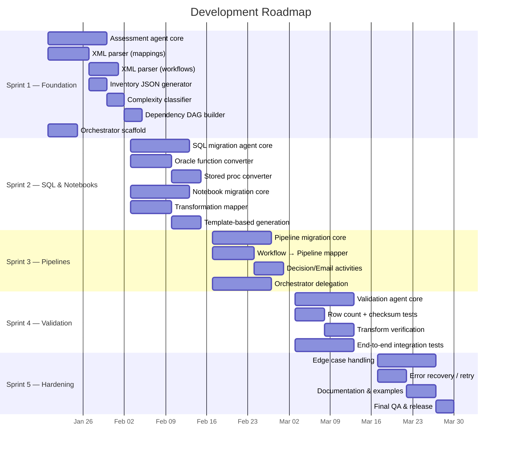
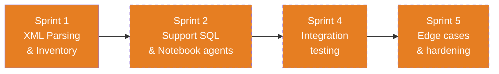
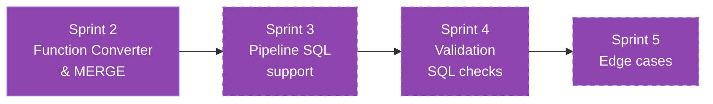
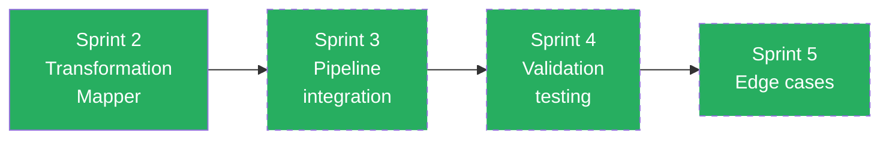
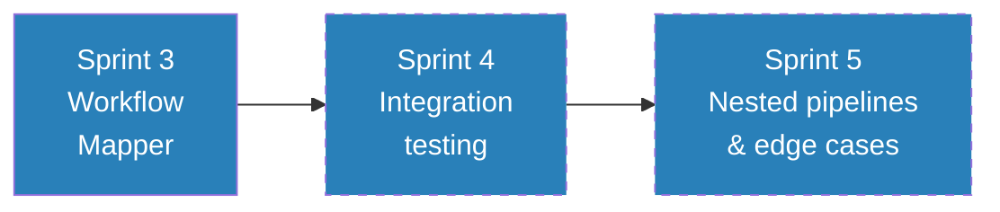
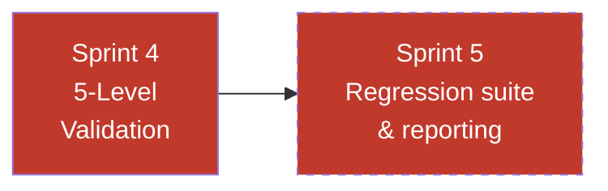
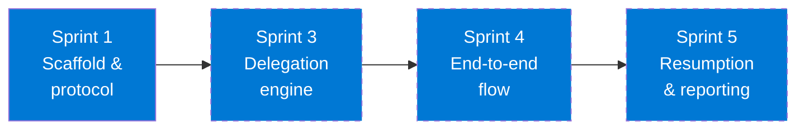
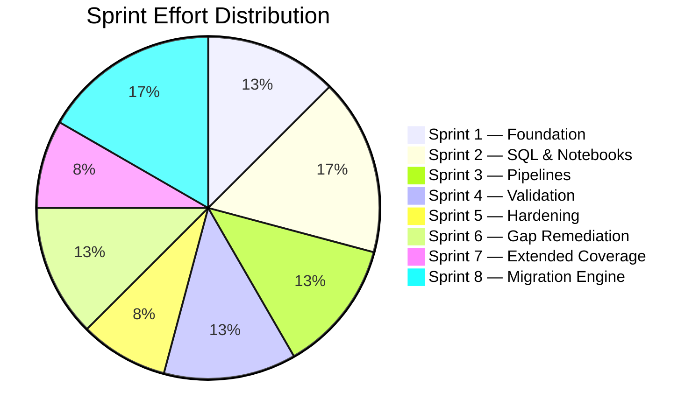

# Development Plan — Informatica to Fabric Migration Agents

  
  
  

> This document describes the **development roadmap** for each of the 6 migration agents, from initial scaffold through production readiness.

---

## Table of Contents

- [Sprint Overview](#sprint-overview)
- [Sprint 1 — Foundation & Assessment](#sprint-1--foundation--assessment)
- [Sprint 2 — SQL & Notebook Conversion](#sprint-2--sql--notebook-conversion)
- [Sprint 3 — Pipeline & Orchestration](#sprint-3--pipeline--orchestration)
- [Sprint 4 — Validation & Integration](#sprint-4--validation--integration)
- [Sprint 5 — Polish, Hardening & Documentation](#sprint-5--polish-hardening--documentation)
- [Sprint 6 — Critical Gap Remediation](#sprint-6--critical-gap-remediation)
- [Sprint 7 — Extended Coverage](#sprint-7--extended-coverage)
- [Sprint 8 — Executable Migration Engine](#sprint-8--executable-migration-engine)
- [Agent Development Plans](#agent-development-plans)
- [Risk Register](#risk-register)
- [Definition of Done](#definition-of-done)

---

## Sprint Overview

---

## Sprint 1 — Foundation & Assessment

**Goal:** Build the assessment agent that can parse any Informatica export and produce a complete, machine-readable inventory.

### 🔍 Assessment Agent

| # | Task | Files | Acceptance Criteria |
|---|------|-------|-------------------|
| 1.1 | Parse `<MAPPING>` elements from XML — extract name, description, transformations | `assessment.agent.md` | Correctly extracts all mappings from test XML |
| 1.2 | Parse `<TRANSFORMATION>` elements — type, name, properties, SQL overrides | `assessment.agent.md` | All 14 transformation types identified |
| 1.3 | Parse `<CONNECTOR>` elements — build data flow graph per mapping | `assessment.agent.md` | Source→transform→target chain reconstructed |
| 1.4 | Parse `<WORKFLOW>` and `<SESSION>` elements — extract scheduling, dependencies | `assessment.agent.md` | All sessions, decisions, links, schedules captured |
| 1.5 | Classify complexity: Simple / Medium / Complex / Custom | `assessment.agent.md` | 3 test mappings correctly classified |
| 1.6 | Generate `inventory.json` output matching schema | `output/inventory/` | JSON validates against expected schema |
| 1.7 | Generate `dependency_dag.json` — workflow→mapping→table edges | `output/inventory/` | DAG correctly represents test workflow |
| 1.8 | Generate `complexity_report.md` with summary statistics | `output/inventory/` | Markdown renders correctly with counts |

### 🎯 Migration Orchestrator (scaffold)

| # | Task | Files | Acceptance Criteria |
|---|------|-------|-------------------|
| 1.9 | Define orchestrator delegation protocol | `migration-orchestrator.agent.md` | Can parse user intent and select correct agent |
| 1.10 | Define progress tracking format | `output/migration_summary.md` | Progress accurately reflects completed steps |

**Sprint 1 Exit Criteria:** ✅ ALL MET (2026-03-23)
- ✅ Assessment agent can parse all 3 example mapping XMLs and 1 workflow XML
- ✅ `inventory.json` matches expected output for test data
- ✅ Complexity classification is 100% accurate for test set (1 Simple, 2 Complex)

---

## Sprint 2 — SQL & Notebook Conversion

**Goal:** Build agents that convert Oracle SQL and Informatica mappings to Spark SQL and PySpark notebooks.

### 🗄️ SQL Migration Agent

| # | Task | Files | Acceptance Criteria |
|---|------|-------|-------------------|
| 2.1 | Build Oracle→Spark SQL function converter (40+ functions) | `sql-migration.agent.md` | NVL, DECODE, SYSDATE, TO_CHAR, TRUNC all converted correctly |
| 2.2 | Convert MERGE INTO → Delta MERGE syntax | `sql-migration.agent.md` | SP_UPDATE_ORDER_STATS test case passes |
| 2.3 | Handle SQL overrides from Source Qualifiers | `sql-migration.agent.md` | SQ SQL overrides in M_LOAD_ORDERS extracted and converted |
| 2.4 | Handle Lookup SQL overrides | `sql-migration.agent.md` | LKP SQL overrides converted to Spark SQL |
| 2.5 | Convert Oracle data types to Spark types | `sql-migration.agent.md` | NUMBER→DECIMAL, VARCHAR2→STRING, DATE→TIMESTAMP |
| 2.6 | Convert stored procedures to notebook cells | `sql-migration.agent.md` | SP_UPDATE_ORDER_STATS → SQL_SP_UPDATE_ORDER_STATS.sql |
| 2.7 | Handle pre/post-session SQL | `sql-migration.agent.md` | Session SQL statements extracted and placed in correct cells |

### 📓 Notebook Migration Agent

| # | Task | Files | Acceptance Criteria |
|---|------|-------|-------------------|
| 2.8 | Map Source Qualifier → `spark.table()` / `spark.read.jdbc()` | `notebook-migration.agent.md` | Bronze reads generated correctly |
| 2.9 | Map Expression → `withColumn()` chain | `notebook-migration.agent.md` | EXP_DERIVE in M_LOAD_CUSTOMERS generates correct withColumn calls |
| 2.10 | Map Filter → `.filter()` / `.where()` | `notebook-migration.agent.md` | FIL_ACTIVE_ONLY in M_LOAD_CUSTOMERS generates correct filter |
| 2.11 | Map Lookup → broadcast join | `notebook-migration.agent.md` | LKP_PRODUCTS in M_LOAD_ORDERS generates broadcast join |
| 2.12 | Map Aggregator → `groupBy().agg()` | `notebook-migration.agent.md` | AGG_BY_CUSTOMER in M_LOAD_ORDERS generates correct agg |
| 2.13 | Map Update Strategy → Delta MERGE | `notebook-migration.agent.md` | UPD_STRATEGY in M_UPSERT_INVENTORY generates full MERGE |
| 2.14 | Map Joiner → PySpark join | `notebook-migration.agent.md` | Inner/outer/left/right/full join conditions correct |
| 2.15 | Map Router → multiple DataFrames with filters | `notebook-migration.agent.md` | Each group becomes a filtered DataFrame |
| 2.16 | Map Sequence Generator → `monotonically_increasing_id()` | `notebook-migration.agent.md` | SK generation correct |
| 2.17 | Generate complete notebook from template | `templates/notebook_template.py` | NB_M_LOAD_CUSTOMERS matches expected output |
| 2.18 | Handle parameterized mappings ($$LOAD_DATE etc.) | `notebook-migration.agent.md` | Widget parameters injected correctly |

**Sprint 2 Exit Criteria:** ✅ ALL MET (2026-03-23)
- ✅ SQL agent converts SP_UPDATE_ORDER_STATS correctly (9 Oracle constructs converted)
- ✅ Notebook agent generates all 3 expected notebooks matching golden outputs
- ✅ All Oracle→Spark SQL function mappings verified (MERGE, DECODE, NVL, SYSDATE, TO_CHAR, TRUNC, TO_DATE)

---

## Sprint 3 — Pipeline & Orchestration

**Goal:** Build the pipeline agent and complete the orchestrator's delegation logic.

### ⚡ Pipeline Migration Agent

| # | Task | Files | Acceptance Criteria |
|---|------|-------|-------------------|
| 3.1 | Map Informatica Session → TridentNotebook activity | `pipeline-migration.agent.md` | Session name, parameters, retry policy correct |
| 3.2 | Map sequential links → `dependsOn` with `Succeeded` condition | `pipeline-migration.agent.md` | Chain order preserved |
| 3.3 | Map Decision task → IfCondition activity | `pipeline-migration.agent.md` | DEC_CHECK_ORDERS generates correct IfCondition |
| 3.4 | Map Email task → WebActivity (webhook) | `pipeline-migration.agent.md` | Webhook call with correct body template |
| 3.5 | Map failure links → `Failed` dependency conditions | `pipeline-migration.agent.md` | Error handling paths wired correctly |
| 3.6 | Map Worklet → nested pipeline (Execute Pipeline activity) | `pipeline-migration.agent.md` | Worklet reference translates to child pipeline call |
| 3.7 | Map parallel sessions → no `dependsOn` between activities | `pipeline-migration.agent.md` | Independent sessions run in parallel |
| 3.8 | Map schedule → pipeline trigger definition | `pipeline-migration.agent.md` | Daily 02:00 UTC schedule extracted |
| 3.9 | Generate pipeline JSON from template | `templates/pipeline_template.json` | PL_WF_DAILY_SALES_LOAD matches expected output |
| 3.10 | Add pipeline parameters from mapping parameters | `pipeline-migration.agent.md` | load_date, alert_webhook_url parameters passed through |

### 🎯 Migration Orchestrator (delegation)

| # | Task | Files | Acceptance Criteria |
|---|------|-------|-------------------|
| 3.11 | Implement full migration flow: assess → SQL → notebooks → pipelines → validate | `migration-orchestrator.agent.md` | End-to-end delegation with correct ordering |
| 3.12 | Implement wave planning (group migrations by dependency) | `migration-orchestrator.agent.md` | Independent mappings grouped into parallel waves |
| 3.13 | Track migration progress in `migration_summary.md` | `output/migration_summary.md` | Progress updates after each step |
| 3.14 | Handle partial failures and resumption | `migration-orchestrator.agent.md` | Can resume from last successful step |

**Sprint 3 Exit Criteria:** ✅ ALL MET (2026-03-23)
- ✅ Pipeline agent generates PL_WF_DAILY_SALES_LOAD matching expected output (5 activities, IfCondition)
- ✅ Orchestrator can run full migration flow across all test data (6-phase delegation)
- ✅ All activity types (notebook, decision, email, parallel) handled

---

## Sprint 4 — Validation & Integration

**Goal:** Build the validation agent and run end-to-end integration tests against all example data.

### ✅ Validation Agent

| # | Task | Files | Acceptance Criteria |
|---|------|-------|-------------------|
| 4.1 | Generate L1 row count comparison scripts | `validation.agent.md` | Source vs target count with tolerance |
| 4.2 | Generate L2 key uniqueness checks | `validation.agent.md` | Duplicate key detection correct |
| 4.3 | Generate L3 NULL checks on critical columns | `validation.agent.md` | All NOT NULL columns validated |
| 4.4 | Generate L4 transformation verification | `validation.agent.md` | Derived columns spot-checked against source |
| 4.5 | Generate L5 aggregate comparison | `validation.agent.md` | SUM/COUNT/AVG match within tolerance |
| 4.6 | Generate test matrix markdown | `output/validation/test_matrix.md` | All tables, all levels, pass/fail status |
| 4.7 | Handle known differences (filters, date ranges) | `validation.agent.md` | Expected differences documented and accepted |
| 4.8 | Generate validation notebook from template | `templates/validation_template.py` | VAL_DIM_CUSTOMER matches expected output |

### Integration Testing

| # | Task | Files | Acceptance Criteria |
|---|------|-------|-------------------|
| 4.9 | End-to-end: input XML → inventory → notebooks → pipelines → validation | All agents | Full pipeline succeeds on test data |
| 4.10 | Cross-agent handoff verification | All agents | Each agent reads predecessor output correctly |
| 4.11 | Verify all golden outputs match generated outputs | `output/` | Diff between generated and expected = 0 |

**Sprint 4 Exit Criteria:** ✅ ALL MET (2026-03-23)
- ✅ Validation agent generates VAL_DIM_CUSTOMER matching expected output
- ✅ Test matrix covers all 4 target tables + pipeline (39 checks across 5 notebooks)
- ✅ End-to-end flow produces correct outputs from raw XML inputs (14 artifacts generated)

---

## Sprint 5 — Polish, Hardening & Documentation ✅

**Goal:** Handle edge cases, improve error messages, and finalize documentation.

| # | Task | Owner | Files | Acceptance Criteria |
|---|------|-------|-------|-------------------|
| 5.1 | Handle missing/malformed XML gracefully | Assessment | `run_assessment.py` | ✅ IICS detection, safe_parse_xml, per-mapping try/except, partial results |
| 5.2 | Handle unsupported transformation types | Notebook | `notebook-migration.agent.md` | ✅ Placeholder cell template with TODO + 6 unsupported types documented |
| 5.3 | Handle non-convertible Oracle SQL | SQL | `sql-migration.agent.md` | ✅ 9 non-convertible constructs documented with TODO block template |
| 5.4 | Handle complex Worklet nesting | Pipeline | `pipeline-migration.agent.md` | ✅ Max 2-level nesting, flatten rules, parameter pass-through |
| 5.5 | Add retry/timeout policies to all pipeline activities | Pipeline | `pipeline-migration.agent.md` | ✅ 6 activity types with default policies + override rules |
| 5.6 | Generate migration issues report | Orchestrator | `output/migration_issues.md` | ✅ 6 issues (2 P0, 3 P1, 1 P2) with resolution tracking |
| 5.7 | Update README.md with final examples | — | `README.md` | ✅ 4 code excerpts (notebook, SQL, pipeline, validation) |
| 5.8 | Update shared instructions with lessons learned | — | `.vscode/instructions/` | ✅ 10 lessons across 5 categories |
| 5.9 | Final review of all agent `.md` files | All | `.github/agents/` | ✅ Reference sections added, Sprint 5 labels unified, ordering fixed |

**Sprint 5 Exit Criteria:** ✅ ALL MET (2026-03-23)
- ✅ Malformed XML handled gracefully with partial results saved
- ✅ All unsupported types documented with placeholder/TODO patterns
- ✅ Agent files have consistent structure (Reference, Output, Rules, Roadmap)
- ✅ README has generated output examples
- ✅ Shared instructions updated with lessons learned

---

## Sprint 6 — Critical Gap Remediation ✅

**Goal:** Address all P0 and critical P1 gaps identified in GAP_ANALYSIS.md — Mapplet expansion, SQL Transformation, Oracle analytics, parameter files, Normalizer/Sorter/Union templates, flat file sources, and Control Task.

| # | Task | Owner | Files | Acceptance Criteria |
|---|------|-------|-------|-------------------|
| 6.1 | Mapplet parsing + expansion | Assessment | `run_assessment.py` | ✅ `parse_mapplets()` extracts MAPPLET definitions; `expand_mapplet_refs()` resolves references and inlines inner transformations; `has_mapplet` flag set on mappings |
| 6.2 | SQL Transformation type | Assessment | `run_assessment.py` | ✅ `SQLT` added to `TRANSFORMATION_ABBREV`; detected and abbreviated in inventory |
| 6.3 | Oracle analytic function detection | Assessment + SQL | `run_assessment.py`, `sql-migration.agent.md` | ✅ 12 analytic patterns added (LEAD, LAG, DENSE_RANK, NTILE, FIRST_VALUE, LAST_VALUE, ROW_NUMBER, OVER, PARTITION BY, GLOBAL TEMPORARY TABLE, MATERIALIZED VIEW, DB_LINK); conversion rules in SQL agent (mostly 1:1) |
| 6.4 | Parameter file (.prm) parser | Assessment | `run_assessment.py` | ✅ `parse_parameter_files()` reads .prm files with [section] key=value format; results in inventory.json |
| 6.5 | Normalizer/Sorter/Union PySpark templates | Notebook | `notebook-migration.agent.md` | ✅ NRM→`.explode()`, SRT→`.orderBy()`, UNI→`.unionByName()` with full code examples |
| 6.6 | Flat file source handling | Notebook | `notebook-migration.agent.md` | ✅ CSV (`spark.read.csv()`) and fixed-width (`spark.read.text()` + `.substr()`) patterns documented |
| 6.7 | Control Task → Fail Activity | Pipeline | `pipeline-migration.agent.md` | ✅ Fail Activity JSON template with ABORT/FAIL PARENT rules documented |

**Sprint 6 Exit Criteria:** ✅ ALL MET (2026-03-23)
- ✅ Mapplet parsing + expansion tested with 2-Mapplet test file (M_LOAD_EMPLOYEES.xml)
- ✅ All 3 P0 gaps addressed (Mapplet, SQL Transformation, Oracle analytics)
- ✅ 4 P1 gaps addressed (parameter files, Normalizer/Sorter/Union, flat files, Control Task)
- ✅ Assessment runs clean with 6 mappings, 2 Mapplets, 3 SQL files, 1 param file, 4 connections

---

## Sprint 7 — Extended Coverage ✅

**Goal:** Extend migration tooling to IICS cloud exports, SQL Server sources, Web Service Consumer, Data Masking, connection XML parsing, and PL/SQL package splitting.

| # | Task | Owner | Files | Acceptance Criteria |
|---|------|-------|-------|-------------------|
| 7.1 | IICS XML parser (Cloud mappings) | Assessment | `run_assessment.py` | ✅ `parse_iics_mapping()` handles `exportMetadata`/`dTemplate` schema with namespace support; `detect_xml_format()` auto-detects IICS vs PowerCenter |
| 7.2 | IICS Taskflow → Fabric Pipeline | Pipeline | `pipeline-migration.agent.md` | ✅ 10 IICS element → Fabric activity mappings documented (Mapping Task, Command Task, Human Task, Notification Task, Subflow, Exclusive/Parallel Gateway, Timer Event) |
| 7.3 | SQL Server → Spark SQL patterns | Assessment + SQL | `run_assessment.py`, `sql-migration.agent.md` | ✅ 18 SQLSERVER_PATTERNS in assessment; `detect_source_db_type()` scores Oracle vs MSSQL; 17 T-SQL→Spark SQL function mappings + construct mappings + date format codes in SQL agent |
| 7.4 | Web Service Consumer conversion | Notebook | `notebook-migration.agent.md` | ✅ WSC placeholder type with PySpark UDF pattern (`requests` library) and pipeline Web Activity alternative documented |
| 7.5 | Data Masking support | Notebook | `notebook-migration.agent.md` | ✅ DM placeholder type with 3 masking approaches: hash-based (`sha2`), partial masking, Fabric Dynamic Data Masking |
| 7.6 | Connection XML parser | Assessment | `run_assessment.py` | ✅ `parse_connection_objects()` extracts DBCONNECTION, FTPCONNECTION, CONNECTION elements; deduped with inferred connections |
| 7.7 | PL/SQL Package splitter | SQL | `sql-migration.agent.md` | ✅ Split strategy documented: parse→identify deps→map shared state→split into individual notebooks; output structure with README |

**Sprint 7 Exit Criteria:** ✅ ALL MET (2026-03-23)
- ✅ IICS parsing tested with namespace-aware XML (IICS_M_LOAD_CONTACTS.xml → 2 cloud mappings detected)
- ✅ SQL Server detection tested (SP_REFRESH_DASHBOARD.sql → 17 T-SQL constructs, correctly classified as `sqlserver`)
- ✅ Oracle analytics detection tested (SP_CALC_RANKINGS.sql → 17 Oracle constructs including LEAD/LAG/DENSE_RANK/NTILE/FIRST_VALUE/LAST_VALUE)
- ✅ Connection XML parsing tested (2 connections extracted: ORACLE_HR DB + FTP_HR_FILES)
- ✅ All agent docs updated with new conversion patterns and guidance

---

## Sprint 8 — Executable Migration Engine ✅

**Goal:** Build runnable Python scripts that execute each migration phase end-to-end, converting agent knowledge into automated tooling with a single-command orchestrator.

| # | Task | Owner | Files | Acceptance Criteria |
|---|------|-------|-------|-------------------|
| 8.1 | SQL Migration script | SQL | `run_sql_migration.py` | ✅ 30+ Oracle regex rules (NVL→COALESCE, DECODE→CASE, date formats, types) + 20+ SQL Server rules (ISNULL, CHARINDEX, TOP→LIMIT); converts standalone SQL files + mapping SQL overrides |
| 8.2 | Notebook Migration script | Notebook | `run_notebook_migration.py` | ✅ Generates PySpark notebook per mapping with 18 transformation-type handlers (EXP, FIL, AGG, JNR, LKP, RTR, UPD, RNK, SRT, UNI, NRM, SEQ, SP, SQLT, DM, WSC, MPLT + unknown); metadata/imports, source read, target write, audit cells |
| 8.3 | Pipeline Migration script | Pipeline | `run_pipeline_migration.py` | ✅ Generates Fabric Pipeline JSON per workflow with TridentNotebook activities, IfCondition for decisions, WebActivity for emails, dependsOn chains, pipeline parameters |
| 8.4 | Validation Generation script | Validation | `run_validation.py` | ✅ Generates validation notebook per target with L1 (row count), L2 (checksum), L3 (NULL+uniqueness) checks; generates test_matrix.md summary |
| 8.5 | End-to-End Orchestrator | Orchestrator | `run_migration.py` | ✅ 5-phase orchestrator (assessment→SQL→notebooks→pipelines→validation) with `--skip` and `--only` flags, sys.argv isolation, SystemExit handling, phase timing, migration_summary.md generation |

**Sprint 8 Exit Criteria:** ✅ ALL MET (2026-03-23)
- ✅ `run_migration.py --skip 0` runs all 4 conversion phases successfully
- ✅ SQL: 3 standalone + 2 override files converted (NVL→COALESCE, TO_DATE date format, etc.)
- ✅ Notebooks: 6 notebooks generated (Simple through Complex mappings)
- ✅ Pipelines: 1 pipeline generated with 4 activities
- ✅ Validation: 7 validation notebooks + test_matrix.md generated
- ✅ migration_summary.md generated with phase results table

---

## Agent Development Plans

### 🔍 Assessment Agent — Development Roadmap

| Sprint | Focus | Key Deliverables |
|--------|-------|-----------------|
| **1** | Core parsing engine | XML parser, inventory generator, complexity classifier, DAG builder |
| **2** | Support downstream agents | Expose SQL override extractions, parameter file parsing |
| **4** | Integration | Verify inventory feeds all downstream agents correctly |
| **5** | Hardening | Malformed XML handling, IICS format support, partial parse recovery |

**Success Criteria:**
- Parse any Informatica PowerCenter XML export (v9.x, v10.x)
- Correctly classify 95%+ of mappings by complexity
- Generate valid JSON inventory that all downstream agents can consume

---

### 🗄️ SQL Migration Agent — Development Roadmap

| Sprint | Focus | Key Deliverables |
|--------|-------|-----------------|
| **2** | Core conversion | 40+ Oracle→Spark function mappings, MERGE converter, data type mapping |
| **3** | Pipeline support | Pre/post-session SQL, SQL-based pipeline variables |
| **4** | Validation support | SQL-based validation queries for aggregate checks |
| **5** | Hardening | PL/SQL block conversion, cursor handling, dynamic SQL |

**Success Criteria:**
- Convert 90%+ of Oracle SQL overrides automatically
- MERGE INTO converts correctly to Delta MERGE
- Unconvertible SQL is clearly marked with manual-review comments

**Function Conversion Matrix (40+ mappings):**

| Oracle | Spark SQL | Status |
|--------|----------|--------|
| `NVL(a, b)` | `COALESCE(a, b)` | ✅ Sprint 2 |
| `DECODE(x, a, b, c)` | `CASE WHEN x=a THEN b ELSE c END` | ✅ Sprint 2 |
| `SYSDATE` | `current_timestamp()` | ✅ Sprint 2 |
| `TRUNC(date)` | `date_trunc('day', date)` | ✅ Sprint 2 |
| `TO_CHAR(d, fmt)` | `date_format(d, fmt)` | ✅ Sprint 2 |
| `TO_DATE(s, fmt)` | `to_date(s, fmt)` | ✅ Sprint 2 |
| `TO_NUMBER(s)` | `CAST(s AS DECIMAL)` | ✅ Sprint 2 |
| `SUBSTR(s, p, l)` | `SUBSTRING(s, p, l)` | ✅ Sprint 2 |
| `INSTR(s, sub)` | `LOCATE(sub, s)` | ✅ Sprint 2 |
| `NVL2(x, a, b)` | `IF(x IS NOT NULL, a, b)` | ✅ Sprint 2 |
| `ROWNUM` | `ROW_NUMBER() OVER()` | ⏳ Sprint 5 |
| `CONNECT BY` | `(manual — recursive CTE)` | ⏳ Sprint 5 |

---

### 📓 Notebook Migration Agent — Development Roadmap

| Sprint | Focus | Key Deliverables |
|--------|-------|-----------------|
| **2** | Core conversion | 14 transformation types → PySpark, template-based generation, parameter handling |
| **3** | Pipeline integration | Notebook output values for pipeline decision gates |
| **4** | Testing | Verify generated notebooks match golden outputs |
| **5** | Hardening | Custom transformations, Java transforms, multi-group routers |

**Transformation Coverage Plan:**

| Transformation | PySpark Equivalent | Sprint | Complexity |
|---------------|-------------------|--------|-----------|
| Source Qualifier | `spark.table()` / `spark.read` | 2 | Low |
| Expression | `withColumn()` chain | 2 | Low |
| Filter | `.filter()` / `.where()` | 2 | Low |
| Aggregator | `.groupBy().agg()` | 2 | Medium |
| Lookup | `broadcast(df).join()` | 2 | Medium |
| Joiner | `.join()` | 2 | Medium |
| Update Strategy | Delta `MERGE` | 2 | High |
| Router | Multiple filtered DFs | 2 | Medium |
| Sequence Generator | `monotonically_increasing_id()` | 2 | Low |
| Sorter | `.orderBy()` | 2 | Low |
| Rank | `Window` + `row_number()` | 3 | Medium |
| Normalizer | `.explode()` | 3 | Medium |
| Stored Procedure | `spark.sql()` cell | 3 | High |
| Custom/Java | Placeholder + TODO | 5 | Manual |

---

### ⚡ Pipeline Migration Agent — Development Roadmap

| Sprint | Focus | Key Deliverables |
|--------|-------|-----------------|
| **3** | Core conversion | Session→Notebook, Decision→IfCondition, Email→WebActivity, schedules, dependencies |
| **4** | Testing | Verify generated pipelines match golden output |
| **5** | Hardening | Worklet nesting, complex decision trees, event-based triggers |

**Activity Mapping Plan:**

| Informatica Element | Fabric Activity | Sprint |
|--------------------|----------------|--------|
| Session | TridentNotebook | 3 |
| Sequential Link (Succeeded) | dependsOn: Succeeded | 3 |
| Sequential Link (Failed) | dependsOn: Failed | 3 |
| Decision Task | IfCondition | 3 |
| Email Task | WebActivity (webhook) | 3 |
| Command Task | Script activity | 3 |
| Worklet | Execute Pipeline | 5 |
| Timer (wait) | Wait activity | 3 |
| Event Wait | (manual — custom trigger) | 5 |
| Scheduler | Schedule trigger | 3 |

---

### ✅ Validation Agent — Development Roadmap

| Sprint | Focus | Key Deliverables |
|--------|-------|-----------------|
| **4** | Core validation | All 5 levels (row count, key unique, NULL, transform, aggregate), test matrix |
| **5** | Refinement | Known-difference handling, tolerance thresholds, regression suite |

**Validation Level Implementation:**

| Level | Test Type | Sprint | Generated Script |
|-------|----------|--------|-----------------|
| L1 | Row count comparison | 4 | Count source vs target, with filter adjustments |
| L2 | Key uniqueness | 4 | GroupBy key → check count > 1 |
| L3 | NULL checks | 4 | Filter isNull on critical columns |
| L4 | Transformation verification | 4 | Re-derive expressions, compare to target |
| L5 | Aggregate comparison | 4 | SUM/COUNT/AVG between source and target |

---

### 🎯 Migration Orchestrator — Development Roadmap

| Sprint | Focus | Key Deliverables |
|--------|-------|-----------------|
| **1** | Scaffold | Delegation protocol, progress tracking format |
| **3** | Delegation | Full 5-phase flow, wave planning, cross-agent handoffs |
| **4** | Integration | End-to-end test, progress reporting |
| **5** | Hardening | Partial failure recovery, resumption, final migration report |

---

## Risk Register

| # | Risk | Impact | Mitigation |
|---|------|--------|-----------|
| R1 | Unsupported Informatica transformation types | Notebooks incomplete | Placeholder cells with TODO + manual conversion notes |
| R2 | Complex Oracle PL/SQL not auto-convertible | SQL conversion gaps | Flag for manual review, provide partial conversion |
| R3 | XML format variations (v9 vs v10 vs IICS) | Parser breaks | Test against multiple format versions, graceful degradation |
| R4 | Pipeline JSON schema changes in Fabric | Pipelines invalid | Pin to known schema version, validate before output |
| R5 | Large mappings > 50 transformations | Performance / accuracy | Chunk processing, intermediate DataFrames |

---

## Definition of Done

A task is **Done** when:

- [x] Code/agent instructions updated and committed
- [x] Test case passes against example data (input → expected output)
- [x] No regressions in other agents’ outputs
- [x] Handoff artifacts documented (what the next agent needs)
- [ ] README or AGENTS.md updated if public-facing behavior changed

---

## Sprint Summary

| Sprint | Primary Agents | Outputs | Status |
|--------|---------------|---------|--------|
| **1** | Assessment, Orchestrator (scaffold) | `inventory.json`, `dependency_dag.json`, `complexity_report.md` | ✅ Complete |
| **2** | SQL Migration, Notebook Migration | `SQL_*.sql`, `NB_*.py` | ✅ Complete |
| **3** | Pipeline Migration, Orchestrator (delegation) | `PL_*.json`, `migration_summary.md` | ✅ Complete |
| **4** | Validation, All (integration) | `VAL_*.py`, `test_matrix.md` | ✅ Complete |
| **5** | All (hardening) | Edge case handling, docs, final QA | ✅ Complete |
| **6** | Assessment, Notebook, Pipeline, SQL | Mapplet expansion, analytics, param files, templates | ✅ Complete |
| **7** | Assessment, Notebook, Pipeline, SQL | IICS parser, SQL Server patterns, WSC/DM, PL/SQL split | ✅ Complete |
| **8** | All (executable scripts) | `run_sql_migration.py`, `run_notebook_migration.py`, `run_pipeline_migration.py`, `run_validation.py`, `run_migration.py` | ✅ Complete |
