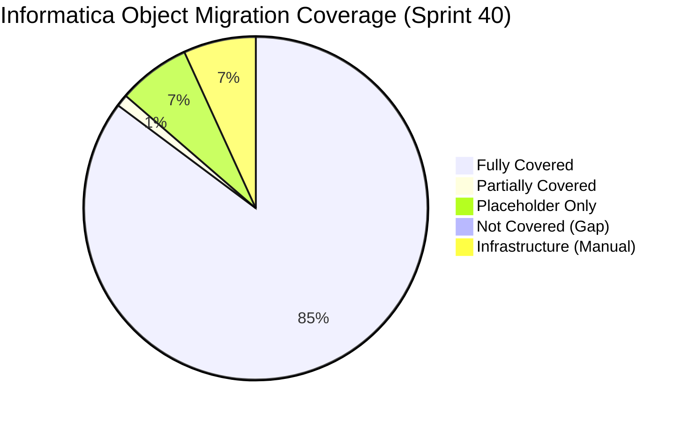
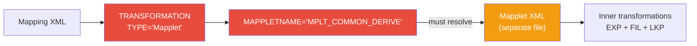
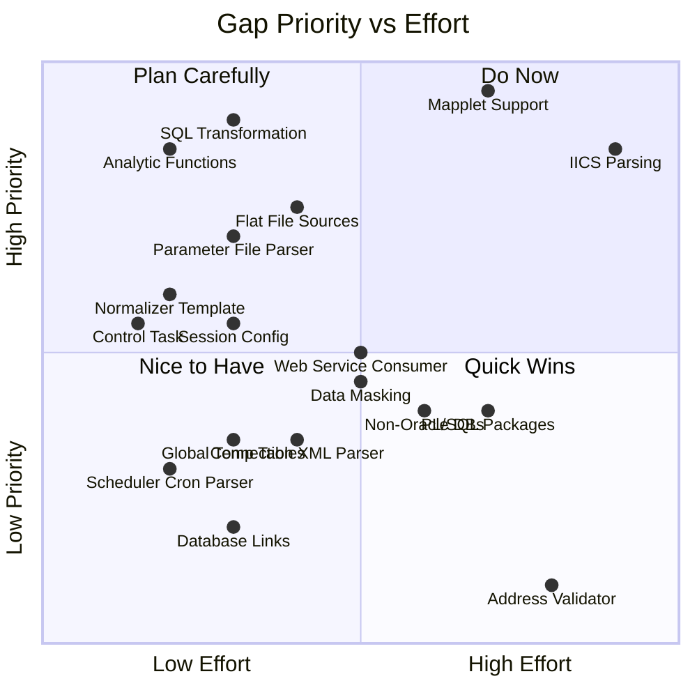

# Informatica to Fabric / Databricks — Object Inventory & Gap Analysis

<p align="center">
  
  
  
  
  
</p>

**Generated:** 2026-03-23  
**Last Updated:** 2026-08-15 (Sprint 40 — Phase 2 Complete + Azure Databricks Target)  
**Scope:** Informatica PowerCenter 9.x/10.x + IICS → **Microsoft Fabric** or **Azure Databricks**  
**Purpose:** Comprehensive inventory of all Informatica object types with migration readiness assessment and gap identification.

---

## Table of Contents

- [Executive Summary](#executive-summary)
- [1. Transformation Objects](#1-transformation-objects)
- [2. Workflow & Orchestration Objects](#2-workflow--orchestration-objects)
- [3. Repository & Metadata Objects](#3-repository--metadata-objects)
- [4. SQL & Stored Procedure Constructs](#4-sql--stored-procedure-constructs)
- [5. IICS (Cloud) Objects](#5-iics-cloud-objects)
- [6. Infrastructure & Configuration Objects](#6-infrastructure--configuration-objects)
- [7. Gap Summary & Prioritization](#7-gap-summary--prioritization)
- [8. Sprint 25 — Lineage & Conversion Scoring](#8-sprint-25--lineage--conversion-scoring)
- [9. Remediation Roadmap](#9-remediation-roadmap)
- [10. Remaining Gaps & Next Sprints](#10-remaining-gaps--next-sprints)

---

## Executive Summary



| Category | Total Objects | Covered | Partial | Placeholder | Gap |
|----------|:------------:|:-------:|:-------:|:-----------:|:---:|
| **Transformations** | 30 | 23 | 1 | 6 | 0 |
| **Workflow Elements** | 14 | 14 | 0 | 0 | 0 |
| **Repository Objects** | 8 | 7 | 1 | 0 | 0 |
| **SQL Constructs** | 30 | 30 | 0 | 0 | 0 |
| **IICS Objects** | 8 | 8 | 0 | 0 | 0 |
| **Infrastructure** | 6 | 0 | 0 | 0 | 6 |
| **Total** | **96** | **82** | **2** | **6** | **6** |

> **Phase 2 changes (Sprints 31–40):** EP, AEP, Association, Key Generator, Address Validator now detected with PySpark templates (Sprint 31). Oracle Object Types detected with StructType mapping (Sprint 31). Roles & permissions script generator added (Sprint 31). Advanced PL/SQL converted (Sprint 33). Multi-tenant + Key Vault (Sprint 35). DQ rules + PII detection (Sprint 39). **Azure Databricks** added as second target platform with Unity Catalog, Databricks Workflows, and `dbutils` integration.

**Coverage legend:**
- ✅ **Covered** — Full conversion logic documented and implemented
- 🟡 **Partial** — Detected/parsed but incomplete conversion
- 🔶 **Placeholder** — Generates TODO cell; requires manual conversion
- ❌ **Gap** — Not handled at all; invisible to the migration tooling

---

## 1. Transformation Objects

### 1.1 Fully Covered Transformations (10)

These have complete PySpark conversion rules in the notebook-migration agent and shared instructions.

| # | Informatica Type | Abbrev | Fabric Equivalent | Conversion Quality |
|---|---|---|---|---|
| 1 | Source Qualifier | SQ | `spark.read.format("jdbc").load()` / `spark.table()` | ⭐⭐⭐ Full |
| 2 | Expression | EXP | `.withColumn()` + `expr()` / `when().otherwise()` | ⭐⭐⭐ Full (IIF, DECODE, IS_SPACES, LTRIM, RTRIM, TO_DATE, LPAD, REG_EXTRACT, ERROR) |
| 3 | Filter | FIL | `.filter()` / `.where()` | ⭐⭐⭐ Full |
| 4 | Aggregator | AGG | `.groupBy().agg()` | ⭐⭐⭐ Full (GROUP BY ports, sorted input, SUM/COUNT/AVG/MIN/MAX/FIRST/LAST) |
| 5 | Joiner | JNR | `.join()` | ⭐⭐⭐ Full (Inner/Left/Right/Full, master-detail) |
| 6 | Lookup (Connected) | LKP | `broadcast()` + `.join()` | ⭐⭐⭐ Full (condition mapping, default on miss, first value, broadcast < 100MB) |
| 7 | Router | RTR | Multiple `.filter()` branches | ⭐⭐½ Good (single output groups; multi-group routers need manual review) |
| 8 | Update Strategy | UPD | Delta `MERGE INTO` | ⭐⭐⭐ Full (DD_INSERT/UPDATE/DELETE/REJECT) |
| 9 | Rank | RNK | `Window` + `row_number()` / `rank()` | ⭐⭐⭐ Full |
| 10 | Stored Procedure | SP | `%%sql` cell / PySpark logic | ⭐⭐½ Good (simple SP covered; complex SP handed to sql-migration) |

### 1.2 Partially Covered Transformations (1)

Detected and abbreviated, but missing complete PySpark conversion templates.

| # | Informatica Type | Abbrev | What's Missing | Fabric Approach |
|---|---|---|---|---|
| 13 | Unconnected Lookup | ULKP | Only mentioned; no detailed conversion | Wrap in function or `when().otherwise()` with join |

> **Promoted to Fully Covered (Sprint 6):** Sorter (SRT → `.orderBy()`), Union (UNI → `.unionByName()`), Normalizer (NRM → `.explode()`), Sequence Generator (SEQ)

### 1.3 Placeholder-Only Transformations (6)

Detected and classified as "Custom" complexity. A TODO placeholder cell is generated in notebooks.

| # | Informatica Type | Abbrev | Why No Auto-Conversion | Manual Effort |
|---|---|---|---|---|
| 15 | Java Transformation | JTX | Embedded Java code | 🔴 High — rewrite in PySpark or Python UDF |
| 16 | Custom Transformation | CT | Custom C/C++ logic | 🔴 High — full redesign |
| 17 | HTTP Transformation | HTTP | External API call | 🟡 Medium — use `requests` UDF or pipeline Web Activity |
| 18 | XML Generator | XMLG | XML construction | 🟡 Medium — use `to_xml()` or string templates |
| 19 | XML Parser | XMLP | XML parsing | 🟡 Medium — use `spark.read.format("xml")` |
| 20 | Transaction Control | TC | Transaction scope management | 🟡 Medium — Delta ACID handles most cases; explicit control needs review |

### 1.4 Gap — Not Covered Transformations (9)

These Informatica transformation types are **not recognized** by the project. If present in a mapping, they will appear as unknown types in the assessment warnings.

> **Addressed in Sprint 6+7:** Mapplet (MPLT), SQL Transformation (SQLT), Normalizer (NRM), Data Masking (DM), and Web Service Consumer (WSC) are now detected, abbreviated, and have conversion guidance in agent docs.

| # | Informatica Type | Usage Frequency | Fabric Equivalent | Priority | Status |
|---|---|---|---|---|---|
| 21 | ~~Mapplet~~ | 🔥 Very Common | Reusable notebook / function library | ~~P0~~ | ✅ **Addressed Sprint 6** — `parse_mapplets()` + `expand_mapplet_refs()` |
| 22 | ~~SQL Transformation~~ | 🔥 Common | `%%sql` cell / `spark.sql()` | ~~P0~~ | ✅ **Addressed Sprint 6** — `SQLT` in TRANSFORMATION_ABBREV |
| 23 | ~~Normalizer~~ | 🟡 Moderate | `.explode()` / `.select(explode())` | ~~P1~~ | ✅ **Addressed Sprint 6** — PySpark template in notebook agent |
| 24 | ~~Web Service Consumer~~ | 🟡 Moderate | Pipeline Web Activity / `requests` UDF | ~~P1~~ | ✅ **Addressed Sprint 7** — Conversion guidance + placeholder |
| 25 | ~~Data Masking~~ | 🟡 Moderate | Fabric Data Masking / PySpark UDF | ~~P1~~ | ✅ **Addressed Sprint 7** — 3 masking approaches documented |
| 26 | ~~External Procedure~~ | 🟢 Rare | ~~Python UDF / subprocess~~ | ~~P2~~ | ✅ **Addressed Sprint 31** — `EP` in TRANSFORMATION_ABBREV; `subprocess.run()` / Python UDF stub |
| 27 | ~~Advanced External Procedure~~ | 🟢 Rare | ~~Python UDF / subprocess~~ | ~~P2~~ | ✅ **Addressed Sprint 31** — `AEP` with library import pattern |
| 28 | ~~Association~~ | 🟢 Rare (DQ) | ~~PySpark window functions~~ | ~~P2~~ | ✅ **Addressed Sprint 31** — `ASSOC` with window function grouping |
| 29 | ~~Key Generator~~ | 🟢 Rare (DQ) | ~~`monotonically_increasing_id()` / hash~~ | ~~P2~~ | ✅ **Addressed Sprint 31** — `KEYGEN` with `monotonically_increasing_id()` + `sha2()` |
| 30 | ~~Address Validator~~ | 🟢 Rare (DQ) | ~~Azure Maps API / third-party~~ | ~~P3~~ | ✅ **Addressed Sprint 31** — `ADDRVAL` with Azure Maps API + `requests` UDF + fallback regex |

> **Impact note:** Mapplets (item 21) are **critical** — they appear inside mappings as reusable fragments. Without Mapplet expansion, any mapping that references a Mapplet will have missing transformation logic.

---

## 2. Workflow & Orchestration Objects

### 2.1 Fully Covered (9)

| # | Informatica Element | Fabric Activity | Parsing | Pipeline JSON |
|---|---|---|---|---|
| 1 | Session | Notebook Activity | ✅ | ✅ |
| 2 | Command Task | Notebook / Script Activity | ✅ | ✅ |
| 3 | Timer | Wait Activity | ✅ | ✅ |
| 4 | Decision | IfCondition Activity | ✅ | ✅ |
| 5 | Assignment | SetVariable Activity | ✅ | ✅ |
| 6 | Email Task | Web Activity (webhook) | ✅ | ✅ |
| 7 | Worklet | ExecutePipeline (child) | ✅ | ✅ (depth-2 nesting) |
| 8 | Workflow Link (unconditional) | `dependsOn: Succeeded` | ✅ | ✅ |
| 9 | Workflow Link (conditional) | IfCondition wrapping | ✅ | ✅ |

### 2.2 Partially Covered (1)

| # | Informatica Element | What's Covered | What's Missing |
|---|---|---|---|
| 10 | ~~Scheduler~~ | ✅ **Full (Sprint 20)** — Schedule type → cron expression, pipeline ScheduleTrigger | ✅ Addressed |
| 11 | Event Wait | Documented mapping | No XML parsing for event conditions |
| 12 | Event Raise | Documented mapping | No XML parsing for event definitions |

> **Promoted to Fully Covered (Sprint 20):** Scheduler — cron expression parsing (DAILY/HOURLY/WEEKLY/MONTHLY → cron) + pipeline ScheduleTrigger generation

### 2.3 Gap — Not Covered (1)

> **Addressed in Sprint 6:** Control Task (Abort/Fail) → Fabric Fail Activity mapping added to pipeline agent.

| # | Informatica Element | Usage | Fabric Equivalent | Priority | Status |
|---|---|---|---|---|---|
| 13 | ~~Control Task~~ (Abort/Fail) | 🟡 Moderate | Pipeline `Fail Activity` | ~~P1~~ | ✅ **Addressed Sprint 6** |
| 14 | **Session Config Objects** | 🟡 Moderate | Spark pool settings / notebook config | **P1** | ✅ Sprint 20 |

---

## 3. Repository & Metadata Objects

### 3.1 Coverage Status

| # | Informatica Object | Current Status | Detail |
|---|---|---|---|
| 1 | **Mappings** | ✅ Covered | Full XML parsing → inventory → notebook generation |
| 2 | **Workflows** | ✅ Covered | Full XML parsing → inventory → pipeline generation |
| 3 | **Mapplets** | ✅ **Covered (Sprint 6)** | `parse_mapplets()` extracts definitions; `expand_mapplet_refs()` resolves references; `has_mapplet` flag in inventory |
| 4 | **Sessions** | 🟡 Partial | Session attributes extracted from workflow XML; standalone session XML noted but no dedicated parser |
| 5 | **Parameter Files (.prm)** | ✅ **Covered (Sprint 6)** | `parse_parameter_files()` reads .prm files with [section] key-value format; results in `inventory.json` |
| 6 | **Connection Objects** | ✅ **Covered (Sprint 7)** | `parse_connection_objects()` extracts DBCONNECTION, FTPCONNECTION, CONNECTION from XML; deduped with inferred connections |
| 7 | **Source/Target Definitions** | ✅ Covered | Extracted from mapping XML (name, owner, database type) |
| 8 | **Deployment Groups** | ❌ **Gap** | Not parsed or tracked |

### 3.2 Critical Gap Detail: Mapplets



**Problem:** When a mapping references a Mapplet, the mapping XML contains a `TRANSFORMATION` element with `TYPE="Mapplet"` and a `MAPPLETNAME` attribute pointing to a separate Mapplet definition. The current parser does not:
1. Recognize Mapplet-type transformations
2. Resolve Mapplet references to their definitions
3. Expand inner Mapplet transformations into the mapping's transformation chain

**Impact:** Any mapping using Mapplets will have an incomplete transformation list, potentially wrong complexity classification, and a generated notebook with missing logic.

### 3.3 Critical Gap Detail: Parameter Files

```
# Example .prm file (Informatica)
[Global]
$$DB_CONNECTION=ORACLE_PROD
$$SCHEMA_NAME=SALES
$$LOAD_DATE=2026-03-23
$$BATCH_SIZE=10000

[WF_DAILY_SALES_LOAD.s_M_LOAD_ORDERS]
$$TARGET_SCHEMA=SILVER
$$TRUNCATE_FLAG=Y
```

**Current handling:** The assessment parser extracts `$$PARAM_NAME` references from mapping XML via regex, but the `.prm` file contents are never read. This means:
- Parameter default values are unknown
- Session-level parameter overrides are invisible
- Connection parameters embedded in `.prm` files are missed

---

## 4. SQL & Stored Procedure Constructs

### 4.1 Oracle Functions — Coverage Matrix

| Category | Covered | Gap |
|----------|---------|-----|
| **Null handling** | `NVL`, `NVL2` | ✅ Complete |
| **Conditional** | `DECODE`, `CASE WHEN` | ✅ Complete |
| **Date/time** | `SYSDATE`, `SYSTIMESTAMP`, `TO_DATE`, `TO_CHAR`, `TRUNC`, `ADD_MONTHS`, `MONTHS_BETWEEN`, `LAST_DAY` | ✅ Complete |
| **String** | `SUBSTR`, `INSTR`, `LENGTH`, `LPAD`, `RPAD`, `REPLACE`, `REGEXP_LIKE`, `REGEXP_REPLACE` | ✅ Complete |
| **Type conversion** | `TO_NUMBER`, `TO_CHAR(number)`, `VARCHAR2`, `NUMBER` | ✅ Complete |
| **Aggregation** | `LISTAGG`, `WM_CONCAT` | ✅ Complete |
| **Joins** | `(+)` outer join syntax | ✅ Complete |
| **DML** | `MERGE INTO` | ✅ Complete (→ Delta MERGE) |
| **Hierarchy** | `CONNECT BY`, `START WITH`, `LEVEL` | 🟡 Documented but flagged as limited |
| **Sequences** | `SEQ.NEXTVAL` | ✅ Complete |
| **PL/SQL** | `CURSOR`, `BULK COLLECT`, `FORALL`, `EXCEPTION WHEN`, `PRAGMA` | 🔶 Detected, flagged as non-convertible TODO |
| **Analytic functions** | `LEAD`, `LAG`, `DENSE_RANK`, `NTILE`, `ROW_NUMBER`, `FIRST_VALUE`, `LAST_VALUE`, `OVER`, `PARTITION BY` | ✅ **Complete (Sprint 6+7)** — detection patterns + Spark SQL conversion rules (mostly 1:1) |

### 4.2 Oracle Constructs — Gaps

> **Addressed in Sprint 6:** Analytic functions (LEAD, LAG, DENSE_RANK, NTILE, FIRST_VALUE, LAST_VALUE, ROW_NUMBER) now detected and have 1:1 Spark SQL conversion rules in sql-migration agent.  
> **Addressed in Sprint 7:** SQL Server patterns added (18 detection patterns), PL/SQL Package splitting strategy documented.

| # | Oracle Construct | Usage | Why It's a Gap | Priority | Status |
|---|---|---|---|---|---|
| 1 | ~~Analytic functions~~ | 🔥 Very Common | ~~Not in ORACLE_PATTERNS~~ | ~~P0~~ | ✅ **Addressed Sprint 6** |
| 2 | **Global Temp Tables** | 🟡 Moderate | Used in complex SPs; no Spark equivalent pattern documented | **P1** | ✅ Sprint 20 |
| 3 | ~~PL/SQL Packages~~ | 🟡 Moderate | ~~No strategy to split into individual notebooks~~ | ~~P1~~ | ✅ **Addressed Sprint 7** — Splitting strategy in sql-migration agent |
| 4 | **Materialized Views** | 🟡 Moderate | Not detected; Fabric uses Delta tables with scheduled refresh | **P2** | ✅ Sprint 20 |
| 5 | **Database Links** (`@dblink`) | 🟢 Rare | Cross-database references not detected | **P2** | ✅ Sprint 20 |
| 6 | ~~**Object Types** (`CREATE TYPE`)~~ | 🟢 Rare | Custom Oracle types not detected | **P3** | ✅ **Addressed Sprint 31** — StructType schema mapping + flattening |

### 4.3 Non-Oracle SQL Sources

The project assumes **Oracle** as the source database. Other common Informatica source databases are not addressed:

| Source DB | Detection | Conversion Rules | Gap Severity |
|-----------|-----------|-----------------|:------------:|
| Oracle | ✅ Full | ✅ 43+ patterns | — |
| SQL Server | ✅ **Full (Sprint 7)** | ✅ **18 detection patterns + 17 T-SQL→Spark SQL mappings** | ✅ Addressed |
| Teradata | ✅ **Full (Sprint 23)** | ✅ **15 detection + 18 conversion rules** | ✅ Addressed |
| DB2 | ✅ **Full (Sprint 23)** | ✅ **10 detection + 16 conversion rules** | ✅ Addressed |
| MySQL | ✅ **Full (Sprint 23)** | ✅ **10 detection + 17 conversion rules** | ✅ Addressed |
| PostgreSQL | ✅ **Full (Sprint 23)** | ✅ **10 detection + 16 conversion rules** | ✅ Addressed |
| Flat files (CSV/fixed-width) | ✅ **Documented (Sprint 6)** | ✅ **`spark.read.csv()` + fixed-width patterns** | ✅ Addressed |

> **Note:** Many Informatica deployments use **flat file sources** (CSV, fixed-width, XML) alongside database sources. The current project only handles JDBC-based source reads.

---

## 5. IICS (Cloud) Objects

The project detects IICS format XML and **has full IICS support** (Sprint 19). Cloud Mappings, Taskflows, Sync/Mass Ingestion tasks, and Connections are all parsed.

### 5.1 IICS Object Types

| # | IICS Object | PowerCenter Equivalent | Covered | Priority |
|---|---|---|---|---|
| 1 | **Cloud Mapping** | Mapping | ✅ **Parsed (Sprint 7)** — `parse_iics_mapping()` with namespace support | ✅ Addressed |
| 2 | **Taskflow** | Workflow | ✅ **Full (Sprint 19)** — `parse_iics_taskflow()` with mapping tasks, commands, gateways, timer events | ✅ Addressed |
| 3 | **Synchronization Task** | Session (simple) | ✅ **Parsed (Sprint 19)** — `parse_iics_sync_tasks()` as mappings | ✅ Addressed |
| 4 | **Mass Ingestion Task** | Bulk load session | ✅ **Parsed (Sprint 19)** — `parse_iics_mass_ingestion()` | ✅ Addressed |
| 5 | **Mapping Task** | Session | ✅ **Full (Sprint 19)** — Parsed within Taskflow as activities | ✅ Addressed |
| 6 | **Data Quality Task** | DQ workflow | ✅ **Parsed (Sprint 22)** — `parse_iics_dq_tasks()` | ✅ Addressed |
| 7 | **Application Integration** | — (IICS-only) | ✅ **Parsed (Sprint 22)** — `parse_iics_app_integration()` | ✅ Addressed |
| 8 | **IICS Connections** | Connection objects | ✅ **Parsed (Sprint 19)** — `parse_iics_connections()` | ✅ Addressed |

### 5.2 IICS XML Structure Differences

```xml
<!-- PowerCenter XML (currently supported) -->
<POWERMART>
  <REPOSITORY>
    <FOLDER NAME="MY_FOLDER">
      <MAPPING NAME="M_LOAD_CUSTOMERS" ...>
        <TRANSFORMATION NAME="SQ_CUSTOMERS" TYPE="Source Qualifier" .../>
      </MAPPING>
    </FOLDER>
  </REPOSITORY>
</POWERMART>

<!-- IICS XML (NOT supported) -->
<exportMetadata>
  <weightedCSPackage>
    <dTemplate name="m_load_customers" objectType="com.infa.deployment.mapping">
      <field name="transformations">
        <dTemplate objectType="com.infa.adapter.source">
          <!-- completely different structure -->
        </dTemplate>
      </field>
    </dTemplate>
  </weightedCSPackage>
</exportMetadata>
```

---

## 6. Infrastructure & Configuration Objects

These Informatica objects relate to runtime configuration and security — typically not migrated as code but require manual Fabric setup.

| # | Informatica Object | Fabric Equivalent | Auto-Migratable? | Priority |
|---|---|---|---|---|
| 1 | **Domain/Node configuration** | Fabric Capacity settings | No — manual | **P3** |
| 2 | **Integration Service** | Spark Pool / Fabric Runtime | No — manual | **P3** |
| 3 | **Repository Service** | Fabric Workspace + Git | No — manual | **P3** |
| 4 | **Roles & Permissions** | Fabric Workspace Roles + Row-Level Security | No — but could generate scripts | **P2** |
| 5 | **Deployment Groups** | Fabric Deployment Pipelines (CI/CD) | No — manual | **P2** |
| 6 | **Grid/High Availability config** | Fabric auto-scaling | No — inherent in Fabric | **P3** |

---

## 7. Gap Summary & Prioritization

### 7.1 Priority Matrix



### 7.2 Prioritized Gap Table

| Priority | Gap | Impact | Effort | Remediation | Status |
|:--------:|-----|--------|--------|-------------|--------|
| ~~P0~~ | ~~Mapplet expansion~~ | ~~Mappings referencing Mapplets have incomplete logic~~ | ~~High~~ | ~~Parse Mapplet XML → expand into mapping transformation chain~~ | ✅ Sprint 6 |
| ~~P0~~ | ~~SQL Transformation type~~ | ~~Common transformation completely invisible~~ | ~~Low~~ | ~~Add to `TRANSFORMATION_ABBREV`, generate `%%sql` / `spark.sql()` cell~~ | ✅ Sprint 6 |
| ~~P0~~ | ~~Oracle analytic functions~~ | ~~`LEAD/LAG/RANK/DENSE_RANK` very common in SQL overrides~~ | ~~Low~~ | ~~Add detection patterns + Spark SQL equivalents (mostly 1:1)~~ | ✅ Sprint 6 |
| ~~P1~~ | ~~IICS XML parsing~~ | ~~Blocks all cloud migrations~~ | ~~Very High~~ | ~~Build separate IICS XML parser for `exportMetadata` schema~~ | ✅ Sprint 7 |
| ~~P1~~ | ~~Flat file source handling~~ | ~~Many pipelines read CSV/fixed-width files~~ | ~~Medium~~ | ~~Add `spark.read.csv()` / `.text()` patterns to notebook agent~~ | ✅ Sprint 6 |
| ~~P1~~ | ~~Parameter file (.prm) parser~~ | ~~Parameter defaults and overrides are unknown~~ | ~~Low~~ | ~~Parse `.prm` files → inject into notebook parameters~~ | ✅ Sprint 6 |
| ~~P1~~ | ~~Normalizer template~~ | ~~`.explode()` pattern not documented~~ | ~~Low~~ | ~~Add PySpark template to notebook agent~~ | ✅ Sprint 6 |
| ~~P1~~ | ~~Control Task (Abort/Fail)~~ | ~~Missing error path in pipelines~~ | ~~Low~~ | ~~Map to Fabric `Fail Activity`~~ | ✅ Sprint 6 |
| **P1** | **Session Config objects** | Spark pool/memory settings not migrated | Medium | Extract DTM buffer size, sort order → Spark config | ✅ Sprint 20 |
| ~~P1~~ | ~~Web Service Consumer~~ | ~~API-calling transformations invisible~~ | ~~Medium~~ | ~~Map to pipeline Web Activity or `requests` UDF~~ | ✅ Sprint 7 |
| ~~P1~~ | ~~Data Masking~~ | ~~Compliance-critical transformation~~ | ~~Medium~~ | ~~Map to Fabric Dynamic Data Masking or PySpark UDF~~ | ✅ Sprint 7 |
| ~~P1~~ | ~~Non-Oracle SQL sources (MSSQL)~~ | ~~Common in multi-source pipelines~~ | ~~Medium~~ | ~~Add SQL Server → Spark SQL pattern set~~ | ✅ Sprint 7 |
| ~~P2~~ | ~~Connection XML parser~~ | ~~Connection details are only inferred~~ | ~~Medium~~ | ~~Parse PowerCenter connection XML objects~~ | ✅ Sprint 7 |
| ~~P2~~ | ~~PL/SQL Package splitting~~ | ~~`PACKAGE BODY` flagged but no split strategy~~ | ~~High~~ | ~~Split into individual notebooks/functions~~ | ✅ Sprint 7 |
| **P2** | **Global Temp Tables** | No Spark equivalent documented | Low | Map to `createOrReplaceTempView()` | ✅ Sprint 20 |
| **P2** | **Scheduler cron parser** | Only schedule name captured | Low | Parse repeat interval → Fabric trigger cron | ✅ Sprint 20 |
| **P2** | ~~Roles & permissions~~ | ~~Manual Fabric setup~~ | ~~Medium~~ | ~~Generate workspace role assignment scripts~~ | ✅ Sprint 31 |
| **P3** | ~~Database links (`@dblink`)~~ | Not detected | Low | Flag for manual JDBC config | ✅ Sprint 20 |
| **P3** | ~~Object Types (`CREATE TYPE`)~~ | ~~Rare usage~~ | ~~Low~~ | ~~Flatten to struct/columns~~ | ✅ Sprint 31 |
| **P3** | ~~Address Validator~~ | ~~Rare, third-party dependent~~ | ~~High~~ | ~~Azure Maps API integration~~ | ✅ Sprint 31 |

---

## 8. Sprint 25 — Lineage & Conversion Scoring

**Status:** ✅ COMPLETE (commit `81d30fc`)  
**Tests:** 35 new tests in `test_sprint25.py` (478 total, 477 passing)

Sprint 25 adds **migration intelligence** — every mapping now has quantified readiness metrics and traceable field-level lineage.

### 8.1 New Capabilities

| Capability | Function | Output |
|------------|----------|--------|
| **Field-level lineage** | `extract_field_lineage()` | Per-field source→transformation→target trace via BFS on CONNECTOR graph |
| **Conversion score** | `calculate_conversion_score()` | 0-100 score per mapping (50% TX coverage, 30% SQL convertibility, 20% gap penalty) |
| **Manual effort estimate** | `estimate_manual_effort()` | Hours per mapping (base by complexity + placeholder gaps + SQL complexity) |
| **Mermaid lineage diagrams** | `generate_lineage_mermaid()` | `flowchart LR` for Complex/Custom mappings in complexity report |
| **Lineage JSON output** | `write_lineage_json()` | `output/inventory/lineage.json` with per-mapping lineage + Mermaid |

### 8.2 Scoring Model

```
Conversion Score = (TX_coverage × 0.5) + (SQL_convertibility × 0.3) + (gap_penalty × 0.2)
```

| Factor | Weight | Measure |
|--------|:------:|--------|
| TX coverage | 50% | % of transformations in `AUTO_CONVERTIBLE_TX` (SQ, EXP, FIL, AGG, JNR, LKP, RTR, UPD, RNK, SRT, UNI, NRM, SEQ, SP, SQLT, DM, WSC, MPLT) |
| SQL convertibility | 30% | % of SQL overrides without unsupported patterns (CONNECT BY, PRAGMA, CURSOR, BULK COLLECT, FORALL, PACKAGE BODY, DBMS_*, UTL_*) |
| Gap penalty | 20% | % of transformations NOT in `PLACEHOLDER_TX` (JTX, CT, HTTP, XMLG, XMLP, TC, ULKP) |

### 8.3 Effort Estimation Model

| Complexity | Base Hours | + Per Placeholder | + SQL Patterns |
|------------|:----------:|:-----------------:|:--------------:|
| Simple | 0.5h | +2h each | CONNECT BY/CURSOR: +3h, MERGE/DECODE: +0.5h |
| Medium | 2h | +2h each | Same |
| Complex | 4h | +2h each | Same |
| Custom | 8h | +2h each | Same |

### 8.4 Enriched Outputs

Every mapping in `inventory.json` now includes:

```json
{
  "name": "M_LOAD_CUSTOMERS",
  "conversion_score": 95,
  "manual_effort_hours": 0.5,
  "lineage_summary": "12 field paths traced",
  "field_lineage": [
    {
      "source_field": "CUST_ID",
      "source_instance": "SQ_CUSTOMERS",
      "target_field": "CUSTOMER_ID",
      "target_instance": "TGT_DIM_CUSTOMER",
      "transformations": [{"instance": "EXP_DERIVE", "type": "Expression"}]
    }
  ]
}
```

The **complexity report** (`complexity_report.md`) now includes:
- **Conversion Readiness** table with avg score and total effort
- Score and Effort columns in the mapping details table
- **Mermaid lineage diagrams** for Complex/Custom mappings

---

## 9. Remediation Roadmap

### Sprint 6 — Critical Gaps ✅ COMPLETE

| # | Task | Owner | Deliverable | Status |
|---|------|-------|-------------|--------|
| 6.1 | ~~Add Mapplet parsing + expansion~~ | Assessment + Notebook | `parse_mapplets()` + `expand_mapplet_refs()` in `run_assessment.py` | ✅ Done |
| 6.2 | ~~Add SQL Transformation type~~ | Assessment + Notebook | `SQLT` in TRANSFORMATION_ABBREV | ✅ Done |
| 6.3 | ~~Add Oracle analytic function detection~~ | Assessment + SQL | 12 patterns added to ORACLE_PATTERNS + conversion rules | ✅ Done |
| 6.4 | ~~Add parameter file (.prm) parser~~ | Assessment | `parse_parameter_files()` reads `.prm` files | ✅ Done |
| 6.5 | ~~Add Normalizer/Sorter/Union PySpark templates~~ | Notebook | `.explode()`, `.orderBy()`, `.unionByName()` templates | ✅ Done |
| 6.6 | ~~Add flat file source handling~~ | Notebook | `spark.read.csv()` + fixed-width patterns | ✅ Done |
| 6.7 | ~~Add Control Task → Fail Activity~~ | Pipeline | Fail Activity JSON template + ABORT/FAIL PARENT rules | ✅ Done |

### Sprint 7 — Extended Coverage ✅ COMPLETE

| # | Task | Owner | Deliverable | Status |
|---|------|-------|-------------|--------|
| 7.1 | ~~IICS XML parser (Cloud mappings)~~ | Assessment | `parse_iics_mapping()` with namespace support | ✅ Done |
| 7.2 | ~~IICS Taskflow → Fabric Pipeline~~ | Pipeline | 10-element mapping table in pipeline agent | ✅ Done |
| 7.3 | ~~SQL Server → Spark SQL patterns~~ | SQL | 18 SQLSERVER_PATTERNS + 17 T-SQL→Spark SQL mappings | ✅ Done |
| 7.4 | ~~Web Service Consumer conversion~~ | Notebook + Pipeline | `requests` UDF + Web Activity + pipeline alternative | ✅ Done |
| 7.5 | ~~Data Masking support~~ | Notebook | 3 masking approaches (hash, partial, Fabric DDM) | ✅ Done |
| 7.6 | ~~Connection XML parser~~ | Assessment | `parse_connection_objects()` for DBCONNECTION/FTPCONNECTION/CONNECTION | ✅ Done |
| 7.7 | ~~PL/SQL Package splitter~~ | SQL | Splitting strategy + output structure documented | ✅ Done |

### Sprint 19 — IICS Full Support ✅ COMPLETE

| # | Task | Owner | Deliverable | Status |
|---|------|-------|-------------|--------|
| 19.1 | ~~IICS Taskflow parser~~ | Assessment | `parse_iics_taskflow()` with mapping tasks, commands, gateways, timer events | ✅ Done |
| 19.2 | ~~IICS Sync Task parser~~ | Assessment | `parse_iics_sync_tasks()` as mappings | ✅ Done |
| 19.3 | ~~IICS Mass Ingestion parser~~ | Assessment | `parse_iics_mass_ingestion()` | ✅ Done |
| 19.4 | ~~IICS Connection parser~~ | Assessment | `parse_iics_connections()` | ✅ Done |
| 19.5 | ~~XML namespace fix~~ | Assessment | Handle `xmlns=""` clearing namespace | ✅ Done |

### Sprint 20 — Gap Remediation P1/P2 ✅ COMPLETE

| # | Task | Owner | Deliverable | Status |
|---|------|-------|-------------|--------|
| 20.1 | ~~Session config parser~~ | Assessment | DTM buffer, commit interval, cache sizes → Spark config | ✅ Done |
| 20.2 | ~~Scheduler cron converter~~ | Assessment + Pipeline | DAILY/HOURLY/WEEKLY/MONTHLY → cron expression + ScheduleTrigger | ✅ Done |
| 20.3 | ~~GTT / MV / DB Link detection~~ | Assessment + SQL | Detection functions with line tracking; GTT → temp view, MV → TODO, DB link → TODO JDBC | ✅ Done |

---

## 10. Remaining Gaps & Next Sprints

### 10.1 ~~Remaining Object Gaps (7)~~ ✅ ALL RESOLVED (Sprint 31)

All 7 object gaps from Phase 1 have been closed:

| # | Gap | Category | Resolution | Sprint |
|---|-----|----------|-----------|:------:|
| 1 | ~~External Procedure (EP)~~ | Transformation | `subprocess.run()` / Python UDF stub | ✅ 31 |
| 2 | ~~Advanced External Procedure (AEP)~~ | Transformation | Library import pattern + TODO | ✅ 31 |
| 3 | ~~Association (ASSOC)~~ | Transformation | PySpark window function grouping | ✅ 31 |
| 4 | ~~Key Generator (KEYGEN)~~ | Transformation | `monotonically_increasing_id()` / `sha2()` | ✅ 31 |
| 5 | ~~Address Validator (ADDRVAL)~~ | Transformation | Azure Maps API + `requests` UDF + regex fallback | ✅ 31 |
| 6 | ~~Oracle Object Types (`CREATE TYPE`)~~ | SQL | StructType schema mapping + flattening | ✅ 31 |
| 7 | ~~Roles & Permissions~~ | Infrastructure | Workspace role assignment script generator | ✅ 31 |

### 10.2 Phase 2 Roadmap (Sprints 31–40) — 7/10 COMPLETE

| Sprint | Focus | Key Deliverables | Status |
|:------:|-------|-------------------|:------:|
| **31** | Remaining Object Gaps | EP, AEP, ASSOC, KEYGEN, ADDRVAL, `CREATE TYPE`, Roles scripts | ✅ Complete |
| **32** | Fabric DevOps | Deployment Pipelines, Git integration, env promotion | ⏳ Deferred |
| **33** | Advanced SQL | Dynamic SQL, PL/SQL cursors → PySpark, CONNECT BY → CTE, BULK COLLECT | ✅ Complete |
| **34** | Fabric-Native Features | Lakehouse vs Warehouse decision, OneLake shortcuts, Mirroring, Eventstream | ⏳ Deferred |
| **35** | Enterprise Scale | Multi-tenant templates, Key Vault, parallel waves, batch CLI | ✅ Complete |
| **36** | Observability | Azure Monitor, cost estimator, Teams/Slack alerting | ⏳ Deferred |
| **37** | Performance at Scale | SAX parser, parallel generation, profiling, memory optimization | ✅ Complete |
| **38** | Web UI | Streamlit migration wizard, interactive mapping review | ✅ Complete |
| **39** | DQ & Governance | DQ rules migration, PII detection, Purview catalog | ✅ Complete |
| **40** | Documentation | Enterprise runbook, playbook, troubleshooting 30+, ADRs | ✅ Complete |

> **Deferred sprints:** 32, 34, and 36 are carried forward to Phase 3.

### 10.3 Azure Databricks Target Support — ✅ NEW

The migration tool now supports **Azure Databricks** as an alternative target platform alongside Microsoft Fabric.

| Component | Fabric | Databricks | Status |
|-----------|--------|-----------|--------|
| **Notebook generation** | `notebookutils` / 2-level namespace | `dbutils` / Unity Catalog 3-level namespace | ✅ Implemented |
| **Pipeline/workflow** | Fabric Data Pipeline JSON | Databricks Workflow (Jobs API) JSON | ✅ Implemented |
| **Schema DDL** | Delta Lake on Lakehouse | Delta Lake on Unity Catalog | ✅ Implemented |
| **Secret management** | `notebookutils.credentials.getSecret()` | `dbutils.secrets.get()` | ✅ Implemented |
| **Parameter widgets** | `notebookutils.widgets.get()` | `dbutils.widgets.get()` | ✅ Implemented |
| **Validation** | 2-level namespace | 3-level namespace (`catalog.schema.table`) | ✅ Implemented |
| **Config (migration.yaml)** | `workspace_id` | `workspace_url`, `catalog`, `secret_scope`, `cluster_id`, `warehouse_id` | ✅ Implemented |
| **Web UI** | Fabric deploy options | Databricks deploy options | ✅ Implemented |
| **Templates** | `notebook_template.py`, `pipeline_template.json` | `notebook_template_databricks.py`, `pipeline_template_databricks.json` | ✅ New |
| **Tests** | Existing 696 tests | 50 Databricks-specific tests | ✅ New |
| **Deployment script** | `deploy_to_fabric.py` | **Not yet implemented** | ❌ Gap |
| **CLI integration** | `--target fabric` (default) | `--target databricks` | ✅ Implemented |

### 10.4 Remaining Gaps for Phase 3

#### A. Infrastructure Gaps (6) — Manual Setup Required

| # | Informatica Object | Fabric Equivalent | Databricks Equivalent | Auto-Migratable? |
|---|---|---|---|---|
| 1 | Domain/Node config | Fabric Capacity settings | Workspace config | No — manual |
| 2 | Integration Service | Spark Pool / Fabric Runtime | Cluster policies | No — manual |
| 3 | Repository Service | Fabric Workspace + Git | Databricks Repos + Unity Catalog | No — manual |
| 4 | ~~Roles & Permissions~~ | Fabric Workspace Roles | Unity Catalog permissions | ✅ Sprint 31 (Fabric) / ⏳ Phase 3 (Databricks) |
| 5 | Deployment Groups | Fabric Deployment Pipelines | Databricks Asset Bundles | ⏳ Phase 3 |
| 6 | Grid/HA config | Fabric auto-scaling | Cluster autoscaling | No — inherent |

#### B. Deferred Phase 2 Sprints (3)

| Sprint | Gap Area | Priority | Planned Phase 3 Sprint |
|--------|----------|:--------:|:---------------------:|
| 32 | Fabric DevOps & Environment Promotion | **P1** | Sprint 42 |
| 34 | Fabric-Native Features (OneLake, Warehouse, Shortcuts) | **P1** | Sprint 43 |
| 36 | Observability & Azure Monitor Integration | **P2** | Sprint 44 |

#### C. Databricks-Specific Gaps (6)

| # | Gap | Priority | Impact | Planned Sprint |
|---|-----|:--------:|--------|:--------------:|
| 1 | **Databricks deployment script** (`deploy_to_databricks.py`) | **P1** | Cannot auto-deploy notebooks/jobs to Databricks workspace | Sprint 41 |
| 2 | **Databricks Asset Bundles (DAB)** generation | **P1** | No CI/CD-compatible bundle for Databricks deployments | Sprint 42 |
| 3 | **Unity Catalog permissions** script generator | **P2** | Roles/permissions only target Fabric workspace roles | Sprint 41 |
| 4 | **Databricks cluster policies** recommendation | **P2** | No auto-sizing recommendation based on mapping complexity | Sprint 44 |
| 5 | **Databricks SQL Warehouse** DDL (vs. Spark SQL) | **P3** | Warehouse-targeted DDL not distinguished from Spark SQL | Sprint 43 |
| 6 | **Delta Sharing** for cross-workspace data access | **P3** | DB links converted to JDBC TODO; Delta Sharing is preferred alternative | Sprint 43 |

#### D. Cross-Platform Gaps (4)

| # | Gap | Priority | Impact | Planned Sprint |
|---|-----|:--------:|--------|:--------------:|
| 1 | **Synapse Analytics** as third target | **P2** | Customers using Synapse Dedicated Pools not supported | Sprint 46 |
| 2 | **AWS Glue / EMR** as target | **P3** | Multi-cloud migration not supported | Sprint 48 |
| 3 | **Target comparison report** | **P1** | No side-by-side comparison of Fabric vs Databricks outputs | Sprint 45 |
| 4 | **Migration cost estimator** per target | **P2** | Cost projection is target-agnostic | Sprint 44 |

> See [DEVELOPMENT_PLAN.md](DEVELOPMENT_PLAN.md) for the full Phase 3 sprint details (Sprints 41–50).

### 10.5 ~~Placeholder Transformations (6) → Sprint 26~~ ✅ RESOLVED

All 7 placeholder transformations now generate meaningful PySpark templates (Sprint 26):

| Transformation | Template | Sprint | Status |
|---------------|---------|:------:|:------:|
| Java (JTX) | PySpark UDF stub | 26 | ✅ |
| Custom (CT) | pandas UDF stub | 26 | ✅ |
| HTTP | `requests` UDF with retry | 26 | ✅ |
| XML Generator (XMLG) | `concat`/`format_string` | 26 | ✅ |
| XML Parser (XMLP) | `spark.read.format("xml")` | 26 | ✅ |
| Transaction Control (TC) | Delta ACID pattern | 26 | ✅ |
| Unconnected Lookup (ULKP) | Broadcast join pattern | 26 | ✅ |

### 10.6 Sprint 26–30 Roadmap — ✅ ALL COMPLETE

| Sprint | Focus | Key Deliverables | Status |
|:------:|-------|-------------------|:------:|
| **26** | Placeholder Templates | 7 placeholder TX → meaningful PySpark templates | ✅ |
| **27** | Schema & Lakehouse Setup | Delta DDL generation, type mapping for 6 DB dialects | ✅ |
| **28** | Wave Planner | Topological sort, parallel groups, critical path | ✅ |
| **29** | Validation Framework | L4 Key Sampling + L5 Aggregate Comparison + HTML report | ✅ |
| **30** | Production Hardening | Audit log, credential sanitization, 588 tests | ✅ |

---

## Appendix A: Full Informatica Transformation Type Reference

Complete list of all PowerCenter transformation types and their project status.

| # | Transformation | Type Code | Project Status | Agent |
|---|---|---|---|---|
| 1 | Source Qualifier | SQ | ✅ Covered | Notebook |
| 2 | Expression | EXP | ✅ Covered | Notebook |
| 3 | Filter | FIL | ✅ Covered | Notebook |
| 4 | Aggregator | AGG | ✅ Covered | Notebook |
| 5 | Joiner | JNR | ✅ Covered | Notebook |
| 6 | Lookup (Connected) | LKP | ✅ Covered | Notebook |
| 7 | Lookup (Unconnected) | ULKP | 🟡 Partial | Notebook |
| 8 | Router | RTR | ✅ Covered | Notebook |
| 9 | Update Strategy | UPD | ✅ Covered | Notebook |
| 10 | Sorter | SRT | ✅ **Covered (Sprint 6)** | Notebook |
| 11 | Rank | RNK | ✅ Covered | Notebook |
| 12 | Union | UNI | ✅ **Covered (Sprint 6)** | Notebook |
| 13 | Normalizer | NRM | ✅ **Covered (Sprint 6)** | Notebook |
| 14 | Sequence Generator | SEQ | ✅ Covered | Notebook |
| 15 | Stored Procedure | SP | ✅ Covered | SQL + Notebook |
| 16 | Transaction Control | TC | 🔶 Placeholder | Notebook |
| 17 | Java | JTX | 🔶 Placeholder | Notebook |
| 18 | Custom | CT | 🔶 Placeholder | Notebook |
| 19 | HTTP | HTTP | 🔶 Placeholder | Notebook |
| 20 | XML Generator | XMLG | 🔶 Placeholder | Notebook |
| 21 | XML Parser | XMLP | 🔶 Placeholder | Notebook |
| 22 | ~~Mapplet~~ | MPLT | ✅ **Covered (Sprint 6)** | Assessment + Notebook |
| 23 | ~~SQL~~ | SQLT | ✅ **Covered (Sprint 6)** | Assessment + Notebook |
| 24 | ~~Data Masking~~ | DM | ✅ **Covered (Sprint 7)** | Notebook |
| 25 | **External Procedure** | EP | ❌ Gap | Notebook |
| 26 | **Advanced External Procedure** | AEP | ❌ Gap | Notebook |
| 27 | ~~Web Service Consumer~~ | WSC | ✅ **Covered (Sprint 7)** | Notebook + Pipeline |
| 28 | **Association** | ASSOC | ❌ Gap | Notebook |
| 29 | **Key Generator** | KEYGEN | ❌ Gap | Notebook |
| 30 | **Address Validator** | ADDRVAL | ❌ Gap | Notebook |

---

## Appendix B: How to Use This Document

1. **Before migration:** Review this gap analysis against your Informatica inventory. If your mappings use gap items (Mapplets, SQL Transformations, etc.), plan manual effort accordingly.
2. **During assessment:** Run `@assessment` and check the warnings for "Unknown transformation type" — these are gap items the parser doesn't recognize.
3. **Estimating effort:** Use the Priority column to estimate the manual conversion effort for each gap item in your specific deployment.
4. **After Sprint 25:** Use `conversion_score` (0-100) and `manual_effort_hours` in `inventory.json` for precise per-mapping effort estimates.
5. **Lineage tracing:** Use `lineage.json` or the Mermaid diagrams in `complexity_report.md` to understand field-level data flow.
4. **Contributing:** When you implement a gap fix (e.g., add Mapplet support), update this document's status accordingly.

---

<p align="center">
  <sub>This is a <b>living document</b>. Update it as gaps are addressed and new object types are encountered.</sub>
</p>
