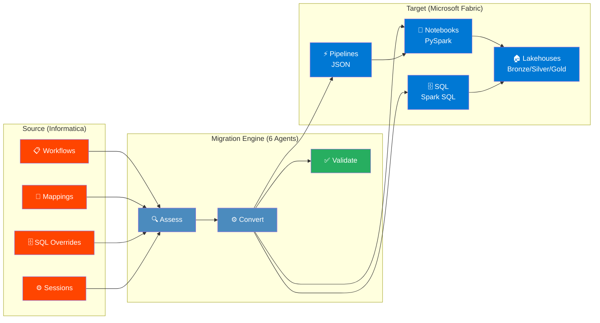
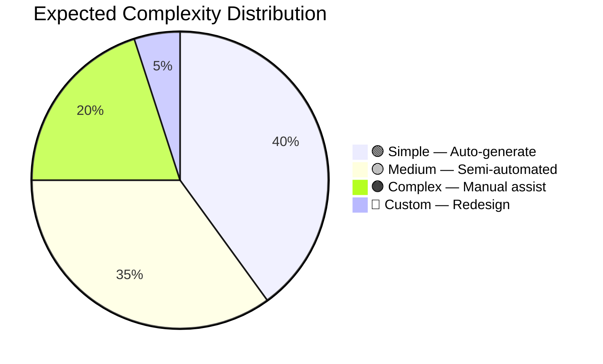
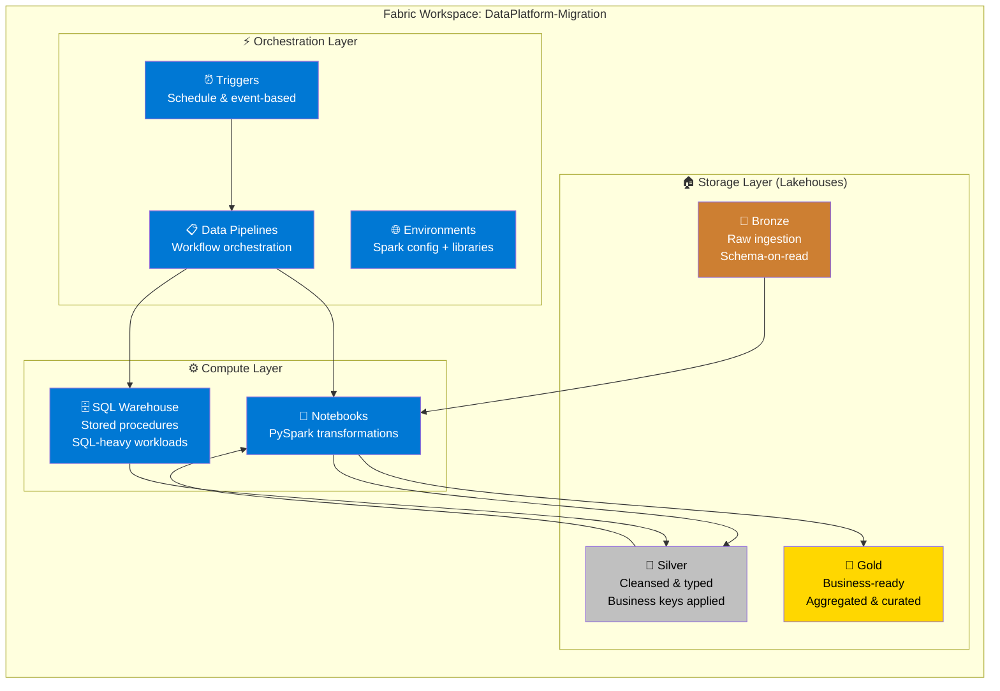
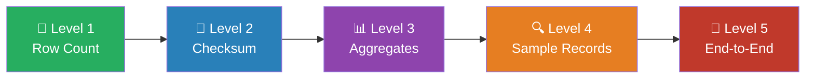
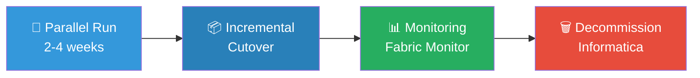
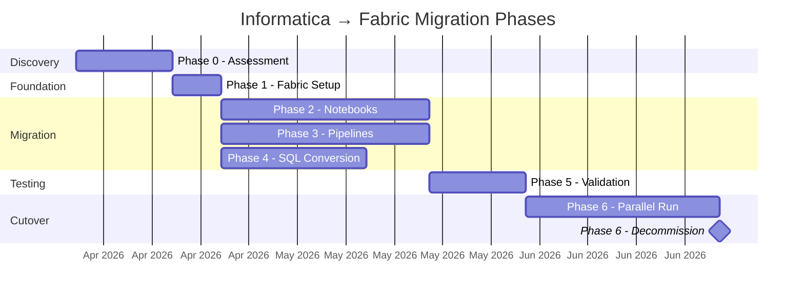

<p align="center">
  
  
  
</p>

<h1 align="center">Migration Plan — Informatica to Microsoft Fabric</h1>

<p align="center">
  <strong>A 6-phase strategy to migrate Informatica PowerCenter/IICS workloads to Microsoft Fabric.</strong>
</p>

---

## Executive Summary

This plan outlines the migration strategy from **Informatica PowerCenter/IICS** to **Microsoft Fabric**, replacing ETL/ELT workloads with a combination of:

| Informatica Component | Fabric Target | Agent |
|---|---|---|
| Mappings (transformations) | **Fabric Notebooks** (PySpark / Spark SQL) | `@notebook-migration` |
| Workflows / Taskflows | **Fabric Data Pipelines** (ADF-based orchestration) | `@pipeline-migration` |
| SQL overrides / Stored Procs | **Fabric SQL / Warehouse SQL** | `@sql-migration` |
| Sessions / connections | **Fabric Lakehouses + Shortcuts** | `@assessment` |
| Scheduler | **Pipeline Triggers + Fabric Scheduler** | `@pipeline-migration` |

### Migration Overview



---

## Phase 0 — Discovery & Assessment

### 0.1 Inventory Extraction
- Export all Informatica **workflows**, **mappings**, **sessions**, and **connections** as XML.
- Parse XML metadata to build a structured inventory:
  - Source/target tables and systems (Oracle, flat files, etc.)
  - Transformation types (SQ, EXP, LKP, AGG, RTR, FIL, JNR, UPD, etc.)
  - SQL overrides and stored procedure calls
  - Workflow dependencies and scheduling info
  - Parameter files and variable usage

### 0.2 Complexity Classification
Each mapping is classified by migration complexity:



| Complexity | Criteria | Migration Path |
|---|---|---|
| 🟢 **Simple** | Source → Filter/Expression → Target, no SQL override | Auto-generate Notebook |
| 🟡 **Medium** | Lookups, Aggregators, Joiners, simple SQL overrides | Semi-automated Notebook |
| 🟠 **Complex** | Routers, Update Strategy, stored procs, multi-pipeline | Manual Notebook + SQL |
| 🔴 **Custom** | Java/custom transformations, SDK calls | Redesign in Fabric |

### 0.3 Dependency Mapping
- Build a DAG of workflow/mapping dependencies
- Identify shared reusable transformations (mapplets)
- Map Oracle DB connections → Fabric Lakehouse/Warehouse connections

---

## Phase 1 — Foundation Setup in Fabric

### 1.1 Fabric Workspace Architecture



### 1.2 Connection Setup
- Configure **Shortcuts** or **Pipelines** for Oracle source ingestion
- Set up **OneLake** storage for intermediate and target data
- Configure **Fabric SQL Warehouse** for SQL-heavy transformations
- Create **Fabric Environment** with required Python/Spark libraries

---

## Phase 2 — Transformation Migration (Mappings → Notebooks)

### 2.1 Mapping-to-Notebook Conversion Rules

| Informatica Transformation | Fabric Notebook (PySpark) |
|---|---|
| Source Qualifier (SQ) | `spark.read.format("delta").load()` or JDBC read |
| Expression (EXP) | `.withColumn()` / `.select(expr(...))` |
| Filter (FIL) | `.filter()` / `.where()` |
| Aggregator (AGG) | `.groupBy().agg()` |
| Joiner (JNR) | `.join()` |
| Lookup (LKP) | `.join()` (broadcast for small tables) |
| Router (RTR) | Multiple `.filter()` branches |
| Update Strategy (UPD) | Delta merge (`MERGE INTO`) |
| Sorter (SRT) | `.orderBy()` |
| Rank (RNK) | `Window` functions with `row_number()` |
| Union (UNI) | `.union()` / `.unionByName()` |
| Normalizer | `.explode()` |
| Stored Procedure (SP) | Fabric SQL endpoint or Notebook `%%sql` |
| Sequence Generator | `monotonically_increasing_id()` or Delta identity |

### 2.2 Notebook Template
Each migrated mapping produces a notebook following this pattern:

```python
# Cell 1: Parameters (mapped from Informatica parameter file)
source_table = "schema.table_name"
target_lakehouse = "Silver"
load_date = dbutils.widgets.get("load_date")

# Cell 2: Read Source
df_source = spark.read.format("jdbc").options(**oracle_config).load()

# Cell 3: Transformations (mapped from EXP, FIL, AGG, etc.)
df_transformed = (
    df_source
    .filter(col("status") == "ACTIVE")
    .withColumn("full_name", concat(col("first_name"), lit(" "), col("last_name")))
    .groupBy("department").agg(count("*").alias("emp_count"))
)

# Cell 4: Write Target
df_transformed.write.format("delta").mode("overwrite").saveAsTable(f"{target_lakehouse}.target_table")
```

---

## Phase 3 — Orchestration Migration (Workflows → Data Pipelines)

### 3.1 Workflow-to-Pipeline Mapping

| Informatica Workflow Element | Fabric Data Pipeline |
|---|---|
| Workflow | Data Pipeline |
| Session | Notebook Activity |
| Command Task | Notebook Activity or Script Activity |
| Timer | Wait Activity or Schedule Trigger |
| Decision | If Condition Activity |
| Event Wait/Raise | Pipeline dependency / Get Metadata |
| Assignment | Set Variable Activity |
| Email Task | Web Activity (Logic App / webhook) |
| Link conditions | Activity dependency conditions (Success/Failure/Completion) |
| Worklet | Child Pipeline (Invoke Pipeline Activity) |

### 3.2 Pipeline Template Structure
```json
{
  "name": "PL_<workflow_name>",
  "activities": [
    {
      "type": "NotebookActivity",
      "name": "NB_<mapping_name>",
      "notebook": { "referenceName": "NB_<mapping_name>" },
      "parameters": { "load_date": "@pipeline().parameters.load_date" }
    }
  ],
  "parameters": {
    "load_date": { "type": "string", "defaultValue": "@utcnow()" }
  }
}
```

---

## Phase 4 — SQL Migration (Oracle → Fabric SQL)

### 4.1 Scope
- Informatica SQL overrides → Fabric Notebook `%%sql` cells or Warehouse stored procedures
- Oracle stored procedures called by Informatica → Fabric Warehouse SQL or Notebook logic
- Oracle-specific syntax → T-SQL/Spark SQL equivalent

### 4.2 Common Oracle → Fabric SQL Conversions

| Oracle SQL | Fabric SQL (T-SQL / Spark SQL) |
|---|---|
| `NVL(a, b)` | `COALESCE(a, b)` |
| `DECODE(...)` | `CASE WHEN ... END` |
| `SYSDATE` | `CURRENT_TIMESTAMP` |
| `ROWNUM` | `ROW_NUMBER() OVER(...)` |
| `TO_DATE(str, fmt)` | `CAST(str AS DATE)` / `to_date()` |
| `TO_CHAR(date, fmt)` | `FORMAT(date, fmt)` / `date_format()` |
| `NVL2(a, b, c)` | `CASE WHEN a IS NOT NULL THEN b ELSE c END` |
| `(+)` outer join | `LEFT JOIN` / `RIGHT JOIN` |
| `CONNECT BY` | Recursive CTE |
| `MERGE INTO` | Delta `MERGE INTO` (Spark SQL) |

---

## Phase 5 — Testing & Validation

### 5.1 Validation Strategy



| Level | Method | What It Checks |
|---|---|---|
| **L1** | Row Count | Source vs. target row counts match |
| **L2** | Checksum | Hash-based comparison of key columns |
| **L3** | Aggregates | SUM, AVG, MIN, MAX of metric columns |
| **L4** | Sample Records | Field-by-field comparison of random sample |
| **L5** | End-to-End | Full pipeline run + downstream report validation |

### 5.2 Automated Validation Notebook
A dedicated validation notebook runs post-migration:
```python
# Compare row counts
oracle_count = spark.read.jdbc(url, "source_table").count()
fabric_count = spark.table("silver.target_table").count()
assert oracle_count == fabric_count, f"Row mismatch: {oracle_count} vs {fabric_count}"
```

> [!TIP]
> The `@validation` agent auto-generates validation notebooks for every migrated mapping. See [templates/validation_template.py](templates/validation_template.py).

---

## Phase 6 — Cutover & Decommission



1. **Parallel Run** — Run Informatica and Fabric side-by-side for 2-4 weeks
2. **Incremental Cutover** — Migrate workflows in batches by priority and dependency order
3. **Monitoring** — Fabric Monitor + Pipeline run history + alerting
4. **Decommission** — Disable Informatica workflows after validation sign-off

---

## Migration Timeline



| Phase | Description | Key Outputs |
|---|---|---|
| **Phase 0** | Discovery & Assessment | `inventory.json`, `complexity_report.md`, `dependency_dag.json` |
| **Phase 1** | Fabric Foundation Setup | Workspace, Lakehouses, Warehouse, Environment |
| **Phase 2** | Transformation Migration | `NB_*.py` notebooks in `output/notebooks/` |
| **Phase 3** | Orchestration Migration | `PL_*.json` pipelines in `output/pipelines/` |
| **Phase 4** | SQL Migration | `SQL_*.sql` files in `output/sql/` |
| **Phase 5** | Testing & Validation | `VAL_*.py` scripts + `test_matrix.md` |
| **Phase 6** | Cutover & Decommission | Sign-off, Informatica shutdown |

---

## Multi-Agent Architecture

The migration is powered by a **6-agent system** defined in the `.github/agents/` directory.

> **Full details:** [AGENTS.md](AGENTS.md) — Architecture diagrams, interaction flows, handoff protocol, file ownership rules.

---

<p align="center">
  <sub>See <a href="README.md">README.md</a> for quick start and usage instructions.</sub>
</p>
