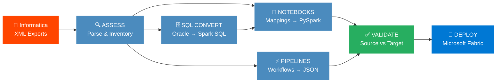
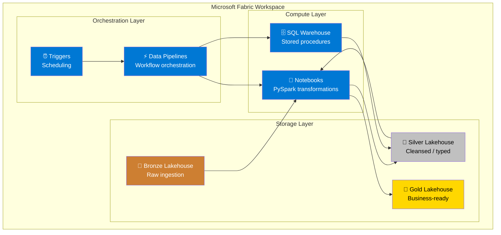
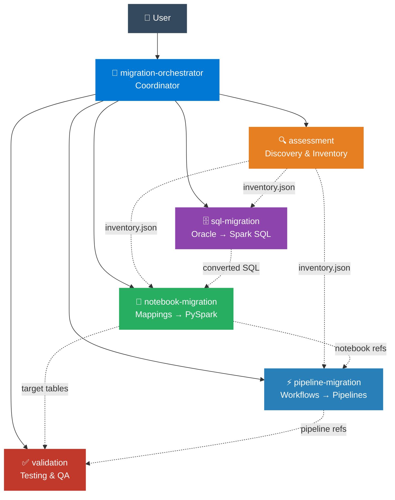
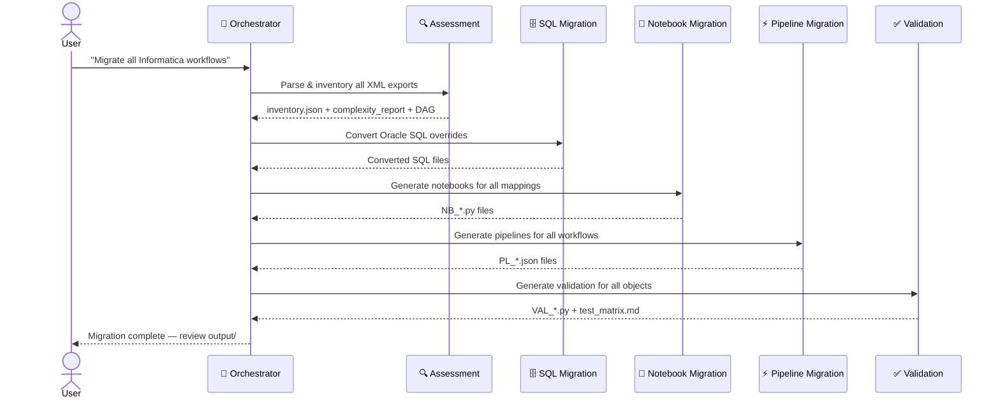
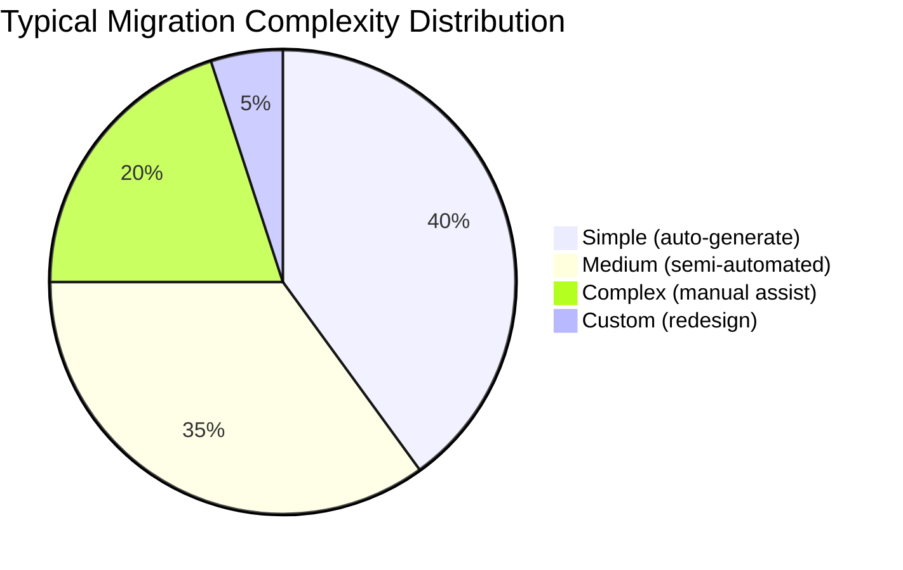

<p align="center">
  
  
  
</p>

<h1 align="center">Informatica to Microsoft Fabric Migration</h1>

<p align="center">
  <strong>Migrate Informatica PowerCenter/IICS workloads to Microsoft Fabric — Notebooks, Data Pipelines & SQL — powered by a 6-agent AI system.</strong>
</p>

<p align="center">
  
  
  
  
  
  
</p>

<p align="center">
  <a href="#-quick-start">Quick Start</a> •
  <a href="#-what-gets-migrated">What Gets Migrated</a> •
  <a href="#-how-it-works">How It Works</a> •
  <a href="#-multi-agent-architecture">Agents</a> •
  <a href="#-transformation-mapping">Mappings</a> •
  <a href="#-documentation">Docs</a>
</p>

---

## ⚡ Quick Start

```
1. Place Informatica XML exports in input/
2. Invoke: @migration-orchestrator start migration
3. Review generated artifacts in output/
4. Deploy to Microsoft Fabric
```

> [!TIP]
> You can also invoke individual agents for targeted tasks:
> `@notebook-migration convert mapping M_LOAD_CUSTOMERS`

---

## 🎯 What Gets Migrated

<table>
<tr>
<td width="50%">

### 📓 Mappings → Notebooks
Every Informatica mapping becomes a **Fabric Notebook** (PySpark):
Source Qualifier, Expression, Filter, Aggregator, Joiner, Lookup, Router, Update Strategy, Rank, Union, Normalizer, Sequence Generator, Stored Procedure

</td>
<td width="50%">

### ⚡ Workflows → Data Pipelines
Every Informatica workflow becomes a **Fabric Data Pipeline** (JSON):
Sessions, Command Tasks, Timers, Decisions, Event Wait/Raise, Assignments, Email Tasks, Worklets, Link Conditions

</td>
</tr>
<tr>
<td>

### 🗄️ SQL → Spark SQL / T-SQL
All Oracle SQL is converted to Fabric-compatible SQL:
SQL overrides, stored procedures, pre/post-session SQL, Oracle functions (NVL, DECODE, SYSDATE, ROWNUM, CONNECT BY, (+) joins)

</td>
<td>

### ✅ Automated Validation
Every migrated object gets a validation notebook:
Row count checks, column checksums, aggregate comparisons, sample record diffs, NULL/duplicate detection, tolerance handling

</td>
</tr>
</table>

> [!NOTE]
> The migration targets a **Medallion architecture** — Bronze (raw), Silver (cleansed), Gold (curated) — using **Delta Lake** on **OneLake**.

---

## 🔧 How It Works



**Phase 0 — Assess:** Parse Informatica XML, build inventory, classify complexity, map dependencies

**Phase 1 — Convert SQL:** Oracle-specific SQL → Spark SQL / T-SQL equivalents

**Phase 2 — Generate Notebooks:** Each mapping → PySpark notebook with transformation logic

**Phase 3 — Generate Pipelines:** Each workflow → Data Pipeline JSON with dependency chains

**Phase 4 — Validate:** Automated row counts, checksums, and aggregate comparisons

**Phase 5 — Deploy:** Push artifacts to Microsoft Fabric workspace

### 🏗️ Fabric Target Architecture



---

## 🤖 Multi-Agent Architecture

The migration is powered by **6 specialized VS Code Copilot agents**, each with focused expertise and clear responsibilities.



### Agent Quick Reference

| Agent | Invoke With | Role | Inputs | Outputs |
|-------|-------------|------|--------|---------|
| **@migration-orchestrator** | `@migration-orchestrator start migration` | Plans waves, delegates, tracks progress | User request | Migration plan, status reports |
| **@assessment** | `@assessment parse input/workflows/` | Parses XML, classifies complexity, maps deps | Informatica XML exports | `inventory.json`, `complexity_report.md`, `dependency_dag.json` |
| **@sql-migration** | `@sql-migration convert Oracle SQL overrides` | Oracle → Spark SQL / T-SQL | SQL overrides, stored procs | Converted `.sql` files |
| **@notebook-migration** | `@notebook-migration convert mapping M_LOAD_X` | Mapping → PySpark notebook | Mapping metadata | `NB_*.py` notebook files |
| **@pipeline-migration** | `@pipeline-migration convert workflow WF_DAILY` | Workflow → Pipeline JSON | Workflow metadata, notebook refs | `PL_*.json` pipeline files |
| **@validation** | `@validation generate tests for Silver tables` | Generates validation scripts | Source/target table pairs | `VAL_*.py` notebooks, test matrix |

### Agent Interaction Flow



---

## 🔄 Transformation Mapping

> **Full reference:** [.vscode/instructions/informatica-patterns.instructions.md](.vscode/instructions/informatica-patterns.instructions.md)

### Informatica → PySpark Conversion

<details>
<summary><b>📋 Complete transformation table</b> (click to expand)</summary>

| Informatica Transformation | PySpark Equivalent | Notes |
|---|---|---|
| Source Qualifier (SQ) | `spark.read.format("jdbc").load()` / `spark.table()` | JDBC for Oracle, Delta for Lakehouse |
| Expression (EXP) | `.withColumn()` / `.select(expr(...))` | Map each port to a column expression |
| Filter (FIL) | `.filter()` / `.where()` | Direct condition mapping |
| Aggregator (AGG) | `.groupBy().agg()` | Map GROUP BY ports + aggregate functions |
| Joiner (JNR) | `.join()` | Inner/Left/Right/Full based on join type |
| Lookup (LKP) | `broadcast()` + `.join()` | Broadcast for small lookup tables (<100MB) |
| Router (RTR) | Multiple `.filter()` branches | One DataFrame per output group |
| Update Strategy (UPD) | Delta `MERGE INTO` | DD_INSERT/UPDATE/DELETE mapped |
| Sorter (SRT) | `.orderBy()` | Direct sort mapping |
| Rank (RNK) | `Window` + `row_number()` | Window function with partition/order |
| Union (UNI) | `.union()` / `.unionByName()` | Schema alignment if needed |
| Normalizer | `.explode()` | Array/struct normalization |
| Stored Procedure (SP) | `%%sql` / PySpark logic | Convert SP body, not just the call |
| Sequence Generator | `monotonically_increasing_id()` | Or Delta identity columns |

</details>

### Oracle SQL → Spark SQL Conversion

<details>
<summary><b>📋 Oracle function mapping</b> (click to expand)</summary>

| Category | Oracle | Spark SQL |
|----------|--------|-----------|
| Null | `NVL(a, b)` | `COALESCE(a, b)` |
| Null | `NVL2(a, b, c)` | `CASE WHEN a IS NOT NULL THEN b ELSE c END` |
| Logic | `DECODE(a, b, c, d)` | `CASE WHEN a=b THEN c ELSE d END` |
| Date | `SYSDATE` | `current_timestamp()` |
| Date | `TO_DATE(s, 'YYYY-MM-DD')` | `to_date(s, 'yyyy-MM-dd')` |
| Date | `TO_CHAR(d, 'YYYY-MM-DD')` | `date_format(d, 'yyyy-MM-dd')` |
| Date | `TRUNC(date)` | `date_trunc('day', date)` |
| Date | `ADD_MONTHS(d, n)` | `add_months(d, n)` |
| Number | `TO_NUMBER(s)` | `CAST(s AS DECIMAL)` |
| Text | `SUBSTR(s, 1, 5)` | `SUBSTRING(s, 1, 5)` |
| Text | `\|\|` (concat) | `concat()` / `concat_ws()` |
| Rank | `ROWNUM` | `ROW_NUMBER() OVER(...)` |
| Regex | `REGEXP_LIKE(s, p)` | `s RLIKE p` |
| Agg | `LISTAGG(col, ',')` | `CONCAT_WS(',', COLLECT_LIST(col))` |
| Join | `a.id = b.id(+)` | `a LEFT JOIN b ON a.id = b.id` |
| Hierarchy | `CONNECT BY PRIOR` | Recursive CTE |
| DML | `MERGE INTO` | Delta `MERGE INTO` |
| Meta | `DUAL` table | Remove `FROM DUAL` |
| Sequence | `SEQ.NEXTVAL` | `monotonically_increasing_id()` |

</details>

### Workflow → Pipeline Mapping

<details>
<summary><b>📋 Workflow element mapping</b> (click to expand)</summary>

| Informatica Workflow Element | Fabric Data Pipeline Activity |
|---|---|
| Workflow | Data Pipeline |
| Session | Notebook Activity |
| Command Task | Notebook Activity / Script Activity |
| Timer (wait) | Wait Activity |
| Decision | If Condition Activity |
| Event Wait | Get Metadata + If Condition |
| Event Raise | Set Variable Activity |
| Assignment | Set Variable Activity |
| Email Task | Web Activity (Logic App webhook) |
| Worklet | Invoke Pipeline (child pipeline) |
| Link — Unconditional | `dependsOn: Succeeded` |
| Link — On Success | `dependsOn: Succeeded` |
| Link — On Failure | `dependsOn: Failed` |
| Link — Conditional | If Condition wrapping next activity |

</details>

---

## 📊 Complexity Classification



| Complexity | Criteria | Migration Path | Agent |
|---|---|---|---|
| 🟢 **Simple** | SQ → EXP/FIL → TGT, no SQL override | Auto-generate Notebook | `@notebook-migration` |
| 🟡 **Medium** | LKP, AGG, JNR, simple SQL overrides | Semi-automated Notebook | `@notebook-migration` + `@sql-migration` |
| 🟠 **Complex** | RTR, UPD, complex SQL, multiple targets, SPs | Manual Notebook + SQL | All agents |
| 🔴 **Custom** | Java/Custom transformations, SDK calls | Redesign in Fabric | Manual + `@notebook-migration` |

---

## 📁 Project Structure

```
InformaticaToDBFabric/
├── .github/
│   └── agents/                          # 🤖 Agent definitions (6 agents)
│       ├── migration-orchestrator.agent.md  # Coordinator
│       ├── assessment.agent.md              # Discovery & inventory
│       ├── notebook-migration.agent.md      # Mapping → Notebook
│       ├── pipeline-migration.agent.md      # Workflow → Pipeline
│       ├── sql-migration.agent.md           # Oracle SQL → Spark SQL
│       └── validation.agent.md              # Testing & QA
├── .vscode/
│   └── instructions/
│       └── informatica-patterns.instructions.md  # 📘 Shared conversion rules
├── input/                               # 📂 Informatica exports (your files go here)
│   ├── workflows/                       #   Workflow XML exports
│   ├── mappings/                        #   Mapping XML exports
│   ├── sessions/                        #   Session XML exports
│   └── sql/                             #   Oracle SQL / stored procedures
├── output/                              # 📤 Generated Fabric artifacts
│   ├── inventory/                       #   Assessment results (JSON/CSV)
│   ├── notebooks/                       #   Generated Fabric Notebooks (.py)
│   ├── pipelines/                       #   Generated Pipeline JSON
│   ├── sql/                             #   Converted SQL files
│   └── validation/                      #   Validation scripts + test matrix
├── templates/                           # 📋 Reusable templates
│   ├── notebook_template.py             #   Base notebook structure
│   ├── pipeline_template.json           #   Base pipeline JSON
│   └── validation_template.py           #   Base validation notebook
├── AGENTS.md                            # 🤖 Multi-agent architecture
├── GAP_ANALYSIS.md                      # 📊 Object inventory & gap analysis
├── MIGRATION_PLAN.md                    # 📝 Full migration strategy
└── README.md                            # 📖 This file
```

---

## 🚀 Usage

### Full Migration (Orchestrated)

```
@migration-orchestrator start migration
```

The orchestrator will:
1. Delegate to `@assessment` → parse all XML, build inventory
2. Delegate to `@sql-migration` → convert Oracle SQL
3. Delegate to `@notebook-migration` → generate PySpark notebooks
4. Delegate to `@pipeline-migration` → generate pipeline JSON
5. Delegate to `@validation` → generate test scripts
6. Produce a migration summary report

### Individual Agent Tasks

```
# Parse and inventory Informatica exports
@assessment parse the workflow XML in input/workflows/

# Convert a specific mapping to a Fabric Notebook
@notebook-migration convert mapping M_LOAD_CUSTOMERS

# Convert Oracle SQL overrides to Spark SQL
@sql-migration convert the SQL overrides from inventory

# Generate a pipeline for a specific workflow
@pipeline-migration convert workflow WF_DAILY_LOAD

# Generate validation tests for all Silver lakehouse tables
@validation generate tests for the Silver lakehouse tables
```

### Fabric Deployment

After generation, deploy artifacts to Fabric using:
- **Fabric Git Integration** — connect your repo to a Fabric workspace
- **Manual Upload** — import notebooks and pipelines through the Fabric portal
- **Fabric REST API** — automate deployment via API calls

---

## 📸 Generated Output Examples

Here are excerpts from actual generated artifacts to illustrate what the agents produce.

### PySpark Notebook (Simple Mapping)

From `output/notebooks/NB_M_LOAD_CUSTOMERS.py`:

```python
# --- Transformation: EXP_DERIVE_FIELDS (Expression) ---
df = df_source.withColumn(
    "FULL_NAME", concat_ws(" ", col("FIRST_NAME"), col("LAST_NAME"))
).withColumn(
    "LOAD_DATE", current_timestamp()
)

# --- Transformation: FIL_ACTIVE_ONLY (Filter) ---
df = df.filter(col("STATUS") == "ACTIVE")

# Write to target — silver.dim_customer
df.write.format("delta").mode("overwrite").option("overwriteSchema", "true") \
    .saveAsTable("silver.dim_customer")
```

### SQL Conversion (Oracle → Spark SQL)

From `output/sql/SQL_SP_UPDATE_ORDER_STATS.sql`:

```sql
-- Oracle: NVL(discount, 0)        → Spark: COALESCE(discount, 0)
-- Oracle: SYSDATE                 → Spark: current_timestamp()
-- Oracle: DECODE(status, 'A', 1)  → Spark: CASE WHEN status = 'A' THEN 1 ... END

MERGE INTO silver.order_stats AS t
USING staging_order_agg AS s
ON t.order_date = s.order_date
WHEN MATCHED THEN UPDATE SET
    t.total_amount = s.total_amount,
    t.updated_at = current_timestamp()
WHEN NOT MATCHED THEN INSERT *;
```

### Pipeline JSON (Workflow → Fabric Pipeline)

From `output/pipelines/PL_WF_DAILY_SALES_LOAD.json`:

```json
{
  "name": "NB_M_LOAD_ORDERS",
  "type": "NotebookActivity",
  "dependsOn": [
    { "activity": "NB_M_LOAD_CUSTOMERS", "dependencyConditions": ["Succeeded"] }
  ],
  "typeProperties": {
    "notebook": { "referenceName": "NB_M_LOAD_ORDERS", "type": "NotebookReference" },
    "parameters": {
      "load_date": { "value": "@pipeline().parameters.load_date", "type": "string" }
    }
  }
}
```

### Validation Notebook (Row Count Check)

From `output/validation/VAL_FACT_ORDERS.py`:

```python
# Level 1: Row Count Comparison
src_count = df_oracle.count()
tgt_count = spark.table("silver.fact_orders").count()
row_count_match = src_count == tgt_count
results.append(("Row Count", "PASS" if row_count_match else "FAIL",
                f"Source: {src_count}, Target: {tgt_count}"))
```

---

## 📝 Documentation

| Document | Description |
|----------|-------------|
| [README.md](README.md) | Project overview (this file) |
| [GAP_ANALYSIS.md](GAP_ANALYSIS.md) | Informatica object inventory & migration gap analysis |
| [MIGRATION_PLAN.md](MIGRATION_PLAN.md) | Detailed 6-phase migration strategy |
| [AGENTS.md](AGENTS.md) | Multi-agent architecture & interaction flows |
| [.vscode/instructions/informatica-patterns.instructions.md](.vscode/instructions/informatica-patterns.instructions.md) | Shared transformation patterns & SQL conversion rules |

### Agent Definitions

| Agent File | Role |
|------------|------|
| [migration-orchestrator.agent.md](.github/agents/migration-orchestrator.agent.md) | Coordinator — plans, delegates, tracks |
| [assessment.agent.md](.github/agents/assessment.agent.md) | Discovery — parses XML, builds inventory |
| [notebook-migration.agent.md](.github/agents/notebook-migration.agent.md) | Notebook generation — mappings → PySpark |
| [pipeline-migration.agent.md](.github/agents/pipeline-migration.agent.md) | Pipeline generation — workflows → JSON |
| [sql-migration.agent.md](.github/agents/sql-migration.agent.md) | SQL conversion — Oracle → Spark SQL |
| [validation.agent.md](.github/agents/validation.agent.md) | Validation — automated testing & QA |

---

## 📋 Migration Checklist

- [ ] **Phase 0** — Export Informatica XML → `input/` folders
- [ ] **Phase 0** — Run `@assessment` → review `output/inventory/`
- [ ] **Phase 1** — Create Fabric workspace with Bronze/Silver/Gold lakehouses
- [ ] **Phase 2** — Run `@notebook-migration` → review `output/notebooks/`
- [ ] **Phase 3** — Run `@pipeline-migration` → review `output/pipelines/`
- [ ] **Phase 4** — Run `@sql-migration` → review `output/sql/`
- [ ] **Phase 5** — Run `@validation` → review `output/validation/test_matrix.md`
- [ ] **Phase 5** — Execute validation notebooks in Fabric
- [ ] **Phase 6** — Parallel run (Informatica + Fabric side-by-side)
- [ ] **Phase 6** — Cutover and decommission Informatica

---

<p align="center">
  <sub>Built with ❤️ using <a href="https://code.visualstudio.com/">VS Code</a> + <a href="https://github.com/features/copilot">GitHub Copilot</a> multi-agent architecture</sub>
</p>
