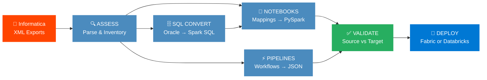
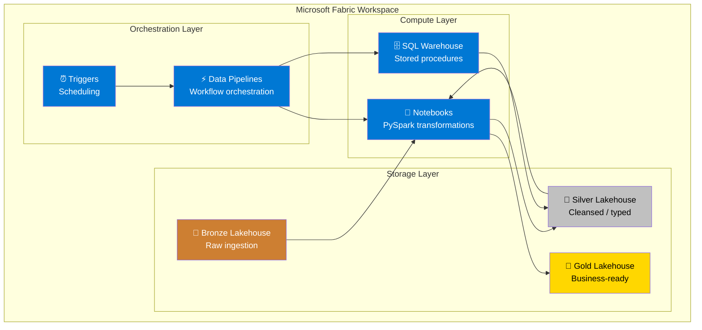
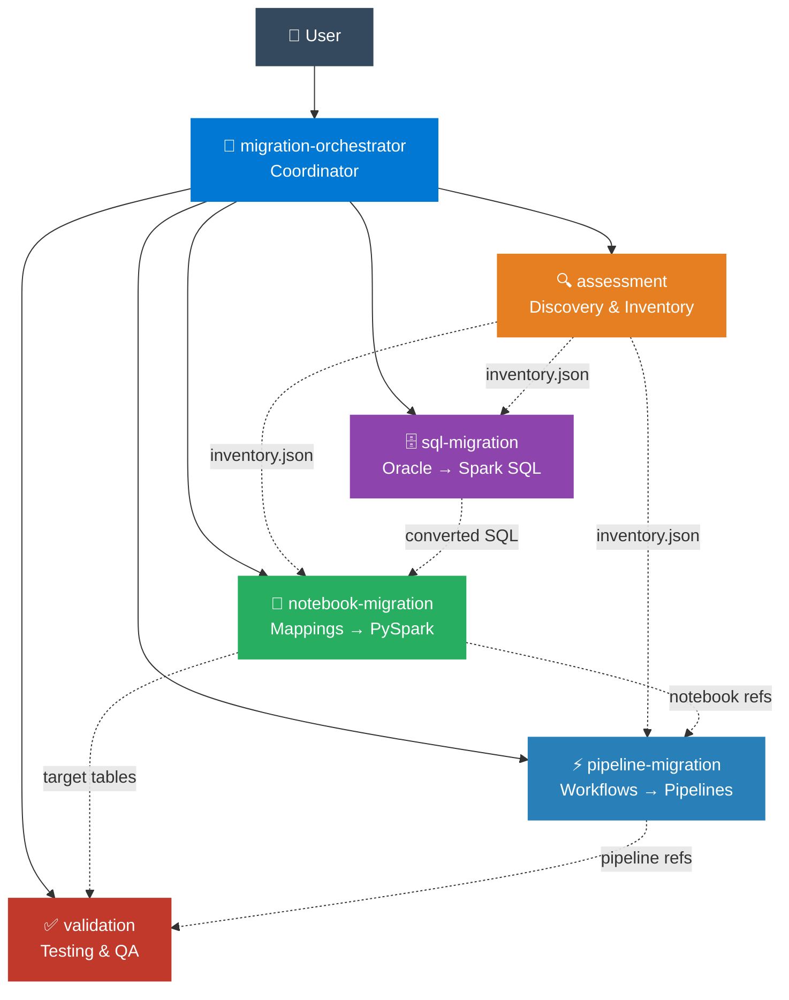
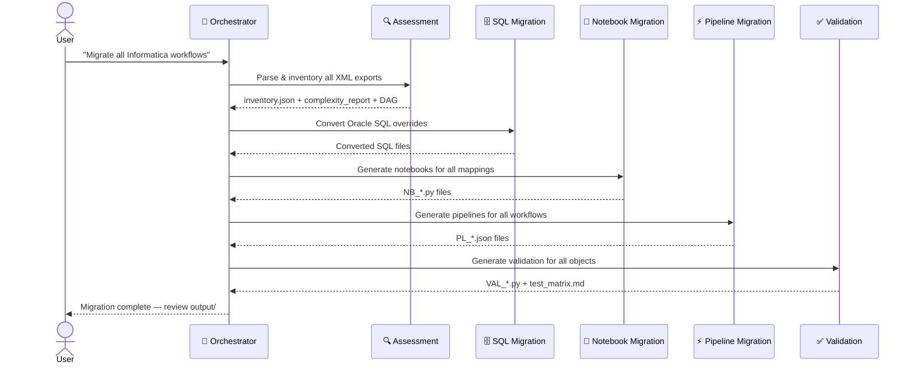
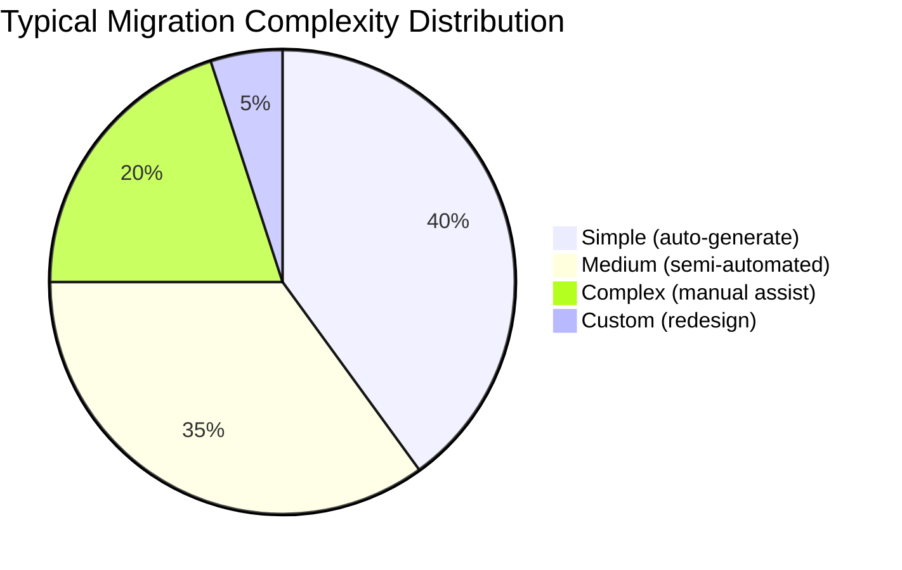

<p align="center">
  
  
  
</p>

<h1 align="center">Informatica to Microsoft Fabric / Azure Databricks Migration</h1>

<p align="center">
  <strong>End-to-end automated migration of Informatica PowerCenter & IICS workloads into Microsoft Fabric or Azure Databricks — PySpark Notebooks, DBT models, Data Pipelines / Databricks Workflows, AutoSys JIL conversion, Delta Lake DDL & multi-database SQL conversion — orchestrated by a 6-agent AI system.</strong>
</p>

<p align="center">
  
  
  
  
  
  
  
  
  
  
</p>

<p align="center">
  
  
  
  
  
</p>

<p align="center">
  <a href="#-quick-start">Quick Start</a> •
  <a href="#-what-gets-migrated">What Gets Migrated</a> •
  <a href="#-how-it-works">How It Works</a> •
  <a href="#-multi-agent-architecture">Agents</a> •
  <a href="#-transformation-mapping">Mappings</a> •
  <a href="examples/">📂 Examples</a> •
  <a href="#-documentation">Docs</a>
</p>

---

## ⚡ Quick Start

### Agent-driven (Copilot Chat)
```
1. Place Informatica XML exports in input/
2. Place AutoSys JIL files in input/autosys/ (optional)
3. Invoke: @migration-orchestrator start migration
4. Review generated artifacts in output/
5. Deploy to Microsoft Fabric or Azure Databricks
```

### Script-driven (Command Line)
```bash
# Install the package
pip install -e ".[dev]"

# Run the full pipeline (assessment → SQL → notebooks → DBT → pipelines → AutoSys → schema → validation)
informatica-to-fabric
# or: python run_migration.py

# Target Azure Databricks instead of Fabric
informatica-to-fabric --target databricks

# Target DBT models on Databricks (SQL-expressible mappings → dbt, complex → PySpark)
informatica-to-fabric --target dbt

# Auto-route: simple/medium → dbt, complex → PySpark notebooks
informatica-to-fabric --target auto

# PySpark-only on Databricks (no dbt)
informatica-to-fabric --target pyspark

# Include AutoSys JIL files from a custom directory
informatica-to-fabric --autosys-dir /path/to/jil/files

# Skip assessment if already done
informatica-to-fabric --skip 0

# Run only specific phases (e.g., SQL + notebooks)
informatica-to-fabric --only 1 2

# Preview without executing (dry-run)
informatica-to-fabric --dry-run --verbose

# Resume from last checkpoint (skip completed phases)
informatica-to-fabric --resume

# Use a custom config file with JSON logging
informatica-to-fabric --config migration.yaml --log-format json

# Deploy generated artifacts to Fabric workspace
python deploy_to_fabric.py --workspace-id <GUID> --dry-run

# Generate interactive dashboard
python dashboard.py --open
```

> [!TIP]
> You can also invoke individual agents for targeted tasks:
> `@notebook-migration convert mapping M_LOAD_CUSTOMERS`

---

## 🎯 What Gets Migrated

<table>
<tr>
<td width="50%">

### 📓 Mappings → Notebooks
Every Informatica mapping becomes a **Fabric Notebook** (PySpark):
Source Qualifier, Expression, Filter, Aggregator, Joiner, Lookup, Router, Update Strategy, Rank, Union, Normalizer, Sorter, Sequence Generator, Stored Procedure, **Mapplets** (auto-expanded), **SQL Transformation**, **Data Masking**, **Web Service Consumer**

</td>
<td width="50%">

### ⚡ Workflows → Data Pipelines / Databricks Workflows
Every Informatica workflow becomes a **Fabric Data Pipeline** (JSON) or **Databricks Workflow** (Jobs API JSON):
Sessions, Command Tasks, Timers, Decisions, Event Wait/Raise, Assignments, Email Tasks, Worklets, Link Conditions, **Control Tasks** (Abort/Fail → Fail Activity), **IICS Taskflows**

</td>
</tr>
<tr>
<td>

### ⚙️ AutoSys JIL → Pipelines / Workflows
CA AutoSys **JIL (Job Information Language)** files are parsed and converted:
BOX → Pipeline container, CMD (pmcmd) → Notebook activity, FW → File sensor/trigger, **Conditions** (s/f/n/d) → dependsOn with Succeeded/Failed/Completed, **Calendars** → cron schedules, **alarm_if_fail** → webhook notifications, **Cross-box dependencies** → Execute Pipeline references. AutoSys jobs calling `pmcmd startworkflow` are automatically **linked to Informatica workflows** in the inventory.

</td>
<td>

### 🏗️ DBT Models (Databricks target)
Simple/Medium mappings can be migrated to **dbt models** instead of PySpark:
3-layer model generation (staging/intermediate/marts), Oracle→Databricks SQL conversion, `dbt_project.yml` + `profiles.yml` + `sources.yml` + `schema.yml` scaffolding, **auto-routing** (`--target auto`) routes SQL-expressible mappings to dbt and complex mappings to PySpark notebooks.

</td>
</tr>
<tr>
<td>

### 🗄️ SQL → Spark SQL / T-SQL
All Oracle, **SQL Server, Teradata, DB2, MySQL, and PostgreSQL** SQL is converted to Fabric-compatible SQL:
SQL overrides, stored procedures, pre/post-session SQL, Oracle functions (NVL, DECODE, SYSDATE, ROWNUM, CONNECT BY, (+) joins), **Oracle analytics** (LEAD, LAG, DENSE_RANK, NTILE, ROW_NUMBER, FIRST_VALUE, LAST_VALUE), **SQL Server** (GETDATE, ISNULL, CROSS APPLY, STRING_AGG, TOP, etc.), **Teradata** (QUALIFY, SAMPLE, COLLECT STATISTICS, VOLATILE TABLE, ZEROIFNULL), **DB2** (FETCH FIRST, VALUE, RRN, WITH UR), **MySQL** (IFNULL, NOW(), GROUP_CONCAT, backtick identifiers), **PostgreSQL** (:: casts, ILIKE, SERIAL, ARRAY_AGG, ON CONFLICT), **PL/SQL Package splitting**

</td>
<td>

### ✅ Automated Validation
Every migrated object gets a validation notebook:
Row count checks, column checksums, aggregate comparisons, sample record diffs, NULL/duplicate detection, tolerance handling

</td>
</tr>
</table>

> [!NOTE]
> The migration targets a **Medallion architecture** — Bronze (raw), Silver (cleansed), Gold (curated) — using **Delta Lake** on **OneLake**.

### 🌐 Supported Sources

| Source Platform | Assessment | SQL Conversion | Status |
|---|---|---|---|
| **Informatica PowerCenter** 9.x/10.x | ✅ Full XML parsing | ✅ Oracle + SQL Server + Teradata + DB2 + MySQL + PostgreSQL | Production-ready |
| **Informatica IICS** (Cloud) | ✅ Taskflows + Mappings + Sync/MassIngestion | ✅ Namespace-aware | Production-ready (Sprint 19) |
| **Oracle** SQL overrides & stored procs | ✅ 43+ patterns | ✅ Full conversion + GTT/MV/DB links | Production-ready |
| **SQL Server** SQL overrides & stored procs | ✅ 18 patterns | ✅ T-SQL → Spark SQL | Production-ready |
| **Flat files** (CSV, fixed-width) | ✅ Documented | ✅ `spark.read.csv()` patterns | Production-ready |
| **Mapplets** (reusable fragments) | ✅ Parsed + expanded | ✅ Auto-resolved | Production-ready |
| **Parameter files** (.prm) | ✅ Parsed | ✅ Key-value extraction | Production-ready |
| **Connection objects** (XML + IICS) | ✅ Parsed | ✅ DB/FTP/generic/IICS | Production-ready |
| **Session configs** | ✅ Extracted → Spark config | ✅ DTM/cache/commit mapping | New in Sprint 20 |
| **Scheduler/Cron** | ✅ Schedule → cron expression | ✅ Pipeline triggers | New in Sprint 20 |
| **AutoSys JIL** (.jil files) | ✅ Full JIL parsing (BOX, CMD, FW, FT) | ✅ Conditions → dependsOn, calendars → cron | New in Sprint 61 |

### 🎯 Target Platforms

| Target Platform | Notebooks | Pipelines | Schema DDL | DBT Models | AutoSys | Secrets | Deploy |
|---|---|---|---|---|---|---|---|
| **Microsoft Fabric** | `notebookutils` / 2-level namespace | Fabric Data Pipeline JSON | Delta Lake on Lakehouse | — | JIL → Pipeline JSON | `notebookutils.credentials.getSecret()` | `deploy_to_fabric.py` |
| **Azure Databricks** | `dbutils` / Unity Catalog 3-level namespace | Databricks Workflow JSON (Jobs API) | Delta Lake on Unity Catalog | `--target dbt` | JIL → Workflow JSON | `dbutils.secrets.get()` | `deploy_to_databricks.py` |
| **DBT on Databricks** | — (SQL-only mappings) | Databricks Workflow with `dbt_task` | Via dbt schema.yml | `stg_` / `int_` / `mart_` models | JIL → Workflow JSON | dbt profiles.yml | `deploy_dbt_project.py` |

---

## 🔧 How It Works



**Phase 0 — Assess:** Parse Informatica XML, build inventory, classify complexity, map dependencies

**Phase 1 — Convert SQL:** Oracle-specific SQL → Spark SQL / T-SQL equivalents

**Phase 2 — Generate Notebooks:** Each mapping → PySpark notebook (Fabric or Databricks target)

**Phase 3 — Generate DBT Models:** Simple/Medium mappings → dbt staging/intermediate/marts SQL models (Databricks target only, `--target dbt|auto`)

**Phase 4 — Generate Pipelines:** Each workflow → Data Pipeline JSON or Databricks Workflow JSON

**Phase 5 — AutoSys JIL Migration:** Parse AutoSys JIL files → Pipeline/Workflow JSON, link pmcmd jobs to Informatica workflows

**Phase 6 — Schema:** Delta Lake DDL generation for Bronze/Silver/Gold (Lakehouse or Unity Catalog)

**Phase 7 — Validate:** 5-level validation — row counts, checksums, data quality rules, key sampling & aggregate comparison

**Phase 8 — Deploy:** Push artifacts to Microsoft Fabric workspace or Azure Databricks workspace

### 🏗️ Fabric Target Architecture



---

## 🤖 Multi-Agent Architecture

The migration is powered by **6 specialized VS Code Copilot agents**, each with focused expertise and clear responsibilities.



### Agent Quick Reference

| Agent | Invoke With | Role | Inputs | Outputs |
|-------|-------------|------|--------|---------|
| **@migration-orchestrator** | `@migration-orchestrator start migration` | Plans waves, delegates, tracks progress | User request | Migration plan, status reports |
| **@assessment** | `@assessment parse input/workflows/` | Parses XML, classifies complexity, maps deps | Informatica XML exports | `inventory.json`, `complexity_report.md`, `dependency_dag.json` |
| **@sql-migration** | `@sql-migration convert Oracle SQL overrides` | Oracle → Spark SQL / T-SQL | SQL overrides, stored procs | Converted `.sql` files |
| **@notebook-migration** | `@notebook-migration convert mapping M_LOAD_X` | Mapping → PySpark notebook | Mapping metadata | `NB_*.py` notebook files |
| **@pipeline-migration** | `@pipeline-migration convert workflow WF_DAILY` | Workflow → Pipeline JSON | Workflow metadata, notebook refs | `PL_*.json` pipeline files |
| **@validation** | `@validation generate tests for Silver tables` | Generates validation scripts | Source/target table pairs | `VAL_*.py` notebooks, test matrix |

### Agent Interaction Flow



---

## 🔄 Transformation Mapping

> **Full reference:** [.vscode/instructions/informatica-patterns.instructions.md](.vscode/instructions/informatica-patterns.instructions.md)

### Informatica → PySpark Conversion

<details>
<summary><b>📋 Complete transformation table</b> (click to expand)</summary>

| Informatica Transformation | PySpark Equivalent | Notes |
|---|---|---|
| Source Qualifier (SQ) | `spark.read.format("jdbc").load()` / `spark.table()` | JDBC for Oracle, Delta for Lakehouse |
| Expression (EXP) | `.withColumn()` / `.select(expr(...))` | Map each port to a column expression |
| Filter (FIL) | `.filter()` / `.where()` | Direct condition mapping |
| Aggregator (AGG) | `.groupBy().agg()` | Map GROUP BY ports + aggregate functions |
| Joiner (JNR) | `.join()` | Inner/Left/Right/Full based on join type |
| Lookup (LKP) | `broadcast()` + `.join()` | Broadcast for small lookup tables (<100MB) |
| Router (RTR) | Multiple `.filter()` branches | One DataFrame per output group |
| Update Strategy (UPD) | Delta `MERGE INTO` | DD_INSERT/UPDATE/DELETE mapped |
| Sorter (SRT) | `.orderBy()` | Direct sort mapping |
| Rank (RNK) | `Window` + `row_number()` | Window function with partition/order |
| Union (UNI) | `.union()` / `.unionByName()` | Schema alignment if needed |
| Normalizer | `.explode()` | Array/struct normalization |
| Stored Procedure (SP) | `%%sql` / PySpark logic | Convert SP body, not just the call |
| Sequence Generator | `monotonically_increasing_id()` | Or Delta identity columns |

</details>

### Oracle SQL → Spark SQL Conversion

<details>
<summary><b>📋 Oracle function mapping</b> (click to expand)</summary>

| Category | Oracle | Spark SQL |
|----------|--------|-----------|
| Null | `NVL(a, b)` | `COALESCE(a, b)` |
| Null | `NVL2(a, b, c)` | `CASE WHEN a IS NOT NULL THEN b ELSE c END` |
| Logic | `DECODE(a, b, c, d)` | `CASE WHEN a=b THEN c ELSE d END` |
| Date | `SYSDATE` | `current_timestamp()` |
| Date | `TO_DATE(s, 'YYYY-MM-DD')` | `to_date(s, 'yyyy-MM-dd')` |
| Date | `TO_CHAR(d, 'YYYY-MM-DD')` | `date_format(d, 'yyyy-MM-dd')` |
| Date | `TRUNC(date)` | `date_trunc('day', date)` |
| Date | `ADD_MONTHS(d, n)` | `add_months(d, n)` |
| Number | `TO_NUMBER(s)` | `CAST(s AS DECIMAL)` |
| Text | `SUBSTR(s, 1, 5)` | `SUBSTRING(s, 1, 5)` |
| Text | `\|\|` (concat) | `concat()` / `concat_ws()` |
| Rank | `ROWNUM` | `ROW_NUMBER() OVER(...)` |
| Regex | `REGEXP_LIKE(s, p)` | `s RLIKE p` |
| Agg | `LISTAGG(col, ',')` | `CONCAT_WS(',', COLLECT_LIST(col))` |
| Analytics | `LEAD(col, 1) OVER(...)` | `LEAD(col, 1) OVER(...)` (1:1) |
| Analytics | `LAG(col, 1) OVER(...)` | `LAG(col, 1) OVER(...)` (1:1) |
| Analytics | `DENSE_RANK() OVER(...)` | `DENSE_RANK() OVER(...)` (1:1) |
| Analytics | `NTILE(n) OVER(...)` | `NTILE(n) OVER(...)` (1:1) |
| Analytics | `FIRST_VALUE(col) OVER(...)` | `FIRST_VALUE(col) OVER(...)` (1:1) |
| Analytics | `LAST_VALUE(col) OVER(...)` | `LAST_VALUE(col) OVER(...)` (1:1) |
| Join | `a.id = b.id(+)` | `a LEFT JOIN b ON a.id = b.id` |
| Hierarchy | `CONNECT BY PRIOR` | Recursive CTE |
| DML | `MERGE INTO` | Delta `MERGE INTO` |
| Meta | `DUAL` table | Remove `FROM DUAL` |
| Sequence | `SEQ.NEXTVAL` | `monotonically_increasing_id()` |

</details>

### SQL Server → Spark SQL Conversion

<details>
<summary><b>📋 SQL Server function mapping</b> (click to expand)</summary>

| Category | SQL Server | Spark SQL |
|----------|------------|----------|
| Null | `ISNULL(a, b)` | `COALESCE(a, b)` |
| Date | `GETDATE()` | `current_timestamp()` |
| Date | `DATEADD(day, n, d)` | `date_add(d, n)` |
| Date | `DATEDIFF(day, a, b)` | `datediff(b, a)` |
| Date | `CONVERT(VARCHAR, d, 120)` | `date_format(d, 'yyyy-MM-dd HH:mm:ss')` |
| Text | `LEN(s)` | `LENGTH(s)` |
| Text | `CHARINDEX(sub, s)` | `INSTR(s, sub)` |
| Text | `STUFF(s, start, len, new)` | `CONCAT(SUBSTRING(s,1,start-1), new, SUBSTRING(s,start+len))` |
| Text | `STRING_AGG(col, ',')` | `CONCAT_WS(',', COLLECT_LIST(col))` |
| Logic | `IIF(cond, a, b)` | `CASE WHEN cond THEN a ELSE b END` |
| Type | `CAST(x AS NVARCHAR)` | `CAST(x AS STRING)` |
| Limit | `TOP n` | `LIMIT n` |
| Join | `CROSS APPLY` | `LATERAL VIEW` / `.explode()` |
| Join | `OUTER APPLY` | `LEFT LATERAL VIEW` |
| Table | `#temp_table` | `createOrReplaceTempView()` |
| Identity | `@@IDENTITY` / `SCOPE_IDENTITY()` | `monotonically_increasing_id()` |
| Error | `@@ERROR` / `TRY...CATCH` | Python try/except wrapper |

</details>

### Workflow → Pipeline Mapping

<details>
<summary><b>📋 Workflow element mapping</b> (click to expand)</summary>

| Informatica Workflow Element | Fabric Data Pipeline Activity |
|---|---|
| Workflow | Data Pipeline |
| Session | Notebook Activity |
| Command Task | Notebook Activity / Script Activity |
| Timer (wait) | Wait Activity |
| Decision | If Condition Activity |
| Event Wait | Get Metadata + If Condition |
| Event Raise | Set Variable Activity |
| Assignment | Set Variable Activity |
| Email Task | Web Activity (Logic App webhook) |
| Worklet | Invoke Pipeline (child pipeline) |
| Control Task (Abort/Fail) | Fail Activity |
| Link — Unconditional | `dependsOn: Succeeded` |
| Link — On Success | `dependsOn: Succeeded` |
| Link — On Failure | `dependsOn: Failed` |
| Link — Conditional | If Condition wrapping next activity |

</details>

### AutoSys JIL → Pipeline / Databricks Workflow Mapping

<details>
<summary><b>📋 AutoSys element mapping</b> (click to expand)</summary>

| AutoSys JIL Element | Fabric Data Pipeline / Databricks Workflow |
|---|---|
| BOX job | Pipeline container / Workflow |
| CMD job (`pmcmd startworkflow`) | Notebook Activity (linked to migrated notebook) |
| CMD job (generic command) | Script Activity / Notebook with TODO |
| FW (File Watcher) | GetMetadata Activity / File arrival trigger |
| FT (File Trigger) | Event-based trigger |
| `condition: s(job)` | `dependsOn: Succeeded` |
| `condition: f(job)` | `dependsOn: Failed` |
| `condition: n(job)` | `dependsOn: Skipped` |
| `condition: d(job)` | `dependsOn: Completed` |
| `days_of_week` + `start_times` | ScheduleTrigger / Quartz cron |
| `run_calendar` | Annotation with recommended cron |
| `alarm_if_fail` | Web Activity (webhook notification) |
| `machine` / `profile` | Cluster config annotation |
| Cross-box `condition` | Execute Pipeline / Run Job reference |
| `insert_calendar` | Calendar metadata (preserved as annotation) |

</details>

---

## 📊 Complexity Classification



| Complexity | Criteria | Migration Path | Agent |
|---|---|---|---|
| 🟢 **Simple** | SQ → EXP/FIL → TGT, no SQL override | Auto-generate Notebook | `@notebook-migration` |
| 🟡 **Medium** | LKP, AGG, JNR, simple SQL overrides | Semi-automated Notebook | `@notebook-migration` + `@sql-migration` |
| 🟠 **Complex** | RTR, UPD, complex SQL, multiple targets, SPs | Manual Notebook + SQL | All agents |
| 🔴 **Custom** | Java/Custom transformations, SDK calls | Redesign in Fabric | Manual + `@notebook-migration` |

---

## 📁 Project Structure

```
InformaticaToDBFabric/
├── .github/
│   └── agents/                          # 🤖 Agent definitions (6 agents)
│       ├── migration-orchestrator.agent.md  # Coordinator
│       ├── assessment.agent.md              # Discovery & inventory
│       ├── notebook-migration.agent.md      # Mapping → Notebook
│       ├── pipeline-migration.agent.md      # Workflow → Pipeline
│       ├── sql-migration.agent.md           # Oracle SQL → Spark SQL
│       └── validation.agent.md              # Testing & QA
├── .vscode/
│   └── instructions/
│       └── informatica-patterns.instructions.md  # 📘 Shared conversion rules
├── examples/                            # 📂 Browsable before/after migration examples
│   └── README.md                        #   10 walkthroughs with input→output links
├── input/                               # 📂 Informatica exports (your files go here)
│   ├── workflows/                       #   Workflow XML exports (PowerCenter + IICS)
│   ├── mappings/                        #   Mapping XML exports + .prm param files
│   ├── sessions/                        #   Session config XML exports
│   ├── sql/                             #   Oracle/SQL Server/Teradata/DB2/MySQL/PostgreSQL SQL
│   └── autosys/                         #   AutoSys JIL files (.jil)
├── output/                              # 📤 Generated Fabric artifacts
│   ├── inventory/                       #   Assessment results (JSON/Markdown)
│   ├── notebooks/                       #   Generated Fabric Notebooks (.py)
│   ├── pipelines/                       #   Generated Pipeline JSON
│   ├── dbt/                             #   Generated dbt project (models, config, schema)
│   ├── autosys/                         #   AutoSys → Pipeline/Workflow JSON + summary
│   ├── schema/                          #   Delta Lake DDL (Bronze/Silver/Gold) + setup notebook
│   ├── sql/                             #   Converted SQL files
│   └── validation/                      #   Validation scripts + test matrix + HTML report
├── templates/                           # 📋 Reusable templates
│   ├── notebook_template.py             #   Base notebook structure
│   ├── pipeline_template.json           #   Base pipeline JSON
│   └── validation_template.py           #   Base validation notebook
├── run_assessment.py                    # 🔍 Assessment script (Phase 0)
├── run_sql_migration.py                 # 🗄️ SQL conversion script (Phase 1)
├── run_notebook_migration.py            # 📓 Notebook generation script (Phase 2)
├── run_dbt_migration.py                 # 🏗️ DBT model generation script (Phase 3)
├── run_pipeline_migration.py            # ⚡ Pipeline generation script (Phase 4)
├── run_autosys_migration.py             # ⏰ AutoSys JIL migration script (Phase 5)
├── run_schema_generator.py               # 🏛️ Delta Lake DDL & setup notebook (Phase 6)
├── run_validation.py                    # ✅ Validation generation script (Phase 7)
├── run_migration.py                     # 🎯 End-to-end orchestrator (8 phases)
├── deploy_to_fabric.py                  # 🚀 Fabric REST API deployment script
├── deploy_to_databricks.py              # 🚀 Databricks REST API deployment script
├── dashboard.py                         # 📊 Interactive HTML dashboard generator
├── generate_html_reports.py             # 📊 HTML report generator (assessment + migration + lineage)
├── deploy_dbt_project.py                # 🚀 DBT project deployment to Databricks Repos
├── migration.yaml                       # ⚙️ Configuration template (workspace, sources, logging)
├── pyproject.toml                       # 📦 Python package config (PEP 621)
├── requirements.txt                     # 📦 Dependencies
├── pytest.ini                           # 🧪 Test configuration
├── tests/                               # 🧪 1,227 tests
│   ├── __init__.py
│   ├── test_migration.py                # Core migration tests
│   ├── test_extended.py                 # Assessment, deploy, dashboard tests
│   ├── test_coverage.py                 # Sprint 17: Deep coverage tests
│   ├── test_e2e.py                      # Sprint 18: End-to-end integration tests
│   ├── test_iics.py                     # Sprint 19: IICS format tests
│   ├── test_gaps.py                     # Sprint 20: Gap remediation tests
│   ├── test_sprint22_24.py              # Sprint 22–24: Session config, DB support
│   ├── test_sprint25.py                 # Sprint 25: Lineage & scoring
│   ├── test_sprint26_30.py              # Sprint 26–30: Templates, schema, waves, validation, audit
│   ├── test_sprint31_40.py              # Sprint 31–40: PL/SQL, DQ, multi-tenant, PII
│   ├── test_databricks_target.py        # Sprint 40–41: Databricks target
│   ├── test_dbt_target.py               # Sprint 51: DBT target
│   ├── test_autosys.py                  # Sprint 61: AutoSys JIL
│   ├── test_sprint66.py                 # Sprint 66: Gap closure & lineage reports
│   ├── test_dbt_enhancements.py         # Sprint 67: DBT enhancements
│   └── test_sprint68_70.py              # Phase 7: DevOps, Platform-Native, Observability
├── docs/                                # 📝 Documentation
│   ├── USER_GUIDE.md                    # Step-by-step user guide
│   ├── TROUBLESHOOTING.md               # Common issues & solutions
│   └── ADR/                             # Architecture Decision Records
├── CONTRIBUTING.md                      # 🤝 Contributing guide
├── AGENTS.md                            # 🤖 Multi-agent architecture
├── DEVELOPMENT_PLAN.md                  # 📋 Sprint development plan (61/67 complete)
├── GAP_ANALYSIS.md                      # 📊 Object inventory & gap analysis
├── MIGRATION_PLAN.md                    # 📝 Full migration strategy
└── README.md                            # 📖 This file
```

---

## 🚀 Usage

### Full Migration (Orchestrated)

```
@migration-orchestrator start migration
```

The orchestrator will:
1. Delegate to `@assessment` → parse all XML, build inventory
2. Delegate to `@sql-migration` → convert Oracle SQL
3. Delegate to `@notebook-migration` → generate PySpark notebooks
4. Delegate to `@pipeline-migration` → generate pipeline JSON
5. Delegate to `@validation` → generate test scripts
6. Produce a migration summary report

### Individual Agent Tasks

```
# Parse and inventory Informatica exports
@assessment parse the workflow XML in input/workflows/

# Convert a specific mapping to a Fabric Notebook
@notebook-migration convert mapping M_LOAD_CUSTOMERS

# Convert Oracle SQL overrides to Spark SQL
@sql-migration convert the SQL overrides from inventory

# Generate a pipeline for a specific workflow
@pipeline-migration convert workflow WF_DAILY_LOAD

# Generate validation tests for all Silver lakehouse tables
@validation generate tests for the Silver lakehouse tables
```

### Fabric Deployment

Deploy generated artifacts to Fabric using the included deployment script or manual methods:

```bash
# Dry-run: list what would be deployed
python deploy_to_fabric.py --workspace-id <GUID> --dry-run

# Deploy only notebooks
python deploy_to_fabric.py --workspace-id <GUID> --only notebooks

# Deploy everything (notebooks + pipelines + SQL scripts)
python deploy_to_fabric.py --workspace-id <GUID>
```

Authentication uses `DefaultAzureCredential` (Azure CLI, Managed Identity, or environment variables). The script handles rate limiting (429 retries) and produces a `deployment_log.json` audit trail.

Alternative deployment methods:
- **Fabric Git Integration** — connect your repo to a Fabric workspace
- **Manual Upload** — import notebooks and pipelines through the Fabric portal

### Databricks Deployment

Deploy generated artifacts to an Azure Databricks workspace:

```bash
# Dry-run: list what would be deployed
python deploy_to_databricks.py --workspace-url https://adb-xxx.azuredatabricks.net --dry-run

# Deploy only notebooks
python deploy_to_databricks.py --workspace-url https://adb-xxx.azuredatabricks.net --token dapi... --only notebooks

# Deploy everything (notebooks + workflows + SQL scripts)
python deploy_to_databricks.py --workspace-url https://adb-xxx.azuredatabricks.net --token dapi...

# Generate Unity Catalog permission scripts
python deploy_to_databricks.py --workspace-url https://adb-xxx.azuredatabricks.net --generate-permissions

# Get cluster configuration recommendation
python deploy_to_databricks.py --workspace-url https://adb-xxx.azuredatabricks.net --recommend-cluster

# Set up Databricks secret scope from migration.yaml
python deploy_to_databricks.py --workspace-url https://adb-xxx.azuredatabricks.net --token dapi... --setup-secrets
```

Authentication uses a Databricks personal access token (PAT) via `--token` or `DATABRICKS_TOKEN` env var. The script handles rate limiting (429 retries) and produces a `databricks_deployment_log.json` audit trail.

Alternative deployment methods:
- **Databricks CLI** — `databricks workspace import` for notebooks
- **Databricks Repos** — link a Git repo with the generated artifacts
- **Jobs API** — create jobs from workflow JSON via REST API

### Testing

```bash
# Run all 1,227 tests
python -m pytest tests/ -v

# Run specific test class
python -m pytest tests/test_migration.py::TestSQLConversion -v

# Run with coverage
python -m pytest tests/ --cov=. --cov-report=term-missing

# Validate generated artifacts (pipeline JSON, DBT SQL, notebooks)
python run_artifact_validation.py            # All artifacts
python run_artifact_validation.py --pipelines  # Pipelines only
python run_artifact_validation.py --dbt        # DBT models only
python run_artifact_validation.py --notebooks  # Notebooks only
```

| Test File | Tests | Covers |
|-----------|-------|--------|
| `test_migration.py` | ~30 | Core unit tests: SQL conversion, notebook/pipeline/validation generation, orchestrator |
| `test_extended.py` | ~50 | Assessment helpers, XML parsing, parameters, deployment, checkpointing, dashboard |
| `test_coverage.py` | ~112 | Sprint 17: Deep coverage for HTML reports, assessment edge cases, connections, all modules |
| `test_e2e.py` | 19 | Sprint 18: End-to-end integration (all 5 phases against real fixtures) |
| `test_iics.py` | 23 | Sprint 19: IICS taskflow/sync/mass-ingestion/connection parsers |
| `test_gaps.py` | 52 | Sprint 20: Session config, scheduler cron, GTT/MV/DB links, SQL rules, pipeline triggers |
| `test_sprint22_24.py` | ~57 | Sprint 22–24: Session config mapping, additional DB support, coverage push |
| `test_sprint25.py` | ~35 | Sprint 25: Lineage tracking, conversion scoring, multi-DB SQL |
| `test_sprint26_30.py` | 110 | Sprint 26–30: Transformation templates, schema generation, wave planner, L4/L5 validation, audit log, credential sanitization |
| `test_sprint31_40.py` | ~109 | Sprint 31–40: Phase 2 — PL/SQL, DQ rules, multi-tenant, PII detection, enterprise runbook |
| `test_databricks_target.py` | 83 | Sprint 40–41: Databricks notebooks, workflows, schema DDL, deployment, UC permissions, cluster config |
| `test_dbt_target.py` | 75 | Sprint 51: DBT target router, SQL conversion, model generation, project scaffolding, E2E |
| `test_autosys.py` | 63 | Sprint 61: AutoSys JIL parsing, conditions, dependency DAG, cron conversion, pipeline generation, Informatica linkage |
| `test_phase3_5.py` | 117 | Sprints 47–65: UC lineage, DLT notebooks, cluster policies, SQL dashboards, advanced workflows, DBU cost, dashboard v2, DBT models/macros/snapshots/incremental/CI/mixed workflows, AutoSys conditions/alarms/calendars/variables/coverage |
| `test_artifact_validation.py` | 76 | Artifact validation: pipeline JSON schema, DBT SQL syntax, notebook structure, circular deps, batch validation, credential detection |
| `test_sprint45.py` | 32 | Sprint 45: Cross-platform comparison report, dual-target generation, migration advisor |
| `test_sprint66.py` | 42 | Sprint 66: ULKP promotion, TC template, Event Wait/Raise, session config, ADRs, SVG lineage, HTML lineage reports |
| `test_dbt_enhancements.py` | 42 | Sprint 67: DECODE→CASE expansion, SCD2 snapshots, mixed workflows, enriched CTEs, Router split, deploy script |
| `test_sprint68_70.py` | 109 | Phase 7: env configs, deployment pipelines, pre-deployment validation, promotion, DAB bundles, Lakehouse/Warehouse advisor, T-SQL DDL, SQL Warehouse DDL, OneLake shortcuts, Delta Sharing, Mirroring, CU cost estimator, Azure Monitor metrics, webhook alerting |

**Overall:** 1,336 tests, all passing, ~27s on Python 3.14

### Configuration

Customize migration settings via `migration.yaml`:

```yaml
fabric:
  workspace_id: "your-workspace-guid"
sources:
  oracle:
    jdbc_url: "jdbc:oracle:thin:@host:1521:SID"
logging:
  level: INFO
  format: text   # or json
```

---

## � Examples

> **[Browse all examples →](examples/)**

The [`examples/`](examples/) directory contains a **complete walkthrough** of 10 before/after migration examples — from simple mappings to complex multi-source workflows — with links to the actual input and output files in the repo.

| Example | Input (Informatica) | Output (Fabric) |
|---------|---------------------|-----------------|
| Simple Mapping | [`M_LOAD_CUSTOMERS.xml`](input/mappings/M_LOAD_CUSTOMERS.xml) | [`NB_M_LOAD_CUSTOMERS.py`](output/notebooks/NB_M_LOAD_CUSTOMERS.py) |
| Complex Mapping (LKP+AGG) | [`M_LOAD_ORDERS.xml`](input/mappings/M_LOAD_ORDERS.xml) | [`NB_M_LOAD_ORDERS.py`](output/notebooks/NB_M_LOAD_ORDERS.py) |
| Advanced (Mapplet+Router+Rank) | [`M_COMPLEX_MULTI_SOURCE.xml`](input/mappings/M_COMPLEX_MULTI_SOURCE.xml) | *(run tool)* |
| Workflow → Pipeline | [`WF_DAILY_SALES_LOAD.xml`](input/workflows/WF_DAILY_SALES_LOAD.xml) | [`PL_WF_DAILY_SALES_LOAD.json`](output/pipelines/PL_WF_DAILY_SALES_LOAD.json) |
| Oracle SQL → Spark SQL | [`SP_CALC_RANKINGS.sql`](input/sql/SP_CALC_RANKINGS.sql) | [`SQL_SP_CALC_RANKINGS.sql`](output/sql/SQL_SP_CALC_RANKINGS.sql) |
| Validation Notebook | *(auto)* | [`VAL_DIM_CUSTOMER.py`](output/validation/VAL_DIM_CUSTOMER.py) |
| IICS Taskflow | [`IICS_TF_DAILY_CONTACTS_ETL.xml`](input/workflows/IICS_TF_DAILY_CONTACTS_ETL.xml) | [`NB_m_load_contacts.py`](output/notebooks/NB_m_load_contacts.py) |
| Multi-DB SQL | [Teradata](input/sql/SP_TERADATA_CUSTOMER_STATS.sql) / [DB2](input/sql/SP_DB2_INVENTORY_REFRESH.sql) / [MySQL](input/sql/SP_MYSQL_USER_ANALYTICS.sql) / [PostgreSQL](input/sql/SP_POSTGRESQL_REPORTING.sql) / [SQL Server](input/sql/SP_SQLSERVER_CUSTOMER_MERGE.sql) | *(run tool)* |

---

## �📸 Generated Output Examples

Here are excerpts from actual generated artifacts to illustrate what the agents produce.

### PySpark Notebook (Simple Mapping)

From `output/notebooks/NB_M_LOAD_CUSTOMERS.py`:

```python
# --- Transformation: EXP_DERIVE_FIELDS (Expression) ---
df = df_source.withColumn(
    "FULL_NAME", concat_ws(" ", col("FIRST_NAME"), col("LAST_NAME"))
).withColumn(
    "LOAD_DATE", current_timestamp()
)

# --- Transformation: FIL_ACTIVE_ONLY (Filter) ---
df = df.filter(col("STATUS") == "ACTIVE")

# Write to target — silver.dim_customer
df.write.format("delta").mode("overwrite").option("overwriteSchema", "true") \
    .saveAsTable("silver.dim_customer")
```

### SQL Conversion (Oracle → Spark SQL)

From `output/sql/SQL_SP_UPDATE_ORDER_STATS.sql`:

```sql
-- Oracle: NVL(discount, 0)        → Spark: COALESCE(discount, 0)
-- Oracle: SYSDATE                 → Spark: current_timestamp()
-- Oracle: DECODE(status, 'A', 1)  → Spark: CASE WHEN status = 'A' THEN 1 ... END

MERGE INTO silver.order_stats AS t
USING staging_order_agg AS s
ON t.order_date = s.order_date
WHEN MATCHED THEN UPDATE SET
    t.total_amount = s.total_amount,
    t.updated_at = current_timestamp()
WHEN NOT MATCHED THEN INSERT *;
```

### Pipeline JSON (Workflow → Fabric Pipeline)

From `output/pipelines/PL_WF_DAILY_SALES_LOAD.json`:

```json
{
  "name": "NB_M_LOAD_ORDERS",
  "type": "NotebookActivity",
  "dependsOn": [
    { "activity": "NB_M_LOAD_CUSTOMERS", "dependencyConditions": ["Succeeded"] }
  ],
  "typeProperties": {
    "notebook": { "referenceName": "NB_M_LOAD_ORDERS", "type": "NotebookReference" },
    "parameters": {
      "load_date": { "value": "@pipeline().parameters.load_date", "type": "string" }
    }
  }
}
```

### Validation Notebook (Row Count Check)

From `output/validation/VAL_FACT_ORDERS.py`:

```python
# Level 1: Row Count Comparison
src_count = df_oracle.count()
tgt_count = spark.table("silver.fact_orders").count()
row_count_match = src_count == tgt_count
results.append(("Row Count", "PASS" if row_count_match else "FAIL",
                f"Source: {src_count}, Target: {tgt_count}"))
```

---

## 📝 Documentation

| Document | Description |
|----------|-------------|
| [README.md](README.md) | Project overview (this file) |
| [examples/](examples/) | **Browsable before/after migration examples** (10 walkthroughs) |
| [docs/USER_GUIDE.md](docs/USER_GUIDE.md) | Step-by-step user guide |
| [docs/TROUBLESHOOTING.md](docs/TROUBLESHOOTING.md) | Common issues & solutions |
| [CONTRIBUTING.md](CONTRIBUTING.md) | Development setup & contributing guide |
| [GAP_ANALYSIS.md](GAP_ANALYSIS.md) | Informatica object inventory & migration gap analysis |
| [MIGRATION_PLAN.md](MIGRATION_PLAN.md) | Detailed 6-phase migration strategy |
| [DEVELOPMENT_PLAN.md](DEVELOPMENT_PLAN.md) | Sprint development plan (30/30 complete) |
| [AGENTS.md](AGENTS.md) | Multi-agent architecture & interaction flows |
| [docs/ADR/](docs/ADR/) | Architecture Decision Records |
| [.vscode/instructions/informatica-patterns.instructions.md](.vscode/instructions/informatica-patterns.instructions.md) | Shared transformation patterns & SQL conversion rules |

### Agent Definitions

| Agent File | Role |
|------------|------|
| [migration-orchestrator.agent.md](.github/agents/migration-orchestrator.agent.md) | Coordinator — plans, delegates, tracks |
| [assessment.agent.md](.github/agents/assessment.agent.md) | Discovery — parses XML, builds inventory |
| [notebook-migration.agent.md](.github/agents/notebook-migration.agent.md) | Notebook generation — mappings → PySpark |
| [pipeline-migration.agent.md](.github/agents/pipeline-migration.agent.md) | Pipeline generation — workflows → JSON |
| [sql-migration.agent.md](.github/agents/sql-migration.agent.md) | SQL conversion — Oracle → Spark SQL |
| [validation.agent.md](.github/agents/validation.agent.md) | Validation — automated testing & QA |

---

## 📋 Migration Checklist

- [ ] **Phase 0** — Export Informatica XML → `input/` folders
- [ ] **Phase 0** — Run `@assessment` → review `output/inventory/`
- [ ] **Phase 1** — Create Fabric workspace with Bronze/Silver/Gold lakehouses
- [ ] **Phase 2** — Run `@notebook-migration` → review `output/notebooks/`
- [ ] **Phase 3** — Run `@pipeline-migration` → review `output/pipelines/`
- [ ] **Phase 4** — Run `@sql-migration` → review `output/sql/`
- [ ] **Phase 5** — Run `@validation` → review `output/validation/test_matrix.md`
- [ ] **Phase 5** — Execute validation notebooks in Fabric
- [ ] **Phase 6** — Parallel run (Informatica + Fabric side-by-side)
- [ ] **Phase 6** — Cutover and decommission Informatica

---

### Development Roadmap (100 Sprints)

| Phase | Sprints | Theme | Status |
|-------|---------|-------|--------|
| **1** | 1–30 | Foundation, SQL, Notebooks, Pipelines, Validation, Hardening | ✅ Complete |
| **2** | 31–40 | Enterprise & Fabric-Native | ✅ 7/10 Complete |
| **3** | 41–50 | Multi-Platform Deployment | ✅ 5/10 Complete |
| **4** | 51–60 | DBT Target Support | ✅ Complete |
| **5** | 61–65 | AutoSys JIL Migration | ✅ Complete |
| **6** | 66–67 | Gap Closure & DBT Enhancements | ✅ Complete |
| **7** | 68–70 | DevOps, Platform-Native, Observability | ✅ Complete |
| **8** | 71–73 | Performance & Advanced SQL | ⏳ Planned |
| **9** | 74–76 | Extensibility & SDK | ⏳ Planned |
| **10** | 77–79 | Validation Maturity & Data Catalog | ⏳ Planned |
| **11** | 80–82 | Streaming & Real-Time | ⏳ Planned |
| **12** | 83–85 | Governance & Compliance | ⏳ Planned |
| **13** | 86–88 | AI-Assisted Migration | ⏳ Planned |
| **14** | 89–91 | Web UI & Developer Experience | ⏳ Planned |
| **15** | 92–94 | Cloud-Native & IaC | ⏳ Planned |
| **16** | 95–97 | Scale & Performance Testing | ⏳ Planned |
| **17** | 98–100 | GA Release & ML Pipelines | ⏳ Planned |

See [DEVELOPMENT_PLAN.md](DEVELOPMENT_PLAN.md) for detailed sprint breakdowns.

---

<p align="center">
  <sub>Built with ❤️ using <a href="https://code.visualstudio.com/">VS Code</a> + <a href="https://github.com/features/copilot">GitHub Copilot</a> multi-agent architecture</sub>
</p>
