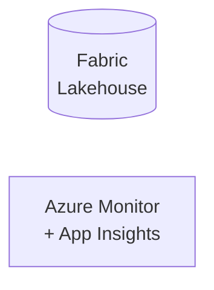

# CDC / Real-Time Deployment Blueprint
**Generated:** 2026-04-10 14:15:27 UTC
**Target Platform:** Fabric
**Region:** eastus
## Summary
| Pattern | Count | Components |
|---------|-------|------------|
| CDC (Change Data Capture) | 0 | SQL Trigger / Cosmos Change Feed → Function → Event Hub → Fabric |
| Real-Time Streaming | 0 | Event Producer → Event Hub → Function → Delta Lake |
| ESB / API Gateway | 0 | Client → APIM → HTTP Function → Target |
## Architecture

## Components
### Azure Functions

- **Plan:** Consumption (scale to zero) or Premium (VNET, longer timeout)
- **Runtime:** Python 3.11+
- **Functions:** 0
- **App Insights:** Enabled (sampling: 5%)
