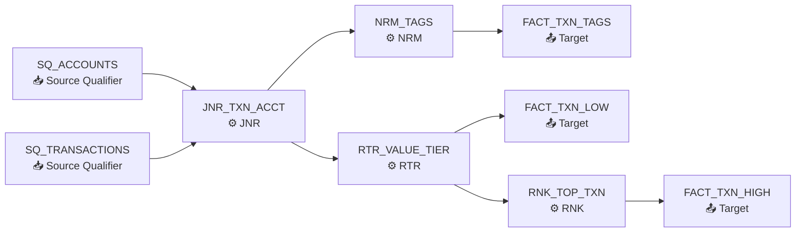
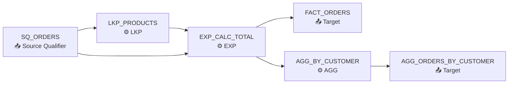

# Informatica-to-Fabric Migration -- Complexity Report

**Generated:** 2026-04-09T07:25:45Z
**Source Platform:** Informatica PowerCenter
**Target Platform:** Microsoft Fabric

---

## Summary

| Metric | Count |
|--------|-------|
| Total Mappings | 16 |
| Total Workflows | 13 |
| Total Sessions | 37 |
| SQL Files Analyzed | 8 |

---

## Complexity Breakdown

| Complexity | Count | % | Migration Approach |
|------------|-------|---|-------------------|
| **Simple** | 6 | 38% | Auto-generate PySpark notebooks |
| **Medium** | 1 | 6% | Semi-automated with manual review |
| **Complex** | 9 | 56% | Manual assist required |
| **Custom** | 0 | 0% | Redesign required |

---

## Conversion Readiness

| Metric | Value |
|--------|-------|
| Average Conversion Score | 95.6/100 |
| Total Manual Effort (est.) | 45.5 hours |
| Total Field Lineage Paths | 380 |

---

## Mapping Details

| Mapping | Complexity | Score | Effort (h) | Sources | Targets | Transformations | SQL Override | Stored Proc |
|---------|------------|-------|------------|---------|---------|-----------------|-------------|-------------|
| m_cdc_order_pipeline | **Complex** | 100/100 | 4 | src_ods_orders, src_ods_order_lines, src_pg_products | tgt_bronze_cdc_events, tgt_silver_orders, tgt_gold_daily_summary | JNR -> LKP -> EXP -> port -> RTR -> group -> UPD -> AGG -> RNK | No | No |
| m_customer_360 | **Complex** | 100/100 | 4 | src_sf_contacts, src_sf_accounts, src_erp_customers, src_erp_transactions, src_snow_scores, src_api_firmographics | tgt_silver_customer, tgt_gold_customer_360 | JNR -> LKP -> EXP -> port -> FIL -> SRT -> RTR -> group -> UPD -> SEQ | No | No |
| m_customer_activity_log | **Simple** | 100/100 | 0.5 | src_kafka_events | tgt_bronze_events | EXP -> port -> FIL | No | No |
| m_load_contacts | **Medium** | 100/100 | 2 | src_sf_contacts | tgt_lh_contacts | EXP -> port -> FIL -> LKP -> AGG -> DM | No | No |
| m_sync_accounts | **Simple** | 100/100 | 0.5 | src_accounts | tgt_accounts | EXP | No | No |
| m_realtime_inventory_scd2 | **Complex** | 100/100 | 4 | src_sap_materials, src_sap_warehouse_bins, src_iot_sensors | tgt_silver_inventory, tgt_gold_inventory_dashboard, tgt_alert_queue | JNR -> LKP -> EXP -> port -> FIL -> UNI -> SRT -> RTR -> group -> NRM | No | No |
| m_inventory_snapshot | **Simple** | 100/100 | 0.5 | src_silver_inventory | tgt_gold_inventory_history | EXP -> port | No | No |
| M_COMPLEX_MULTI_SOURCE | **Complex** | 100/100 | 4.5 | Oracle.FINANCE.TRANSACTIONS, Oracle.FINANCE.ACCOUNTS | FACT_TXN_HIGH, FACT_TXN_LOW, FACT_TXN_TAGS | SQ -> JNR -> EXP -> SQLT -> LKP -> RTR -> RNK -> NRM | Yes | No |
| M_LOAD_CUSTOMERS | **Simple** | 100/100 | 0.5 | Oracle.SALES.CUSTOMERS | DIM_CUSTOMER | SQ -> EXP -> FIL | No | No |
| M_LOAD_EMPLOYEES | **Complex** | 100/100 | 4 | Oracle.HR.EMPLOYEES | DIM_EMPLOYEE | SQ -> EXP -> FIL -> SRT -> LKP -> SQLT | Yes | No |
| M_LOAD_ORDERS | **Complex** | 100/100 | 4 | Oracle.SALES.ORDERS, Oracle.SALES.PRODUCTS | FACT_ORDERS, AGG_ORDERS_BY_CUSTOMER | SQ -> LKP -> EXP -> AGG | Yes | No |
| M_UPSERT_INVENTORY | **Complex** | 100/100 | 4 | Oracle.SALES.STG_INVENTORY | DIM_INVENTORY | SQ -> EXP -> UPD | No | No |
| DQ_VALIDATE_EMAILS | **Complex** | 65/100 | 6 |  |  | SQ -> DQ -> TGT | No | No |
| DQ_STANDARDIZE_ADDRESSES | **Complex** | 65/100 | 6 |  |  | SQ -> DQ -> TGT | No | No |
| SYNC_CUSTOMER_DATA | **Simple** | 100/100 | 0.5 | Oracle_CRM | Lakehouse_Silver | SQ -> TGT | No | No |
| MI_BULK_LOAD_PRODUCTS | **Simple** | 100/100 | 0.5 | S3_LANDING | Lakehouse_Bronze | SQ -> TGT | No | No |

---

## SQL Overrides Found

### M_COMPLEX_MULTI_SOURCE
- **Sql Query:**
  ```sql
  SELECT TXN_ID, ACCOUNT_ID, TXN_TYPE, AMOUNT, CURRENCY, TXN_DATE, DECODE(STATUS, 'C', 'COMPLETED', 'P', 'PENDING', 'F', 'FAILED', STATUS) AS STATUS, NVL(CHANNEL, 'UNKNOWN') AS CHANNEL, TAGS FROM FINANCE.TRANSACTIONS WHERE TXN_DATE >= ADD_MONTHS(SYSDATE, -3)
  ```
- **Source Filter:**
  ```sql
  STATUS != 'X'
  ```
- **Lookup Sql Override:**
  ```sql
  SELECT ACCOUNT_ID AS BLOCKED_ACCOUNT_ID, NVL(REASON, 'Unspecified') AS BLOCK_REASON FROM COMPLIANCE.FRAUD_BLACKLIST WHERE ACTIVE_FLAG = 'Y' AND EXPIRY_DATE > SYSDATE
  ```

### M_LOAD_EMPLOYEES
- **Sql Query:**
  ```sql
  SELECT EMPLOYEE_ID, FIRST_NAME, LAST_NAME, EMAIL, DEPARTMENT, MONTHLY_SALARY, HIRE_DATE, STATUS FROM HR.EMPLOYEES WHERE STATUS = 'ACTIVE' AND HIRE_DATE >= ADD_MONTHS(SYSDATE, -120)
  ```
- **Lookup Sql Override:**
  ```sql
  SELECT DEPT_NAME, MANAGER_NAME FROM HR.DEPARTMENTS WHERE ACTIVE = 'Y'
  ```
- **Sql Query:**
  ```sql
  SELECT EMPLOYEE_ID, DENSE_RANK() OVER (PARTITION BY DEPARTMENT ORDER BY ANNUAL_SALARY DESC) AS DEPT_SALARY_RANK FROM HR.EMPLOYEES
  ```

### M_LOAD_ORDERS
- **Sql Query:**
  ```sql
  SELECT ORDER_ID, CUSTOMER_ID, PRODUCT_ID, QUANTITY, UNIT_PRICE, NVL(DISCOUNT_PCT, 0) AS DISCOUNT_PCT, ORDER_DATE, ORDER_STATUS, CHANNEL FROM SALES.ORDERS WHERE ORDER_DATE >= TO_DATE('$$LOAD_DATE', 'YYYY-MM-DD') AND ORDER_STATUS != 'CANCELLED'
  ```
- **Lookup Sql Override:**
  ```sql
  SELECT PRODUCT_ID, NVL(PRODUCT_NAME, 'Unknown') AS PRODUCT_NAME, NVL(CATEGORY, 'Uncategorized') AS CATEGORY FROM SALES.PRODUCTS
  ```


---

## Field Lineage Diagrams (Complex/Custom)

### M_COMPLEX_MULTI_SOURCE (Score: 100/100)



### M_LOAD_ORDERS (Score: 100/100)



### M_UPSERT_INVENTORY (Score: 100/100)


---

## Oracle SQL Files Analysis

### SP_CALC_RANKINGS.sql
- **Path:** `input\sql\SP_CALC_RANKINGS.sql`
- **Total lines:** 96
- **Oracle-specific constructs:**

| Construct | Occurrences | Lines |
|-----------|-------------|-------|
| `MERGE` | 1 | 13 |
| `DECODE` | 1 | 70 |
| `NVL` | 1 | 35 |
| `SYSDATE` | 5 | 10, 50, 56, 82, 86 |
| `TO_CHAR` | 3 | 79, 83, 86 |
| `DBMS_` | 2 | 86, 92 |
| `EXCEPTION WHEN` | 1 | 89 |
| `CREATE OR REPLACE` | 1 | 8 |
| `LEAD` | 2 | 30, 69 |
| `LAG` | 4 | 29, 31, 68, 71 |
| `DENSE_RANK` | 1 | 18 |
| `NTILE` | 1 | 19 |
| `FIRST_VALUE` | 1 | 21 |
| `LAST_VALUE` | 1 | 25 |
| `ROW_NUMBER` | 1 | 20 |
| `OVER` | 11 | 18, 19, 20, 21, 25, 29, 30, 31, 68, 69... |
| `PARTITION BY` | 3 | 68, 69, 71 |

### SP_DB2_INVENTORY_REFRESH.sql
- **Path:** `input\sql\SP_DB2_INVENTORY_REFRESH.sql`
- **Total lines:** 85
- **Oracle-specific constructs:**

_No Oracle-specific constructs detected._

### SP_MYSQL_USER_ANALYTICS.sql
- **Path:** `input\sql\SP_MYSQL_USER_ANALYTICS.sql`
- **Total lines:** 88
- **Oracle-specific constructs:**

_No Oracle-specific constructs detected._

### SP_POSTGRESQL_REPORTING.sql
- **Path:** `input\sql\SP_POSTGRESQL_REPORTING.sql`
- **Total lines:** 109
- **Oracle-specific constructs:**

| Construct | Occurrences | Lines |
|-----------|-------------|-------|
| `LAG` | 2 | 98, 99 |
| `FIRST_VALUE` | 1 | 102 |
| `ROW_NUMBER` | 1 | 97 |
| `OVER` | 4 | 97, 98, 99, 102 |
| `PARTITION BY` | 4 | 97, 98, 100, 103 |
| `DB_LINK` | 1 | 66 |

### SP_REFRESH_DASHBOARD.sql
- **Path:** `input\sql\SP_REFRESH_DASHBOARD.sql`
- **Total lines:** 126
- **Oracle-specific constructs:**

| Construct | Occurrences | Lines |
|-----------|-------------|-------|
| `ROWNUM` | 1 | 101 |
| `LEAD` | 1 | 100 |
| `LAG` | 1 | 99 |
| `ROW_NUMBER` | 1 | 101 |
| `OVER` | 4 | 97, 99, 100, 101 |
| `PARTITION BY` | 4 | 97, 99, 100, 101 |
| `DB_LINK` | 12 | 13, 14, 15, 30, 51, 61, 61, 83, 87, 87... |

### SP_SQLSERVER_CUSTOMER_MERGE.sql
- **Path:** `input\sql\SP_SQLSERVER_CUSTOMER_MERGE.sql`
- **Total lines:** 93
- **Oracle-specific constructs:**

| Construct | Occurrences | Lines |
|-----------|-------------|-------|
| `MERGE` | 4 | 4, 6, 54, 55 |
| `DB_LINK` | 6 | 7, 81, 89, 90, 91, 91 |

### SP_TERADATA_CUSTOMER_STATS.sql
- **Path:** `input\sql\SP_TERADATA_CUSTOMER_STATS.sql`
- **Total lines:** 75
- **Oracle-specific constructs:**

| Construct | Occurrences | Lines |
|-----------|-------------|-------|
| `LAG` | 1 | 67 |
| `DENSE_RANK` | 1 | 70 |
| `ROW_NUMBER` | 1 | 25 |
| `OVER` | 4 | 25, 66, 67, 70 |
| `PARTITION BY` | 1 | 26 |

### SP_UPDATE_ORDER_STATS.sql
- **Path:** `input\sql\SP_UPDATE_ORDER_STATS.sql`
- **Total lines:** 83
- **Oracle-specific constructs:**

| Construct | Occurrences | Lines |
|-----------|-------------|-------|
| `MERGE` | 1 | 15 |
| `DECODE` | 1 | 24 |
| `NVL` | 1 | 54 |
| `SYSDATE` | 4 | 10, 42, 48, 77 |
| `TO_CHAR` | 1 | 69 |
| `DBMS_` | 1 | 69 |
| `EXCEPTION WHEN` | 1 | 71 |
| `NUMBER` | 1 | 12 |
| `CREATE OR REPLACE` | 1 | 8 |


---

## Migration Recommendations

1. **Simple mappings** -- Auto-generate using the notebook-migration agent. Expect minimal manual intervention.
2. **Medium mappings** -- Use notebook-migration with manual review of LKP/AGG/JNR logic. Validate join conditions.
3. **Complex mappings** -- Hand off SQL overrides to sql-migration agent first, then generate notebooks.
4. **Custom mappings** -- Require full redesign. Java transformations must be rewritten in PySpark.
5. **Oracle SQL files** -- Hand off to sql-migration for MERGE, DECODE, NVL, etc.
6. **Workflow orchestration** -- Hand off to pipeline-migration for Fabric Pipeline JSON generation.
