# Migration Wave Plan

**Total Waves:** 3
**Total Mappings:** 12
**Total Effort:** 24.0 hours
**Critical Path:** M_COMPLEX_MULTI_SOURCE (4.5h)

---

## Wave 1 (10 mappings, 19.0h)

| Mapping | Dependencies |
|---------|-------------|
| DQ_STANDARDIZE_ADDRESSES | — |
| DQ_VALIDATE_EMAILS | — |
| MI_BULK_LOAD_PRODUCTS | — |
| M_COMPLEX_MULTI_SOURCE | — |
| M_LOAD_CUSTOMERS | — |
| M_LOAD_EMPLOYEES | — |
| M_UPSERT_INVENTORY | — |
| SYNC_CUSTOMER_DATA | — |
| m_load_contacts | — |
| m_sync_accounts | — |

## Wave 2 (1 mappings, 4h)

| Mapping | Dependencies |
|---------|-------------|
| M_LOAD_ORDERS | M_LOAD_CUSTOMERS |

## Wave 3 (1 mappings, 1h)

| Mapping | Dependencies |
|---------|-------------|
| M_VARIANCE_REPORT | M_RECONCILE_TOTALS |

---

## Wave Timeline

```mermaid
gantt
    title Migration Waves
    dateFormat X
    axisFormat Wave %s
    section Wave 1
    DQ_STANDARDIZE_ADDRESSES : 0, 1
    DQ_VALIDATE_EMAILS : 0, 1
    MI_BULK_LOAD_PRODUCTS : 0, 1
    M_COMPLEX_MULTI_SOURCE : 0, 1
    M_LOAD_CUSTOMERS : 0, 1
    M_LOAD_EMPLOYEES : 0, 1
    M_UPSERT_INVENTORY : 0, 1
    SYNC_CUSTOMER_DATA : 0, 1
    m_load_contacts : 0, 1
    m_sync_accounts : 0, 1
    section Wave 2
    M_LOAD_ORDERS : 1, 2
    section Wave 3
    M_VARIANCE_REPORT : 2, 3
```

