# Migration Wave Plan

**Total Waves:** 5
**Total Mappings:** 21
**Total Effort:** 50.5 hours
**Critical Path:** m_cdc_order_pipeline → m_upsert_inventory → m_load_gl_journals (6h)

---

## Wave 1 (13 mappings, 40.5h)

| Mapping | Dependencies |
|---------|-------------|
| DQ_STANDARDIZE_ADDRESSES | — |
| DQ_VALIDATE_EMAILS | — |
| MI_BULK_LOAD_PRODUCTS | — |
| M_COMPLEX_MULTI_SOURCE | — |
| M_LOAD_CUSTOMERS | — |
| M_LOAD_EMPLOYEES | — |
| M_UPSERT_INVENTORY | — |
| SYNC_CUSTOMER_DATA | — |
| m_cdc_order_pipeline | — |
| m_customer_360 | — |
| m_inventory_snapshot | — |
| m_load_contacts | — |
| m_realtime_inventory_scd2 | — |

## Wave 2 (4 mappings, 6.0h)

| Mapping | Dependencies |
|---------|-------------|
| M_LOAD_ORDERS | M_LOAD_CUSTOMERS |
| m_customer_activity_log | m_customer_360 |
| m_sync_accounts | m_load_contacts |
| m_upsert_inventory | m_cdc_order_pipeline |

## Wave 3 (2 mappings, 2h)

| Mapping | Dependencies |
|---------|-------------|
| m_load_gl_journals | m_upsert_inventory |
| m_load_opportunities | m_sync_accounts |

## Wave 4 (1 mappings, 1h)

| Mapping | Dependencies |
|---------|-------------|
| m_agg_monthly_revenue | m_agg_daily_revenue |

## Wave 5 (1 mappings, 1h)

| Mapping | Dependencies |
|---------|-------------|
| M_VARIANCE_REPORT | M_RECONCILE_TOTALS |

---

## Wave Timeline

```mermaid
gantt
    title Migration Waves
    dateFormat X
    axisFormat Wave %s
    section Wave 1
    DQ_STANDARDIZE_ADDRESSES : 0, 1
    DQ_VALIDATE_EMAILS : 0, 1
    MI_BULK_LOAD_PRODUCTS : 0, 1
    M_COMPLEX_MULTI_SOURCE : 0, 1
    M_LOAD_CUSTOMERS : 0, 1
    M_LOAD_EMPLOYEES : 0, 1
    M_UPSERT_INVENTORY : 0, 1
    SYNC_CUSTOMER_DATA : 0, 1
    m_cdc_order_pipeline : 0, 1
    m_customer_360 : 0, 1
    m_inventory_snapshot : 0, 1
    m_load_contacts : 0, 1
    m_realtime_inventory_scd2 : 0, 1
    section Wave 2
    M_LOAD_ORDERS : 1, 2
    m_customer_activity_log : 1, 2
    m_sync_accounts : 1, 2
    m_upsert_inventory : 1, 2
    section Wave 3
    m_load_gl_journals : 2, 3
    m_load_opportunities : 2, 3
    section Wave 4
    m_agg_monthly_revenue : 3, 4
    section Wave 5
    M_VARIANCE_REPORT : 4, 5
```

