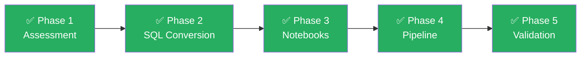

# Migration Summary Report

<p align="center">
  
  
  
  
  
</p>

---

## Executive Summary

| Metric | Value |
|--------|-------|
| **Workflow** | WF_DAILY_SALES_LOAD |
| **Mappings Migrated** | 3 (1 Simple, 2 Complex) |
| **SQL Files Converted** | 2 (1 stored procedure, 1 override set) |
| **Notebooks Generated** | 3 (PySpark / Fabric Notebook) |
| **Pipelines Generated** | 1 (5 activities, IfCondition branching) |
| **Validation Tests** | 39 checks across 5 notebooks |
| **Oracle SQL Constructs Converted** | 9 (MERGE, DECODE, NVL, SYSDATE, etc.) |
| **Target Tables** | 4 (2 silver, 2 gold) |

---

## Phase Execution Summary



---

### Phase 1: Assessment ✅

| Output | Location |
|--------|----------|
| Inventory (JSON) | `output/inventory/inventory.json` |
| Complexity Report | `output/inventory/complexity_report.md` |
| Dependency DAG | `output/inventory/dependency_dag.json` |

**Findings:**
- **M_LOAD_CUSTOMERS** — Simple (SQ → EXP → FIL → TGT)
- **M_LOAD_ORDERS** — Complex (SQ → LKP → EXP → AGG → 2 TGTs + SQL overrides)
- **M_UPSERT_INVENTORY** — Complex (SQ → EXP → UPD → TGT with Delta MERGE)
- 1 workflow, 3 sessions, 6 links, 1 Oracle SQL file with 9 constructs

---

### Phase 2: SQL Conversion ✅

| File | Description | Oracle → Spark SQL Conversions |
|------|------------|-------------------------------|
| `output/sql/SQL_SP_UPDATE_ORDER_STATS.sql` | Stored procedure conversion | MERGE INTO, DECODE→CASE, NVL→COALESCE, SYSDATE→current_timestamp(), TRUNC→current_date(), TO_CHAR→date_format() |
| `output/sql/SQL_OVERRIDES_M_LOAD_ORDERS.sql` | Inline SQL overrides | SQ_ORDERS query, LKP_PRODUCTS query, Pre-SQL DELETE, Post-SQL EXEC (TODO) |

**Oracle Constructs Converted:** 9 total — MERGE, DECODE (×2), NVL (×2), SYSDATE, TRUNC, TO_DATE, DBMS_OUTPUT

---

### Phase 3: Notebook Generation ✅

| Notebook | Mapping | Complexity | Target Tables | Write Mode |
|----------|---------|-----------|---------------|------------|
| `output/notebooks/NB_M_LOAD_CUSTOMERS.py` | M_LOAD_CUSTOMERS | Simple | silver.dim_customer | Overwrite |
| `output/notebooks/NB_M_LOAD_ORDERS.py` | M_LOAD_ORDERS | Complex | silver.fact_orders, gold.agg_orders_by_customer | Append, Overwrite |
| `output/notebooks/NB_M_UPSERT_INVENTORY.py` | M_UPSERT_INVENTORY | Complex | silver.dim_inventory | Delta MERGE |

**Transformation Patterns:**
- Expression → `withColumn` + `when/otherwise`
- Filter → `.filter()` / `.where()`
- Lookup → `broadcast` join
- Aggregator → `groupBy().agg()`
- Update Strategy → Delta `MERGE INTO` with `whenMatchedDelete` / `whenMatchedUpdate` / `whenNotMatchedInsert`

---

### Phase 4: Pipeline Generation ✅

| Pipeline | Activities | Parameters | Branching |
|----------|-----------|------------|-----------|
| `output/pipelines/PL_WF_DAILY_SALES_LOAD.json` | 5 top-level | load_date, alert_webhook_url | IfCondition (DEC_CHECK_ORDERS) |

**Execution Flow:**
```
NB_M_LOAD_CUSTOMERS
├── On Success → NB_M_LOAD_ORDERS
│   ├── On Success → DEC_CHECK_ORDERS (IfCondition)
│   │   ├── True  → NB_M_UPSERT_INVENTORY
│   │   └── False → Set_Skip_Reason → EMAIL_FAILURE_DECISION
│   └── On Failure → EMAIL_FAILURE_ORDERS
└── On Failure → EMAIL_FAILURE_CUSTOMERS
```

---

### Phase 5: Validation ✅

| Notebook | Target Table | # Checks | Key Validations |
|----------|-------------|----------|-----------------|
| `VAL_DIM_CUSTOMER.py` | silver.dim_customer | 4 levels | Row count, checksum, DQ (nulls, uniqueness, status), sample |
| `VAL_FACT_ORDERS.py` | silver.fact_orders | 5 levels | Row count (append), checksum, aggregates, DQ (nulls, uniqueness, RI, range), sample |
| `VAL_AGG_ORDERS_BY_CUSTOMER.py` | gold.agg_orders_by_customer | 5 levels | Row count (groups), checksum, grand totals, DQ, sample with tolerance |
| `VAL_DIM_INVENTORY.py` | silver.dim_inventory | 6 levels | Row count, **MERGE verification** (Delta history), key sync, checksum, DQ, sample |
| `VAL_PIPELINE_EXECUTION.py` | All 4 tables | 5 checks | Table existence, execution order, IfCondition branching, cross-table RI |
| `test_matrix.md` | — | 39 total | Full test matrix with P0/P1 prioritization |

---

## Generated Artifacts

```
output/
├── inventory/
│   ├── inventory.json              # Machine-readable assessment
│   ├── complexity_report.md        # Human-readable complexity analysis
│   └── dependency_dag.json         # Dependency graph
├── sql/
│   ├── SQL_SP_UPDATE_ORDER_STATS.sql    # Stored procedure → Spark SQL
│   └── SQL_OVERRIDES_M_LOAD_ORDERS.sql  # Inline SQL overrides → Spark SQL
├── notebooks/
│   ├── NB_M_LOAD_CUSTOMERS.py      # Simple mapping → PySpark
│   ├── NB_M_LOAD_ORDERS.py         # Complex mapping → PySpark
│   └── NB_M_UPSERT_INVENTORY.py    # MERGE mapping → PySpark + Delta
├── pipelines/
│   └── PL_WF_DAILY_SALES_LOAD.json # Workflow → Fabric Data Pipeline
└── validation/
    ├── VAL_DIM_CUSTOMER.py          # Customer dimension validation
    ├── VAL_FACT_ORDERS.py           # Fact orders validation
    ├── VAL_AGG_ORDERS_BY_CUSTOMER.py # Gold aggregation validation
    ├── VAL_DIM_INVENTORY.py         # Inventory MERGE validation
    ├── VAL_PIPELINE_EXECUTION.py    # Pipeline execution validation
    └── test_matrix.md               # 39-check test matrix
```

**Total: 14 generated artifacts**

---

## Manual TODO Items

| # | Item | Priority | Notes |
|---|------|----------|-------|
| 1 | Update JDBC connection strings in validation notebooks | **P0** | Replace `<host>`, `<username>`, `<password>` with actual values or Key Vault references |
| 2 | Convert Post-SQL `EXEC SP_UPDATE_ORDER_STATS` call | **P1** | Marked as TODO in SQL_OVERRIDES — need to decide: inline in notebook or separate notebook activity |
| 3 | Configure pipeline `alert_webhook_url` parameter | **P1** | Point to Teams/Slack webhook or Azure Logic App |
| 4 | Create Lakehouse tables (silver/gold schemas) | **P0** | Tables will be auto-created on first write if using Delta, but schema should be verified |
| 5 | Set up Fabric Git integration for deployment | **P2** | Push pipeline JSON and notebooks via Git sync or REST API |
| 6 | Review `NB_M_LOAD_ORDERS.py` DISCOUNT_PCT COALESCE default (0.0) | **P1** | Verify this matches the original Informatica mapping behavior |

---

## Next Steps

1. **Review** all generated artifacts in `output/`
2. **Deploy** notebooks and pipeline to a Fabric workspace (dev)
3. **Configure** JDBC connections and Key Vault references
4. **Run** the pipeline end-to-end in dev environment
5. **Execute** all 5 validation notebooks to verify correctness
6. **Address** TODO items listed above
7. **Promote** to staging/production once validated
